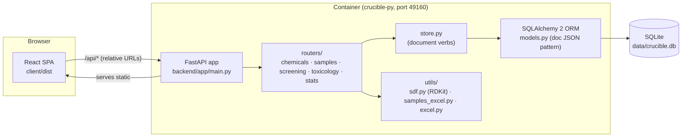

[← README](README.md) · [All docs in order](README.md#the-documentation-in-order) · [Glossary](docs/GLOSSARY.md)

# MIGRATION.md — Crucible (v2.0): Node/Express → Python/FastAPI (history)

This document is a **historical record** of how Crucible moved from its
original Node.js/Express backend to the current Python/FastAPI backend, plus a
**learning map** for the codebase. The legacy Node stack has since been
retired and removed from the repository.

> **Looking for how to deploy or operate the app today?**
> See **[DEPLOYMENT.md](DEPLOYMENT.md)** — runbooks (macOS Docker/Podman,
> RHEL8 Podman), SSL, systemd auto-start, backup/restore, and troubleshooting.

---

## Table of Contents

1. [What changed and why](#1-what-changed-and-why)
2. [Architecture (current state)](#2-architecture-current-state)
3. [Learning map](#3-learning-map)
4. [Rollback](#4-rollback)
5. [Open items](#5-open-items)

---

## 1. What changed and why

The migration used a **strangler-fig** approach: a new FastAPI backend was
built to reproduce the existing API **contract exactly**, proven with
parity tests, then swapped in — and finally the old stack was deleted.

| Phase | Change | Why |
|---|---|---|
| 1 | Rebranded to **Crucible: Pandora Toolbox Enhancement (v2.0)**; image/container names standardised | New project identity |
| 2 | Port **5942 → 49160** everywhere; `PORT` env var + `0.0.0.0` binding; no hardcoded hostnames | Same image/scripts run unmodified on macOS and RHEL8 |
| 2 | Container ports published on `HOST_BIND` (127.0.0.1 on macOS, 0.0.0.0 on Linux) | macOS's `remoted` daemon squats on 49152+ via link-local IPv6, breaking wildcard binds of 49160 on Macs |
| 2 | Container `HEALTHCHECK` fixed to `127.0.0.1` | In-container `localhost` resolves to `::1`, but the server binds IPv4 — the old check always failed |
| 3 | New **`backend/`**: FastAPI + SQLAlchemy 2 + Pydantic v2 + SQLite, RDKit for SDF, openpyxl for Excel | Python rewrite with an **identical API contract** |
| 3 | A one-time JSON→SQL data import + contract-parity tests | Proof the contract was identical before switching |
| 4 | `backend/Dockerfile` (python:3.12-slim, multi-stage) + `container-py.sh` | Containerised Python backend, runtime-agnostic (podman/docker) |
| 5 | **Retired the legacy Node/Express stack** — removed `server/`, the Node `Dockerfile`, `container.sh`, the old `pandora.json` data file, and the one-time migration tooling | Soak period over; the Python backend is now the single stack |

**Database mapping (JSON store → SQL).** The original store was schemaless, so
each SQL table keeps the record verbatim in a `doc` JSON column plus indexed
lookup columns (`id`, business key, `created_at`, insertion-order `seq`). This
kept API responses byte-identical through the switch. Moving SQLite →
PostgreSQL is a `DATABASE_URL` change (the `doc` column maps to JSONB); full
column normalisation can follow later without touching the API layer.

---

## 2. Architecture (current state)



Request flow: browser → `/api/...` (relative, so no ports in client code) →
FastAPI router (one file per resource) → `get_db` session → `store.py`
reads/writes whole-record JSON docs → response dicts. Static files and the SPA
fallback are served by the **same** process.

---

## 3. Learning map

Each concept, what it is, and where to see it in this codebase:

- **FastAPI routing** — declare a function with a decorator like
  `@router.get("/{id}")` and FastAPI wires the URL, parses parameters, and
  serialises the returned dict to JSON. See any file in `backend/app/routers/`.
- **FastAPI dependency injection** — parameters like
  `db: Session = Depends(get_db)` are filled in automatically per request;
  `get_db` opens a DB session before the handler runs and closes it after.
  See `backend/app/database.py` (`get_db`).
- **Pydantic models** — classes describing JSON bodies; FastAPI parses and
  type-checks requests against them. Ours are deliberately lenient (all fields
  optional, unknown keys kept) to preserve the v1 contract. See
  `backend/app/schemas.py`.
- **SQLAlchemy 2 ORM** — Python classes mapped to tables
  (`backend/app/models.py`); a `Session` batches reads/writes and commits as a
  unit (`backend/app/store.py`). The engine is built from `DATABASE_URL`, so
  PostgreSQL = connection-string change (`backend/app/config.py`).
- **Migrations (Alembic)** — the container's entrypoint runs
  `alembic upgrade head` at startup (`backend/scripts/db_bootstrap.py`), so
  Alembic owns the schema there (`AUTO_INIT_DB=false`). Local dev and tests
  still create tables with `Base.metadata.create_all()` (`AUTO_INIT_DB=true`).
  Add a revision with `alembic revision --autogenerate` when models change.
- **uvicorn** — the ASGI web server that runs the FastAPI app. Started at the
  bottom of `backend/app/main.py`; one process is enough for this app (add
  `--workers N` later only if CPU-bound).
- **RDKit** — chemistry toolkit; parses MOL blocks, computes formulas/weights,
  detects polymers (S-Groups), charges and stereo. See `backend/app/utils/sdf.py`.
- **pytest fixtures** — reusable test setup; `client` in
  `backend/tests/conftest.py` gives every test a fresh in-process app with a
  clean throwaway database.
- **Docker basics** — `backend/Dockerfile` is a recipe: stage 1 (Node) builds
  the React bundle, stage 2 (python:3.12-slim) installs pip packages and copies
  the app; the final image contains no Node. `EXPOSE` documents the port,
  `HEALTHCHECK` lets the runtime probe `/api/stats`, `CMD` is the process to
  run. `container-py.sh` wraps build/run/logs for podman & docker.

---

## 4. Rollback

Because the legacy Node stack has been removed, rollback is no longer a
backend switch — it is a **redeploy of a previous version**:

```bash
# Roll the code back to an earlier known-good commit and rebuild
git log --oneline          # pick the known-good commit
git checkout <commit>
./container-py.sh rebuild
```

(The repo currently has no release tags, so pick the commit from `git log`;
tagging known-good releases is a natural follow-up.)

For **data** recovery (as opposed to code), restore a database backup instead
of changing code:

```bash
./container-py.sh restore backups/crucible-<stamp>.db
```

See [DEPLOYMENT.md → Backup and restore](DEPLOYMENT.md#backup-and-restore).
Take a safety backup before any rollback: `./container-py.sh backup`.

---

## 5. Open items

- **SSO / authentication** — still none. HTTPS is transport encryption only; a
  FastAPI dependency or an authenticating reverse proxy is the natural hook.
  Plan before wider rollout.
- **PostgreSQL + Alembic** — ✅ delivered. Run `./container-py.sh db-start`
  then `USE_POSTGRES=true ./container-py.sh start`, or point `DATABASE_URL` at
  an external Postgres. `psycopg[binary]` ships in requirements, the `doc`
  column becomes JSONB, and Alembic owns the schema
  (see [DEPLOYMENT.md → Database](DEPLOYMENT.md#database-sqlite-and-postgresql)).
- **Schema normalisation** — still open: the `doc` JSON pattern preserves the
  contract; promoting hot fields (name, CAS, dates) into real indexed columns
  is the next incremental step (now backed by Alembic migrations).
- **HTTPS niceties** — TLS is done (`./container-py.sh start-ssl`) and
  certificate-expiry monitoring is delivered (`./cert-expiry-check.sh`); an
  optional HTTP→HTTPS redirect remains.
