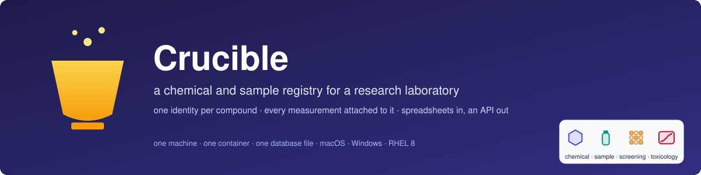

# Crucible: Pandora Toolbox Enhancement (v2.0)



Chemical and Sample Management System - MVP

A comprehensive web application for managing chemical compounds, samples, screening data, and toxicology information with an integrated Electronic Lab Notebook (ELN). Deployed with **HTTPS/TLS** encryption using official Nestlé SSL certificates.

**[Handbook — start here](docs/HANDBOOK.md)** · **[All documents](#the-documentation-in-order)** · **[Glossary](docs/00-glossary.md)** · **[Release notes](NEWS.md)**

> **Never used this before?** Open the **[Handbook](docs/HANDBOOK.md)**. It
> takes you from Day 0 — what a chemical registry is — through setting up one
> machine, loading real data, checking it, and publishing a change, in order,
> linking each document at the moment you need it. It assumes no chemistry and
> no command-line experience. The hands-on chapter it points to is
> **[the user playbook](docs/10-user-playbook.md)**.
>
> **New to any of this?** Every technical term used anywhere in this repository —
> container, port, certificate, migration, CAS number, SLIMS — is explained in
> plain words, with everyday comparisons, in **[docs/00-glossary.md](docs/00-glossary.md)**.
> If you meet a word that isn't there and isn't obvious, that's a documentation
> bug worth reporting. You are not expected to arrive already knowing the
> vocabulary.

## What is a chemical registry? (start here)

Imagine a toxicologist who needs to know whether a compound has been tested
before. Somebody screened it two years ago, but the results are in a
spreadsheet on a laptop that has since been reimaged. The physical sample was
logged under a different identifier, by a colleague who has changed teams. The
toxicology study that followed sits in a third file, named after the study
rather than the compound. Nobody can prove the three describe the same
substance, so the compound is re-ordered, re-prepared and re-tested — weeks of
work to learn something the organisation already knew.

A **chemical registry** — one catalogue that gives every compound a single
identity, and keeps everything ever measured about it attached to that
identity. Instead of asking *which file has this in it?*, you ask the registry.

Four words that recur throughout this project, in the order the work happens:

- A **chemical** is the substance itself, on paper: a name, a molecular
  formula, usually a **CAS number** (the internationally agreed identifier for
  a substance — the same string means the same compound in any lab in the
  world).
- A **sample** is a physical quantity of that chemical sitting in a vial: a
  batch, a concentration, a location, an expiry.
- **Screening** is the fast, broad first test — run a sample against an assay
  and record what happened.
- A **toxicology study** is the slow, careful one that follows: dose levels,
  endpoints, a **NOAEL** (the highest dose at which nothing harmful was
  observed).

Every one of these terms, and every technical one below, is defined in plain
words in the **[Glossary](docs/00-glossary.md)**.

---

## The problem this project tackles

**The pain point.** Laboratory data arrives as spreadsheets. Each is correct on
its own and useless next to the others: the same compound appears under a
supplier code in one file, a CAS number in another, and a free-typed name in a
third. Nothing enforces that they refer to the same thing, so the link between
a compound, the vial it went into, and the result that came out exists only in
somebody's memory. When that person moves on, the link goes with them.

**Why it matters.** Work gets repeated because nobody can prove it was already
done. Safety questions take days to answer because answering them means finding
files rather than querying data. And the answers are unauditable: a number in a
spreadsheet cannot say where it came from.

**What Crucible is.** A web application that holds all four kinds of record in
one place, keyed to one chemical identity, uploadable from the spreadsheet and
structure formats laboratories already produce — and readable back out through
a REST API so other tools can ask it questions. It runs on one machine, in one
container, against a single database file. It is deliberately small: this is a
system of record, not an analysis platform.

---

## How it works

```
   Your spreadsheet or structure file
   (.xlsx · .csv · .sdf)
              │
              ▼
   ┌──────────────────────┐   You map your column names to the fields
   │  Upload (ELN page)   │   Crucible knows. Nothing is renamed on disk.
   └──────────┬───────────┘
              ▼
   ┌──────────────────────┐   openpyxl reads spreadsheets; RDKit reads
   │  Parse & validate    │   chemical structures. Bad rows are reported,
   └──────────┬───────────┘   not silently dropped.
              ▼
   ┌──────────────────────┐   Every record is stored whole, as JSON, plus a
   │  Store (SQLite)      │   few indexed columns for finding it again.
   └──────────┬───────────┘   Your original fields survive verbatim.
              │
      ┌───────┴────────┐
      ▼                ▼
 ┌─────────┐    ┌─────────────┐
 │ Browser │    │  REST API   │  Same data, two doors: people use the
 │ Viewer  │    │  /api/*     │  web pages, programs use the endpoints.
 │Dashboard│    └─────────────┘
 └─────────┘
```

Upload a file, map its columns once, and the records land in the database with
their original fields intact. **The full record is kept as JSON and treated as
the source of truth**; the indexed columns beside it exist only to find rows
quickly. That is the single design decision the rest of the system follows
from — it is why an upload never has to be reshaped to fit a schema, and why
adding a field later breaks nothing. The reasoning, and what it costs, is in
**[Architecture → The one rule](docs/02-architecture.md#the-one-design-rule-everything-else-follows-from)**.

---

## What the system handles


| Module | What it holds | Accepts | Optimised for | Linked to |
|---|---|---|---|---|
| **Chemicals** | The substance: name, CAS number, formula, molecular weight, supplier reference | `.xlsx` · `.csv` · `.sdf` | 15,000+ records | — (the anchor everything else hangs from) |
| **Samples** | The physical vial: batch, concentration, location, expiry | `.xlsx` (SLIMS three-row header) | 1,000+ records | a chemical |
| **Screening** | Assay results: the fast, broad first pass | `.xlsx` | — | a chemical |
| **Toxicology** | Study data: doses, endpoints, NOAEL | `.xlsx` | — | a chemical |

Three ways in and out: the **ELN** upload pages, the **Data Viewer** for search
and filter, and the **Dashboard**, which refreshes counts every five seconds.
Everything the browser does, the **[REST API](docs/08-api-reference.md)** can do too — the web
pages are simply its first client.

Neither upload limit is a hard cap. They are the volumes the system has been
exercised at; see [About the data](#about-the-data-honesty-notes) for what that
does and does not promise.

**In practice**, one deployment holds 49,065 screening records from a single
packaging-migration export, covering 3,500 distinct compounds. 664 of those are
identified against a chemical registry, linking 43,399 rows (88%) to a compound
entry. The remainder show the compound name their source file recorded —
overwhelmingly because that file carries no CAS number for them, which no
software can work around.

---

## Quick start

Installation is done **once per machine**, by one command. After that,
development and redeployment are a short loop that never needs the install
guide again.

```bash
# macOS (development) — the PUBLIC repository, no authentication needed
git clone https://github.com/akannan2987/nr-nips-crucible.git
cd nr-nips-crucible
./setup-after-clone-py.sh          # build the image, start the app, poll the API until it answers
curl --noproxy '*' -sS http://localhost:49160/api/stats   # expect a JSON line containing "chemicals"
```

The production VM clones the **private** repository instead and the same
command serves HTTPS with the corporate certificates. What that command is
doing, step by step, with the output each step should print and the likely
mistakes named: **[docs/01-setup-macos.md](docs/01-setup-macos.md)** ·
**[docs/01-setup-rhel8.md](docs/01-setup-rhel8.md)** ·
**[docs/01-setup-windows.md](docs/01-setup-windows.md)** (untested). If you have never used a container, follow
the guide rather than the one-liner — it takes an hour and you will know what
you have.

**Then read the [Handbook](docs/HANDBOOK.md).** It is the one document to
keep open: where the project stands, the story so far, and every other
document in the order you need it — set up once, run it, understand how it is
built, how a change travels from your Mac to production, operate it, work with
real laboratory data, what comes next.

**Looking for something specific?**

| I want to… | Read |
|---|---|
| Load a file, check it, identify compounds, correct mistakes, ask questions, publish a change | [The user playbook](docs/10-user-playbook.md) |
| Take an edit from my Mac to production safely | [Git workflow](docs/03-git-workflow.md) · [Handbook §6](docs/HANDBOOK.md#6-how-a-change-travels) |
| Update, back up, rotate a certificate, monitor, troubleshoot, uninstall | [Operations](docs/07-operations.md) |
| Develop against the backend, run the tests | [backend/README.md](backend/README.md) · [Architecture → Testing](docs/02-architecture.md#testing) |
| Call the API from a script | [API cookbook](docs/08-api-cookbook.md) · [API reference](docs/08-api-reference.md) |
| Understand a word | [Glossary](docs/00-glossary.md) |

---

## The documentation, in order

Every guide, numbered in the order a newcomer should meet them. The numbers are
the file names in `docs/`, so the folder listing *is* the reading order — the
same convention as my other projects. The guides assume **no prior experience**
with chemistry, containers, terminals or servers: every technical word is
explained where it first appears, every command shows the output you should
get, and likely mistakes get a named fix.

| # | Guide | What it teaches |
|---|-------|-----------------|
| — | **[Handbook](docs/HANDBOOK.md)** | **Start here.** Where the project stands, the story so far, and everything below in the order you need it — updated with every change |
| 00 | **[Glossary](docs/00-glossary.md)** | Every term in the project, in plain words — read it, or keep it open in a tab |
| 01 | **[Set up: macOS](docs/01-setup-macos.md)** | From a blank Mac to the app running: containers, ports, HTTPS. Uses the **public** repo |
| 01 | **[Set up: RHEL 8](docs/01-setup-rhel8.md)** | The production deployment: rootless podman, SELinux, firewall cases, real certificates, surviving a reboot. Uses the **private** repo |
| 01 | **[Uninstall: macOS](docs/01-uninstall-macos.md)** | Clean removal, starting with what you cannot get back |
| 01 | **[Uninstall: RHEL 8](docs/01-uninstall-rhel8.md)** | The same, plus the server-only pieces (systemd, lingering, cron) and the R1–R9 reinstall checklist |
| 01 | **[Set up: Windows](docs/01-setup-windows.md)** | Docker Desktop and Git Bash, or a Linux distribution under WSL 2 — written to the same depth, **untested** until walked on a real PC |
| 02 | **[Architecture](docs/02-architecture.md)** | How the boxes fit; the one design rule everything else follows from; the interactive architecture page |
| 02 | **[Database schema](docs/02-database-schema.md)** | The hybrid document pattern; SQLite and PostgreSQL; Alembic |
| 03 | **[Git workflow](docs/03-git-workflow.md)** | Two repositories, three folders; how a change travels from your Mac to the server; the safety gate that stops secrets escaping |
| 04 | **[Phase tutorials](docs/04-phase-tutorials/phase-00-node-to-python.md)** | One tutorial per build phase, 00 to 05: why it existed, what it built, steps with expected output, a checkpoint, what it deliberately did not do |
| 05 | **[Roadmap](docs/05-roadmap.md)** | What is planned, in order, and what each item waits on |
| 06 | **[Product and technology roadmap](docs/06-product-and-technology-roadmap.md)** | From one VM to a product: every candidate technology with a verdict and the trigger that would change it |
| 07 | **[Operations](docs/07-operations.md)** | The deep runbook: certificate rotation, PostgreSQL, systemd, backups, monitoring, troubleshooting |
| 08 | **[API reference](docs/08-api-reference.md)** | Every endpoint, request and response |
| 08 | **[API cookbook](docs/08-api-cookbook.md)** | Copy-paste `curl` and Python recipes — every answer captured from a live instance |
| 09 | **[Chemical identification](docs/09-chemical-identification.md)** | Why compound names need identifying; the two-stage rule; maintaining the registry |
| 09 | **[Query cookbook](docs/09-query-cookbook.md)** | Read-only SQL against the hybrid schema — why queries look unusual here, and recipes that work |
| 10 | **[The user playbook](docs/10-user-playbook.md)** | **Hands-on start.** Load a file, check it, identify compounds, correct mistakes, ask questions, publish a change — every concept explained from scratch |
| 11 | **[Lessons learned](docs/11-lessons-learned.md)** | Every bug that real verification found, and what each taught |
| 12 | **[History](docs/12-history.md)** | The Node → Python migration and other retired decisions |
| — | **[Upload templates](docs/excel-templates)** | The spreadsheet formats each module accepts, and the generator that makes synthetic examples |
| — | **[Backend README](backend/README.md)** | Python backend: quickstart, tests, environment variables |
| — | **[Contributing](CONTRIBUTING.md)** | How to make and publish a change |
| — | **[Release notes](NEWS.md)** | What changed in each version, why, and what each release deliberately did not fix |

---

## Repository map

```
nr-nips-crucible/
├── backend/                    the application
│   ├── app/
│   │   ├── main.py             FastAPI app: starts uvicorn, serves the SPA
│   │   ├── routers/            one thin file per module — chemicals, samples,
│   │   │                       screening, toxicology, stats
│   │   ├── store.py            all data access lives here, not in the routers
│   │   ├── models.py           the four tables (indexed columns + JSON doc)
│   │   ├── schemas.py          Pydantic shapes — deliberately lenient
│   │   ├── database.py         engine + get_db session dependency
│   │   └── utils/              excel.py · samples_excel.py · sdf.py (the parsers)
│   ├── alembic/                schema migrations; owns the schema in the container
│   ├── tests/                  90 tests: contract-parity, parsers, ingestion
│   └── Dockerfile              multi-stage: Node builds the UI, then is discarded
├── client/                     React SPA
│   └── src/pages/              Dashboard · <Module>Upload · <Module>View
├── docs/                       every guide, numbered in reading order (see the index above)
│   ├── HANDBOOK.md             start here — the living walkthrough from day 0 to today
│   └── excel-templates/        synthetic upload templates + their generator
├── container-py.sh             build · start · start-ssl · status · backup · restore
├── setup-after-clone-py.sh     the one-command install
├── uninstall.sh                --dry-run · --partial · --full
├── check-public-safe.sh        the pre-push gate
├── monitor.sh                  health check, run from cron every 5 minutes
└── cert-expiry-check.sh        weekly certificate warning
```

| Path | What it is |
|---|---|
| `backend/app/` | Everything the server does. Routers stay thin; logic lives in `store.py` and `utils/`. |
| `backend/alembic/` | Schema migrations. In the container these run at startup and are the only thing allowed to change the schema. |
| `client/` | The browser interface. Built into `client/dist` and served by the same Python process — there is no second web server. |
| `docs/` | The guides. Written for a reader with no prior container experience. |
| `*.sh` (root) | The operator's toolkit. Same scripts on macOS and RHEL8; they auto-detect podman or docker. |

**Two kinds of "not in Git."** `data/`, `backups/` and `certs/` are absent
because they are *yours* — your records, your certificates — and must never
travel to a shared repository. `client/dist/`, `node_modules/` and
`backend/.venv/` are absent because they are *regenerated*: the build produces
them, and a repository that carried them would only carry them stale. The
full list and why each is excluded: [Operations → Security](docs/07-operations.md#security).

---

## About the data (honesty notes)

- **The data is yours, and none of it is here.** No real records ship in this
  repository. The files in `docs/excel-templates/` are synthetic, generated by
  a tracked script, and exist to show the column names each endpoint reads.
- **Uploads are lenient on purpose.** Every field is optional and unknown
  columns are preserved rather than rejected, so that a spreadsheet never has
  to be reshaped to be accepted. The cost is real: a mistyped column heading
  becomes a new field instead of an error. The system records what you gave it.
- **It does not check your chemistry.** A CAS number is stored, not verified
  against a registry; a molecular formula is not checked against the structure.
  RDKit will reject a structure file it cannot parse, and that is the extent of
  the validation.
- **`/api/*` has no authentication.** Anyone who can reach the port can read
  and write everything. This is a deliberate, documented state for internal
  trusted-network use, not an oversight — and it is the first item on the
  roadmap.
- **There is no audit trail.** Records can be edited and deleted, and nothing
  records who did it or what it was before. Do not use this as evidence of what
  a value was on a given date.
- **SQLite takes one writer at a time.** Correct and fast for this workload,
  which is bulk uploads and many reads. A dozen people uploading simultaneously
  is not the shape it is built for; PostgreSQL is supported for that case.
- **The capacity figures are what has been exercised, not a benchmark.**
  "Optimised for 15,000+" means uploads at that size have been run and behave
  well. It is not a limit, and it is not a guarantee about your hardware.

---

## Why the documentation is so detailed

Because the person who has to redeploy this at 8am is quite likely to be
someone who has never used a container, and quite likely to be its author two
years from now, who has forgotten. Every guide therefore explains each
technical word where it first appears, shows the output a command should
produce, and names the likely mistakes instead of assuming they will not
happen. The glossary carries a standing contract: **a term missing from it is a
documentation bug.**

That is not thoroughness for its own sake. Every bug in
[docs/11-lessons-learned.md](docs/11-lessons-learned.md) was found because
someone followed a written procedure literally and it did not work. Documentation detailed enough to be followed literally is documentation
detailed enough to be *tested* — and an instruction nobody can test is just a
hope.

---

## License

Intended license: MIT. A `LICENSE` file has not yet been added — pending the
repository owner's decision (note this code originates from an internal
project; confirm licensing before adding the file).

---

## Authors

**Abhilash Kannan** - Computational Sciences, Nestle Research

For support, contact: `<maintainer-email>`

---

**Last Updated:** September 7, 2026
