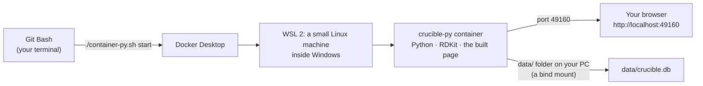

[← README](../README.md) · [Handbook](HANDBOOK.md) · [Glossary](00-glossary.md)

# Windows Install & Run — Crucible on a Windows 10 or 11 PC

> ⚠️ **Untested.** This guide is written to the same depth as the
> [macOS guide](01-setup-macos.md), from the scripts' behaviour and the
> Windows tools' documentation, but it has **not yet been walked on a real
> Windows machine**. Every "You should see" below is *expected*, not
> observed. The first person to follow it will find the places where Windows
> disagrees; please record them in [`11-lessons-learned.md`](11-lessons-learned.md)
> and remove this notice when the checklist passes. Until then, macOS and
> RHEL 8 are the verified platforms.

**Prerequisites:** a PC running 64-bit Windows 10 (version 2004 or later) or Windows 11; the ability to install programs (administrator rights, or an IT-approved software centre); an internet connection; about 45 minutes. No prior experience with containers or terminals needed.
**Learning goal:** after this guide you will understand what a container is and why this app uses one, how Windows runs Linux containers (through a small hidden Linux machine), how to start, stop and check the app, and how to serve it over HTTPS — plus you will have it running.
**Time:** about 45 minutes, most of it downloading and the first image build.

> ### How to read this doc
>
> **Numbered steps are things you do.** The text between them explains *why*.
> Every piece of jargon is defined the first time it appears and again in the
> [glossary](00-glossary.md).
>
> **Grey boxes are commands.** On Windows you will type them into **Git Bash**
> — a terminal window that understands the same commands as a Mac or Linux
> terminal, installed with Git in section 2. This project's scripts are
> written for that kind of terminal, so using Git Bash means every command in
> every other guide works here unchanged. (PowerShell, Windows' own terminal,
> is used for exactly two commands, both marked `PS>`.)
>
> **Lines starting with `#` inside a grey box are comments** — notes to you,
> ignored by the terminal.
>
> After each command: **You should see** and **What it means**, and where a
> command can go sideways, an **If instead** naming the symptom and the fix.
>
> Nothing here deletes your files. The one guide that does is the uninstall
> guide, and Windows has none yet: to remove the app, see
> [Removing it](#removing-it) at the end.

Companion documents: [macOS Install](01-setup-macos.md) · [RHEL 8 Install](01-setup-rhel8.md) ·
[Operations](07-operations.md). Clone from the **public** repository; the
private one is for the production VM only.

### What you are actually installing


Crucible has a **backend** (stores and serves the data, Python) and a
**frontend** (what you see in the browser, React). You install neither
directly. You install one thing that carries both:

- A **container** ([glossary](00-glossary.md#the-container-words)) — a sealed
  lunchbox holding the app and every library it needs. It runs on your PC but
  does not mix with it.
- An **image** — the packed lunchbox the container is started from. Built
  once; started as often as you like.
- A **container runtime** — the program that builds images and runs
  containers. On Windows the practical choice is **Docker Desktop**, and this
  guide uses it. (Podman also runs on Windows; it is noted, not walked.)

**The Windows-specific idea.** Containers are a Linux technology. Windows
runs them by keeping a small, invisible Linux machine inside Windows —
**WSL 2**, the Windows Subsystem for Linux — and running the containers
there. Docker Desktop installs and manages it for you. *Everyday version:* a
kitchen in the basement that Docker Desktop keeps stocked; you never go
down there, you just order from upstairs.



## Table of Contents

- [1. Before you type anything](#1-before-you-type-anything)
- [2. Install Git for Windows (gives you Git Bash)](#2-install-git-for-windows-gives-you-git-bash)
- [3. Install Docker Desktop](#3-install-docker-desktop)
- [4. Get the project](#4-get-the-project)
- [5. Install and run (HTTP)](#5-install-and-run-http)
- [6. Enable HTTPS](#6-enable-https)
- [7. Verification checklist](#7-verification-checklist)
- [8. Day-2 operations](#8-day-2-operations)
- [9. Windows-specific gotchas](#9-windows-specific-gotchas)
- [10. The WSL 2 alternative](#10-the-wsl-2-alternative)
- [What you have now](#what-you-have-now)
- [Removing it](#removing-it)
- [Troubleshooting](#troubleshooting)

---

## 1. Before you type anything

You will install two programs. Everything else lives inside one project
folder that you can delete to undo it all.

| Tool | What it is | Everyday version |
|---|---|---|
| **Git for Windows** | Git, the save-game system for code, plus **Git Bash**, the terminal this project's scripts expect | A photo album of the project's history, and a window to talk to the computer in sentences |
| **Docker Desktop** | The container runtime, with the hidden Linux machine it needs | The basement kitchen and the person who runs it |

**A convention for this page.** Windows paths use backslashes
(`C:\Users\<you>\projects`). Inside Git Bash the same folder is written
`/c/Users/<you>/projects`. Both name the same place. `<you>` means your own
Windows username — never type the angle brackets.

---

## 2. Install Git for Windows (gives you Git Bash)

1. Open <https://git-scm.com/download/win> and download the **64-bit Git for
   Windows Setup**.
2. Run it. Accept every default except one screen: **"Configuring the line
   ending conversions"** — choose **"Checkout as-is, commit as-is"**. *Why:*
   the project's scripts are shell scripts; if Windows rewrites their line
   endings, bash will refuse them with a baffling error (`$'\r': command not
   found`). This one choice prevents it.
3. Press the Windows key, type `Git Bash`, press Enter. A window opens with a
   prompt ending in `$`. That is the computer waiting for you.

```bash
git --version
```

**You should see (expected):** `git version 2.4x.x.windows.x`. Any version
2.23 or newer is fine.

Tell Git who you are — stamped on every snapshot you save:

```bash
git config --global user.name "Your Name"
git config --global user.email "you@example.com"
git config --global core.autocrlf false        # belt and braces for the line-ending choice above
```

---

## 3. Install Docker Desktop

1. Open <https://www.docker.com/products/docker-desktop/> and download
   **Docker Desktop for Windows**.
2. Run the installer. Keep **"Use WSL 2 instead of Hyper-V"** ticked. If the
   installer asks to enable WSL or a Windows feature, allow it; a **reboot**
   may be required — do it, then reopen Git Bash.
3. Start Docker Desktop from the Start menu. Wait for the whale icon in the
   system tray to stop animating. *Why:* the hidden Linux machine takes half
   a minute to boot; nothing container-shaped works until it has.

```bash
docker --version
docker run --rm hello-world
```

**You should see (expected):** a version line, then a paragraph beginning
`Hello from Docker!`.

**What it means:** Git Bash can talk to Docker Desktop, Docker Desktop can
reach its Linux machine, and that machine can pull and run an image. Every
later step rests on this.

**If instead:** `docker: command not found` — close Git Bash and open a new
one; the installer updates the search path for *new* windows only. **If
instead:** `error during connect` — Docker Desktop is not running yet; start
it and wait for the whale.

> **Licensing note.** Docker Desktop is free for personal use, education and
> small businesses; larger organisations need a paid subscription. If that is
> a problem, section 10 describes running podman or Docker Engine inside
> WSL 2 directly, with no Docker Desktop.

---

## 4. Get the project

```bash
# 1. A folder for projects (created if missing), then the clone
mkdir -p /c/Users/$USERNAME/projects && cd /c/Users/$USERNAME/projects
git clone https://github.com/akannan2987/nr-nips-crucible.git
cd nr-nips-crucible
ls
```

**You should see (expected):** the repository's files — `README.md`,
`backend/`, `client/`, `docs/`, `container-py.sh` and the other scripts.

**What it means:** you have your own complete copy, history and all.
`$USERNAME` is Git Bash's name for your Windows username.

---

## 5. Install and run (HTTP)

The same one command as on macOS and RHEL 8:

```bash
# 2. One-shot setup: build the image, start the container, verify the API
SETUP_MONITOR=n ./setup-after-clone-py.sh
```

**Why `SETUP_MONITOR=n`:** the health-monitoring cron job the script offers
is a Linux/macOS mechanism. Windows has no `crontab`; the script would fail
at that step. Skip it here; section 9 says what to use instead.

**You should see (expected):** the script detect `docker`, print "No
certificate store … starting in HTTP mode", build the image (several
minutes the first time — two stages, the second installing RDKit), start the
container, poll the API for up to a minute and print the stats JSON, then a
line naming `http://localhost:49160`.

**If instead:** the build fails with a message about a path such as
`C:/Program Files/Git/app/data` — Git Bash has rewritten a container path
into a Windows one. This is the best-known Windows gotcha (section 9); run
the command as:

```bash
MSYS_NO_PATHCONV=1 SETUP_MONITOR=n ./setup-after-clone-py.sh
```

and, if that fixes it, put `export MSYS_NO_PATHCONV=1` in `~/.bashrc` so
every later command has it.

**If instead:** `$'\r': command not found` — line endings were converted at
clone time (section 2, step 2). Fix with
`git config core.autocrlf false && git rm -q --cached -r . && git reset --hard`.

Open the app:

```bash
start http://localhost:49160
```

(`start` is Windows' equivalent of macOS's `open`: hand this to the default
browser.)

**You should see (expected):** the dashboard, with zero counts.

---

## 6. Enable HTTPS

Optional on a development PC. **Option A** makes a self-signed certificate
(the browser will warn; that is expected for a certificate you signed
yourself). Git for Windows ships the `openssl` tool the script needs.

```bash
./setup-ssl.sh                                # writes certs/server.crt and certs/server.key
./container-py.sh start-ssl
curl --noproxy '*' -sSk https://localhost:49160/api/stats
```

**You should see (expected):** the certificate generated, the container
recreated "with HTTPS", and the stats JSON over `https://`. **Option B**,
real certificates you already hold, is identical to the
[macOS guide §3](01-setup-macos.md#3-enable-https): copy the pair into
`certs/` and run `start-ssl`.

---

## 7. Verification checklist

The same seven checks as macOS, with the Windows variants marked. Run
whichever line matches your mode (HTTP or HTTPS), not both.

```bash
# V1. API answers with stats JSON (must contain "chemicals")
curl --noproxy '*' -sS  http://localhost:49160/api/stats     # HTTP
curl --noproxy '*' -sSk https://localhost:49160/api/stats    # HTTPS
```

**You should see (expected):** one long JSON line starting `{"chemicals":`.
`curl` ships with Windows 10 and later and with Git Bash.

```bash
# V2. Container is up and (after ~30 s) healthy
./container-py.sh status
```

**You should see (expected):** a `NAMES STATUS PORTS` table with
`crucible-py` and `Up … (healthy)`, then the stats JSON.

```bash
# V3. UI loads in the browser (React app + architecture page)
start http://localhost:49160
start http://localhost:49160/architecture
```

```bash
# V4. Logs are clean (Ctrl-C to stop watching; the app keeps running)
./container-py.sh logs
```

```bash
# V5. Health monitor runs — by hand, since Windows has no cron
./monitor.sh                                                  # HTTP
API_URL=https://localhost:49160/api/stats ./monitor.sh        # HTTPS
```

**You should see (expected):** two timestamped lines ending
`✓ Application is healthy`. To run it on a schedule, Windows' **Task
Scheduler** can run `"C:\Program Files\Git\bin\bash.exe" -lc "cd
/c/Users/<you>/projects/nr-nips-crucible && ./monitor.sh"` every five
minutes — untested, and on a development PC the monitor earns little.

```bash
# V6. Backup / restore round-trip works
./container-py.sh backup
```

**You should see (expected):** `✓ Backup complete:` and a file under
`backups/`.

```bash
# V7. Backend test suite passes (needs Python on Windows itself)
cd backend
py -3.12 -m venv .venv 2>/dev/null || python -m venv .venv
.venv/Scripts/pip install -r requirements.lock       # the exact versions the image runs
.venv/Scripts/pytest
.venv/Scripts/ruff check .
cd ..
```

**You should see (expected):** `90 passed`. **Note the path:** on Windows a
virtual environment puts its programs in `.venv/Scripts/`, not
`.venv/bin/`. Everywhere another guide says `.venv/bin/pytest`, read
`.venv/Scripts/pytest` here. Python itself comes from <https://www.python.org/downloads/windows/>
(tick "Add python.exe to PATH" in its installer); V7 is the only check that
needs it, and skipping it is fine if you are running the app rather than
changing it.

**If instead:** the RDKit wheel fails to install — RDKit publishes Windows
wheels for supported Python versions; use Python 3.12 exactly, or run the
tests inside the container instead:
`docker exec crucible-py python -m pytest -q /app/backend/tests`.

---

## 8. Day-2 operations

Identical to the macOS guide's [§5](01-setup-macos.md#5-day-2-operations):
`git pull` then `./container-py.sh rebuild` to update; `backup` and
`restore`; `./cert-expiry-check.sh` for certificates. The full runbook is
[`07-operations.md`](07-operations.md).

Starting the app tomorrow: open Docker Desktop, wait for the whale, then in
Git Bash `./container-py.sh start`.

---

## 9. Windows-specific gotchas

Expected, not yet observed. Each will either be confirmed or removed by the
first real walk.

- **Path conversion.** Git Bash (MSYS) rewrites arguments that look like
  Unix paths (`/app/data`) into Windows paths before a program sees them,
  which breaks the container's volume mounts. `MSYS_NO_PATHCONV=1` turns the
  rewriting off. The scripts should not need it, but if any command fails
  with a `C:/Program Files/Git/...` path in the message, this is why.
- **Line endings.** Shell scripts with Windows line endings do not run. The
  clone-time setting in section 2 prevents it; `git config core.autocrlf`
  should print `false`.
- **Docker Desktop must be running.** Unlike podman on macOS, the scripts do
  not check for it; the symptom is `error during connect` on any command.
- **The port is published on all interfaces.** The scripts bind to
  `127.0.0.1` on macOS only; on Windows and Linux they bind `0.0.0.0`, so
  another machine on your network can reach port 49160. Windows Defender
  Firewall will usually ask on first start; answer for private networks
  only, or set `HOST_BIND=127.0.0.1` before `start` to keep it local.
- **No `lsof`, `crontab` or `sqlite3`.** Find who holds a port with
  `netstat -ano | grep 49160`; schedule with Task Scheduler; query the
  database with the app's Query tab or `docker exec crucible-py python -c …`.
- **The `:Z` suffix on mounts** is a SELinux setting for RHEL 8. Docker
  Desktop accepts and ignores it.
- **`open` does not exist**; use `start`. **`brew` does not exist**; each
  tool has its own installer.
- **Antivirus and the first build.** Real-time scanning of the Docker data
  folder can make the first image build very slow. Excluding Docker
  Desktop's data directory is a common fix; ask IT before changing
  antivirus settings on a managed PC.

---

## 10. The WSL 2 alternative

If Docker Desktop is not allowed, install a Linux distribution inside
WSL 2 and follow the **RHEL 8 guide** inside it, treating it as a Linux
machine without systemd or a firewall:

```
PS> wsl --install -d Ubuntu          # PowerShell, once; reboot if asked
```

Then, inside the Ubuntu terminal: `sudo apt install podman` (or Docker
Engine), clone the repository under the Linux home (`~/projects`, **not**
under `/mnt/c/` — files there are slow and lose Unix permissions), and run
`./setup-after-clone-py.sh` exactly as [`01-setup-rhel8.md` §2](01-setup-rhel8.md#2-install-and-run)
does. The app is reachable from Windows at `http://localhost:49160` because
WSL 2 forwards ports automatically. Sections 1.3 (lingering), 1.4
(firewall) and 4 (systemd) of the RHEL 8 guide do not apply.

---

## What you have now


- **Git for Windows** with Git Bash, and **Docker Desktop** with its hidden
  Linux machine.
- A local **clone** of the public repository under `C:\Users\<you>\projects`.
- The image `crucible-py:latest` and a running container `crucible-py`.
- The app at **<http://localhost:49160>** (or `https://` after §6), with its
  database at `data\crucible.db` on your PC, not inside the container.
- A verified backup in `backups\`, if you ran V6.

The four everyday commands are the same as everywhere else:

```bash
./container-py.sh status     # is it alive?
./container-py.sh logs       # what is it saying? (Ctrl-C to stop watching)
./container-py.sh backup     # make a safety copy
./container-py.sh stop       # switch it off
```

---

## Removing it

There is no Windows uninstall guide yet. The macOS guide's structure applies;
in Git Bash:

```bash
./uninstall.sh --dry-run      # preview; expected to work under Git Bash, untested
./container-py.sh backup      # keep a copy of the database first
./uninstall.sh --partial      # container + image; keeps source and data/
```

Then delete the project folder if you want it gone entirely, and uninstall
Docker Desktop from Windows Settings → Apps if you no longer need it. The
`data\` folder holds your records: copy it somewhere first.

---

## Troubleshooting

| Message | Cause | Fix |
|---|---|---|
| `docker: command not found` | new program, old terminal | open a new Git Bash window |
| `error during connect: … dockerDesktopLinuxEngine` | Docker Desktop not running | start it; wait for the whale icon |
| `$'\r': command not found` | Windows line endings in a script | section 2 step 2; then `git rm -q --cached -r . && git reset --hard` |
| a path like `C:/Program Files/Git/app/data` in an error | Git Bash path conversion | `export MSYS_NO_PATHCONV=1` |
| `bind: An attempt was made to access a socket…` | port 49160 held by another program | `netstat -ano \| grep 49160`, then stop that program or set `CRUCIBLE_PORT=<n>` |
| `.venv/bin/pytest: No such file` | Windows virtual-environment layout | use `.venv/Scripts/pytest` |
| very slow first build | antivirus scanning Docker's data folder | ask IT about excluding Docker Desktop's data directory |

**Last Updated:** September 7, 2026 — **untested on a real Windows machine**
