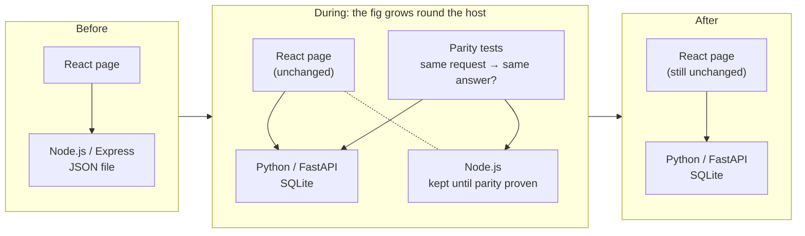

[← README](../../README.md) · [Handbook](../HANDBOOK.md) · [Glossary](../00-glossary.md) · [Phase 01 →](phase-01-postgres-alembic.md)

# Phase 00 — From a Node.js prototype to a Python backend, without the users noticing

**Version shipped:** pre-2.0 · **Date:** before 2026-08-06 (the exact date is not recorded; the public repository begins after the migration) · **Status:** reconstructed
**Prerequisites:** none to read; to run the walk-through steps, the setup guide for your platform ([macOS](../01-setup-macos.md) · [RHEL 8](../01-setup-rhel8.md)) and the test virtual environment from its V7 check.
**Learning goal:** you understand what an API *contract* is, why a rewrite that keeps the contract can happen underneath a running application, and how the tests in this repository make that promise checkable.
**Deliverable:** the Python/FastAPI backend that exists today, answering exactly the requests the original Node.js/Express backend answered, verified by parity tests, with the Node stack removed.

> **Reconstructed.** This phase was finished before the public repository and its release notes existed. What follows is rebuilt from [`12-history.md`](../12-history.md), the first commits, and the code as it is now. Where the history does not say how something was done, this page says *not recorded* rather than inventing a command.

---

## Contents

1. [Why this phase exists](#why-this-phase-exists)
2. [What was built](#what-was-built)
3. [How it was done, as far as the record shows](#how-it-was-done-as-far-as-the-record-shows)
4. [Step 1 — Read the contract before the code](#step-1--read-the-contract-before-the-code)
5. [Step 2 — Run the parity tests](#step-2--run-the-parity-tests)
6. [Step 3 — Follow one request through the four layers](#step-3--follow-one-request-through-the-four-layers)
7. [Step 4 — Look at how a record is stored](#step-4--look-at-how-a-record-is-stored)
8. [Step 5 — Read the image recipe](#step-5--read-the-image-recipe)
9. [Checkpoint](#checkpoint)
10. [What this phase deliberately did not do](#what-this-phase-deliberately-did-not-do)
11. [Publish](#publish)

---

## Why this phase exists

The first version of this system — the "Pandora toolbox" the project name
refers to — was a prototype: a Node.js/Express server storing every record in
one JSON file, with a React page in front. It worked, and people used it. Its
limits were the limits of a prototype: no real database, no room for
chemistry tooling (the structure-file parsing this laboratory needs lives in
Python's RDKit, not in the Node ecosystem), and a data file that grew without
an index.

Rewriting a system people use has one classic failure: the new version
behaves *slightly* differently, and every screen that depended on the old
behaviour breaks at once. The way round it has a name, the **strangler fig**
— a plant that grows around a host tree until the host can be removed and the
fig stands on its own. In software: build the new backend to answer *every
request exactly as the old one did*, prove it with tests, swap it in behind
the same web page, then delete the old one.

*Everyday version:* replacing the engine of a car while keeping the dashboard,
the pedals and the key. The driver turns the same key and presses the same
pedals; only the mechanic knows what changed underneath.



---

## What was built

| Piece | What it is | Where it lives today |
|---|---|---|
| The **API contract** | The exact set of addresses the browser calls, with the exact shape of every answer — status codes, field names, even the messages | Locked by `backend/tests/` and written up in [`08-api-reference.md`](../08-api-reference.md) |
| **FastAPI backend** | A Python web server answering that contract | `backend/app/` — thin routers, a data-access layer, models, lenient schemas |
| **Hybrid storage** | Each record kept whole as JSON in a `doc` column, plus a few indexed columns to find it | `backend/app/models.py`; explained in [`02-database-schema.md`](../02-database-schema.md) |
| **Parity tests** | Tests asserting the Python answers match the Node answers, quirks included | `backend/tests/test_parity_*.py` |
| **Portable ports and binding** | Port moved from 5942 to 49160, read from `CRUCIBLE_PORT`; the host interface chosen per platform | `container-py.sh` |
| **One image, two runtimes** | A multi-stage container image built by podman or Docker | `backend/Dockerfile`, `container-py.sh` |
| **The retirement** | `server/`, the Node `Dockerfile`, `container.sh`, the JSON data file and the one-time migration tool removed | gone; recorded in [`12-history.md`](../12-history.md#1-what-changed-and-why) |

Two decisions from this phase still govern everything:

- **The stored document is the truth; every other column is an index.** The
  original store had no schema, so the new tables keep each record verbatim
  in `doc` and add only what is needed to find it. That is what kept every
  API response byte-identical through the switch, and it is the rule
  [`02-architecture.md`](../02-architecture.md#the-one-design-rule-everything-else-follows-from)
  says nothing may break without a written decision.
- **Lenient schemas.** Every field optional, unknown keys preserved. A
  spreadsheet never has to be reshaped to be accepted, and the old prototype's
  tolerance is kept.

---

## How it was done, as far as the record shows

| Step in the migration | What the record says | Source |
|---|---|---|
| Rename and standardise | Project renamed to Crucible; image and container names fixed | [`12-history.md` §1](../12-history.md#1-what-changed-and-why) |
| Make it portable | Port 5942 → 49160 everywhere; `PORT` from the environment; no hard-coded hostnames; host binding 127.0.0.1 on macOS (an Apple background service occupies ports 49152 and above on a link-local address) and 0.0.0.0 on Linux; the in-container health probe pointed at 127.0.0.1 because `localhost` resolved to IPv6 while the server listened on IPv4 | same |
| Build the Python backend | FastAPI + SQLAlchemy 2 + Pydantic v2 over SQLite; RDKit for structure files; openpyxl for Excel | same |
| Prove the contract | A one-time JSON → SQL import, then contract-parity tests run against both backends | same; the tests survive in `backend/tests/` |
| Containerise | `backend/Dockerfile`, multi-stage; `container-py.sh` for podman or Docker | same |
| Retire the host | The Node stack, its container script, its data file and the migration tooling deleted | same |
| **Dates, order of work, and the commands used** | **not recorded** | — |

The steps below therefore do not repeat the migration. They walk *the result*,
so that you can see the contract, the tests and the layers for yourself. They
run on any machine that has completed a setup guide.

---

## Step 1 — Read the contract before the code

**What:** open one parity test and read it as a specification.

**How:**

```bash
cd ~/Documents/Work/pandora_toolbox/nr-nips-crucible      # Mac; on the VM the tests cannot run (system Python 3.6)
sed -n 1,40p backend/tests/test_parity_chemicals.py
```

**Why:** a **contract** is the promise a server makes to its clients: *send
this, get exactly that back*. Before the rewrite, the promise lived only in
the running Node code. The parity tests wrote it down, which is what made the
rewrite safe — anything the tests cover cannot change without a test failing.

**You should see:** a docstring saying the tests assert response keys,
messages and status codes for the chemicals route, followed by test functions
whose names read like sentences (`test_…`).

**What it means:** every one of those functions is one clause of the promise.
The word *parity* means "the same on both sides".

---

## Step 2 — Run the parity tests

**What:** prove the promise holds on your machine.

**How:**

```bash
cd backend && .venv/bin/pytest -q && cd ..
```

**Why:** the tests build a fresh application in memory with a throwaway
database for every test, so they need no container and no network. This is
the first of the three gates every change passes before it is published.

**You should see:** a run of dots and `90 passed`.

**If instead:** `No such file or directory: .venv/bin/pytest` — the test
virtual environment has not been created; the V7 check of your setup guide
creates it. **If instead:** a failure — you have changed the contract, or a
dependency has; read the failing test's name before anything else.

---

## Step 3 — Follow one request through the four layers

**What:** trace `GET /api/chemicals` from the address to the database.

**How:** open the files in this order and find the function that handles the
request in each:

| Layer | File | What to look for |
|---|---|---|
| Router | `backend/app/routers/chemicals.py` | the function decorated with `@router.get("")` or similar; it receives `db: Session = Depends(get_db)` |
| Session | `backend/app/database.py` | `get_db`: opens a database session before the handler runs and closes it after |
| Store | `backend/app/store.py` | the verb the router calls — the only place that talks to the tables |
| Model | `backend/app/models.py` | the `Chemical` class: the `doc` column plus the indexed ones |

**Why:** routers stay thin on purpose, so that the logic lives in one place
(`store.py`) and a new client — a script, another tool — gets exactly what the
web page gets. This is the shape every later phase followed.

**You should see:** a router function of a few lines that calls one store
function and returns its result; the store function building a query on the
model.

**What it means:** "API-first" is not a slogan here; it is the file layout.

---

## Step 4 — Look at how a record is stored

**What:** see the hybrid document pattern in the database itself.

**How:** with the application running and at least one chemical loaded (the
[playbook](../10-user-playbook.md#part-2--put-a-laboratory-file-in) shows an
upload; the [API cookbook](../08-api-cookbook.md#loading-data-in) shows the
same by command):

```bash
sqlite3 data/crucible.db "SELECT chemical_id, substr(doc, 1, 120) FROM chemicals LIMIT 2;"
```

**Why:** the whole design rule is visible in one row: a short indexed
identifier beside a JSON document holding everything the file said.

**You should see:** two rows, each an identifier such as `CHEM-0001` next to
the opening of a JSON object containing the same identifier, a name and the
other fields as the upload provided them.

**If instead:** `sqlite3: command not found` — install it (`brew install
sqlite` on a Mac) or use the read-only SQL console in the application's Query
tab, which runs the same statement; see [`09-query-cookbook.md`](../09-query-cookbook.md).

---

## Step 5 — Read the image recipe

**What:** see why the final image contains no Node.js at all.

**How:**

```bash
grep -nE "^FROM|^COPY --from|^COPY docs|^CMD" backend/Dockerfile
```

**Why:** the React page still has to be *built* with Node tooling, but the
built files are plain HTML and JavaScript. The recipe therefore has two
stages: a Node stage that builds the page, and a Python stage that copies only
the result. The Node stage is thrown away.

**You should see:** two `FROM` lines (a Node image, then `python:3.12-slim`),
a `COPY --from=client-build` line bringing the built page across, a `COPY
docs docs` line (for the interactive architecture page), and a `CMD` that
starts the Python entrypoint.

**What it means:** the security scanner's findings on the Node build tooling
(a carried item in the [roadmap](../05-roadmap.md#carried-items-none-blocking))
concern files that never reach the running image.

---

## Checkpoint

```bash
cd backend && .venv/bin/pytest -q 2>&1 | tail -1 && cd ..
curl --noproxy '*' -sS http://localhost:49160/api/stats | head -c 60; echo
```

**You should see** `90 passed` and a line beginning `{"chemicals":{"total":`.
The first proves the contract; the second proves the Python backend is the
one answering it.

---

## What this phase deliberately did not do

- **Change the API.** Every quirk of the prototype was reproduced, including
  messages and edge cases a fresh design would not choose. Cleaning them up
  would have broken the page during the switch; it can be done later, one
  clause at a time, with the tests as the record.
- **Normalise the schema.** The `doc` column keeps the data exactly as it was;
  promoting fields into real columns is [phase 06](../05-roadmap.md#the-next-three-phases).
- **Add authentication.** The prototype had none; the rewrite kept parity.
  That is [phase 07](../05-roadmap.md#the-next-three-phases).

---

## Publish

The commit that shipped it is not in the public history, which begins after
the migration with `28e7c99 Initial commit` on 2026-08-06. How a change is
published today, on both machines, is in
[`03-git-workflow.md` → Flow A](../03-git-workflow.md#4-flow-a---a-change-from-start-to-finish).

**Last Updated:** September 7, 2026
