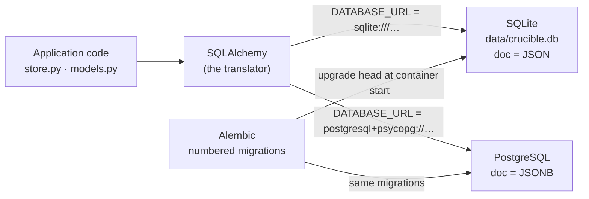

[← README](../../README.md) · [Handbook](../HANDBOOK.md) · [Glossary](../00-glossary.md) · [← Phase 00](phase-00-node-to-python.md) · [Phase 02 →](phase-02-public-repo-hygiene.md)

# Phase 01 — One codebase, two databases: PostgreSQL beside SQLite, with Alembic in charge of the schema

**Version shipped:** pre-2.0 · **Date:** before 2026-08-06 (not recorded more precisely) · **Status:** reconstructed
**Prerequisites:** [Phase 00](phase-00-node-to-python.md); a setup guide completed; for the optional PostgreSQL walk-through, about 1 GB of disk for the database image.
**Learning goal:** you understand why a single-file database is the right default here, what changes when a database *server* is used instead, and what a migration tool does that a "create the tables" call cannot.
**Deliverable:** the application runs unchanged against SQLite (default) or PostgreSQL (one setting), and inside the container the schema is owned by Alembic migrations rather than created on the fly.

> **Reconstructed.** From [`12-history.md` §5](../12-history.md#5-open-items), [`07-operations.md` → Database](../07-operations.md#database-sqlite-and-postgresql), [`backend/README.md`](../../backend/README.md) and the code. The commit that delivered it is recorded as a private-repository commit and predates the public history; its date is *not recorded*.

---

## Contents

1. [Why this phase exists](#why-this-phase-exists)
2. [What was built](#what-was-built)
3. [Step 1 — See which database you are on](#step-1--see-which-database-you-are-on)
4. [Step 2 — Read the schema Alembic owns](#step-2--read-the-schema-alembic-owns)
5. [Step 3 — Watch the container bring the schema to head](#step-3--watch-the-container-bring-the-schema-to-head)
6. [Step 4 — Run against PostgreSQL (optional)](#step-4--run-against-postgresql-optional)
7. [Step 5 — Check for drift](#step-5--check-for-drift)
8. [Checkpoint](#checkpoint)
9. [What this phase deliberately did not do](#what-this-phase-deliberately-did-not-do)
10. [Publish](#publish)

---

## Why this phase exists

**SQLite** is a database that is one file. No service to start, no account,
no password, no port; copying the file copies everything, which is exactly
what the backup command does. For a laboratory registry — bulk uploads, many
reads, one machine — it is not a compromise; it is the right tool.

But SQLite takes **one writer at a time**. If a dozen people ever upload
simultaneously, or the registry moves to a shared server, a database
*server* — **PostgreSQL** — is the answer: many connections, permissions, a
process that stays up. Choosing between them later would be expensive if the
code cared which one it was talking to. So this phase made the code not care.

The second problem is subtler. When the tables are created by a "make all the
tables" call at startup, *changing* a table later has no safe path: the call
creates what is missing and ignores what differs. A **migration tool** keeps a
numbered history of schema changes and applies exactly the ones a database has
not seen yet, in order, on either engine. That tool is **Alembic**.

*Everyday version:* SQLite is a notebook you carry; PostgreSQL is a filing
room with a clerk. The ORM is a translator who speaks to both. Alembic is the
renovation log for the filing room: every change to the shelves is written
down, numbered, and applied in the same order to every branch office.



---

## What was built

| Piece | What it does | Where |
|---|---|---|
| `DATABASE_URL` | One connection string decides the engine. Default: `sqlite:///<repo>/data/crucible.db` | `backend/app/config.py`; table in [`backend/README.md`](../../backend/README.md#environment-variables) |
| `USE_POSTGRES=true` | Convenience switch for the container script: starts the app against the managed PostgreSQL container | `container-py.sh` |
| `db-start` · `db-stop` · `db-shell` | Start, stop and open a shell on a PostgreSQL container the script manages for you | `container-py.sh` |
| `doc` as JSON or JSONB | The same column is JSON text on SQLite and binary JSONB on PostgreSQL, where it can be indexed | `backend/app/models.py` |
| Alembic environment | `backend/alembic/` with numbered revisions; `alembic.ini` reads `DATABASE_URL` | `backend/alembic/` |
| `db_bootstrap.py` | At container start: adopt an existing schema or upgrade it to the newest revision, then hand over to the web server | `backend/scripts/db_bootstrap.py`, called by `entrypoint.sh` |
| `AUTO_INIT_DB` | `true` (local dev, tests): create tables directly. `false` (the container image): Alembic owns the schema | `backend/app/config.py`, `backend/Dockerfile` |
| SQLite → PostgreSQL copier | Moves the data across engines when the time comes | `backend/scripts/migrate_sqlite_to_postgres.py` |

The design rule from phase 00 is what makes the engine swap cheap: because
every record is a `doc`, the schema is small and the same on both engines.

---

## Step 1 — See which database you are on

**What:** find the setting and the file.

**How:**

```bash
grep -n "DATABASE_URL\|AUTO_INIT_DB" backend/app/config.py
ls -lh data/crucible.db
```

**Why:** before changing anything, know the default. Every later step is a
variation on this one setting.

**You should see:** the config reading `DATABASE_URL` from the environment
with a SQLite default under `data/`, and `AUTO_INIT_DB` defaulting to `true`;
then the database file with its size (about 118 MB on production, a few
hundred kilobytes on a fresh install).

---

## Step 2 — Read the schema Alembic owns

**What:** look at the migration history.

**How:**

```bash
ls backend/alembic/versions/
sed -n 1,30p "$(ls backend/alembic/versions/*.py | head -1)"
```

**Why:** each file is one numbered change to the schema, with an `upgrade()`
and a `downgrade()`. Reading the first one shows the four tables and their
indexed columns as they were first created.

**You should see:** one or more Python files with hashed names; inside the
first, `revision = …`, `down_revision = None`, and an `upgrade()` creating the
`chemicals`, `samples`, `screening` and `toxicology` tables.

**What it means:** the schema has a *history*, not just a current state.
Phase 06 will add a revision to it rather than editing the models alone.

---

## Step 3 — Watch the container bring the schema to head

**What:** see Alembic run at startup.

**How:**

```bash
./container-py.sh logs | head -20        # Ctrl-C to stop following
```

**Why:** the image sets `AUTO_INIT_DB=false`, so the container never creates
tables directly; the entrypoint runs the bootstrap script, which runs
`alembic upgrade head`. "Head" is the newest revision.

**You should see:** near the top, lines from the bootstrap script about the
schema being current (or being upgraded), before the web server's own startup
lines.

**If instead:** the log shows a migration error — the database file is from a
newer version than the code. Restore the matching backup or update the code;
[`07-operations.md` → Database](../07-operations.md#database-sqlite-and-postgresql)
covers both.

---

## Step 4 — Run against PostgreSQL (optional)

**What:** switch engines with one setting.

**How:**

```bash
./container-py.sh db-start                     # once: starts the managed PostgreSQL container
USE_POSTGRES=true ./container-py.sh start      # the app now talks to it
curl --noproxy '*' -sS http://localhost:49160/api/stats
./container-py.sh db-shell                     # \dt lists the tables; \q leaves
```

**Why:** to see for yourself that nothing in the application changed. The
same image, the same code, a different `DATABASE_URL`.

**You should see:** the PostgreSQL container start; the app start and answer
`/api/stats` (with zero counts — it is an empty database); and in the shell
the four tables, with `doc` typed `jsonb`.

**If instead:** you want your SQLite data there too:
`backend/scripts/migrate_sqlite_to_postgres.py` copies it; back up first.
To go back: `./container-py.sh stop && ./container-py.sh start` without the
variable.

---

## Step 5 — Check for drift

**What:** confirm the models and the migrations agree.

**How (Mac, test virtual environment):**

```bash
cd backend && .venv/bin/alembic check && cd ..
```

**Why:** "drift" is a model changed without a migration, or the reverse. The
check compares the two and reports any difference. It is the gate every
schema change in [phase 06](../05-roadmap.md#sh--shared-spine) must pass.

**You should see:** `No new upgrade operations detected.`

**If instead:** it lists operations — someone changed a model without writing
a migration. Do not "fix" it by editing the database; write the revision.

---

## Checkpoint

```bash
grep -c "" backend/alembic/versions/*.py | wc -l      # at least one revision exists
cd backend && .venv/bin/alembic check && cd ..        # expect: No new upgrade operations detected.
curl --noproxy '*' -sS http://localhost:49160/api/stats | head -c 40; echo
```

---

## What this phase deliberately did not do

- **Make PostgreSQL the default.** Nothing yet needs it; the notebook is
  faster than the filing room for one user. The trigger and the reasoning are
  in [`06-product-and-technology-roadmap.md`](../06-product-and-technology-roadmap.md).
- **Normalise the schema.** The migration tool was put in place *so that*
  phase 06 can do it safely; it did not do it.
- **Add an HTTP → HTTPS redirect or other niceties.** Listed as open in
  [`12-history.md` §5](../12-history.md#5-open-items).

---

## Publish

Shipped in a private-repository commit before the public history begins;
date *not recorded*. Today's publish path:
[`03-git-workflow.md` → Flow A](../03-git-workflow.md#4-flow-a---a-change-from-start-to-finish).
A schema change additionally runs `alembic check` in Step 1 of that flow.

**Last Updated:** September 7, 2026
