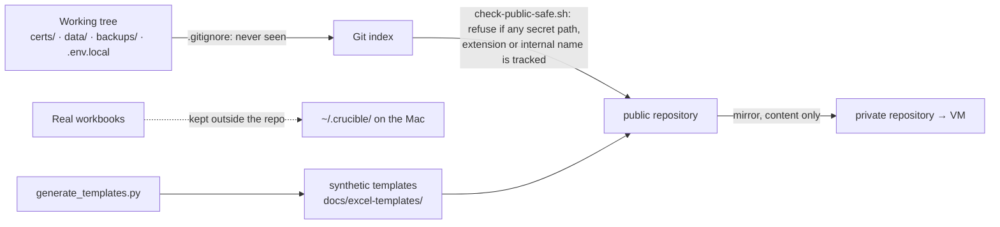

[← README](../../README.md) · [Handbook](../HANDBOOK.md) · [Glossary](../00-glossary.md) · [← Phase 01](phase-01-postgres-alembic.md) · [Phase 03 →](phase-03-platform-verification.md)

# Phase 02 — Making the repository safe to publish

**Version shipped:** 2.0.0 · **Date:** 2026-08-06 to 2026-08-07 · **Status:** reconstructed
**Prerequisites:** [Phase 00](phase-00-node-to-python.md) and [Phase 01](phase-01-postgres-alembic.md) for context; a setup guide completed to run the steps.
**Learning goal:** you understand what must never reach a public repository, the difference between *ignoring* a file and *guarding* against it, why real data was replaced by generated data, and how two repositories can hold one codebase.
**Deliverable:** a repository that can be pushed to a public host with no certificates, keys, databases, internal names or laboratory data in it — and a gate that refuses the push if any of those ever appear.

> **Reconstructed** from `NEWS.md` v2.0.0, the first five commits (`28e7c99` to `a20928d`) and the guides they created. Individual sub-steps inside those commits are *not recorded*.

---

## Contents

1. [Why this phase exists](#why-this-phase-exists)
2. [What was built](#what-was-built)
3. [Step 1 — See what is excluded, and why](#step-1--see-what-is-excluded-and-why)
4. [Step 2 — Run the gate](#step-2--run-the-gate)
5. [Step 3 — Find the placeholders](#step-3--find-the-placeholders)
6. [Step 4 — Regenerate the synthetic templates](#step-4--regenerate-the-synthetic-templates)
7. [Step 5 — Trace the two-repository flow](#step-5--trace-the-two-repository-flow)
8. [Checkpoint](#checkpoint)
9. [What this phase deliberately did not do](#what-this-phase-deliberately-did-not-do)
10. [Publish](#publish)

---

## Why this phase exists

The code was ready to share; the repository was not. It carried the things a
working system accumulates: TLS certificates and their private key, a
database with real laboratory records, spreadsheets with real compound names,
and the hostname, username and filesystem paths of the corporate machine it
ran on. None of that is code, and all of it is either secret, someone else's,
or a map for an attacker.

Two ideas do the work here:

- **Ignore** — tell Git never to *see* certain paths (`.gitignore`). This
  prevents accidents but not force: `git add -f` still wins.
- **Guard** — a script that inspects what *is* tracked and refuses the push if
  anything forbidden is there (`check-public-safe.sh`). This catches what
  ignoring cannot.

And one decision: the six real workbooks the guides used as examples were
replaced by **synthetic** ones, generated by a tracked script, so that the
documentation could show real column names with invented rows.

*Everyday version:* moving out of a rented office. The lock on the door
(ignore) keeps most things in; the checklist at the exit (guard) catches what
you carry out by hand. And the demo binder you leave for the next tenant has
the right tabs and made-up contents.



---

## What was built

| Piece | What it does | Where |
|---|---|---|
| `.gitignore` | Certificates and keys in every format, databases and backups, environment files, build output, per-machine notes | repository root |
| `check-public-safe.sh` | The gate: refuses if a secret path, a sensitive extension, an internal identifier or a non-template workbook is tracked; prints `✓ SAFE TO PUSH` or the list of problems | repository root; owns the list of internal identifiers |
| Placeholders | `<vm-hostname>`, `<cert-store-path>`, `<your-user>`, `<maintainer-email>` replace real values in every document and script | throughout `docs/` |
| `.env.local` | Untracked per-machine file holding the real values (`CERT_SOURCE`, `CERT_HOSTNAME`, `USE_HTTPS`); read by the setup and container scripts | created by hand on each machine; the variables it holds are listed in [`01-setup-rhel8.md` §3.2](../01-setup-rhel8.md#32-configure-the-certificate-source) |
| `generate_templates.py` | Produces synthetic CSV, XLSX and SDF upload files with no real data and no document metadata, verified to import through the real endpoints | `docs/excel-templates/` |
| Four platform guides | Install and uninstall for macOS and RHEL 8, with mirrored verification checklists | now `docs/01-*.md` |
| The Git workflow document | Two repositories, three folders, the gate in the flow | now [`03-git-workflow.md`](../03-git-workflow.md) |
| Certificate backup | The real certificate and key copied outside the repository before anything else, so an uninstall cannot lose them | outside the repository, on the owner's machine |

---

## Step 1 — See what is excluded, and why

**What:** read the ignore rules.

**How:**

```bash
grep -vE '^\s*(#|$)' .gitignore | head -40
```

**Why:** the list is the policy. Each group answers one question: *what would
be secret, someone else's data, or regenerated anyway?*

**You should see:** patterns for `certs/`, `*.key`, `*.crt` and their
relatives; `data/`, `backups/`, `*.db`; `.env` and `.env.*`; `node_modules/`,
`client/dist/`, `.venv/`; and a rule keeping only `*_template.*` files under
the templates folder.

**What it means:** two kinds of "not in Git": things that are *yours* (data,
certificates) and things that are *regenerated* (builds). Both are absent for
different reasons; the README's repository map says which is which.

---

## Step 2 — Run the gate

**What:** run the guard and read what it checks.

**How:**

```bash
./check-public-safe.sh
```

**Why:** this is the one command that stands between a keystroke and a public
leak. It runs before every public push, and the workflow document says never
to push if it fails.

**You should see:** numbered sections — secret paths, sensitive extensions,
workbooks, internal identifiers — each reporting nothing found, then a note
about the accepted attribution lines (the maintainer label in the image and
the certificate subject), and finally `✓ SAFE TO PUSH to the public
repository`.

**If instead:** a red `✗ TRACKED:` line — a forbidden file is in the index.
`git rm --cached <file>` untracks it; then find out how it got there.

---

## Step 3 — Find the placeholders

**What:** see how internal names were removed without removing the
instructions that need them.

**How:**

```bash
grep -rhoE "<(vm-hostname|cert-store-path|your-user|maintainer-email)>" docs README.md | sort | uniq -c
grep -n "CERT_SOURCE\|CERT_HOSTNAME" setup-after-clone-py.sh | head -5
```

**Why:** a guide that says "copy the certificate from the store" is useless
without the path, and a guide that prints the real path leaks it. The
placeholder is the third option: the document shows the *shape*, the machine
holds the *value* in an untracked file, and the script joins them.

**You should see:** counts of each placeholder across the documents, and the
setup script reading `CERT_SOURCE` and `CERT_HOSTNAME` from `.env.local` with
environment variables taking precedence.

---

## Step 4 — Regenerate the synthetic templates

**What:** produce the example files from the script and confirm they import.

**How (Mac, test virtual environment):**

```bash
backend/.venv/bin/python docs/excel-templates/generate_templates.py
git status --short docs/excel-templates/        # expect: no changes, the output is deterministic
curl --noproxy '*' -sS -X POST http://localhost:49160/api/chemicals/upload/excel \
  -F "file=@docs/excel-templates/chemicals/chemicals_template.csv"
```

**Why:** the templates are documentation that can be *executed*: they show
each upload's column names, and the generator is the single source, so they
cannot drift from the parsers.

**You should see:** the generator finish quietly; a clean status; and
`{"message":"Successfully processed 5 chemicals (5 new, 0 updated)", …}` (or
`0 new, 5 updated` if you had loaded them before).

**If instead:** the generator needs openpyxl or RDKit — it runs with the
backend's virtual environment, which has both; use the path shown.

---

## Step 5 — Trace the two-repository flow

**What:** read the flow once, as a diagram and as commands.

**How:** open [`03-git-workflow.md` §1](../03-git-workflow.md#1-the-two-repositories)
and [§3 Golden rules](../03-git-workflow.md#3-golden-rules).

**Why:** the public repository is authored on a Mac that holds no private
credentials; the private one is filled by *copying content* from the public
one on the VM, never the reverse. That direction is what makes a leak into
the public repository impossible from the VM side, and the gate is what makes
it unlikely from the Mac side.

**You should see:** three folders, two remotes, and the rule that content
flows public → private only.

---

## Checkpoint

```bash
./check-public-safe.sh | tail -1                 # expect: ✓ SAFE TO PUSH to the public repository
git ls-files certs data backups | wc -l          # expect: 0
git ls-files docs/excel-templates | grep -vcE "_template\.|README|generate_templates" # expect: 0
```

---

## What this phase deliberately did not do

- **Reissue the TLS certificate.** The private key had been in the repository
  before this phase, so it is treated as exposed. Reissue is an action for the
  corporate certificate authority and is tracked as an open posture, not
  fixed by removing the file from history.
- **Add a licence.** Public on GitHub without a `LICENSE` file still means all
  rights reserved; the choice is the owner's and is on the [roadmap](../05-roadmap.md).
- **Verify the guides on a blank machine.** That is [phase 03](phase-03-platform-verification.md),
  and it found fifteen bugs.

---

## Publish

Shipped as `ec996f1 Add gitignore, platform runbooks, sanitized templates, and
container script fixes` (2026-08-06), followed by `72db107` (executable bits),
`cd0a13d Add GitOps workflow doc and public-push safety check` and `a20928d`
(2026-08-07). Published through the flow in
[`03-git-workflow.md`](../03-git-workflow.md#4-flow-a---a-change-from-start-to-finish),
which this phase itself wrote down.

**Last Updated:** September 7, 2026
