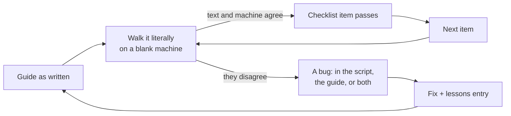

[← README](../../README.md) · [Handbook](../HANDBOOK.md) · [Glossary](../00-glossary.md) · [← Phase 02](phase-02-public-repo-hygiene.md) · [Phase 04 →](phase-04-template-ingestion.md)

# Phase 03 — Walking the guides on real machines, and fixing what they found

**Version shipped:** 2.0.1 to 2.1.0 · **Date:** 2026-08-17 to 2026-08-25 · **Status:** reconstructed
**Prerequisites:** [Phase 02](phase-02-public-repo-hygiene.md); to run the steps, a completed setup guide for [macOS](../01-setup-macos.md) or [RHEL 8](../01-setup-rhel8.md).
**Learning goal:** you understand why documentation is only tested when someone follows it literally, what a verification checklist is for, and the one failure shape — *an operation reporting one thing while doing another* — that most of the bugs shared.
**Deliverable:** both platform guides walked from a blank machine to a running, verified application; fifteen bugs found and fixed; mirrored checklists (V1–V7 on macOS, V1–V9 on RHEL 8) and a reinstall checklist (R1–R9); the documentation rewritten so that a newcomer can follow it.

> **Reconstructed** from `NEWS.md` v2.0.1 through v2.1.0, the commits from `0b86478` to `c1964c2`, and the guides as they stand. The order in which individual bugs were found is *not recorded*; the bugs themselves are, in [`11-lessons-learned.md`](../11-lessons-learned.md).

---

## Contents

1. [Why this phase exists](#why-this-phase-exists)
2. [What was built](#what-was-built)
3. [Step 1 — Run the verification checklist](#step-1--run-the-verification-checklist)
4. [Step 2 — Make a command that cannot fail silently](#step-2--make-a-command-that-cannot-fail-silently)
5. [Step 3 — Preview an uninstall](#step-3--preview-an-uninstall)
6. [Step 4 — Read the reinstall checklist](#step-4--read-the-reinstall-checklist)
7. [Step 5 — Find the failure shape in one bug](#step-5--find-the-failure-shape-in-one-bug)
8. [Checkpoint](#checkpoint)
9. [What this phase deliberately did not do](#what-this-phase-deliberately-did-not-do)
10. [Publish](#publish)

---

## Why this phase exists

Phase 02 wrote four guides. Nobody had followed them. A guide that has not
been followed literally, on a machine that starts blank, is a hope, not a
procedure — and this project's stated reason for detailed documentation is
that the person redeploying at 8 a.m. may never have used a container.

So the guides were walked: the macOS one from a simulated fresh clone, the
RHEL 8 one on the real production VM, which was fully uninstalled for the
purpose and rebuilt from the text. Every place the text and the machine
disagreed became a fix, and every fix became an entry in the lessons file.

*Everyday version:* a recipe is not tested by the person who wrote it. It is
tested by someone who has never made the dish, in a kitchen that has none of
the writer's habits, following each line as written.



---

## What was built

| Piece | What it does | Where |
|---|---|---|
| Verification checklists | V1–V7 (macOS) and V1–V9 (RHEL 8), *mirrored*: the same checks in the same order, plus the server-only ones — external access and surviving a reboot | [`01-setup-macos.md` §4](../01-setup-macos.md#4-verification-checklist) · [`01-setup-rhel8.md` §5](../01-setup-rhel8.md#5-verification-checklist) |
| Reinstall checklist | R1–R9: the steps a *re*installer skips because they sit inside "one-time prerequisites" — lingering, the certificate-expiry cron, the certificate source | [`01-uninstall-rhel8.md`](../01-uninstall-rhel8.md) |
| `container-py.sh` fixes | `rebuild` keeps HTTPS; `status` is HTTPS-aware; `start` prints the port actually served; `USE_HTTPS` read from `.env.local` on a fresh install | `container-py.sh` |
| `uninstall.sh` fixes | No longer aborts halfway under `set -e`; clears the systemd failed state; removes every cron entry and log; `--help` tells the truth | `uninstall.sh` |
| Visible failure | Thirty-five `curl -s` commands became `curl -sS`; verification blocks after a full uninstall start with `cd ~`; the cron line is generated rather than pasted | throughout the guides |
| The newcomer rewrite | Every term explained where it first appears, every command with expected output, an "if instead" for likely failures; the glossary and its contract; the API cookbook with live answers | `docs/00-glossary.md`, `docs/08-api-cookbook.md`, the setup guides |
| A recorded outcome | On the VM the test suite cannot run bare-metal (system Python 3.6); V7 is a documented skip, not a failure | [`01-setup-rhel8.md` §5](../01-setup-rhel8.md#5-verification-checklist) |

---

## Step 1 — Run the verification checklist

**What:** run the checklist for your platform, all items, in order.

**How:** open [`01-setup-macos.md` §4](../01-setup-macos.md#4-verification-checklist)
or [`01-setup-rhel8.md` §5](../01-setup-rhel8.md#5-verification-checklist)
and run each block. The first two on either platform:

```bash
curl --noproxy '*' -sS  http://localhost:49160/api/stats     # macOS, HTTP
curl --noproxy '*' -sSk https://localhost:49160/api/stats    # RHEL 8, HTTPS
./container-py.sh status
```

**Why:** the checklist is the definition of "installed". It is the same after
a first install, a redeploy and a reinstall, so a pass means the same thing
every time.

**You should see:** each item's *You should see* text. In particular, V1 must
print a JSON line containing `"chemicals"`, and V2 must show `(healthy)`
after about thirty seconds.

**If instead:** V1 prints nothing — you are probing HTTP against an HTTPS
listener or the reverse. That silent nothing is exactly the bug that turned
`-s` into `-sS` everywhere.

---

## Step 2 — Make a command that cannot fail silently

**What:** see the difference between `-s` and `-sS` with your own eyes.

**How:**

```bash
curl --noproxy '*' -s  http://localhost:1/api/stats; echo "[exit $?]"
curl --noproxy '*' -sS http://localhost:1/api/stats; echo "[exit $?]"
```

**Why:** port 1 has nothing listening, so both fail. The first prints nothing
at all — in a guide, that is indistinguishable from a quiet success. The
second prints the reason.

**You should see:** `[exit 7]` alone on the first line; `curl: (7) Failed to
connect …` followed by `[exit 7]` on the second.

**What it means:** every verification command in this repository is written
in the second form. When you add one, do the same.

---

## Step 3 — Preview an uninstall

**What:** see what an uninstall would remove, without removing anything.

**How:**

```bash
./uninstall.sh --dry-run
```

**Why:** the uninstall script had two bugs this phase found — it aborted
halfway while reporting success, and it left a systemd unit in a failed
state that looked like an error. A dry run is how you check what a
destructive command intends before it acts.

**You should see:** a numbered list of steps (container, image, cron entries,
logs, and so on), each saying what it *would* remove, and no change to your
system afterwards (`./container-py.sh status` still shows the app running).

**If instead:** you are tempted to run it for real — read
[`01-uninstall-macos.md`](../01-uninstall-macos.md) or
[`01-uninstall-rhel8.md`](../01-uninstall-rhel8.md) first; they open with what
you cannot get back.

---

## Step 4 — Read the reinstall checklist

**What:** understand why a reinstall is not "the install guide again".

**How:** open [`01-uninstall-rhel8.md`](../01-uninstall-rhel8.md) and find the
R1–R9 table.

**Why:** a person reinstalling skips the section headed "one-time
prerequisites" — reasonably, since they did it once. Two things in that
section are *not* one-time on this VM: lingering (which lets rootless
containers survive logout) and the certificate-expiry cron. The reinstall
walk lost both. The lesson entry reads: *a cross-reference is not a step.*

**You should see:** nine numbered items, beginning with R1, find your
`CERT_SOURCE` — the one value nothing can restore.

---

## Step 5 — Find the failure shape in one bug

**What:** read one lessons entry and name the shape.

**How:** open [`11-lessons-learned.md`](../11-lessons-learned.md) and read
entry 11, *verification commands that could not run looked exactly like
passing ones*.

**Why:** after a full uninstall deleted the project folder, the shell was
left standing in a folder that no longer existed; every `podman` command
failed; piped into `grep crucible`, that failure printed nothing — which is
what the guide said a pass looks like. The operation reported one thing
(clean) while doing another (not running). Almost every entry in the file has
this shape, and it is the first thing to look for in any check you write.

**You should see:** the entry, and the fix: those blocks now begin with
`cd ~`.

---

## Checkpoint

For your platform, every item of the verification checklist passes, and:

```bash
./uninstall.sh --dry-run | tail -3      # ends without error; nothing removed
./container-py.sh status | tail -1      # still the stats JSON
```

On RHEL 8, V9 (surviving a reboot) is recorded as pending a maintenance window
in the [handbook status box](../HANDBOOK.md#0-where-we-are); it is the one
item of this phase not yet confirmed.

---

## What this phase deliberately did not do

- **Walk a Windows guide.** None existed. [`01-setup-windows.md`](../01-setup-windows.md)
  is written in phase 05 and stays marked *untested* until this same walk is
  done on a real PC.
- **Perform the reboot check.** V9 needs a maintenance window on a machine
  other people use.
- **Automate the checklist.** That came in phase 04 as `verify-deploy.sh`,
  once there was real data to check against.

---

## Publish

Shipped across `0b86478` (2026-08-17, docs overhaul), `621d7e1`, `ca27a1d`
(v2.0.2, v2.0.3), `adabbc6` (2026-08-24, v2.1.0, the newcomer rewrite),
`6544e4d`, `efae606`, `b226723`, `857bbca`, `6085323` and `c1964c2`
(2026-08-25, the last VM findings). Each followed
[`03-git-workflow.md` → Flow A](../03-git-workflow.md#4-flow-a---a-change-from-start-to-finish).

**Last Updated:** September 7, 2026
