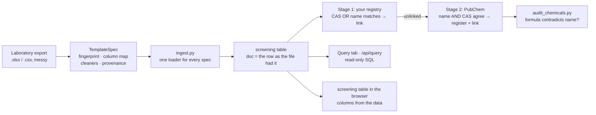

[← README](../../README.md) · [Handbook](../HANDBOOK.md) · [Glossary](../00-glossary.md) · [← Phase 03](phase-03-platform-verification.md) · [Phase 05 →](phase-05-docs-consolidation.md)

# Phase 04 — Real laboratory data: a template that is data, a table built from the file, and compounds given one identity each

**Version shipped:** 2.2.0 and 2.2.1 · **Date:** 2026-08-25 and 2026-08-31 · **Status:** reconstructed
**Prerequisites:** [Phase 03](phase-03-platform-verification.md); a running instance with a laboratory export loaded, or the synthetic screening template for a small-scale walk; the [playbook](../10-user-playbook.md) Parts 2–6 open beside this page.
**Learning goal:** you understand why a laboratory file is described as *data* rather than parsed by *code*, why the screening table's columns come from the file, why identification has two stages with opposite rules, and why an audit that cries wolf is worse than none.
**Deliverable:** one deployment holding a 49,000-row screening export; a data-driven table with filters, sorting and export; a read-only SQL console; two-stage chemical identification with a registry of 664 compounds linking 88 % of rows; five registry-maintenance scripts; a one-command post-deploy verification.

> **Reconstructed** from `NEWS.md` v2.2.0 and v2.2.1, the commits from `3ad9ac6` (2026-08-25) to `f0cd3da` (2026-08-31), [`09-chemical-identification.md`](../09-chemical-identification.md) and the [playbook](../10-user-playbook.md). Figures are production's on 2026-09-07.

---

## Contents

1. [Why this phase exists](#why-this-phase-exists)
2. [What was built](#what-was-built)
3. [Step 1 — Read a template spec](#step-1--read-a-template-spec)
4. [Step 2 — Load a file and watch the columns appear](#step-2--load-a-file-and-watch-the-columns-appear)
5. [Step 3 — Preview identification without writing](#step-3--preview-identification-without-writing)
6. [Step 4 — Run it for real, and watch it from outside](#step-4--run-it-for-real-and-watch-it-from-outside)
7. [Step 5 — Audit what was registered](#step-5--audit-what-was-registered)
8. [Step 6 — Ask the database a question](#step-6--ask-the-database-a-question)
9. [Step 7 — Verify the deployment in one command](#step-7--verify-the-deployment-in-one-command)
10. [Checkpoint](#checkpoint)
11. [What this phase deliberately did not do](#what-this-phase-deliberately-did-not-do)
12. [Publish](#publish)

---

## Why this phase exists

Until this phase every example file was synthetic. The first real export —
49,000 rows of packaging-migration screening from one laboratory — was messy
in every way a real file is: a Windows text encoding, `#DIV/0!` and `#VALUE!`
where Excel formulas had failed, header rows repeated in the middle because
several exports had been pasted together, two CAS numbers in one cell, and
names written in the laboratory's own style (`Phenol, 2,4-di-tertiobutyl`).

Two design questions had to be answered before the next laboratory's file
arrived:

1. **How do you read a file you have never seen?** By *describing* it — a
   fingerprint to recognise it, a map from its columns to fields, a cleaner
   per field, a provenance tag — and handing the description to one loader.
   Adding a template should mean adding a description; if it needs new code,
   the design has failed.
2. **How do you know which compound a row is about?** By identifying it
   against a registry, in two stages with *opposite* rules: your own registry
   trusts a single matching identifier (it is curated); the public database
   demands that the name *and* the CAS number resolve to the same compound (it
   is inference). The strict rule rejects most house-style names; that was
   chosen knowingly, and the audit in v2.2.1 showed why.

*Everyday version:* a customs form. The template is the form's layout, so
any officer can read any traveller's declaration. Identification is the
passport check: your own staff list needs one matching detail; a stranger's
claim needs the photo *and* the number to agree.



---

## What was built

| Piece | What it does | Where |
|---|---|---|
| `TemplateSpec` | A template as data: how to recognise the file, what each column means, how to clean it, where it came from. `CERGY_SCREENING` is the first | `backend/app/utils/templates.py` |
| Cleaning primitives | Null tokens; measurements with formula errors classified separately from blanks; dates; CAS extraction from mixed cells; header-echo detection — each testable alone | `backend/app/utils/cleaning.py` |
| Loader | Applies a spec to a file and resolves each row's chemical | `backend/app/ingest.py` |
| Data-driven screening table | Columns discovered from the records; raw view; column chooser; per-column filters; sorting; export to CSV, TSV, XLSX, JSON, including the untouched source row | client, `ScreeningView.jsx`; API in [`08-api-cookbook.md`](../08-api-cookbook.md#screening-data-reading-it-back) |
| Read-only SQL console | `/api/query` and a Query tab; the SQLite connection is opened read-only, so the database itself refuses writes | `backend/app/routers/`; [`09-query-cookbook.md`](../09-query-cookbook.md) |
| Stage 2 linker | Resumable, batched commits, progress every five compounds, every write gated on `--apply`, a report of why each compound was left unlinked | `backend/scripts/link_pubchem.py` |
| Registry maintenance | Propose compounds from the unlinked report for review; merge two entries for one substance (re-pointing rows first); remove entries after unlinking their rows; audit entries whose formula contradicts their name | `backend/scripts/propose_chemicals.py`, `merge_duplicate_chemicals.py`, `remove_chemicals.py`, `audit_chemicals.py` |
| Post-deploy verification | Sixteen checks, `PASS`/`FAIL` with a reason, exit status = number of failures | `verify-deploy.sh` |
| The CAS-ownership fix (v2.2.1) | Looking up a CAS number returned a *list of compounds referencing it*, unranked; the code took the first; 19 compounds were registered with another substance's chemistry. Now the candidate that lists the number among its own synonyms is chosen, or nothing is | `backend/scripts/link_pubchem.py`; lessons entry 25 |

Eleven bugs from this phase are in [`11-lessons-learned.md`](../11-lessons-learned.md),
entries 17 to 27 — a dry run that wrote, a job that looked hung, a cache that
never hit, a report cut on commas, a list nobody ranked, two audit heuristics
thrown away, an audit that read half the data.

---

## Step 1 — Read a template spec

**What:** see a laboratory file described as data.

**How:**

```bash
grep -n "CERGY_SCREENING\|fingerprint\|column_map\|provenance\|cleaner" backend/app/utils/templates.py | head -20
```

**Why:** the spec is the contract between one laboratory's export and the
system. Everything that is particular to that file is here and nowhere else.

**You should see:** a `TemplateSpec` instance named `CERGY_SCREENING` with a
fingerprint (how to recognise the file), a column map (source heading →
field), cleaners per field, and a provenance tag.

**What it means:** the next laboratory's file is a second instance beside
this one. The playbook's [Part 2](../10-user-playbook.md#part-2--put-a-laboratory-file-in)
explains each part in everyday terms.

---

## Step 2 — Load a file and watch the columns appear

**What:** upload a screening file and read the column report.

**How:** on a development machine, the synthetic template stands in for a
laboratory export:

```bash
curl --noproxy '*' -sS -X POST http://localhost:49160/api/screening/upload/excel \
  -F "file=@docs/excel-templates/screening/screening_template.xlsx"
curl --noproxy '*' -sS "http://localhost:49160/api/screening/columns" | head -c 400; echo
```

**Why:** files from different laboratories share almost no field names, so
the table cannot have fixed columns. It asks the data which columns exist and
how well populated each is.

**You should see:** an upload message with an inserted count, then a JSON
description of the columns present, with a fill count for each.

**If instead:** `File is not a zip file` — you sent a CSV to an endpoint that
reads only real Excel workbooks; the cookbook's
[refusals section](../08-api-cookbook.md#why-some-requests-are-refused-and-thats-correct)
explains the message.

---

## Step 3 — Preview identification without writing

**What:** run stage 2 as a dry run.

**How (on the machine that holds the data; `podman` or `docker` as
appropriate):**

```bash
./container-py.sh backup
podman exec crucible-py python /app/backend/scripts/link_pubchem.py --limit 20
```

**Why:** a preview *must* write nothing. Lessons entry 17 records the day it
did not: a helper committed per call, and the closing rollback had nothing
left to undo. Every commit point is now gated on `--apply`, and this preview
is how you check that claim yourself.

**You should see:** progress every five compounds, then a breakdown by
reason (`confirmed`, `rejected`, `no_cas`, `not_found`, …), and — the point —
the same row count from `/api/stats` before and after.

**If instead:** PubChem answers `503` — it throttles under load; the client
backs off and retries. Wait, or reduce `--limit`.

---

## Step 4 — Run it for real, and watch it from outside

**What:** the real run, detached, with a log and a report.

**How:**

```bash
podman exec -d crucible-py sh -c \
  'python /app/backend/scripts/link_pubchem.py --apply --report /app/backend/unlinked.csv \
   > /app/backend/link.log 2>&1'
podman top crucible-py | grep link_pubchem          # a line = running; empty = finished
podman exec crucible-py tail -3 /app/backend/link.log
```

**Why:** an hour for a few thousand compounds is PubChem's politeness limit,
not slow code. Watching from the *host* with `podman top` matters: the slim
image has no `ps`, and `ps | grep -c` inside it prints `0`, which reads
exactly like "not running" (lessons entry 24).

**You should see:** a process line while it runs; log lines advancing every
five compounds; at the end, a summary and a CSV report the
[playbook Part 4](../10-user-playbook.md#part-4--give-the-compounds-an-identity)
teaches you to read.

---

## Step 5 — Audit what was registered

**What:** check the registry for entries whose formula contradicts their
own name.

**How:**

```bash
podman exec crucible-py python /app/backend/scripts/audit_chemicals.py
```

**Why:** two earlier heuristics were thrown away because they flagged correct
entries — name overlap, and "ester implies heavy". Only *checkable
chemistry* survived: a carbon chain the formula cannot hold, an element the
name never mentions. A check with a high false-positive rate trains the
reader to skim (lessons entry 26).

**You should see:** a short list of flagged identifiers with the reason for
each, or none. A pass is not a guarantee: a wrong number pointing at a
compound of similar composition leaves nothing to measure, and three such
entries were found only by reading pairs by hand.

**What it means:** the 22 compounds removed on 2026-08-31 are real
substances; re-registering them waits on a row-by-row review, as the
[roadmap](../05-roadmap.md#planned-items-and-what-each-waits-on) says.

---

## Step 6 — Ask the database a question

**What:** run one read-only query.

**How:**

```bash
curl --noproxy '*' -sS -X POST http://localhost:49160/api/query \
  -H "Content-Type: application/json" \
  -d '{"sql": "SELECT COUNT(*) AS rows, COUNT(chemical_id) AS linked FROM screening"}'
```

**Why:** most fields live inside the `doc` JSON, so queries look unusual
here; the [query cookbook](../09-query-cookbook.md#why-queries-look-unusual-here)
explains the shape. The connection is opened read-only, so a `DELETE` is
refused by SQLite itself, not by a filter.

**You should see:** one row with the total and the linked count. On
production on 2026-09-07: 49,065 and 43,399.

---

## Step 7 — Verify the deployment in one command

**What:** run the sixteen checks.

**How:**

```bash
./verify-deploy.sh                         # macOS
./verify-deploy.sh https://localhost:49160 # RHEL 8
```

**Why:** the V-checklist is for a human; this is for a script. Each check
prints `PASS` or `FAIL` with a reason, and the exit status is the number of
failures, so it can gate a deploy.

**You should see:** sixteen `PASS` lines and exit status 0. Transient network
faults during a background job are retried rather than reported as failures,
because a false `FAIL` against a working feature is worse than no check.

---

## Checkpoint

```bash
./verify-deploy.sh 2>&1 | tail -2                 # expect: 0 failures
curl --noproxy '*' -sS http://localhost:49160/api/stats | head -c 80; echo
```

On production the stats line reads 664 chemicals and 49,065 screening rows.

---

## What this phase deliberately did not do

- **Loosen the two-identifier rule.** It rejects roughly 88 % of compounds
  that carry a valid CAS but a house-style name. The alternative — trusting
  one identifier — is what registered 19 compounds with another substance's
  chemistry when the lookup was wrong. Name normalisation is on the roadmap
  as the safe way to recover them.
- **Fix `DELETE /api/chemicals/:id`.** It still removes an entry without
  unlinking its rows; the removal script does it properly. Changing the
  endpoint changes the contract, so it is announced rather than slipped in.
- **Identify compounds with no CAS in the source.** 2,278 of them. The only
  fix is upstream.
- **Write a test for the removal script.** It deletes data and has none; on
  the roadmap.

---

## Publish

`3ad9ac6 Ingest the Cergy screening export via a template spec` and
`ed75c66 Ingest Cergy screening; add a data table, query console and PubChem
linking` (2026-08-25), then the linker and registry commits through
`418c68b`; v2.2.1 from `d01d66a` to `f0cd3da` (2026-08-31), including
`bef7bfc Check which compound actually owns a CAS number`. Each followed
[`03-git-workflow.md` → Flow A](../03-git-workflow.md#4-flow-a---a-change-from-start-to-finish),
with a production rebuild because the scripts live inside the image.

**Last Updated:** September 7, 2026
