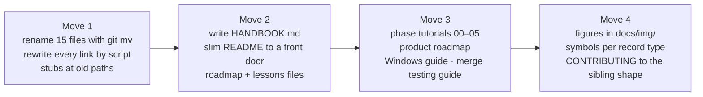

[← README](../../README.md) · [Handbook](../HANDBOOK.md) · [Glossary](../00-glossary.md) · [← Phase 04](phase-04-template-ingestion.md)

# Phase 05 — Giving the documentation a spine

**Version shipped:** 2.3.0 · **Date:** 2026-09-07 onward · **Status:** in progress (step 3 of 4)
**Prerequisites:** none to read. To run the steps: a clone on any platform.
**Learning goal:** you understand why a document set needs one home per topic and one ordered spine, how a rename is done so that history and links survive, and how the handbook stays true.
**Deliverable:** the numbered document set my other projects use; `docs/HANDBOOK.md` as the living spine; one tutorial per phase; the two roadmaps; the lessons file; a Windows setup guide; figures for the ideas newcomers stumble on.

---

## Contents

1. [Why this phase exists](#why-this-phase-exists)
2. [What we are building](#what-we-are-building)
3. [Step 1 — Inventory before moving anything](#step-1--inventory-before-moving-anything)
4. [Step 2 — Rename with history, rewrite links by script](#step-2--rename-with-history-rewrite-links-by-script)
5. [Step 3 — Write the spine, then slim the front door](#step-3--write-the-spine-then-slim-the-front-door)
6. [Step 4 — Reconstruct the phases, write the roadmaps](#step-4--reconstruct-the-phases-write-the-roadmaps)
7. [Step 5 — Illustrate](#step-5--illustrate)
8. [Checkpoint](#checkpoint)
9. [What this phase deliberately did not do](#what-this-phase-deliberately-did-not-do)
10. [Publish](#publish)

---

## Why this phase exists

By the end of phase 04 the documentation was rich and had no shape. Sixteen
files under three folders, named by habit (`INSTALL-MACOS.md`, `DEPLOYMENT.md`,
`PLAYBOOK.md`), a README of 925 lines that was also the operations manual,
the build log and the roadmap, and no single document that told a newcomer
where to start or told me where I had got to. Two guides covered the same
command in different words; a fix in one did not reach the other.

My other projects had already solved this the same way: a numbered `docs/`
set whose file names *are* the reading order, and one handbook that
sequences them and carries the status. This phase gives Crucible that shape,
without losing a sentence of real content.

*Everyday version:* a library whose books are all good and all on the floor.
Nothing is thrown away; each book gets a shelf number, and one index card at
the door says which shelf to visit first.



---

## What we are building

| Piece | Purpose | Status |
|---|---|---|
| `docs/00-…12-*.md` | The numbered set; the folder listing is the reading order | ✅ move 1 |
| Stubs at the old paths | One line each, kept for one release, so bookmarks and the private mirror still land somewhere | ✅ move 1; removed in the release after next |
| `docs/HANDBOOK.md` | The spine: status box, timeline, Day 0 → today, build log, cheat sheet | ✅ move 2 |
| `README.md` | Front door only, one index, handbook first | ✅ move 2 |
| `docs/05-roadmap.md`, `docs/11-lessons-learned.md` | Moved out of the README, extended | ✅ move 2; lessons reconciled in move 3 |
| `docs/04-phase-tutorials/phase-00…05` | One tutorial per phase, reconstructed where the phase predates the format | ✅ move 3 |
| `docs/06-product-and-technology-roadmap.md` | Every candidate technology with a verdict and a trigger | ✅ move 3 |
| `docs/01-setup-windows.md` | The third platform, marked *untested* until walked | ✅ move 3 (untested) |
| `docs/08-api-cookbook.md` absorbs the API testing guide | One home for API recipes | ✅ move 3 |
| `docs/img/` and figures in every numbered doc | The ideas newcomers stumble on, drawn | 🔜 move 4 |
| `CONTRIBUTING.md` in the sibling shape | Ways to contribute, branch model, the loop, the push sequence, release flow, norms | 🔜 move 4 |

---

## Step 1 — Inventory before moving anything

**What:** list every document, its headings, and every link into it.

**How:** a script over every `.md` file that collects the relative links (path and anchor)
and counts inbound links per target. The result on 2026-09-07: the glossary
had 104 inbound links from 20 files; `DEPLOYMENT.md` had 37, with eleven
distinct anchors linked from other documents; the README's index heading was
linked from 20 files.

**Why:** a rename breaks every inbound link. Knowing the count tells you the
rewrite must be scripted, and knowing the anchors tells you which stubs must
keep their headings.

**You should see:** a table of targets and counts before any file moves.

---

## Step 2 — Rename with history, rewrite links by script

**What:** `git mv` fifteen files; rewrite every relative link in one pass;
leave stubs.

**How:** the script resolves each link against the file's *old* location,
maps the target to its new name, and re-relativises from the file's *new*
location — so a link from a file that itself moved is right on both counts.
Then the moves, then the stubs, then a link check that resolves every path
and anchor:

```bash
git mv docs/GLOSSARY.md docs/00-glossary.md          # … and fourteen more
./check-public-safe.sh                                # unchanged gate
```

**Why:** `git mv` keeps history reachable; a scripted rewrite is the only way
to change hundreds of links without missing one; a stub is kinder than a 404
for a release.

**You should see:** the link check report `clean`, and `git status` showing
renames rather than deletions plus additions.

**If instead:** the check reports a missing anchor — check the slug rules:
GitHub keeps underscores and turns each space into one hyphen; a checker
that collapses double hyphens reports false misses.

---

## Step 3 — Write the spine, then slim the front door

**What:** `docs/HANDBOOK.md` to the section list in the handbook's own
"how this is maintained"; then cut the README to a front door, moving each
section to its numbered home with a pointer.

**Why:** the handbook is written *after* the renames so its links are final,
and the README is slimmed *after* the handbook so nothing is homeless in
between. Order is the whole trick.

**You should see:** the README under 350 lines; every document's first line
reading `[← README] · [Handbook] · [Glossary]`; the handbook's §0 status box
and §7 build log matching this page.

---

## Step 4 — Reconstruct the phases, write the roadmaps

**What:** one tutorial per shipped phase, from the release notes, the git
log and the guides — never invented — with *not recorded* where the history
is silent; the product roadmap to the same three questions for every
option; the Windows guide to the depth of the macOS one; the API testing
guide folded into the cookbook; the lessons file reconciled with the full
bug list.

**You should see:** `docs/04-phase-tutorials/` with six files; every link
from the handbook's build log resolving; the tutorials' checkpoints runnable
on a machine that completed a setup guide.

---

## Step 5 — Illustrate

**What:** `docs/img/` with figures for the machine layout, the two
repositories and three folders, the request path, the document-is-truth
rule, the two-stage identification rule and the timeline; one symbol per
record type used consistently; the interactive page kept as the one
interactive figure.

**Why:** the docs are written for readers with no chemistry, container or
Git background; a picture of "the document is the truth and every other
column is an index" lands faster than the paragraph.

**Status:** 🔜 move 4.

---

## Checkpoint

```bash
ls docs/ | head -30                                   # numbered files in reading order
grep -c "" docs/HANDBOOK.md                           # the spine exists
sed -n 1p docs/02-architecture.md                     # nav line names the Handbook
```

And the full gate set: link check clean, forbidden-words grep clean,
`./check-public-safe.sh` → `✓ SAFE TO PUSH`, pytest unchanged at 90.

---

## What this phase deliberately did not do

- **Rewrite content for its own sake.** Moves 1 and 2 moved text; only the
  README, the handbook, the roadmap and the lessons file were written fresh.
  The setup guides, the operations runbook and the cookbooks are as phase 03
  and 04 left them, reviewed for links and stale numbers.
- **Delete the stubs.** They stay for one release.
- **Walk the Windows guide.** It is marked untested until someone does.

---

## Publish

Move 1 and 2 shipped together as `fef3e48 Reshape the documentation around
a living handbook` and `5b286bd Keep per-machine ignore rules out of the
tracked ignore list` (2026-09-07). Move 3 is the commit that carries this
page. Each follows [`03-git-workflow.md` → Flow A](../03-git-workflow.md#4-flow-a---a-change-from-start-to-finish);
documentation-only commits need no rebuild on the VM.

**Last Updated:** September 7, 2026
