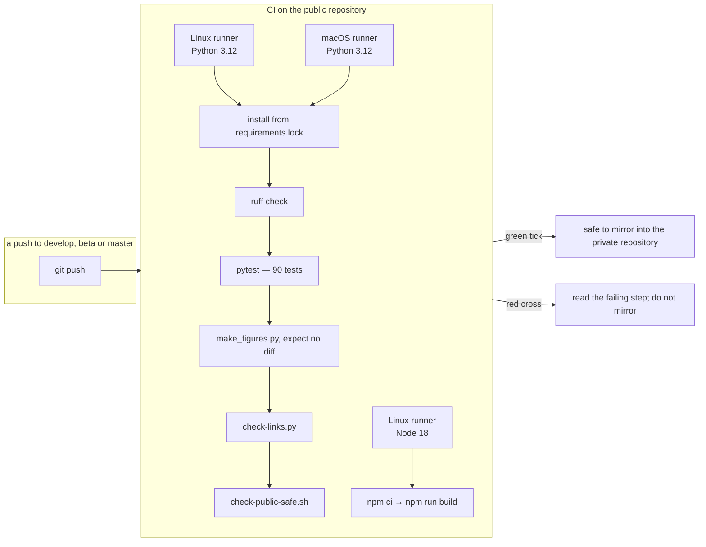

[← README](../../README.md) · [Handbook](../HANDBOOK.md) · [Glossary](../00-glossary.md) · [← Phase 05](phase-05-docs-consolidation.md)

# Phase 05b — Reproducible builds and continuous integration

**Version shipped:** 2.4.0 · **Date:** 2026-09-07 · **Status:** complete
**Prerequisites:** a setup guide completed for your platform; the test virtual environment from its V7 check; the container runtime running (the lock is generated inside the base image).
**Learning goal:** you understand why "install the requirements" can give two people two different programs, what a lock file is and who reads it, what a linter is for, and what it means for a check to run on a machine that is not yours.
**Deliverable:** `backend/requirements.lock` with 44 exact versions, generated inside the Python 3.12 image by one command; the Dockerfile, CI and the test environment all installing from it; a linter with an explicit rule set and a clean codebase; a workflow on the public repository that runs every check on Linux and macOS for every push.

---

## Contents

1. [Why this phase exists](#why-this-phase-exists)
2. [What we built](#what-we-built)
3. [Step 1 — See the drift you had](#step-1--see-the-drift-you-had)
4. [Step 2 — Generate the lock inside the image](#step-2--generate-the-lock-inside-the-image)
5. [Step 3 — Rebuild from the lock and prove the versions](#step-3--rebuild-from-the-lock-and-prove-the-versions)
6. [Step 4 — Install the lock on your own machine](#step-4--install-the-lock-on-your-own-machine)
7. [Step 5 — Run the linter](#step-5--run-the-linter)
8. [Step 6 — Read the workflow, then watch it run](#step-6--read-the-workflow-then-watch-it-run)
9. [Checkpoint](#checkpoint)
10. [What this phase deliberately did not do](#what-this-phase-deliberately-did-not-do)
11. [Publish](#publish)

---

## Why this phase exists

`backend/requirements.txt` listed twelve libraries with version *ranges*:
"any FastAPI from 0.115 up, below 1.0". That is the right way to say what
the project *needs*. It is the wrong way to say what a build *gets*: `pip`
picks the newest version that fits on the day it runs, and each of those
twelve pulls in others you never named. Two image builds a month apart could
differ in thirty packages, and a test that passed on one laptop could fail
on another for reasons that have nothing to do with the code.

Three habits close that gap:

1. **A lock file.** Resolve the ranges once, inside the same base image the
   Dockerfile uses, and write down every exact version. Then install from
   *that* everywhere: the image, the test environment, CI.
2. **A linter.** A program that reads the code and reports the small things
   that are usually mistakes — an unused import, a variable never read, a
   type hint in last decade's style — before a person has to.
3. **Continuous integration.** On every push, rented machines that are not
   yours install from the lock, run the linter and the tests, build the
   client, regenerate the figures, check the links and run the safety gate.
   Green means the checks you ran by hand also pass somewhere else.

*Everyday version:* the shopping list says "bread, milk". The receipt says
which loaf and which carton. Give everyone the receipt and everyone cooks the
same meal. The linter is the friend who reads your list and says "you wrote
*mlik*". CI is cooking the recipe in someone else's kitchen before you serve
it at yours.


---

## What we built

| Piece | What it does | Where |
|---|---|---|
| `backend/requirements.lock` | 44 exact versions, resolved inside `python:3.12-slim`; a header says how it was made and that it is never edited by hand | `backend/requirements.lock` |
| `./container-py.sh lock` | Runs `pip` inside the base image the Dockerfile names, freezes the result, writes the lock with its header | `container-py.sh` |
| Dockerfile installs from the lock | `RUN pip install -r backend/requirements.lock` — the image gets what the lock says, nothing newer | `backend/Dockerfile` |
| `backend/ruff.toml` | The linter's explicit rule set — real errors, unused names, import order, modern syntax, common bugs — so a laptop and CI agree | `backend/ruff.toml` |
| A clean codebase | 182 findings fixed: 180 automatically (import order, `Optional[X]` → `X \| None`), two by hand | `backend/app/`, `backend/scripts/` |
| `.github/workflows/ci.yml` | Two jobs. *backend* on Linux and macOS: Python 3.12, install from the lock, `ruff`, `pytest`, figure determinism, link check, safety gate. *client*: Node 18, `npm ci`, build | `.github/workflows/ci.yml` |
| `check-links.py` | The documentation link checker as a tracked, cross-platform script, so CI and a laptop run the same one | `check-links.py` |
| An RDKit cap | `rdkit<2025.9.4` in `requirements.txt`: the newest release with pre-built packages for *every* machine this project uses — the Linux image and VM, the macOS CI runner, and the Intel Mac the code is developed on. The comment beside it says how to check the next release before lifting the cap | `backend/requirements.txt` |



---

## Step 1 — See the drift you had

**What:** compare what the file asked for with what one environment had.

**How:**

```bash
grep -cE "==" backend/requirements.txt      # exact pins in the wish list
grep -cE "==" backend/requirements.lock     # exact pins in the receipt
grep -E "^(fastapi|rdkit|pandas)==" backend/requirements.lock
```

**Why:** the first number is the point. Before this phase it was zero: nothing
was pinned exactly, so two builds could differ silently.

**You should see:** `0`, then `44`, then three lines such as
`fastapi==0.141.1`, `rdkit==2025.9.3`, `pandas==3.0.5` (your numbers will
match the lock in your checkout).

---

## Step 2 — Generate the lock inside the image

**What:** resolve the ranges where the build resolves them.

**How (the container runtime must be running):**

```bash
./container-py.sh lock
git diff --stat backend/requirements.lock
```

**Why:** resolving on your laptop would pin versions for *your* operating
system and Python. Resolving inside `python:3.12-slim` pins what the image
will actually install. Running it twice on the same day gives the same file
byte for byte, which is how you know it is a record and not a roll of the
dice.

**You should see:** `Resolving backend/requirements.txt inside
docker.io/library/python:3.12-slim …`, a minute or two of quiet, then
`✓ Wrote …/backend/requirements.lock (44 pinned packages)`. If nothing in
`requirements.txt` changed since the last lock, the diff is empty.

**If instead:** `✗ pip could not resolve requirements.txt` — a range in the
wish list has no version that satisfies it together with the others; the
lock was not touched. **If instead:** the diff shows a version you did not
expect — a library released a new version since the last lock; that is
exactly what the lock exists to make visible. Review it, then rebuild.

---

## Step 3 — Rebuild from the lock and prove the versions

**What:** build the image and read the versions inside it.

**How:**

```bash
./container-py.sh rebuild
podman exec crucible-py python -c "import sys, fastapi, rdkit; print(sys.version.split()[0], fastapi.__version__, rdkit.__version__)"
grep -E "^(fastapi|rdkit)==" backend/requirements.lock
```

(`docker exec` if Docker is your runtime.)

**Why:** the Dockerfile now copies the lock and installs from it. The proof
is not the build succeeding; it is the versions inside the container being
the ones the lock names.

**You should see:** the build's `RUN pip install … requirements.lock` step
listing `Collecting fastapi==0.141.1 (from -r backend/requirements.lock …)`
and so on; then `3.12.14 0.141.1 2025.09.3`, matching the two lock lines.

---

## Step 4 — Install the lock on your own machine

**What:** make the test environment use the same versions as the image.

**How (macOS and Linux; Windows uses `.venv\Scripts\`):**

```bash
cd backend
python3 -m venv .venv                      # python3.12 if you have it — the image's version
.venv/bin/pip install -r requirements.lock
.venv/bin/pytest -q
cd ..
```

**Why:** a test that fails should mean the code is wrong, not that your
laptop has a newer library than production. Installing from the lock removes
that second possibility.

**You should see:** a few minutes of downloads, then `90 passed`.

**If instead:** `No matching distribution found for rdkit==…` — RDKit
publishes pre-built packages (*wheels*) per operating system, processor and
Python version, and not for every combination. This is the one place a lock
resolved on Linux can disagree with a laptop, and it is why `requirements.txt`
caps RDKit at the newest release that covers every machine this project uses.
If you hit it on a new kind of machine, record the Python and processor in
the lessons file, and run the tests inside the container meanwhile:
`podman exec crucible-py python -m pytest -q /app/backend/tests`.

---

## Step 5 — Run the linter

**What:** run the same check CI runs, and read one finding.

**How:**

```bash
cd backend && .venv/bin/ruff check . && cd ..
```

**Why:** the rules are written down in `backend/ruff.toml` — real errors,
unused names, import order, modern syntax for Python 3.12, common bugs — so
a laptop and CI cannot disagree. Two rules are switched off on purpose:
`B008`, because FastAPI's `Depends(get_db)` in a default argument is exactly
the pattern it warns about, and `E501`, because a long error message or SQL
string is clearer unbroken.

**You should see:** `All checks passed!`

**If instead:** findings are listed — most carry `[*]`, meaning
`ruff check . --fix` applies the fix safely. Read the diff before you commit
it, as with any tool that edits code.

---

## Step 6 — Read the workflow, then watch it run

**What:** open `.github/workflows/ci.yml`, then the *Actions* tab of the
public repository after your next push.

**Why:** the workflow is short and commented; every step is one of the
checks you have just run by hand. The point of reading it is to know that a
green tick means *those* checks, on a Linux machine and a macOS machine that
have never seen your laptop.

**You should see:** in the file, two jobs: *backend* with a two-entry
operating-system matrix, and *client*. On the host, after a push, a tick
next to the commit; clicking it lists the steps with their timings.

**If instead:** a red cross — open the failing step. The most common cause
on a first run is a platform difference the lock reveals (a package with no
wheel for the runner); the second is a link broken by a rename. Neither is
fixed by pushing again.

---

## Checkpoint

```bash
grep -cE "==" backend/requirements.lock                   # expect: 44
cd backend && .venv/bin/ruff check . && .venv/bin/pytest -q && cd ..   # expect: All checks passed! · 90 passed
python3 check-links.py                                    # expect: links: clean
python3 docs/img/make_figures.py >/dev/null && git diff --exit-code -- docs/img && echo "figures deterministic"
```

And, after the push, a green tick on the commit in the public repository's
*Actions* tab.

---

## What this phase deliberately did not do

- **Pin the client the same way.** `client/package-lock.json` already is a
  lock; `npm ci` in CI installs exactly what it says. Nothing to add.
- **Run CI on the private repository.** It is a content mirror; the checks
  have already passed on the same content publicly. The VM's own proof is
  `./verify-deploy.sh` after a deploy.
- **Add a Windows runner.** The Windows guide is untested; a runner would
  test the backend on Windows before a person has, and its failures would
  be hard to tell from the guide's. It is the natural next step after the
  first real walk.
- **Adopt a cross-platform resolver** (a tool that writes one lock valid on
  every platform at once). `pip freeze` inside the image is enough while the
  only platform difference is RDKit's wheel coverage, handled by the cap;
  a second such package is the trigger.
- **Make Python 3.12 mandatory on laptops.** It is the reference, and CI
  uses it; a laptop on 3.13 or 3.14 runs the same lock because every pinned
  package has wheels for those too. The guides say "3.12 if you have it".

---

## Publish

Shipped as the v2.4.0 commit on 2026-09-07. It changes `backend/Dockerfile`
and `backend/requirements.*`, so the VM deploy **rebuilds** the image, with a
backup first, per [`03-git-workflow.md` → Flow A](../03-git-workflow.md#4-flow-a---a-change-from-start-to-finish).

**Last Updated:** September 7, 2026
