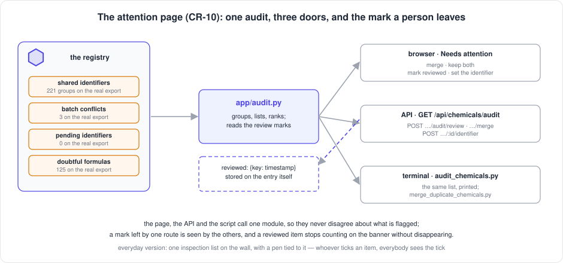
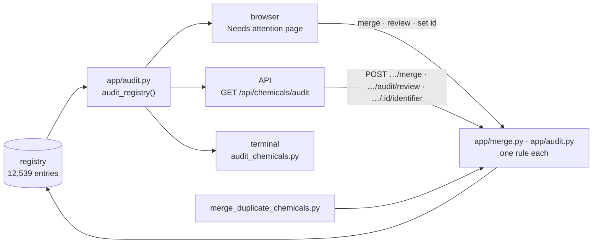

[← README](../../README.md) · [Handbook](../HANDBOOK.md) · [Glossary](../00-glossary.md) · [← Phase CR-2](phase-cr-2-views-sort-filter.md)

# Phase CR-10 — The attention page: every flag in the browser, with the buttons to act

**Version shipped:** 2.16.0 · **Date:** 2026-09-09 · **Status:** complete
**Track:** CR, the Chemical Registry ([roadmap](../05-roadmap.md#cr--chemical-registry)); pulled ahead of the SD-1 build at the owner's request the morning the banner was first seen on production.
**Prerequisites:** [Phase CR-9](phase-cr-9-real-registry-sources.md), which put the flags on the entries; [Phase CR-6](phase-cr-6-delete-unlinks-first.md) for what a link is and why nothing may point at a missing entry; a setup guide completed for your platform.
**Learning goal:** you understand why a message that sends a browser user to the terminal is a message they cannot act on, how one *audit module* lets the browser, the API and a script list exactly the same things, what a *review mark* is and why it lives on the entry rather than in a separate list, and what a *merge* must do, in what order, so that no measurement is ever orphaned.
**Deliverable:** a **Needs attention** page under Chemical Registry that lists every flagged entry — shared identifiers side by side with the other holders, batch conflicts with each batch's value, pending identifiers, doubtful formulas — with the actions a person takes: **merge**, **keep both**, **mark reviewed**, **set the identifier**, **delete**. The banner's counts link to it; the sidebar shows the count. Four endpoints; the audit script and the merge script call the same module; eight tests.



---

## Contents

1. [Why this phase exists](#why-this-phase-exists)
2. [The words you need](#the-words-you-need)
3. [What we built](#what-we-built)
4. [Step 1 — One audit module](#step-1--one-audit-module)
5. [Step 2 — The review mark](#step-2--the-review-mark)
6. [Step 3 — The merge, in the only safe order](#step-3--the-merge-in-the-only-safe-order)
7. [Step 4 — Four endpoints, and the scripts become callers](#step-4--four-endpoints-and-the-scripts-become-callers)
8. [Step 5 — The page](#step-5--the-page)
9. [Step 6 — What the real data taught the formula check](#step-6--what-the-real-data-taught-the-formula-check)
10. [Step 7 — Tests, build, rebuild](#step-7--tests-build-rebuild)
11. [How to test it, by every route](#how-to-test-it-by-every-route)
12. [What this phase deliberately did not do](#what-this-phase-deliberately-did-not-do)
13. [Publish](#publish)

---

## Why this phase exists

The morning after the real export was loaded, the Chemical Registry page
showed its banner: *419 entries share a CAS number with another entry … 3
compounds whose batches disagree on a field … until then it runs from the
terminal (`./container-py.sh script audit_chemicals.py`)*. The owner's
reaction was the right one: the people who will use this registry do not
open terminals. A flag they cannot act on from the browser is a flag they
will not act on, and the banner will sit there until somebody with a shell
happens by.

The roadmap had already recorded the rule this breaks — *anything a
maintenance script can do, the browser must be able to do too* — and named
this phase as its first application. So it was pulled ahead of the
screening-data work.

*Everyday version:* a notice on the stockroom door that says "some crates
have the wrong label — see the foreman for the list" is not a notice, it is
an errand. The list belongs on the door, with a pen.

---

## The words you need

| Term | Plain words | Everyday version |
|---|---|---|
| **Attention page** | The one page listing everything the registry wants a person to look at, with the buttons to act | The inspection list on the wall |
| **Audit** | The check that produces that list: which entries share an identifier, whose batches disagree, whose formula contradicts its name | The stocktake walk |
| **Audit module** | The one piece of code that runs the audit, called by the page, the API and the terminal script alike | One clipboard, whoever is holding it |
| **Review mark** | A note left on an entry saying a person looked at a particular finding and decided it needs no change: `reviewed: {"shared:cas:58-08-2": "2026-09-09T…"}` | The initialled tick beside a line on the list |
| **Shared identifier** | Two or more entries carrying the same CAS number, DTXSID or PubChem compound id | Two folders with one barcode |
| **Merge** | Folding entries into one survivor: it takes what it lacked from the others, every measurement is repointed at it, and only then are the others removed | Emptying one folder into the other before binning it |
| **Batch conflict** | A compound whose batch rows in the export disagree on a column that should describe the compound, not the batch | Two delivery notes for one product that give different weights |
| **Pending identifier** | An entry from the limited list whose identifier column said it would come from the screening data | A label that says "number to follow" |
| **Doubtful formula** | The name claims a carbon chain the formula cannot hold, or the formula holds an element nothing in any of the entry's names accounts for | A jar labelled "sugar" whose contents test salty |

---

## What we built



| Piece | File | What it does |
|---|---|---|
| The audit | `backend/app/audit.py` | Groups shared identifiers from the data, lists batch conflicts with every batch's value, pending identifiers, and the chemistry findings; reads the review marks; counts what is open |
| The merge | `backend/app/merge.py` | One function: carry fields over, repoint rows, clean the flags, delete — in that order |
| Link counts | `backend/app/links.py` → `link_counts()` | Rows per chemical from the indexed column in one grouped query, so the page can show "linked rows" beside every entry |
| Four endpoints | `backend/app/routers/chemicals.py` | `GET /api/chemicals/audit`, `POST /api/chemicals/audit/review`, `POST /api/chemicals/merge`, `POST /api/chemicals/:id/identifier` |
| The banner's counts | `GET /api/chemicals/notices/summary` | Two new keys, `formula` and `attention`; reviewed items no longer counted |
| The page | `client/src/pages/RegistryAttention.jsx` | At `/chemicals/attention`; sidebar item **Needs attention** with the count; the registry banner's counts link to its sections |
| The scripts | `backend/scripts/audit_chemicals.py`, `merge_duplicate_chemicals.py` | Callers of the two modules; the merge script also takes identifiers to merge by hand |
| Tests | `backend/tests/test_chemicals_audit.py` | Eight; the suite is 137 |

---

## Step 1 — One audit module

**What:** move the audit out of the script and into the application, where
every route can call it.

**How:** `backend/app/audit.py`. Its one public entry point is
`audit_registry(db)`, which returns the whole list as one structure:

```
counts          shared_groups, shared_entries, batch_conflicts, pending, formula, reviewed, attention
shared          [ {key, kind, value, reviewed, entries: [ {chemical_id, name, cas_number, dtx_id,
                   pubchem_cid, molecular_formula, source_template, batches, linked_rows, …} ]} ]
batch_conflicts [ {chemical_id, name, …, columns: [ {column, promoted, values: [ {batch, batch_id, value} ]} ]} ]
pending         [ {chemical_id, name, cas_number, supplier, pending_from} ]
formula         [ {chemical_id, name, pubchem_name, molecular_formula, reasons: [...], severity, reviewed} ]
```

**Why the shared groups come from the data, not from the flags.** The import
sets `cas_shared_with` and its siblings on the entries it touches. But an
entry can arrive by any route, and an entry that is merged away should stop
being listed. So the audit groups the entries by value — every CAS number,
DTXSID and PubChem id held by two or more entries — and the flags stay what
they were: a record the import left, honoured by the deploy check.

**You should see:** the same function behind three doors, in Step 4.

**If instead** the audit is slow: on 12,539 entries it takes about 0.8 s,
most of it reading the documents. The banner calls it without the link
counts; the page with them. If the registry grows tenfold, the shared spine's
schema work (SH-2) is what makes it fast, not a cache here.

---

## Step 2 — The review mark

**What:** a way to say "a person looked at this and it is fine" that every
route can see.

**How:** `mark_reviewed(db, chemical_ids, key, reviewed)` writes
`doc["reviewed"][key] = <timestamp>` on each entry, or removes the key. The
key names *what* was reviewed, as the audit reports it:

| Finding | Key |
|---|---|
| a shared identifier | `shared:cas:58-08-2`, `shared:dtxsid:DTXSID…`, `shared:pubchem:2519` |
| a batch conflict | `batch_conflicts` |
| a doubtful formula | `formula` |

A group of shared entries is reviewed when every entry in it carries the
group's key. Lift the mark on one and the group is open again.

**Why on the entry.** The mark is a fact about the entry — *somebody decided
these two are different substances* — and the one design rule says every fact
about a record lives in its document. A separate "reviewed list" would be a
second source of truth that could disagree with the first, and would be lost
by a JSON export and re-import. On the entry, it round-trips.

**Why a reviewed item stays listed.** Greyed, off the banner, but there. A
decision you cannot see is a decision you cannot revisit. *Show reviewed*
on the page brings them back; *Reopen* lifts the mark.

**You should see:** in the entry's detail, under *Data*: `reviewed:
{"shared:cas:121-33-5": "2026-09-09T…"}`.

---

## Step 3 — The merge, in the only safe order

**What:** fold entries that describe one substance into one survivor,
without leaving a single measurement pointing at nothing.

**How:** `merge_entries(db, keep_id, remove_ids)` in `backend/app/merge.py`,
four steps, one transaction:

1. **Carry over.** Any field the survivor lacks is taken from the entries
   being removed. Its own values are never overwritten.
2. **Repoint.** Every screening, sample and toxicology row pointing at a
   removed entry is pointed at the survivor — the document *and* the
   indexed column, because the document is the truth and the column its
   index. A sample listing both is left listing the survivor once.
3. **Clean the flags.** `cas_shared_with` and its siblings, on the survivor
   and on any other entry, lose the identifiers that are about to vanish;
   an emptied flag is removed.
4. **Delete.** Only now. The survivor records what was folded into it under
   `merged_entries` — identifier, name, CAS, when.

**Why this order and not another.** Delete first and a failure between the
halves leaves rows pointing at a missing entry: lesson 22, and the exact
thing [CR-6](phase-cr-6-delete-unlinks-first.md) exists to prevent. Repoint
first and the worst a failure can do is leave a duplicate that the audit
lists again tomorrow.

**What the merge refuses:** an empty list (400), the survivor named among
the removed (400), an unknown identifier (404) — and in each case nothing is
written.

**You should see:** `{"kept": "CHEM-000010", "removed": ["CHEM-000011"],
"rows_repointed": {"screening": 3, "samples": 1, "total": 4}, "message": …}`.

---

## Step 4 — Four endpoints, and the scripts become callers

**What:** the same three actions from the API, and the scripts rewritten to
use the modules rather than carry their own copy of the rules.

| Endpoint | Body | Answer |
|---|---|---|
| `GET /api/chemicals/audit` | — (`?everything=true` adds the entries the formula check passed, ranked) | the structure in Step 1 |
| `POST /api/chemicals/audit/review` | `{"chemical_ids": [...], "key": "…", "reviewed": true}` | `{"updated": n, "key", "reviewed"}`; 404 if any id is unknown, nothing written |
| `POST /api/chemicals/merge` | `{"keep": "CHEM-…", "remove": ["CHEM-…"]}` | the merge result in Step 3 |
| `POST /api/chemicals/:id/identifier` | `{"nestle_id": "…"}` | `{"message": "Identifier set", …}`; the pending flag is removed |

`GET /api/chemicals/notices/summary` keeps its three counts and gains
`formula` and `attention`; every count now excludes reviewed items.

**The scripts.** `audit_chemicals.py` prints what `audit_registry` returns —
the same groups, the same marks (`--json` prints the endpoint's answer
verbatim; `--all` and `-o` behave as before). `merge_duplicate_chemicals.py`
still finds duplicates by PubChem id or name, reports with the count of rows
pointing at each, and merges through `merge_entries` on `--apply`; it also
takes identifiers by hand: `merge_duplicate_chemicals.py CHEM-000010
CHEM-000011 --apply` folds the second into the first.

**Why the scripts stay.** Bulk work, a hundred merges from a reviewed list,
a cron job — a terminal is the right tool for those. What changed is that
the terminal no longer knows anything the browser does not.

---

## Step 5 — The page

**What:** `Chemical Registry → Needs attention`, at `/chemicals/attention`.

**How:** `client/src/pages/RegistryAttention.jsx`. Top to bottom:

- **Four tiles** — shared identifiers, batch conflicts, pending identifiers,
  doubtful formulas — each a link to its section; amber while open, grey at
  zero. *Show reviewed* brings the decided items back; *JSON* opens the
  endpoint's answer; *Refresh* re-reads.
- **Shared identifiers.** One card per group: *CAS number 121-33-5 · shared
  by 2 entries*, then the entries side by side — identifier, name, CAS,
  DTXSID, PubChem, formula, source, batches, **linked rows** — with a radio
  for the survivor (the oldest is preselected, as the script has always
  chosen). **Merge the others into CHEM-…** opens a confirmation that names
  the survivor, the removed, and how many rows will be repointed. **Keep
  both — mark reviewed** for two substances that happen to share a number.
- **Batch conflicts.** Per compound, a table: the disputed column, the value
  on the entry, and each batch's value, the differing ones in amber. **Open
  the entry** to edit; **Mark reviewed** when the promoted value is right.
- **Pending identifiers.** A row per entry with a box: type the identifier,
  **Set**.
- **Doubtful formulas.** Per entry, your name beside PubChem's, formula and
  weight, and the reasons in plain words. **It is fine — mark reviewed**, or
  **Delete…** with an inline confirmation; a compound with linked rows is
  refused by the server with the count, exactly as on the registry page.
- **Nothing needs attention** in green when every count is zero.

The registry banner's counts became links to the sections, and its sentence
about the terminal is gone. The sidebar's **Needs attention** shows the
open count, refreshed on every page change so a merge shows without a
reload.

**Why not a modal on the registry page.** Two hundred groups do not fit in a
dialog, and a person reviewing them wants to leave and come back.

---

## Step 6 — What the real data taught the formula check

**What:** the chemistry check, run on 12,539 real entries for the first time
through the page, flagged 522. Reading them changed the check in two ways.

**Names other than the first one are evidence.** The check asks whether the
name accounts for every element in the formula. `DDT` says nothing about
chlorine; its synonym `1,1'-(2,2,2-trichloroethylidene)bis(4-chlorobenzene)`
says everything. A synonym is another name for the same substance, so the
check now reads the name, the IUPAC name, PubChem's name, the synonyms and
the other names together. 495 heteroatom findings became 109, every one
removed being a name the entry itself explained.

**A multiplier glued to a halogen counts that halogen.** `tridecafluorohexyl`
is thirteen fluorines on six carbons; the old check read `tridec` as a
thirteen-carbon chain and flagged the whole family of perfluorinated
surfactants. Those words are removed before chain stems are looked for. 37
chain findings became 17.

**The count went from 522 to 125** of 6,550 entries with a formula (5,989
have none and are not checked). What is left is worth a person's eye: names
truncated in the source, salts and mixtures described by one component,
and a few entries whose formula really does belong to something else. It is
a check, not a verdict; the page says so.

**If instead** you see a trivial name flagged with no synonym: the entry
has none to read. Mark it reviewed once you have looked, or add the synonym
by editing the entry — the mark or the synonym both end it.

---

## Step 7 — Tests, build, rebuild

**How:**

```bash
cd ~/Documents/Work/pandora_toolbox/nr-nips-crucible
cd backend && .venv/bin/ruff check . && .venv/bin/pytest -q && cd ..    # All checks passed! · 137 passed
cd client && npm run build && cd ..                                     # ✓ built
./container-py.sh rebuild                                               # backend, client and scripts changed
curl --noproxy '*' -sS http://localhost:49160/api/chemicals/notices/summary
```

**You should see** the five counts. On the Mac copy of the real export:

```
{"nestle_id_pending":0,"cas_shared":419,"batch_conflicts":3,"formula":125,"attention":349}
```

---

## How to test it, by every route

Synthetic first: an empty registry, then two entries that share a CAS
number, one of them with rows. The last column is the Mac copy of the real
export (12,539 entries, no rows linked yet), which is what the server will
show.

| Route | How | You should see (synthetic) | Real export |
|---|---|---|---|
| **Set up** | Chemical Registry → Upload → JSON, or `./container-py.sh import chemicals docs/excel-templates/chemicals/chemicals_template.json`; then add a second entry with the same CAS as one of them by **Add Chemical**; then on Screening Data link a few rows to the second | — | — |
| **Browser, the banner** | the Chemical Registry page | *Needs a person's eye: 2 entries share an identifier with another entry … **Review them*** — the count is a link | *419 entries share … 3 compounds whose batches … 125 entries whose formula does not match their name* |
| **Browser, the sidebar** | Chemical Registry ▸ | **Needs attention** with an amber **1** | **349** |
| **Browser, the page** | click either | one tile amber (*1 shared identifiers · 2 entries*); one card *CAS number … shared by 2 entries* with both rows and the linked-row counts | four tiles: 221 · 3 · 0 · 125; 221 cards (8 CAS, 20 DTXSID, 193 PubChem; 205 pairs, 11 triples, 4 of four, 1 of six) |
| **Browser, keep both** | **Keep both — mark reviewed** | the card greys; the tile goes to 0; the banner disappears; *Show reviewed* brings the card back; **Reopen** undoes it | the same, per card |
| **Browser, merge** | choose the survivor, **Merge the others into …**, read the confirmation, **Yes, merge** | *Merged 1 entry into CHEM-…; N rows repointed*; the card is gone; on Screening Data the rows now show the survivor; the survivor's *Data* tab shows `merged_entries` | the same |
| **Browser, refusal** | on a doubtful formula with linked rows, **Delete… → Yes, delete** | a red message from the server: *N screening rows linked to …; unlink them first* — nothing deleted | — |
| **API, the list** | `curl --noproxy '*' -sSk https://localhost:49160/api/chemicals/audit \| python3 -m json.tool \| head -40` | `counts`, one `shared` group with two `entries` and `linked_rows` | `"shared_groups": 221, "shared_entries": 419, "batch_conflicts": 3, "pending": 0, "formula": 125, "attention": 349` |
| **API, review** | `curl --noproxy '*' -sSk -X POST https://localhost:49160/api/chemicals/audit/review -H 'Content-Type: application/json' -d '{"chemical_ids":["CHEM-000001","CHEM-000002"],"key":"shared:cas:58-08-2","reviewed":true}'` | `{"updated":2,"key":"shared:cas:58-08-2","reviewed":true}`; the notices summary drops to 0 | — |
| **API, merge** | `… -X POST …/api/chemicals/merge -d '{"keep":"CHEM-000001","remove":["CHEM-000002"]}'` | `{"kept":…,"removed":[…],"rows_repointed":{"screening":N,"total":N},"message":…}` | — |
| **API, identifier** | `… -X POST …/api/chemicals/CHEM-000003/identifier -d '{"nestle_id":"NID-0042"}'` | `{"message":"Identifier set",…}`; `nestle_id_pending` is gone from the entry | (none pending) |
| **Terminal, the audit** | `./container-py.sh script audit_chemicals.py` | *1 thing needs attention (1 shared identifiers, …)*, the group with *N rows linked*, then the chemistry section; the last line points at the browser page | *349 things need attention (221 shared identifiers, 3 batch conflicts, 0 pending identifiers, 125 doubtful formulas); 0 reviewed.* |
| **Terminal, the same as JSON** | `./container-py.sh script audit_chemicals.py --json \| head` | the endpoint's answer, byte for byte the same structure | the same |
| **Terminal, merge by hand** | `./container-py.sh script merge_duplicate_chemicals.py CHEM-000001 CHEM-000002` then `--apply` | the report with *(N rows point at it)*, *Report only*; then *1 entries removed, N rows repointed. Applied.* | — |
| **Database** | Query page: `SELECT chemical_id, json_extract(doc,'$.reviewed') reviewed, json_extract(doc,'$.merged_entries') merged FROM chemicals WHERE reviewed IS NOT NULL OR merged IS NOT NULL` | the marks and the merge record, as data on the entries | empty until somebody acts |
| **Deploy check** | `./verify-deploy.sh https://localhost:49160` | `16 passed` | `16 passed` |
| **Automated tests** | `cd backend && .venv/bin/pytest -q` | `137 passed` | — |

---

## What this phase deliberately did not do

- **Decide anything.** 221 groups are 221 decisions; the page makes each
  one a click, it does not make it.
- **Merge from the registry table.** CR-8 asked for a merge button on any
  two ticked entries; here the merge exists only for flagged groups, where
  the candidates are already side by side. CR-8 becomes the small step of
  offering the same dialog for a hand-picked pair.
- **Edit the disputed column in place.** A batch conflict sends you to the
  entry's editor; the page shows the values, it does not rewrite them.
- **Export the list.** The **JSON** link is the endpoint; CSV and XLSX of
  the attention list wait for SH-7 with every other page's export.
- **Speed it up.** 0.8 s for 12,539 entries is acceptable and was measured;
  the schema work that would make it instant is SH-2.
- **Record who reviewed.** The mark carries a time and no name, because the
  application does not yet know who is asking. SH-3 gives it a name; the
  mark's shape leaves room for one.

---

## Publish

Ships as v2.16.0. Backend, client and scripts changed, so the server deploy
**rebuilds**, with a backup first, per
[`03-git-workflow.md` → Flow A](../03-git-workflow.md#4-flow-a---a-change-from-start-to-finish).
The handbook's status box, timeline and build log, the roadmap's CR-10 and
CR-8 rows, the sources page, the registry tasks page, the API reference,
the cookbook, the playbook, the identification guide, the architecture
module map, the glossary, the figure index and the release note are in the
same commit.

**Last Updated:** September 9, 2026
