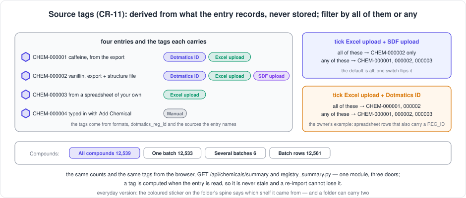
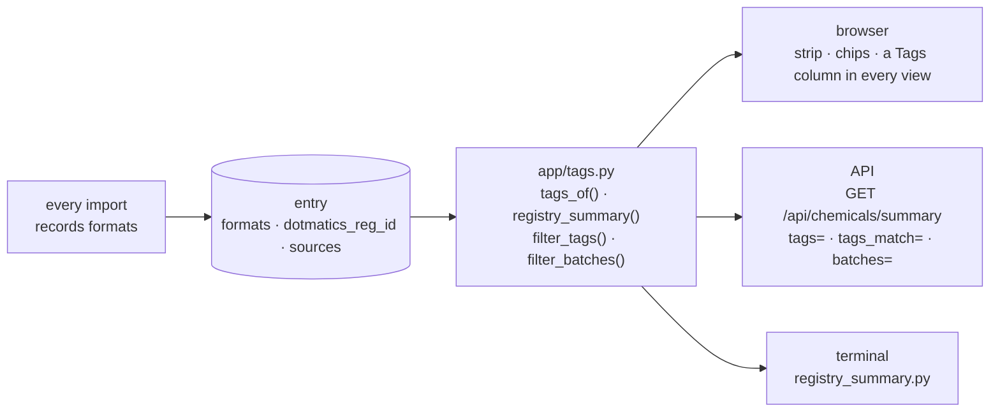

[← README](../../README.md) · [Handbook](../HANDBOOK.md) · [Glossary](../00-glossary.md) · [← Phase CR-10](phase-cr-10-attention-page.md)

# Phase CR-11 — Counts, batch filters and source tags: where every compound came from, at a glance

**Version shipped:** 2.18.0 · **Date:** 2026-09-14 · **Status:** complete
**Track:** CR, the Chemical Registry ([roadmap](../05-roadmap.md#cr--chemical-registry)); the owner's request of 2026-09-14, built ahead of the screening-data rule.
**Prerequisites:** [Phase CR-9](phase-cr-9-real-registry-sources.md), which put the three real sources into the registry and folded batches into entries; [Phase CR-2](phase-cr-2-views-sort-filter.md) for the three views; a setup guide completed for your platform; the test virtual environment from its V7 check if you want to run the Python route.
**Learning goal:** you understand why two true numbers — 12,539 compounds and 12,561 batch rows — confused everyone who met them side by side, what a *derived tag* is and why deriving beats storing, how "all of these" and "any of these" are two different questions, and how the same counts come out of the browser, the API and a script because one module produces them.
**Deliverable:** a strip above the Chemical Registry table — **All compounds · One batch · Several batches · Batch rows** — each count a button that filters the table; six **source tags** (*Dotmatics ID, Excel upload, SDF upload, CSV upload, JSON upload, Manual*) shown as chips on every row in every view and in the detail, filterable one at a time or in combination; `GET /api/chemicals/summary`, three new list parameters, a terminal script; five tests, the suite at 144.



---

## Contents

1. [Why this phase exists](#why-this-phase-exists)
2. [The words you need](#the-words-you-need)
3. [What we built](#what-we-built)
4. [Step 1 — Record the route, derive the tag](#step-1--record-the-route-derive-the-tag)
5. [Step 2 — Count once, in one place](#step-2--count-once-in-one-place)
6. [Step 3 — Filter the list](#step-3--filter-the-list)
7. [Step 4 — The strip and the chips](#step-4--the-strip-and-the-chips)
8. [Step 5 — Tests, build, rebuild](#step-5--tests-build-rebuild)
9. [How to test it, by every route](#how-to-test-it-by-every-route)
10. [What this phase deliberately did not do](#what-this-phase-deliberately-did-not-do)
11. [Publish](#publish)

---

## Why this phase exists

Two questions came from the first days of using the refilled registry.

**"Why 12,539 here and 12,561 there?"** The Compact view counts compounds;
the Batches view counts batches. Both are right, and the page said
nothing about the twenty-two rows between them. A number that needs a
person standing beside it to explain is a number the page should explain
itself.

**"Where did this entry come from?"** The export, the structure file, a
spreadsheet of your own, a JSON file, a form. The entry knows — it records
its source and everything merged into it — but the page did not say, and
you could not ask for "only the ones from the structure file".

*Everyday version:* a stockroom where every crate is labelled with what it
holds but not which supplier it came from, and where the count on the door
says 12,539 while the delivery log says 12,561. Both are true. Nobody
trusts either.

---

## The words you need

| Term | Plain words | Everyday version |
|---|---|---|
| **Batch** | One physical lot of a compound; the export has one row per batch | One delivery of the same product |
| **Batch rows** | The Batches view: every batch of every compound as its own row — 12,561 today | The delivery log, one line per delivery |
| **Tag** | A short label on an entry saying where it came from | The coloured sticker on the folder's spine |
| **Derived** | Computed from what the entry already records, when it is read, never written | Reading the postmark instead of writing "from London" on the envelope |
| **Formats** | The list the imports keep on an entry of every file type that loaded or updated it: `["excel", "sdf"]` | The stamps on a passport |
| **All of these / any of these** | With several tags ticked: entries carrying every one, or at least one | "Members who are *both* students *and* residents" versus "students *or* residents" |
| **Summary** | The one answer that holds every count the strip and the chips show | The totals line at the bottom of the ledger |

---

## What we built



| Piece | File | What it does |
|---|---|---|
| The tags module | `backend/app/tags.py` | Derives the tags, counts everything, filters by batches and by tags |
| Recording the route | `backend/app/imports.py` | Every import writes the format it came through under `formats` |
| The endpoints | `backend/app/routers/chemicals.py` | `GET /api/chemicals/summary`; `tags`, `tags_match`, `batches` on the list; `tags` on every row and in the columns list |
| The script | `backend/scripts/registry_summary.py` | The same counts printed; lists the entries behind a tag or a batch filter |
| The page | `client/src/pages/ChemicalsView.jsx` | The strip, the chips with counts, the all/any switch, a Tags column in Compact, Complete and Batches, chips in the detail |
| Tests | `backend/tests/test_chemicals_tags.py` | Five; the suite is 144 |

---

## Step 1 — Record the route, derive the tag

**What:** make every import say how it came in, then read the tags off
that.

**How:** `note_format(doc, fmt)` in `backend/app/tags.py` appends a token
— `excel`, `csv`, `sdf`, `json` — to the entry's `formats` list. Every
import path calls it: the recognised sources, the generic spreadsheet
route, the generic SDF route, the JSON file and the JSON-body endpoint. An
entry that arrives twice by two routes keeps both tokens.

`tags_of(doc)` then reads them:

| Tag | Earned when |
|---|---|
| **Dotmatics ID** | the entry has a `dtx_id`, the DTX identifier in the *DTX_ID* column, by whatever route (v2.18.3; the first release read the registration number instead, which every export row has) |
| **Excel upload** | `formats` has `excel` — the Dotmatics export **included**, with or without an ID (decision T1) |
| **SDF upload** | `formats` has `sdf` |
| **CSV upload** | `formats` has `csv` — a CSV is not an Excel file (T4) |
| **JSON upload** | `formats` has `json` |
| **Manual** | nothing above applies: the entry was typed in and no file has touched it since |

**Why derive rather than store.** A stored tag is a fact that can go
stale: rename a source, re-import a file, merge two entries, and a stored
list is wrong until something rewrites it. A derived tag is recomputed
every time the entry is read from facts the entry cannot lose. It also
costs no migration and touches no existing entry.

**Why *Manual* is inferred, not written.** `POST /api/chemicals` writes an
exact set of keys, locked by the v1 contract tests; adding `formats` there
would break the contract. So a typed-in entry records nothing and is
*Manual* by the absence of any file's mark — which is also what the word
means.

**The 12,539 already loaded** carry no `formats` (they predate it). For
them the format is inferred from the source they name: the export and the
limited list are always Excel, the registry SDF always SDF. An entry that
names none is read from what it holds: a MOL block means SDF, a `metadata`
row means a spreadsheet, nothing means Manual.

**You should see:** on the entry, `formats: ["excel", "sdf"]` for a
compound the export loaded and the structure file completed; in the list,
`tags: ["Dotmatics ID", "Excel upload", "SDF upload"]`; and `tags` absent
from the stored entry itself.

---

## Step 2 — Count once, in one place

**What:** the numbers the strip and the chips show.

**How:** `registry_summary(db)` reads every entry once and returns:

```json
{"total": 12539, "one_batch": 12533, "several_batches": 6, "batch_rows": 12561,
 "tags": {"Dotmatics ID": 9193, "Excel upload": 12539, "SDF upload": 77, "CSV upload": 0, "JSON upload": 0, "Manual": 0}}
```

A compound with no `batches` list counts as one batch and one batch row,
so *one batch* + *several batches* is always *total*, and *batch rows* is
always what the Batches view shows.

**Why one function.** The page, the endpoint and the script all call it,
so the three cannot show three different numbers — the rule from CR-10.

**You should see:** the JSON above from `GET /api/chemicals/summary`, in
about 0.7 s on 12,539 entries.

---

## Step 3 — Filter the list

**What:** three parameters on `GET /api/chemicals`, and `tags` on every
row it returns.

| Parameter | Values | Keeps |
|---|---|---|
| `batches` | `one`, `several` | entries with a single batch, or with two or more; with `view=batches`, the batch rows of those compounds |
| `tags` | comma-separated tag names | entries carrying them |
| `tags_match` | `all` (default), `any` | every listed tag, or at least one |

**Why *all* by default.** Ticking a second tag usually means "narrow it
down". The owner's own example — *Excel upload* and *Dotmatics ID* — is
an intersection: spreadsheet rows that also carry a REG_ID. *Any* is one
switch away for the other question, "everything that came from a file of
either kind" (decision T2).

**Without the parameters** the list answers exactly as before, plus the
`tags` key on each row. An unknown `tags_match` or `batches` value is a
400 with the reason.

**You should see:** `tags=Excel upload,SDF upload` → 77 on the real
export; with `tags_match=any` → 12,539; `tags=SDF upload,Manual` → 0.

---

## Step 4 — The strip and the chips

**What:** the page.

**How:** above the view toolbar, two rows:

- **Compounds:** *All compounds 12,539 · One batch 12,533 · Several
  batches 6 · Batch rows 12,561*. The first three set the batch filter
  and keep your view; the fourth switches to the Batches view. The active
  one is filled.
- **Tags:** one chip per tag with its count, in one colour each, the same
  colours everywhere. Tick one or more; with two or more ticked, the
  switch *all of these / any of these* appears. *Clear* resets both rows.

Every row in every view has a **Tags** column of chips — a fixed column
in Compact after the name, a column in Complete (offered second in the
chooser, on by default), and a core column in Batches (decision T3). The
detail dialog shows *Where it came from* under the structure.

**If instead** the strip is missing: the summary call failed; the table
still works. Check `curl --noproxy '*' -sS http://localhost:49160/api/chemicals/summary`.

**If instead** the table is empty and says *No chemicals match the current
filters*: read the list under it — a search, a batch filter, ticked tags
or a column filter is narrowing the table — and press **Clear all
filters**. (Before v2.18.1 a column filter typed in one view silently
carried into the next and could hide every row; filters now belong to the
view they were typed in.)

---

## Step 5 — Tests, build, rebuild

```bash
cd ~/Documents/Work/pandora_toolbox/nr-nips-crucible
cd backend && .venv/bin/ruff check . && .venv/bin/pytest -q && cd ..    # All checks passed! · 144 passed
cd client && npm run build && cd ..                                     # ✓ built
./container-py.sh rebuild                                               # backend, client and a script changed
curl --noproxy '*' -sS http://localhost:49160/api/chemicals/summary
```

**You should see** the summary JSON from Step 2.

---

## How to test it, by every route

Synthetic first, then the real export. The synthetic set is one entry per
route: load `docs/excel-templates/chemicals/dotmatics_template.xlsx` (six
compounds, Caffeine with two batches), then `chemicals_registry_template.sdf`
(three structures that merge into them), then `chemicals_template.csv`, then
`chemicals_template.json`, then add one compound by hand with **Add
Chemical**. The last column is the development copy of the real export, which is
what the server shows.

| Route | How | You should see (synthetic) | Real export |
|---|---|---|---|
| **Browser, the strip** | Chemical Registry page, above the view toolbar | *All compounds 17 · One batch 16 · Several batches 1 · Batch rows 18*; click **Several batches** → only Caffeine; click **Batch rows** → the Batches view, two Caffeine rows | 12,539 · 12,533 · 6 · 12,561 |
| **Browser, the chips** | the *Tags:* row | *Dotmatics ID 5 · Excel upload 6 · SDF upload 3 · CSV upload 5 · JSON upload 5 · Manual 1* (one template compound has no DTX identifier); tick **SDF upload** → 3 rows, each with three chips; tick **Excel upload** too → still 3 (*all of these*); flip to *any of these* → the 6 export entries; tick **CSV upload** and **JSON upload** with *all of these* → nothing, with *any* → 10 | Dotmatics ID 9,193 · Excel upload 12,539 · SDF upload 77 · the rest 0 |
| **Browser, the column** | any view | a **Tags** column of coloured chips on every row; in Complete, *tags* in the column chooser, second in the list; in Batches, after the name | the same |
| **Browser, the detail** | the eye icon on any row | *Where it came from* under the structure, with the chips | the same |
| **API, the summary** | `curl --noproxy '*' -sSk https://localhost:49160/api/chemicals/summary` | `{"total":17,"one_batch":16,"several_batches":1,"batch_rows":18,"tags":{"Dotmatics ID":5,"Excel upload":6,"SDF upload":3,"CSV upload":5,"JSON upload":5,"Manual":1}}` | `{"total":12539,"one_batch":12533,"several_batches":6,"batch_rows":12561,"tags":{"Dotmatics ID":9193,"Excel upload":12539,"SDF upload":77,"CSV upload":0,"JSON upload":0,"Manual":0}}` |
| **API, the filters** | `curl --noproxy '*' -sSk "https://localhost:49160/api/chemicals?batches=several&limit=5"` then `…?tags=Excel%20upload,SDF%20upload&tags_match=any&limit=1` then `…?tags=SDF%20upload,Manual` | `pagination.total` 1, then 6, then 0; every row has a `tags` list | 6 · 12,539 · 0 |
| **API, a refusal** | `curl --noproxy '*' -sSk "https://localhost:49160/api/chemicals?tags_match=sometimes"` | `{"error":"tags_match must be all or any"}` | the same |
| **Terminal, the shortcut** | `./container-py.sh script registry_summary.py` | *17 compounds: 16 with one batch, 1 with several; 18 batch rows.* then *Entries per tag* | *12539 compounds: 12533 with one batch, 6 with several; 12561 batch rows.* |
| **Terminal, the entries behind a tag** | `./container-py.sh script registry_summary.py --tag "Excel upload" --tag "SDF upload"` then add `--any` | *3 entries with Excel upload and SDF upload:* with their tags; then *6 entries with Excel upload or SDF upload* | 77, then 12,539 |
| **Terminal, the compounds with several batches** | `./container-py.sh script registry_summary.py --batches several` | *1 entry with several batches:* Caffeine, `batches=2` | 6 entries, `batches=` 2, 2, 3, 3, 3, 15 |
| **Podman / Docker, the long form** | `podman exec crucible-py python /app/backend/scripts/registry_summary.py --json` (Docker: `docker exec …`) | the endpoint's answer as JSON | the same |
| **Python directly, on the development machine** | `cd backend && .venv/bin/python scripts/registry_summary.py --tag "SDF upload"` | the same lines, against `data/crucible.db` | 77 entries |
| **Database** | Query page: `SELECT json_extract(doc,'$.formats') formats, COUNT(*) n FROM chemicals GROUP BY formats` | `["excel","sdf"]` 3 · `["excel"]` 3 · `["csv"]` 5 · `["json"]` 5 · `null` 1 (the typed-in one; tags are not stored, formats are) | `null` 12,539 until the next import touches an entry — the 12,539 predate `formats` and are labelled from their source |
| **Deploy check** | `./verify-deploy.sh https://localhost:49160` | `16 passed` | `16 passed` |
| **Automated tests** | `cd backend && .venv/bin/pytest -q` | `144 passed` | — |

Clean up the synthetic entries afterwards: on the registry page tick them
and **Delete Selected**, or `./container-py.sh script remove_chemicals.py --all --apply` on a test copy only.

---

## What this phase deliberately did not do

- **Tags a person adds by hand.** Derived tags first: they cost no
  migration and are never wrong. A `tags` list on the entry with a chip
  editor is a small later phase, once someone needs one.
- **Write `formats` onto the 12,539 existing entries.** They are labelled
  by inference, correctly; the next import that touches an entry records
  it. No re-import was run for a label.
- **Record the file's name.** The format is enough for a tag; the name
  would be a second fact to keep. The upload report already says which
  source was recognised.
- **Tag screening rows.** The screening table has its own `source_tag`
  from the template spec; the registry's tags are about registry entries.
- **A *Dotmatics export* tag.** Dropped at the owner's request: *Dotmatics
  ID* already says the entry belongs to that system, and *Excel upload*
  says how it arrived.

---

## Publish

Ships as v2.18.0. Backend, client and a script changed, so the server
deploy **rebuilds**, with a backup first, per
[`03-git-workflow.md` → Flow A](../03-git-workflow.md#4-flow-a---a-change-from-start-to-finish).
The handbook's status box, timeline and build log, the roadmap's CR-11 row,
the sources page (the specification rewritten as what exists, with the
decisions recorded), the registry tasks page, the API reference, the
cookbook, the playbook, the architecture module map, the glossary, the
figure index and the release note are in the same commit.

**Last Updated:** September 14, 2026
