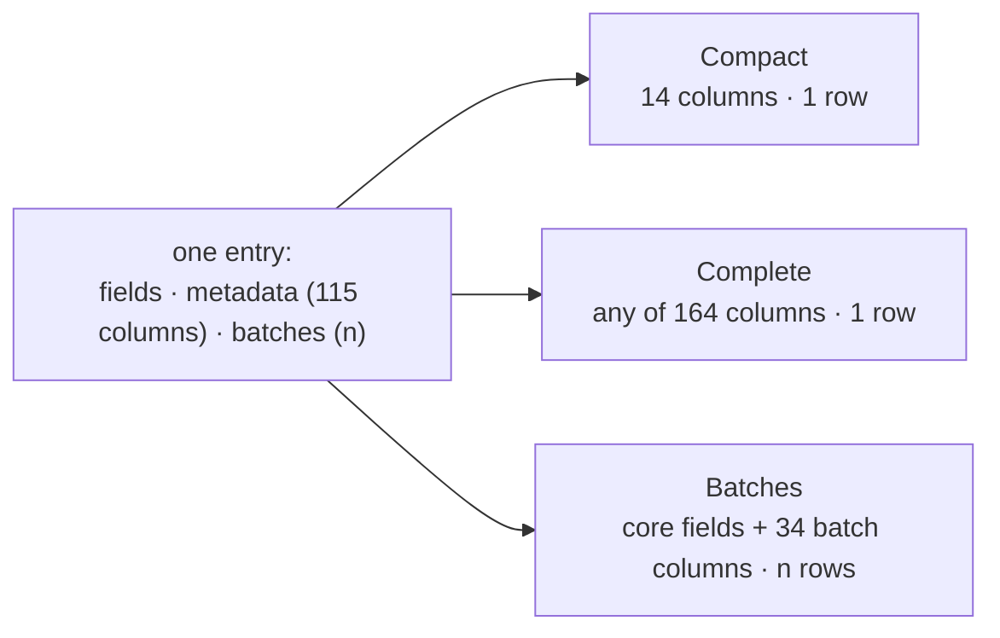

[← README](../../README.md) · [Handbook](../HANDBOOK.md) · [Glossary](../00-glossary.md) · [← Phase CR-9](phase-cr-9-real-registry-sources.md)

# Phase CR-2 (with CR-1) — Every column, every batch: three views, sorting and filters on the registry table

**Version shipped:** 2.15.0 · **Date:** 2026-09-09 · **Status:** complete
**Track:** CR, the Chemical Registry ([roadmap](../05-roadmap.md#cr--chemical-registry)); closes CR-1 (sort, search and filter per column) and CR-2 (the views) together, pulled forward after the owner loaded the real export and could not see its columns or its batches.
**Prerequisites:** [Phase CR-9](phase-cr-9-real-registry-sources.md), which put 12,539 entries with 115 columns and their batches into the registry; a setup guide completed for your platform.
**Learning goal:** you understand why a table built from a fixed list of columns cannot show a file it did not anticipate, how a table is instead built from the data itself, what a *view* is, why "one entry per compound" and "one row per batch" are the same data shown two ways, and how sorting and filtering are done on the server so that a page of fifty rows is always the right fifty.
**Deliverable:** the Chemical Registry table has three views — **Compact** (the usual columns), **Complete** (every column the entries have, chosen from a list), **Batches** (one row per batch, all 12,561) — with sorting by any column, a filter box under every column, and a page-size chooser; the view and the chosen columns are remembered per browser; five tests.

---

## Contents

1. [Why this phase exists](#why-this-phase-exists)
2. [The words you need](#the-words-you-need)
3. [What we built](#what-we-built)
4. [Step 1 — Discover the columns from the data](#step-1--discover-the-columns-from-the-data)
5. [Step 2 — Three views of one document](#step-2--three-views-of-one-document)
6. [Step 3 — Sort and filter on the server](#step-3--sort-and-filter-on-the-server)
7. [Step 4 — The page](#step-4--the-page)
8. [Step 5 — Tests, build, rebuild](#step-5--tests-build-rebuild)
9. [How to test it, by every route](#how-to-test-it-by-every-route)
10. [What this phase deliberately did not do](#what-this-phase-deliberately-did-not-do)
11. [Publish](#publish)

---

## Why this phase exists

The owner loaded the Dotmatics export — 12,561 rows, 115 columns — and
opened the Chemical Registry page. It showed 12,539 rows and fourteen
columns. Nothing was lost: every column sat under each entry's `metadata`
and every batch under its `batches`. But the *table* had always been a
fixed list of fourteen headings written before those files existed, so it
could not show what it did not anticipate. A registry that keeps
everything and shows a fraction is, to the person looking at it,
indistinguishable from one that lost the rest.

*Everyday version:* a filing cabinet that keeps every page of every
delivery note, behind a window that shows the top line. The pages are
there; you need a bigger window, and a way to turn them.

---

## The words you need

| Term | Plain words | Everyday version |
|---|---|---|
| **View** | A named set of columns, and a rule for what a row is | The same drawer looked at through a different window |
| **Compact view** | The fourteen columns the page always had; one row per compound | The catalogue card |
| **Complete view** | Every column the entries have, discovered from the data, chosen from a list; one row per compound | The whole file, open on the desk |
| **Batches view** | One row per *batch* of a compound; the compound's key fields beside the batch's own columns | The delivery log: one line per lot |
| **Column discovery** | Reading the stored entries to learn which columns exist and how many entries carry a value, instead of writing the list by hand | Looking in the drawer before printing the headings |
| **Dotted key** | `metadata.CAS_NO`, `batch.BATCH_ID`: a column that lives inside a nested part of the entry | Folder → page |
| **Server-side sort and filter** | The application orders and filters the whole set and sends one page, instead of the browser sorting the page it happens to hold | The librarian brings the right shelf, not the nearest one |

---

## What we built

| Piece | What it does | Where |
|---|---|---|
| `GET /api/chemicals/columns` | Every column the entries have: the entries' own fields in first-seen order, then `metadata.<key>` for every key any entry keeps, then `batch.<key>` for every key seen in a batch; with how many entries carry a value; cached against the entry count | `backend/app/routers/chemicals.py` |
| `view=batches` | One row per batch, the compound's fields plus `batch` (the batch's columns), `batch_no` and `batches_total`; a compound with no batches is one row | same |
| `sort`, `order` | By any column, dotted keys included; numbers as numbers; missing values last in both directions | same |
| `filters` | A JSON object of column → text; a row is kept when the column contains the text, case-insensitively; several columns combine | same |
| The page | View buttons, a column chooser for Complete (remembered per browser), a filter box under every heading, click a heading to sort, rows per page 20 to 500; Compact keeps its layout and gains sorting on its main columns | `client/src/pages/ChemicalsView.jsx`, `client/src/services/api.js` |
| Tests | Column discovery; the batches view's row count and positions; sorting numbers, text, dotted keys, missing last; filters and their refusal; the default answer unchanged | `backend/tests/test_chemicals_views.py` |

---

## Step 1 — Discover the columns from the data

**What:** ask the entries which columns exist, rather than telling the table.

**How:** the endpoint reads every entry once, notes each top-level field
in the order first seen, each key under `metadata` as `metadata.<key>`,
and each key seen inside a batch; it counts how many entries carry a
value in each. The answer is cached until the number of entries changes,
because reading 12,539 documents takes a moment and the answer is the same
until something is added or removed — the same trick the screening table
uses.

**Why first-seen order:** it reproduces the file's left-to-right layout,
which is the order the person recognises. An alphabetical list would
scramble it.

**You should see**, on a registry holding the real files:

```bash
curl --noproxy '*' -sSk https://localhost:49160/api/chemicals/columns | python3 -c "import sys,json; d=json.load(sys.stdin); print(len(d['columns']), 'columns,', len(d['batch_columns']), 'batch columns, for', d['total'], 'entries')"
```

`164 columns, 34 batch columns, for 12539 entries` — 32 fields of the
entries' own and 132 columns from the files' headers.

---

## Step 2 — Three views of one document

**What:** the same stored entry, shown three ways.



**Why one row per batch is a view and not a different table:** decision 1
of CR-9 made the compound the entry and its batches a list on it, so that
a link from a measurement points at *one* thing. The Batches view unfolds
that list back into rows at request time: 12,539 entries become 12,561
rows, and the entry underneath is unchanged.

**You should see:**

```bash
curl --noproxy '*' -sSk "https://localhost:49160/api/chemicals?view=batches&limit=3&sort=batches_total&order=desc" | python3 -c "import sys,json; d=json.load(sys.stdin); print(d['pagination']['total']); print([(r['chemical_id'], r['batch_no'], r['batches_total']) for r in d['data']])"
```

`12561`, then the three first batches of the compound with fifteen —
`(…, 1, 15), (…, 2, 15), (…, 3, 15)`.

---

## Step 3 — Sort and filter on the server

**What:** `sort=<column>&order=asc|desc` and `filters={"column":"text"}`
on the list endpoint, dotted keys allowed.

**Why on the server:** the page holds fifty rows. Sorting those fifty in
the browser would order one page, not the registry. The server orders all
12,539 (or 12,561) and sends the right fifty; on this data that takes well
under a second.

**Two rules worth knowing:** a column whose values are all numbers sorts
as numbers, so 194.19 comes after 52.0 and not before it; and entries with
no value in the sort column come last, whichever direction you sort — a
missing weight is not the heaviest, and not the lightest.

**You should see:**

```bash
curl --noproxy '*' -sSk "https://localhost:49160/api/chemicals?limit=3&sort=molecular_weight&order=desc" --data-urlencode 'filters={"name":"phenol"}' -G | python3 -c "import sys,json; d=json.load(sys.stdin); print(d['pagination']['total'], [r.get('molecular_weight') for r in d['data']])"
```

the number of entries whose name contains *phenol*, and the three
heaviest of them. A malformed `filters` answers 400 with
`{"error":"filters must be a JSON object of column: text"}`.

---

## Step 4 — The page

**What:** the Chemical Registry page gains a toolbar.

| Control | What it does |
|---|---|
| **Compact · Complete · Batches** | Switch the view; the choice is remembered in this browser |
| **Choose columns** (Complete) | A list of every column with the share of entries that carry a value; *Select all*, *Only columns with values*, *Clear all*; the choice is remembered |
| Heading click | Sort by that column; click again to reverse; ▲ ▼ show the state |
| The box under each heading (Complete and Batches) | Filter that column; several boxes combine; *Clear sort and filters* resets |
| **Rows per page** | 20, 50, 100, 250 or 500 |
| The eye icon | The full entry, as before, in every view |

**Why Compact keeps its own layout:** the fourteen-column table with the
presence tags and the delete actions is what the registry's daily work
looks like; the two new views are for looking at everything and for the
batches, and they deliberately show plain values.

---

## Step 5 — Tests, build, rebuild

```bash
cd backend && .venv/bin/ruff check . && .venv/bin/pytest -q && cd ..   # expect: All checks passed! · 129 passed
cd client && npm run build && cd ..
./container-py.sh rebuild
```

---

## How to test it, by every route

Run against a registry holding the three real files (12,539 entries), as
production does since 2026-09-09; the synthetic templates give the same
shapes with six entries and seven batch rows.

| Route | How | You should see |
|---|---|---|
| **Browser, Complete** | Chemical Registry → **Complete** → **Choose columns** | 164 columns listed with their coverage; every column with a value is ticked on first visit; the table shows them all, scrolling sideways |
| **Browser, Batches** | **Batches** | *Showing 50 of 12,561 chemicals*; `batch #` and `of` columns; a compound with fifteen batches has fifteen consecutive rows |
| **Browser, sort** | click **Mol. Weight** in Compact, or any heading in Complete | rows reorder across the whole registry, ▲ then ▼; entries without a weight at the end either way |
| **Browser, filter** | in Complete, type `phenol` under **name** and `Yes` under a presence column | the count above the table drops to the rows matching both; page 1 |
| **Browser, remembered** | choose a view and some columns, reload the page | the same view and columns |
| **API, columns** | `curl --noproxy '*' -sSk https://localhost:49160/api/chemicals/columns \| python3 -c "import sys,json; d=json.load(sys.stdin); print(len(d['columns']), len(d['batch_columns']))"` | `164 34` |
| **API, batches** | `curl --noproxy '*' -sSk "https://localhost:49160/api/chemicals?view=batches&limit=1"` | `"total":12561` in the pagination |
| **API, sort and filter** | the Step 3 command | the count and the three heaviest |
| **API, default** | `curl --noproxy '*' -sSk "https://localhost:49160/api/chemicals?limit=1"` | exactly the keys it always had: `data`, `pagination` with `page`, `limit`, `total`, `totalPages` |
| **Terminal** | the same `curl` commands from the server's shell; the scripts are unaffected — they never read through the table | as above |
| **Database** | Query page: `SELECT COUNT(*) AS compounds, SUM(json_array_length(doc,'$.batches')) AS batch_rows FROM chemicals` | `12539`, `12561` — what the two views show is what is stored |
| **Deploy check** | `./verify-deploy.sh https://localhost:49160` | `16 passed` |
| **Automated tests** | `cd backend && .venv/bin/pytest -q` | `129 passed` |

---

## What this phase deliberately did not do

- **A PubChem view.** CR-2 as planned named one; the Complete view with a
  remembered column choice covers it — tick the `pubchem_cid`, `iupac_name`
  and structure columns — so a fixed third view was not worth its own code.
- **Export of the current view.** SH-7, export from every page, follows;
  today the Query page's *Download CSV* covers it.
- **Editing in the table.** The eye icon and the bulk-edit dialog are
  unchanged.
- **Filters on Compact.** Its columns are a hand-picked layout; sorting is
  on its main columns, filtering is in the two data-driven views.

---

## Publish

Ships as v2.15.0. Backend and client changed, so the server deploy
**rebuilds**, with a backup first, per
[`03-git-workflow.md` → Flow A](../03-git-workflow.md#4-flow-a---a-change-from-start-to-finish).
The handbook's status box and build log, the roadmap's CR-1 and CR-2 rows,
the registry tasks page, the API reference, the glossary and the release
note are in the same commit.

**Last Updated:** September 9, 2026
