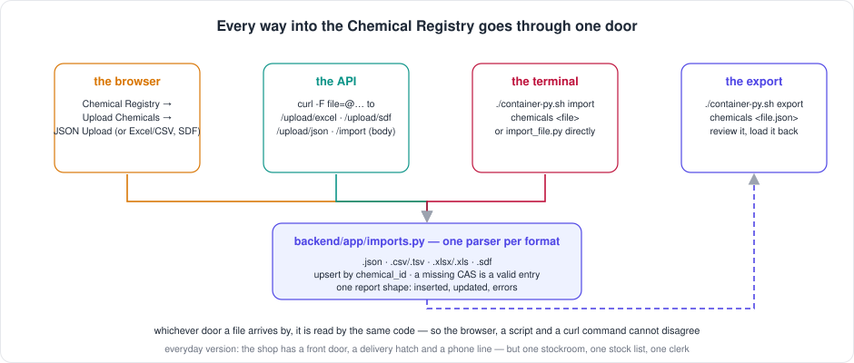

[← README](../../README.md) · [Handbook](../HANDBOOK.md) · [Glossary](../00-glossary.md) · [← Phase CR-6](phase-cr-6-delete-unlinks-first.md)

# Phase CR-3 — Every way in: JSON, one import command, and the review loop

**Version shipped:** 2.13.0 · **Date:** 2026-09-09 · **Status:** complete
**Track:** CR, the Chemical Registry ([roadmap](../05-roadmap.md#cr--chemical-registry))
**Prerequisites:** [Phase R](phase-r-registry-reset.md) (why the registry is empty) and [Phase CR-6](phase-cr-6-delete-unlinks-first.md) (the shared-module habit); a setup guide completed for your platform; for the review loop, the pre-reset backup on the server.
**Learning goal:** you understand what "the same door" means in software and why it matters more than any single feature; what JSON is and why it is the format that round-trips; how a file gets from your machine into a container that cannot see your folders; and how to refill a registry from a curated file, by any of four routes, with a review step in the middle.
**Deliverable:** one module, `backend/app/imports.py`, that every route calls; a JSON upload beside CSV, TSV, XLSX and SDF, in the browser and the API; a JSON-body endpoint for scripts; a terminal import script and an export script; `import` and `export` shortcuts on the container script; a synthetic JSON template; six tests; the registry refillable from a reviewed export of the 664 old entries.



---

## Contents

1. [Why this phase exists](#why-this-phase-exists)
2. [The words you need](#the-words-you-need)
3. [What we built](#what-we-built)
4. [Step 1 — One door: the shared import module](#step-1--one-door-the-shared-import-module)
5. [Step 2 — JSON in the browser and the API](#step-2--json-in-the-browser-and-the-api)
6. [Step 3 — The terminal: import and export scripts, and the shortcuts](#step-3--the-terminal-import-and-export-scripts-and-the-shortcuts)
7. [Step 4 — The review loop: refilling the registry from the backup](#step-4--the-review-loop-refilling-the-registry-from-the-backup)
8. [Step 5 — Tests, build, rebuild](#step-5--tests-build-rebuild)
9. [How to test it, by every route](#how-to-test-it-by-every-route)
10. [What this phase deliberately did not do](#what-this-phase-deliberately-did-not-do)
11. [Publish](#publish)

---

## Why this phase exists

After the reset the registry is empty, and under the agreed rule nothing
attaches to a compound until a person has registered it. So the registry
must be refillable from a *curated file* — a list a person has looked at —
by whichever route the person prefers: the browser, a script against the
API, or a command on the server. Before this phase the browser and the API
took spreadsheets and structure files, JSON was accepted one record at a
time, and the only terminal route was `curl`. Worse, the browser's upload
and the API's upload were the same code, but any new route would have had
to copy it.

*Everyday version:* a shop with a front door, a delivery hatch and a phone
line. If each has its own stock list, they disagree by Tuesday. One
stockroom, one list, one clerk — and three ways to reach the counter.

---

## The words you need

| Term | Plain words | Everyday version |
|---|---|---|
| **JSON** | A text format for records: named values in braces, lists in brackets. The API already speaks it | A form where every box is labelled |
| **Upsert** | Update the entry if its identifier exists, insert it if not — so loading a file twice never duplicates | Filing a card in the drawer where its number belongs, replacing the old one |
| **Round trip** | Export, then import, and end up with what you started with. Only JSON does this losslessly here, because it carries every field by name | Photocopying a form and filing the copy: nothing lost |
| **Curated file** | A list a person has reviewed before it is loaded — the opposite of inference | The stock list after stocktake, with the pencil corrections |
| **Mount** | A host folder the container can see; here `data/` is mounted as `/app/data`. Any other host path is invisible inside | The hatch between the shop floor and the stockroom |
| **Shared module** | One file of code that several routes call, so they cannot drift | One clerk, whichever door you came in by |

---

## What we built

| Piece | What it does | Where |
|---|---|---|
| `imports.py` | `format_of`, `parse_json_records`, `import_json_records`, `import_spreadsheet_rows`, `import_sdf_text`, `import_chemicals_file` (the one door), `export_chemicals` | `backend/app/imports.py` |
| The endpoints | `upload/excel` and `upload/sdf` now call the module (answers unchanged); new `POST /api/chemicals/upload/json` (a file) and `POST /api/chemicals/import` (the records in the body) | `backend/app/routers/chemicals.py` |
| The upload page | A **JSON Upload** mode beside Excel/CSV, SDF and Manual Entry | `client/src/pages/ChemicalsUpload.jsx`, `client/src/services/api.js` |
| Import script | `import_file.py chemicals <path>` for any of the five formats; `run(argv, db)` for tests | `backend/scripts/import_file.py` |
| Export script | `export_chemicals.py -o <path> [--db <url>]` writes every entry as re-importable JSON, sorted by identifier; `--db` reads a backup instead of the live database | `backend/scripts/export_chemicals.py` |
| Shortcuts | `./container-py.sh import chemicals <host file>` copies the file in and imports it; `./container-py.sh export chemicals <host file.json>` exports and copies the file out | `container-py.sh` |
| Template | `chemicals_template.json`, five synthetic records, one deliberately without a CAS number | `docs/excel-templates/chemicals/`, from `generate_templates.py` |
| Tests | JSON file upload upserts and keeps unknown keys; the object wrapper and the body endpoint; four refusals that say why; the spreadsheet route answers as before; the script imports JSON and CSV through the same door and refuses a missing or unknown file; export then import round-trips | `backend/tests/test_chemicals_import.py` |
| Small fix | `remove_chemicals.py --all` on an empty registry now says *already empty* and exits 0, instead of *Nothing matched* | `backend/scripts/remove_chemicals.py` |
| The gate | The safety gate's allow-list of template files gains `chemicals_template.json`; it refused the push until it did, which is the gate working | `check-public-safe.sh` |

---

## Step 1 — One door: the shared import module

**What:** move the three parsers out of the router into `backend/app/imports.py`
and add the fourth, JSON.

**How the JSON parser decides what a record means:** a record is a JSON
object with the API's own field names. `chemical_id` present and known →
update that entry; present and unknown → insert with that identifier;
absent → insert with the next sequential identifier. `name` missing →
"Unknown". `cas_number` empty or missing → stored as none, **a valid
entry**. Every other key is kept as it is: the document *is* the record,
which is what makes the export round-trip. Three keys are the registry's
own and are never taken from the file: `id`, `created_at`, `updated_at`.

**Why the spreadsheet and SDF parsers moved unchanged:** their answers are
locked by the contract tests. Moving code is safe when the tests do not
change; changing behaviour on the way would have hidden inside a refactor.

**You should see** the contract tests still pass after the move:

```bash
cd backend && .venv/bin/pytest -q tests/test_parity_chemicals.py tests/test_sdf_upload.py && cd ..   # expect: 25 passed
```

---

## Step 2 — JSON in the browser and the API

**What:** a fourth mode on the upload page and two endpoints.

**How, in the browser:** **Chemical Registry → Upload Chemicals → JSON
Upload** → drop or choose a `.json` file → **Upload**. The page says what
the file must be.

**How, through the API:** two shapes, because two callers exist. A person
or a script with a file on disk sends the file; a script that built the
list in memory sends it as the request body.

```bash
curl --noproxy '*' -sS -X POST http://localhost:49160/api/chemicals/upload/json -F "file=@docs/excel-templates/chemicals/chemicals_template.json"
curl --noproxy '*' -sS -X POST http://localhost:49160/api/chemicals/import -H 'Content-Type: application/json' -d '{"chemicals":[{"chemical_id":"CHEM-0009","name":"Test","cas_number":null}]}'
```

**You should see** the same report from both:
`{"message":"Successfully processed 5 chemicals (5 new, 0 updated)","inserted":5,"updated":0,"total":5}`.
Upload the same file again and it says `(0 new, 5 updated)`.

**If instead** you get `{"error":"Not valid JSON: … at line N"}`, the file is
not JSON — a stray comma or a missing bracket; the line number says where.
`{"error":"JSON must be a list of chemicals, or {\"chemicals\": [...]}"}`
means the top level is an object without a `chemicals` list.

---

## Step 3 — The terminal: import and export scripts, and the shortcuts

**What:** the same door from the command line, on every platform.

**Why a shortcut is needed at all:** the container cannot see your folders.
`data/` is the one host folder mounted into it. So a file on the server's
disk must either be placed under `data/` first, or copied into the
container. The `import` shortcut does the copy for you; the `script`
shortcut expects a path the container can already see.

**How, on the server** (or a Mac; the shortcuts find podman or Docker):

```bash
./container-py.sh import chemicals ~/registry-review.json          # copies the file in, imports it, prints the report
./container-py.sh export chemicals ~/registry-export.json          # exports the live registry, copies the file out
./container-py.sh script import_file.py chemicals /app/data/imports/registry-review.json   # if the file is already under data/
./container-py.sh script export_chemicals.py -o /app/data/registry-export.json
```

**The long form**, which the shortcuts wrap — useful to know what is
happening, never necessary to type:

```bash
podman cp ~/registry-review.json crucible-py:/tmp/crucible-import/registry-review.json
podman exec crucible-py python /app/backend/scripts/import_file.py chemicals /tmp/crucible-import/registry-review.json
```

**On a Mac with the test environment**, the scripts also run directly against
the local database, no container involved:

```bash
cd backend && .venv/bin/python scripts/import_file.py chemicals ../docs/excel-templates/chemicals/chemicals_template.json && cd ..
cd backend && .venv/bin/python scripts/export_chemicals.py -o /tmp/registry-export.json && cd ..
```

**You should see** `Successfully processed 5 chemicals (5 new, 0 updated)`
from the import and `Wrote N chemicals to …` from the export. **If instead**
the import says `Refused: Unsupported file type`, the extension is not one
of the five; `No such file` means the path is wrong — with the `script`
shortcut, remember the path is *inside* the container (`/app/data/…`).

---

## Step 4 — The review loop: refilling the registry from the backup

**What:** decision D10 of the registry-first rule, made real. The 664 old
entries live in the backup taken before R-2. Export them to JSON, review
the file, load back the good ones.

**How, on the server:**

```bash
cd ~/work/Pandora_toolbox/nr-nips-crucible
cp ~/data-backup-20260908-before-R2.db data/review-source.db                                    # 1. a copy of the backup where the container can see it
./container-py.sh script export_chemicals.py --db sqlite:////app/data/review-source.db -o /app/data/registry-review.json   # 2. the 664 entries as JSON
ls -la data/registry-review.json                                                                # 3. it is on the host now, under data/ (git ignores it)
```

**Then the review, by a person.** Open `data/registry-review.json` in any
editor, or load it into a spreadsheet through the Query page later. For
each entry the questions are the registry-first rule's: is the name right,
is the CAS number right, is it one substance? Delete the records that
fail; keep the rest. Entries without a CAS number are fine to keep.

```bash
./container-py.sh script import_file.py chemicals /app/data/registry-review.json               # 4. load what survived the review
rm data/review-source.db                                                                        # 5. the copy of the backup is no longer needed
```

**You should see** `Successfully processed N chemicals (N new, 0 updated)`
and the Chemical Registry page showing those N entries. **What it means:**
the registry is refilled by a person's decision, not by inference — which
is the whole point of the reset. Rows do not attach yet; that is SD-1, the
next phase, whose re-identify command will attach every row whose name and
CAS match one of these entries.

*Everyday version:* the old stock list is in the safe. You photocopy it,
cross out the entries you no longer trust, and type the survivors into the
new system.

---

## Step 5 — Tests, build, rebuild

```bash
cd backend && .venv/bin/ruff check . && .venv/bin/pytest -q && cd ..    # expect: All checks passed! · 117 passed
cd client && npm run build && cd ..                                     # the JSON mode is in the bundle
./container-py.sh rebuild                                               # scripts and the page live in the image
```

---

## How to test it, by every route

Everything below was run against the Mac copy before this page was
written; the numbers are from the five-record synthetic template.

| Route | How | You should see |
|---|---|---|
| **Browser** | Chemical Registry → Upload Chemicals → **JSON Upload** → choose `docs/excel-templates/chemicals/chemicals_template.json` → Upload | *Successfully processed 5 chemicals (5 new, 0 updated)*; five new rows in the registry, one with an empty CAS |
| **Browser, twice** | upload the same file again | *(0 new, 5 updated)*; still five rows |
| **API, a file** | `curl --noproxy '*' -sSk -X POST https://localhost:49160/api/chemicals/upload/json -F "file=@docs/excel-templates/chemicals/chemicals_template.json"` | `{"message":"Successfully processed 5 chemicals (0 new, 5 updated)","inserted":0,"updated":5,"total":5}` after the browser upload above |
| **API, the body** | `curl --noproxy '*' -sSk -X POST https://localhost:49160/api/chemicals/import -H 'Content-Type: application/json' -d '{"chemicals":[{"chemical_id":"CHEM-0009","name":"Body test"}]}'` | `…(1 new, 0 updated)…`; `GET /api/chemicals/CHEM-0009` answers the record with `cas_number` null |
| **API, refused** | the JSON endpoint with a file that is not JSON: `-F "file=@README.md"` | HTTP 400, `{"error":"Not valid JSON: Expecting value at line 1"}`; the terminal script with a `.txt` file: `Refused: Unsupported file type 'bad.txt': use .json, .csv, .tsv, .xlsx, .xls or .sdf` |
| **Terminal, shortcut** | `./container-py.sh import chemicals docs/excel-templates/chemicals/chemicals_template.json` | the same report as the API |
| **Terminal, export shortcut** | `./container-py.sh export chemicals /tmp/registry-export.json && head -c 200 /tmp/registry-export.json` | *Wrote N chemicals to /tmp/crucible-export.json*, *Copied to …*, and the JSON list starts |
| **Terminal, long form** | `podman cp … && podman exec crucible-py python /app/backend/scripts/import_file.py chemicals /tmp/crucible-import/…` | the same report — proves the shortcut is only a wrapper |
| **Python directly, on a Mac** | `cd backend && .venv/bin/python scripts/import_file.py chemicals ../docs/excel-templates/chemicals/chemicals_template.json` | the same report, against the local database |
| **Round trip** | export to a file, `DELETE …/all/clear?force=true`, import the file back | the same count and the same fields, `pubchem_cid` and all |
| **Database** | Query page: `SELECT chemical_id, json_extract(doc,'$.name'), json_extract(doc,'$.cas_number') FROM chemicals ORDER BY chemical_id` | the five template rows, one with an empty CAS |
| **Deploy check** | `./verify-deploy.sh https://localhost:49160` | `16 passed` |
| **Automated tests** | `cd backend && .venv/bin/pytest -q` | `117 passed` |

Clean up the test records afterwards with the registry page's **Delete
Selected**, or `./container-py.sh script remove_chemicals.py CHEM-0001 CHEM-0002 CHEM-0003 CHEM-0004 CHEM-0005 CHEM-0009 --apply`.

---

## What this phase deliberately did not do

- **Import screening or sample files from the terminal.** The script
  accepts `chemicals` only; screening arrives by the upload endpoint until
  SD-2, samples until SM-2, each with its own template detection.
- **Attach rows to the refilled entries.** That is the registry-first rule,
  SD-1, next; its re-identify command does it for every row already loaded.
- **Review the 664 entries for you.** The export makes the review possible;
  the review is the owner's, row by row, per decision D10.
- **Validate a whole file before writing any of it.** A bad record is
  skipped and reported; the rest are written. Whole-file validation is
  SD-4.

---

## Publish

Ships as v2.13.0. Backend, client and scripts changed, so the server deploy
**rebuilds**, with a backup first, per
[`03-git-workflow.md` → Flow A](../03-git-workflow.md#4-flow-a---a-change-from-start-to-finish).
The handbook's status box and build log, the roadmap's CR-3 row, the API
reference, the cookbook, the registry tasks page, the playbook, the
identification guide's review-loop section, the templates README, the
glossary and the release note are in the same commit.

**Last Updated:** September 9, 2026
