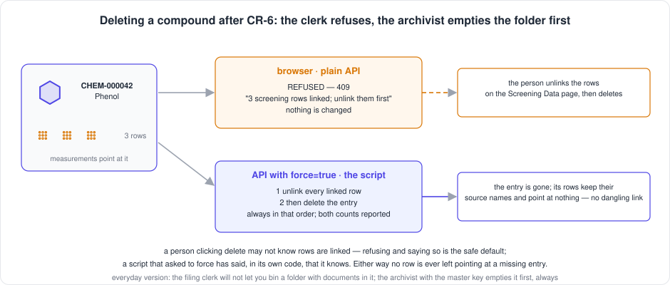
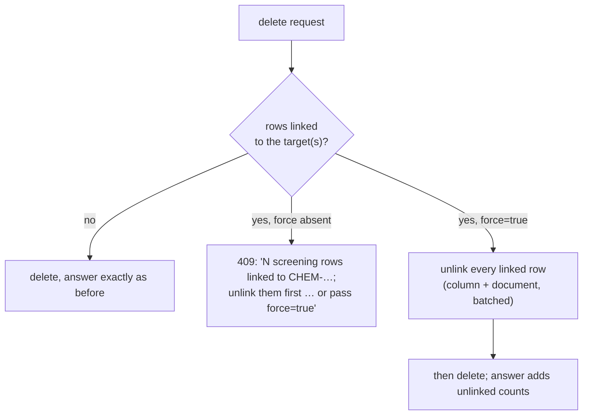

[← README](../../README.md) · [Handbook](../HANDBOOK.md) · [Glossary](../00-glossary.md) · [← Phase SH-1](phase-sh-1-module-names.md)

# Phase CR-6 — Deleting a compound: refuse in the browser, unlink first when forced

**Version shipped:** 2.11.0 · **Date:** 2026-09-09 · **Status:** complete
**Track:** CR, the Chemical Registry ([roadmap](../05-roadmap.md#cr--chemical-registry))
**Prerequisites:** [Phase R](phase-r-registry-reset.md) for what a link is and where it lives; a setup guide completed for your platform; the test virtual environment from its V7 check.
**Learning goal:** you understand what a *dangling link* is and why it is the one thing a deletion must never leave behind, why the same request gets two different answers depending on who is asking, what an HTTP 409 means, and how one shared module lets the API, the browser and a terminal script clear a link in exactly one way.
**Deliverable:** deleting a compound that still has measurements pointing at it is **refused** in the browser and by the plain API, with the count and what to do; the API with `force=true` and the removal script **unlink every linked row first, then delete**, always in that order, and report both counts. Six new tests; one contract test rewritten for the agreed behaviour; the link logic in one module.



---

## Contents

1. [Why this phase exists](#why-this-phase-exists)
2. [The rule, in plain words](#the-rule-in-plain-words)
3. [What we built](#what-we-built)
4. [Step 1 — One home for the link logic](#step-1--one-home-for-the-link-logic)
5. [Step 2 — The three delete endpoints learn to refuse, or to force](#step-2--the-three-delete-endpoints-learn-to-refuse-or-to-force)
6. [Step 3 — The browser explains the refusal and opens the rows](#step-3--the-browser-explains-the-refusal-and-opens-the-rows)
7. [Step 4 — Tests, including the one that had to change](#step-4--tests-including-the-one-that-had-to-change)
8. [Step 5 — Build, rebuild, and try it on real data](#step-5--build-rebuild-and-try-it-on-real-data)
9. [How to test it, by every route](#how-to-test-it-by-every-route)
10. [What this phase deliberately did not do](#what-this-phase-deliberately-did-not-do)
11. [Publish](#publish)

---

## Why this phase exists

A **link** is the pointer from a measurement to the compound it is about:
the compound's identifier, stored on the screening row. Delete the compound
and leave the pointer, and the row now points at something that does not
exist — a **dangling link**. The page shows "Unknown" where a name should
be, the deploy check reports it, and it has happened once, to 1,897 rows
([lesson 22](../11-lessons-learned.md)).

Until this phase the terminal script did the right thing — unlink, then
delete — while the browser and the API deleted and left the pointers. The
owner's rule fixes that in a way that matches who is asking.

*Everyday version:* a filing cabinet. A folder is the compound; the
documents inside it are the measurements. The clerk at the counter will not
let you throw away a folder that still has documents in it — you empty it
first. The archivist with the master key, when you tell him to clear it,
empties it for you, always before the folder goes.

---

## The rule, in plain words

| Who is deleting | Rows still linked? | What happens |
|---|---|---|
| A person in the browser | yes | **Refused.** A dialog says how many rows and offers to open exactly those rows on the Screening Data page. Nothing is deleted. |
| A person in the browser | no | Deleted, after the usual confirmation. |
| The API, plain (`DELETE /api/chemicals/{id}`, `bulk/delete`, `all/clear`) | yes | **409 Conflict** with the same message. The browser calls these, which is how the browser refuses without checking anything itself. |
| The API with `force=true` | yes | **Unlink first, then delete**, automatically; the answer carries `unlinked` counts per module. |
| The terminal script `remove_chemicals.py` | yes | The same, as it always did: report, then on `--apply` unlink, then delete. |

**409** is the HTTP status for "your request conflicts with the current
state of things" — the right word for "this folder is not empty". The body
is the usual `{"error": "…"}`, the shape every error in this API has.

The written specification this implements is in
[`09-chemical-identification.md`](../09-chemical-identification.md#how-deletion-will-work-after-cr-6--specification).

---

## What we built

| Piece | What it does | Where |
|---|---|---|
| `app/links.py` | The one home for "where does a link live and how is it cleared": `links_of`, `linked_rows`, `count_links`, `describe_links`, `unlink_rows`, `unlink_targets` | `backend/app/links.py` |
| `_refuse_or_unlink` | The rule, once, used by all three delete endpoints: count the linked rows; refuse with 409 unless forced; when forced, unlink and return the counts | `backend/app/routers/chemicals.py` |
| `force` | A query parameter on `DELETE /api/chemicals/{id}` and `DELETE /api/chemicals/all/clear`; a body field on `POST /api/chemicals/bulk/delete` | same, and `backend/app/schemas.py` |
| The script | Imports the link logic from `app/links.py` instead of carrying its own copy; behaviour unchanged | `backend/scripts/remove_chemicals.py` |
| The dialog | On 409, "Not deleted — rows are still linked", the message, and *Open the linked rows*, which goes to `/screening?chemical_id=…`; a note under the bulk bar; the bin icon's tooltip says the rule | `client/src/pages/ChemicalsView.jsx` |
| Tests | Six cases: refused, forced (screening and sample links, column and document cleared), unchanged when nothing is linked, a sample link alone refuses, bulk refuse and force, clear-all refuse and force | `backend/tests/test_chemicals_delete_links.py` |
| One rewritten test | The contract test that *expected* an orphaned row now asserts the refusal, then reaches "Unknown" through the forced route | `backend/tests/test_parity_screening_toxicology.py` |

---

## Step 1 — One home for the link logic

**What:** move the three facts about links out of the removal script into a
module the API can import too.

**Why:** the script already knew that a screening row keeps its link in two
places (a column and inside its document), that a sample keeps a *list* of
links with no column at all, and that clearing must be batched. The API
needed the same three facts. Two copies of a rule drift; one copy cannot
(the single-owner rule, [CONTRIBUTING](../../CONTRIBUTING.md#7-documentation-norms)).

**How:** `backend/app/links.py` holds `links_of(row)`, `linked_rows`,
`count_links`, `describe_links` (the words for the refusal: *3 screening
rows and 1 sample*), `unlink_rows` (batched, column and document) and
`unlink_targets`. The script imports them and deletes its own copies.

**You should see** the script's own tests still pass:

```bash
cd backend && .venv/bin/pytest -q tests/test_remove_chemicals.py && cd ..    # expect: 8 passed
```

**If instead** an import fails inside the container, the image is stale:
scripts live in the image, so a rebuild is part of this phase.

---

## Step 2 — The three delete endpoints learn to refuse, or to force

**What:** one helper, `_refuse_or_unlink(db, targets, force, what)`, called
by delete-one, bulk-delete and clear-all before they delete anything.

**How it decides:**



**Why the plain answer is unchanged when nothing is linked:** the API
contract is locked by tests. With no links, `DELETE` still answers exactly
`{"message": "Chemical deleted successfully"}`; only when something *was*
unlinked does the answer gain an `unlinked` object. Nothing that worked
before stops working; only the dangerous case changes, and it changes into a
refusal, which is the announced contract change of this release.

**You should see**, on a chemical with linked rows:

```bash
curl --noproxy '*' -sS -X DELETE http://localhost:49160/api/chemicals/CHEM-000042
# {"error":"3 screening rows linked to CHEM-000042; unlink them first (Screening Data page, or POST /api/screening/unlink), or pass force=true to unlink and then delete."}
curl --noproxy '*' -sS -X DELETE "http://localhost:49160/api/chemicals/CHEM-000042?force=true"
# {"message":"Chemical deleted successfully","unlinked":{"screening":3,"total":3}}
```

---

## Step 3 — The browser explains the refusal and opens the rows

**What:** the three delete handlers on the Chemical Registry page catch a
409 and show a dialog instead of a generic "failed" message.

**How:** the dialog is titled *Not deleted — rows are still linked*, shows
the API's message, explains the three clicks that unlink (tick the header
box, *Select all N matching rows*, *Unlink*), and has a button *Open the
linked rows* that goes to the Screening Data page with the compound's
identifier as a filter — the page already understood `?chemical_id=…`, so
the person lands on exactly the rows to unlink. For *Delete Selected* with
several compounds and for *Clear All*, the button opens the page unfiltered.
A one-line note under the bulk bar states the rule, and the bin icon's
tooltip repeats it.

**Why no force in the browser:** a person clicking delete may not know rows
are linked. Refusing and saying so is the safe default; the force flag is
for a script that has said, in its own code, that it knows.

**You should see** the dialog when you click the bin on a compound with
linked rows, and the Screening Data page filtered to that compound after
*Open the linked rows*.

---

## Step 4 — Tests, including the one that had to change

**What:** six new tests, and one existing test rewritten.

**Why one had to change:** `test_screening_unknown_chemical_shows_unknown_name`
deleted a chemical while a row pointed at it and asserted the orphaned row
showed "Unknown". That test *locked the bug*. It now asserts the plain
delete is refused (409), then reaches "Unknown" through the forced route —
where the row shows "Unknown" because it has no chemical, not because its
chemical vanished. This is the contract change, agreed in the specification
and announced in the release note.

**How:**

```bash
cd backend && .venv/bin/ruff check . && .venv/bin/pytest -q && cd ..
```

**You should see** `All checks passed!` and `111 passed`.

---

## Step 5 — Build, rebuild, and try it on real data

**What:** the client changed and the backend changed, so both the bundle
and the image are rebuilt, and the rule is tried against a copy of real
data before it goes anywhere near production.

**How, on the Mac** (a Mac copy of the database with 120 compounds and
11,981 linked rows):

```bash
cd ~/Documents/Work/pandora_toolbox/nr-nips-crucible/client && npm run build && cd ..
./container-py.sh rebuild
curl --noproxy '*' -sS "http://localhost:49160/api/screening?chemical_id=CAS-95-93-2&limit=1" | head -c 120; echo
curl --noproxy '*' -sS -X DELETE http://localhost:49160/api/chemicals/CAS-95-93-2 ; echo
```

**You should see** the refusal with the row count for that compound, and
the compound still present afterwards. On production there is nothing to
refuse today — no row is linked since R-2 — which is why this phase is safe
to deploy now and matters later, when the registry is refilled.

---

## How to test it, by every route

| Route | How | You should see |
|---|---|---|
| Browser, refused | Chemical Registry → a compound with linked rows → bin icon → confirm | the dialog *Not deleted — rows are still linked* with the count; the compound still listed; *Open the linked rows* lands on Screening Data filtered to it |
| Browser, allowed | unlink those rows (tick header → *Select all N matching rows* → *Unlink*), back to the registry, bin icon → confirm | *Chemical deleted successfully*; the compound gone |
| API, plain | `curl --noproxy '*' -sSk -X DELETE https://localhost:49160/api/chemicals/<id>` on a linked compound | HTTP 409, `{"error":"N screening rows linked to <id>; unlink them first …"}`, nothing changed |
| API, forced | the same with `?force=true` | `{"message":"Chemical deleted successfully","unlinked":{"screening":N,"total":N}}`; those rows now show their source name and no chemical |
| API, bulk and clear-all | `POST /api/chemicals/bulk/delete` with and without `"force": true`; `DELETE /api/chemicals/all/clear` with and without `?force=true` | refused with the counts, then done with `unlinked` |
| Terminal, the script | `podman exec crucible-py python /app/backend/scripts/remove_chemicals.py <id>` then `--apply` | the report, then `Removed 1 entries, unlinked N rows` — unchanged behaviour, now from the shared module |
| Database | Query page: `SELECT COUNT(*) FROM screening WHERE chemical_id IS NOT NULL AND chemical_id NOT IN (SELECT chemical_id FROM chemicals)` | `0` — no dangling link, before and after any of the above |
| Deploy check | `./verify-deploy.sh https://localhost:49160` | `16 passed`, including *no dangling chemical links* |
| Automated tests | `cd backend && .venv/bin/pytest -q` | `111 passed` |

On production today every route answers as if nothing were linked, because
nothing is. The refusal becomes visible the first time a compound with rows
is deleted from the browser after the registry is refilled.

---

## What this phase deliberately did not do

- **Add a force button to the browser.** A person is never asked "are you
  sure you want to orphan rows?"; the browser has exactly one behaviour.
- **Change the script.** It already unlinked first; it now does so through
  the shared module.
- **Refuse deletions of samples or toxicology records.** Those point *at*
  chemicals; nothing points at them.
- **Touch the screening page.** Its `?chemical_id=` filter already existed;
  the dialog only links to it.

---

## Publish

Ships as v2.11.0. Backend and client changed, so the server deploy
**rebuilds**, with a backup first, per
[`03-git-workflow.md` → Flow A](../03-git-workflow.md#4-flow-a---a-change-from-start-to-finish).
The handbook's status box and build log, the roadmap's CR-6 row, the API
reference, the cookbook, the registry tasks page, the playbook, the
identification guide's specification (now marked built), the glossary and
the release note are in the same commit.

**Last Updated:** September 9, 2026
