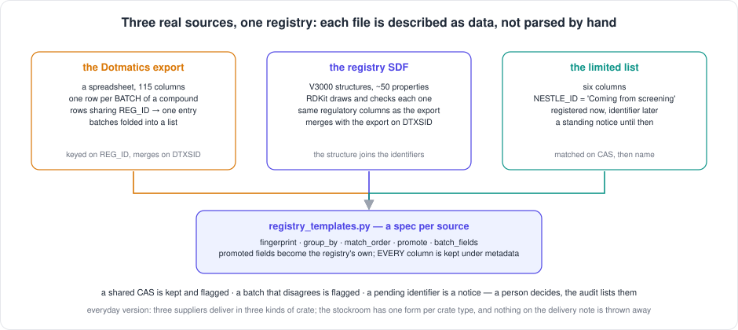

[← README](../../README.md) · [Handbook](../HANDBOOK.md) · [Glossary](../00-glossary.md) · [← Phase CR-3](phase-cr-3-every-way-in.md)

# Phase CR-9 — The laboratory's real registry sources, described as data

**Version shipped:** 2.14.0 · **Date:** 2026-09-09 · **Status:** complete
**Track:** CR, the Chemical Registry ([roadmap](../05-roadmap.md#cr--chemical-registry))
**Prerequisites:** [Phase CR-3](phase-cr-3-every-way-in.md) (the one door every file goes through); [phase 04](phase-04-template-ingestion.md) for the idea of a template specification; a setup guide completed for your platform.
**Learning goal:** you understand how a real file format is described as data instead of parsed by hand, why several rows can be one compound and how they become one entry, why two entries may legitimately share an identifier and what the system does about it, how a structure file is read and merged with a spreadsheet's entry, and what "the identifier is coming from screening" means for an entry.
**Deliverable:** the three real registry sources — the Dotmatics export, the registry structure file and the limited list — recognised by their columns and loaded through the existing door by every route; batches folded into entries; shared identifiers kept and flagged; structures read by RDKit; a standing notice on the registry page; the audit listing every flag; seven tests on synthetic files.



---

## Contents

1. [Why this phase exists](#why-this-phase-exists)
2. [The words you need](#the-words-you-need)
3. [What we built](#what-we-built)
4. [Step 1 — Read the real files without loading them](#step-1--read-the-real-files-without-loading-them)
5. [Step 2 — Write each source as a specification](#step-2--write-each-source-as-a-specification)
6. [Step 3 — Teach the door to recognise a spec](#step-3--teach-the-door-to-recognise-a-spec)
7. [Step 4 — Fix the structure parser](#step-4--fix-the-structure-parser)
8. [Step 5 — Flags, notices and the audit](#step-5--flags-notices-and-the-audit)
9. [Step 6 — Make it fast](#step-6--make-it-fast)
10. [Step 7 — Tests, build, rebuild, and the real files](#step-7--tests-build-rebuild-and-the-real-files)
11. [How to test it, by every route](#how-to-test-it-by-every-route)
12. [What this phase deliberately did not do](#what-this-phase-deliberately-did-not-do)
13. [Publish](#publish)

---

## Why this phase exists

The registry is empty by design since the reset, and the rule that
refills it says a person loads curated files. The laboratory has three
such files: the master export of its other electronic notebook (12,561
rows, 115 columns), a structure file of 77 molecules with fifty properties
each, and a short list whose identifier column says *Coming from
screening*. Before this phase the generic upload would have loaded the
export after a fashion — name, CAS, formula and weight promoted, the rest
kept — but it would have made one entry per *row* rather than per
compound, dropped the identifiers that let the sources merge, and it could
not draw a single one of the 77 structures.

*Everyday version:* three suppliers deliver in three kinds of crate. You
could hire a specialist per supplier. Instead the stockroom has one form
per crate type — what is in it, where each thing goes, what to do when two
crates carry the same item — and one clerk reads the forms.

---

## The words you need

| Term | Plain words | Everyday version |
|---|---|---|
| **Template specification** | A file format described as data: how to recognise it, which column is the compound, which columns become the registry's fields, and the rule that the rest is kept | The form for a crate type |
| **Fingerprint** | The column names that must all be present for a file to be recognised as this source | The supplier's logo on the crate |
| **Batch** | One physical lot of a compound; the Dotmatics export has one row per batch, so a compound may span several rows | One delivery of the same item |
| **DTXSID** | An identifier from a public chemistry database, carried by both the export and the structure file — which is why they can be matched to each other | A product barcode both suppliers print |
| **Merge** | When a second source describes an entry the registry already has, its fields are added to that entry rather than making a new one | Filing the second delivery note in the same folder |
| **Shared identifier** | Two registrations in the source carry the same CAS, DTXSID or PubChem identifier. Kept as two entries, each flagged with the other's identifier | Two folders with the same barcode: you note it, you do not throw one away |
| **Pending identifier** | *Coming from screening*: the entry is registered now and its identifier filled in later from the screening data | A form with one box marked "to follow" |
| **V3000** | The newer, wider layout of the structure file format, used for large molecules | The A3 version of the same form |

---

## What we built

| Piece | What it does | Where |
|---|---|---|
| Three specs | `DOTMATICS_EXPORT`, `REGISTRY_SDF`, `LIMITED_LIST`: fingerprint, `group_by`, `match_order`, `promote`, `batch_fields`; `detect_sheet_spec`, `detect_sdf_spec` | `backend/app/utils/registry_templates.py` |
| The spec path in the door | `import_with_spec`: groups rows, promotes fields, folds batches, flags conflicts, matches or inserts, keeps every column; `_Registry` lookup maps; `registry_notices` | `backend/app/imports.py` |
| Structure parsing | The record split consumes the terminator's newline and the parser no longer strips a blank name line, so V3000 records reach RDKit intact | `backend/app/utils/sdf.py` |
| The notices endpoint | `GET /api/chemicals/notices/summary`: pending identifiers, shared identifiers, batch conflicts | `backend/app/routers/chemicals.py` |
| The banner | *Needs a person's eye:* the three counts, on the Chemical Registry page, with the audit command | `client/src/pages/ChemicalsView.jsx`, `client/src/services/api.js` |
| The audit | Lists every flagged entry: shared identifiers with the other holders, batch conflicts with the columns, pending identifiers | `backend/scripts/audit_chemicals.py` |
| The deploy check | Entries flagged as sharing an identifier on purpose are not duplicates | `verify-deploy.sh` |
| Batched writes | `replace_doc(commit=False)`; the import allocates identifiers from one counter and writes in batches of 1,000 | `backend/app/store.py`, `backend/app/imports.py` |
| Synthetic templates | `dotmatics_template.xlsx`, `chemicals_registry_template.sdf` (V3000), `chemicals_limited_template.xlsx` — the real column and property names, invented values | `docs/excel-templates/chemicals/`, from `generate_templates.py`; allowed by `check-public-safe.sh` |
| Tests | Seven: recognition and grouping, promotion, batch conflicts, shared CAS, re-import updates, SDF read by RDKit and merged on DTXSID with the first source kept, the limited list's pending identifier and the notice, pending dropped when another source knows the identifier, the generic route untouched, the terminal script using the specs | `backend/tests/test_registry_templates.py` |
| The specification page | The three sources, column by column, and what every flag means | `docs/09-registry-sources.md` |

---

## Step 1 — Read the real files without loading them

**What:** learn the files' shape — headers, counts, fill rates — before
writing a line of code, and without printing a single value.

**How, on a Mac with the test environment** (the real files stay outside
git: the ignore rules for spreadsheets and structure files under
`docs/excel-templates/` cover them, and the gate refuses anything there
that is not a synthetic template):

```bash
cd backend && .venv/bin/python - <<'PY'
from openpyxl import load_workbook
wb = load_workbook("../docs/excel-templates/chemicals/Export_Chemicals_dotmatics.xlsx", read_only=True, data_only=True)
ws = wb.worksheets[0]; rows = ws.iter_rows(values_only=True); header = next(rows)
n = sum(1 for r in rows if any(v not in (None, "") for v in r))
print(ws.title, n, "rows", len(header), "columns")
PY
```

**Why:** a specification written from a guess is the failure mode of
lesson 25. The counts below came from this step.

**You should see:** `browser export 12561 rows 115 columns`; the same
technique on the structure file gives 77 molecules and 52 property names;
on the list, 25 rows, six columns, every identifier *Coming from
screening*. Deeper: 12,539 distinct `REG_ID`, six compounds with several
batches, twelve CAS numbers shared by more than one registration, one
duplicated header, and the synonym cells separated by semicolons with
commas *inside* names.

---

## Step 2 — Write each source as a specification

**What:** `backend/app/utils/registry_templates.py`, one `RegistrySpec`
per source. Each answers four questions: how to recognise the file
(`fingerprint`), which column says what compound a row is about
(`group_by`), how to find an existing entry for it (`match_order`), and
which columns become the registry's fields (`promote`) — everything else
is kept under `metadata`, always.

**Why data and not code:** the fourth source, when it comes, should be a
fourth description. If it needs new code, the design has failed.

**The decisions you must not guess** — the owner agreed them on
2026-09-09: one entry per `REG_ID` with batches as a list; shared CAS
numbers kept and flagged; the export and the structure file merge on
DTXSID; the owner loads the real files; this phase before SD-1. They are
written, with the column-by-column mapping, in
[`09-registry-sources.md`](../09-registry-sources.md).

**You should see** the three specs recognised on the synthetic templates:

```bash
cd backend && .venv/bin/python -c "
import sys; sys.path.insert(0, '.')
from app.utils.registry_templates import detect_sheet_spec, REGISTRY
print([s.key for s in REGISTRY]); print(detect_sheet_spec(['REG_ID','BATCH_ID','FORMATTED_BATCH_ID','CHEMICAL_NAME','CAS_NO','DTXSID']).key)"
```

`['dotmatics_export', 'registry_sdf', 'limited_list']` and `dotmatics_export`.

**If instead** the generic template were recognised as the limited list:
that happened. The list's six headers are a subset of the generic
template's, so the list spec matches *exactly* those six and no more.

---

## Step 3 — Teach the door to recognise a spec

**What:** in `backend/app/imports.py`, spreadsheet rows and structure
files first ask "does a spec recognise this?"; if yes, `import_with_spec`
runs; if no, the generic route of CR-3 runs unchanged.

**How `import_with_spec` works, in order:** build the lookup maps once;
group rows by the spec's key; for each group take the first row's
promoted fields, fold the batch-level columns of every row into
`batches`, note any other column that differs between the rows under
`batch_conflicts`; find an existing entry by the spec's match order —
the spec's own key always matches, a later key such as DTXSID matches
only an entry from a *different* source, so two registrations of one
source that share a DTXSID stay two entries; update it (the first
source's label stays, the later one is recorded under `merged_from`, the
two sources' metadata sit side by side) or insert it with the next
sequential identifier; flag shared CAS, DTXSID and PubChem identifiers;
write everything in batches.

**Why the identifier is never the source's own:** an entry's `CHEM-nnnnnn`
is the application's; `REG_ID` and DTXSID are fields on it. The generic
structure route used to take a DTXSID as the identifier; the spec route
does not.

---

## Step 4 — Fix the structure parser

**What:** every one of the 77 real molecules came back with *RDKit could
not parse the MOL block*.

**How it was found:** RDKit's own reader read all 77 from the file
directly, so the file was fine and the block the parser built was not.
Two things, both at the start of each record: the split on the record
terminator left the terminator's newline at the head of the next record,
and the parser then stripped leading blank lines — but the blank first
line *is* the molecule's empty name line in this file. Together they
shifted the header by one, and RDKit read the atom counts from the
comment line.

**The fix:** the split consumes the terminator's newline; the parser
strips trailing whitespace only.

**You should see**, on the synthetic V3000 template, no warnings and a
non-zero atom count:

```bash
cd backend && .venv/bin/python -c "
import sys; sys.path.insert(0, '.')
from app.utils.sdf import parse_sdf
m = parse_sdf(open('../docs/excel-templates/chemicals/chemicals_registry_template.sdf').read())
print(len(m), 'molecules;', sum(1 for x in m if x['warnings']), 'with warnings;', m[0]['_structure']['atom_count'], 'atoms in the first')"
```

`3 molecules; 0 with warnings; 14 atoms in the first`. On the real file:
77, 0 warnings. The formula RDKit computes rarely equals the file's stated
one — hydrogens are implicit in these drawings — so the file's value is
the promoted `molecular_formula` and the computed one sits under
`structural` for the audit.

---

## Step 5 — Flags, notices and the audit

**What:** a person decides the doubtful cases; the system points at them.

| Flag on the entry | Set when | Shown |
|---|---|---|
| `cas_shared_with`, `dtx_shared_with`, `pubchem_shared_with` | another entry carries the same identifier | banner count *share an identifier*; audit *shared id* lines |
| `batch_conflicts` | a compound's batch rows disagree on a column outside the batch-level set | banner; audit *batch conflict* lines |
| `nestle_id_pending: screening` | the limited list said *Coming from screening* and no other source knows the identifier | banner *await an identifier*; audit *pending id* lines |

**Why the deploy check had to change:** its duplicate test counted every
repeated CAS, PubChem identifier or name. Under decision 2 a flagged pair
is not a duplicate but a recorded fact, so the three duplicate queries now
skip flagged entries. Without that, loading the export would have failed
the deploy check by design.

---

## Step 6 — Make it fast

**What:** the first run of the real export took eight and a half minutes.

**How it was diagnosed:** the same import run directly on the Mac took ten
seconds, and a profile showed six of them reading the spreadsheet. So the
code was fine, and the eight minutes were the container's mounted disk on
macOS, which is slow for a database that commits often. That is a Mac
development artefact — the server's mount is native — but committing once
per entry and rescanning every identifier to allocate the next one was
still the pattern of lesson 18, so both were fixed: identifiers come from
one counter, new entries are written in batches of 1,000, changed entries
commit once.

**You should see** the export load in about six seconds directly on a Mac,
and in a few tens of seconds inside the container on the server.

---

## Step 7 — Tests, build, rebuild, and the real files

```bash
cd backend && .venv/bin/ruff check . && .venv/bin/pytest -q && cd ..   # expect: All checks passed! · 124 passed
cd client && npm run build && cd ..                                    # the banner is in the bundle
./container-py.sh rebuild                                              # the parser, specs and scripts live in the image
```

Then the real files, on the Mac copy only, never committed, through the
routes below. The numbers there are what they gave.

---

## How to test it, by every route

The synthetic templates give small, exact numbers on any machine. The
real files give the numbers in the last column; they were run on the Mac
copy on 2026-09-09 and are what to expect on the server.

| Route | How | You should see (synthetic templates) | Real files |
|---|---|---|---|
| **Browser, the export** | Chemical Registry → Upload Chemicals → **Excel Upload** → `docs/excel-templates/chemicals/dotmatics_template.xlsx` → Upload | *Successfully processed 6 chemicals from the Dotmatics registry export (6 new, 0 updated)*; the result box shows `compounds 6, rows 7, batch_conflicts 0`; Caffeine has two batches | 12,539 compounds from 12,561 rows, 3 batch conflicts, 18 entries sharing a CAS; the banner appears |
| **Browser, the structure file** | the same page → **SDF Upload** → `chemicals_registry_template.sdf` | *… from the Registry structure file (SDF, V3000) (0 new, 3 updated)* — merged into the export's entries; the eye icon draws the structure | 77 molecules, 0 new, 77 updated (all merged on DTXSID) |
| **Browser, the list** | **Excel Upload** → `chemicals_limited_template.xlsx` | *… from the Limited chemicals list … (0 new, 3 updated)* — all three matched the export's entries by CAS or name; `pending_identifiers 2`: Caffeine and the mixture had no identifier in the export, Vanillin did | 25 updated, 0 new, 0 pending — every one already had its identifier from the export |
| **Browser, the banner** | the Chemical Registry page after the three uploads | *Needs a person's eye: 2 compounds still await an identifier from the screening data* | 419 entries sharing an identifier (18 CAS, 43 DTXSID, 404 PubChem), 3 batch conflicts |
| **API, a file** | `curl --noproxy '*' -sSk -X POST https://localhost:49160/api/chemicals/upload/excel -F "file=@docs/excel-templates/chemicals/dotmatics_template.xlsx"` | the same report as JSON, with `"template":"dotmatics_export"` | the same |
| **API, the structure file** | `curl --noproxy '*' -sSk -X POST https://localhost:49160/api/chemicals/upload/sdf -F "file=@docs/excel-templates/chemicals/chemicals_registry_template.sdf"` | `"template":"registry_sdf","totalRecords":3,"parseErrors":0` | `totalRecords 77, parseErrors 0` |
| **API, the notices** | `curl --noproxy '*' -sSk https://localhost:49160/api/chemicals/notices/summary` | `{"nestle_id_pending":2,"cas_shared":0,"batch_conflicts":0}` | `{"nestle_id_pending":0,"cas_shared":419,"batch_conflicts":3}` |
| **Terminal, the shortcut** | `./container-py.sh import chemicals docs/excel-templates/chemicals/dotmatics_template.xlsx` | the report's message line | 12,539 compounds |
| **Terminal, the long form** | `podman cp docs/excel-templates/chemicals/chemicals_registry_template.sdf crucible-py:/tmp/t.sdf && podman exec crucible-py python /app/backend/scripts/import_file.py chemicals /tmp/t.sdf --json` | the full JSON report | — |
| **Python directly, on a Mac** | `cd backend && .venv/bin/python scripts/import_file.py chemicals ../docs/excel-templates/chemicals/dotmatics_template.xlsx --json` | the full JSON report, against `data/crucible.db` — the same file the container serves | the export in about 6 s, the SDF in 2 s, the list in 2 s |
| **Terminal, the audit** | `./container-py.sh script audit_chemicals.py` | a *Flags set by the registry imports* section with two *pending id* lines: Caffeine and the mixture | 419 shared-id lines, 3 batch-conflict lines |
| **Database** | Query page: `SELECT chemical_id, json_extract(doc,'$.dotmatics_reg_id') reg, json_array_length(doc,'$.batches') batches, json_extract(doc,'$.merged_from') merged FROM chemicals ORDER BY chemical_id` | six rows, `CHEM-000001` to `CHEM-000006`; Caffeine with `batches 2` and `merged ["limited_list","registry_sdf"]`; every column of the file under `metadata` | 12,539 rows |
| **Deploy check** | `./verify-deploy.sh https://localhost:49160` | `16 passed` — flagged pairs are not duplicates | `16 passed` |
| **Automated tests** | `cd backend && .venv/bin/pytest -q` | `124 passed` | — |

**One thing to know when writing from outside the container.** After a
direct Python import on a Mac, the running application may answer stale
counts for a moment: its pooled database connection holds the snapshot it
last saw, until its next write or a `./container-py.sh restart`. The
data is there; the view catches up. On the server, loading through the
shortcut or the browser writes through the application and shows at once.

Clean up the synthetic entries afterwards: on the registry page tick them
and **Delete Selected**, or `./container-py.sh script remove_chemicals.py --all --apply` on a test copy only.

---

## What this phase deliberately did not do

- **Load the real files.** The owner does, by any route, per decision 4;
  the last column above says what to expect.
- **Resolve the pending identifiers.** They wait for the NR screening data
  and the matching of SD-1.
- **Judge the flagged pairs.** 419 entries share an identifier with
  another; the audit lists them and a person decides, pair by pair.
- **Show the metadata in the table.** Every column is kept; the Complete
  view that displays it is CR-2.
- **Make the spreadsheet templates byte-stable.** The generator's XLSX
  output differs between runs (timestamps inside the file); the
  regenerated spreadsheets were restored and only the new files committed.
  A small item for the shared spine.

---

## Publish

Ships as v2.14.0. Backend, client, scripts and the deploy check changed, so
the server deploy **rebuilds**, with a backup first, per
[`03-git-workflow.md` → Flow A](../03-git-workflow.md#4-flow-a---a-change-from-start-to-finish).
The handbook's status box and build log, the roadmap's CR-9 row, the
sources page, the registry tasks page, the templates README, the API
reference, the playbook, the identification guide, the glossary and the
release note are in the same commit.

**Last Updated:** September 9, 2026
