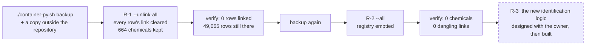

[← README](../../README.md) · [Handbook](../HANDBOOK.md) · [Glossary](../00-glossary.md) · [← Phase 05b](phase-05b-reproducible-builds-and-ci.md) · [Phase SH-1 →](phase-sh-1-module-names.md)

# Phase R — The registry reset: unlink everything, empty the registry, start again

**Version shipped:** 2.5.0 (the tools), 2.6.0 (the buttons), 2.7.0 (select-all-matching, confirmation, per-chemical summaries) · **Date:** 2026-09-08 · **Status:** in progress — **R-1 done on production on 2026-09-08** (the owner, from the browser, then the terminal for a re-linked page); **R-2 done on production on 2026-09-08** (the owner, from the terminal, after a backup); R-3 was described on 2026-09-08 and is now the **SD-1 specification, agreed the same day**
**Prerequisites:** [Phase 04](phase-04-template-ingestion.md) for what identification is; the [playbook](../10-user-playbook.md) Parts 4–6 for the registry as it stands; on the VM, a backup you have copied outside the repository.
**Learning goal:** you understand what a link between a measurement and a compound is, where it is stored, why removing it is safe and reversible while deleting a compound is not, and how a data operation is made *provably dry* before it is made real.
**Deliverable:** two new modes on the removal script — `--unlink-all` and `--all` — each gated on `--apply`, batched, and covered by the script's first automated tests; a written procedure for the two steps on production; the registry emptied so that the new identification logic starts clean.

---

## Contents

1. [Why this phase exists](#why-this-phase-exists)
2. [What a link is, and where it lives](#what-a-link-is-and-where-it-lives)
3. [What we built](#what-we-built)
4. [Step 1 — Prove the dry run is dry](#step-1--prove-the-dry-run-is-dry)
5. [Step 2 — R-1: unlink every row, on production](#step-2--r-1-unlink-every-row-on-production)
6. [Step 3 — R-2: remove every chemical, on production](#step-3--r-2-remove-every-chemical-on-production)
7. [Step 4 — R-3: the new identification logic](#step-4--r-3-the-new-identification-logic)
8. [How to test it, by every route](#how-to-test-it-by-every-route)
9. [What this phase deliberately did not do](#what-this-phase-deliberately-did-not-do)
10. [Publish](#publish)

---

## Why this phase exists

The registry holds 664 compounds. Most were created by the identification
job from the screening export, under rules that are about to change: the
owner has a different logic in mind for deciding what a compound *is*. A
registry built under one set of rules and corrected under another would be
half one thing and half the other, and nobody could say which entries to
trust. It is cleaner to start again: detach every measurement from its
compound, empty the registry, and let the new logic rebuild it.

*Everyday version:* a library that catalogued its books under one scheme
and is switching to another. You do not re-label a few shelves; you take
every card out of the drawer, keep the books exactly where they are, and
re-catalogue under the new scheme. The books are the measurements; the cards
are the links; the drawer is the registry.

Two things make this safe rather than reckless:

- **The measurements are never touched.** A screening row keeps every value
  its source file had, including the compound *name* the laboratory wrote.
  Only the pointer to a registry entry is cleared.
- **A backup precedes each step, and each step is run twice:** once as a
  report that writes nothing, once for real.



---

## What a link is, and where it lives

When a screening row has been identified, it carries the identifier of a
registry entry, such as `CHEM-000042`. That identifier is stored **twice**,
on purpose: once inside the row's stored document (the truth, see
[the one design rule](../02-architecture.md#the-one-design-rule-everything-else-follows-from))
and once in an indexed column beside it (so that "every result for this
compound" is a fast lookup). Unlinking must clear both, or the two would
disagree and a later index rebuild would resurrect the link.


The same is true of samples and toxicology studies; production holds none
today, but the script treats all three the same way.

---

## What we built

| Piece | What it does | Where |
|---|---|---|
| `--unlink-all` | Clears the link on every screening, sample and toxicology row; keeps every chemical entry. Step R-1 | `backend/scripts/remove_chemicals.py` |
| `--all` | Unlinks every row, then deletes every chemical entry. Step R-2 | same |
| Batched commits | 5,000 rows per commit with a progress line, because one transaction per row on a 116 MB file once looked like a hang (lesson 18) | same |
| `run(argv, db)` | The script's logic callable from a test with a supplied session, so it can be exercised without a container | same |
| A latent crash fixed | A sample links through a list of chemical identifiers in its document, not a column; the script assumed a column and would have failed on the first sample. Found by the first test (lesson 30) | same |
| First tests | Six cases: the report writes nothing; removing one entry unlinks only its rows; `--unlink-all` clears column *and* document and keeps chemicals; `--all` empties the registry and the rows keep their source names; the job-only selector; nothing matching is an error | `backend/tests/test_remove_chemicals.py` |
| Buttons on the Screening Data page | A link or unlink icon on each row, *Link to a chemical…* and *Unlink* for ticked rows or for every row matching the filters, a name-and-CAS confirmation before a link, *Unlink all rows…* with typed confirmation; backed by `POST /api/screening/link` and `/unlink`, whose answers say how many rows of which chemical | `client/src/pages/ScreeningView.jsx`, `backend/app/routers/screening.py` |
| `--unlink-only` | Detach the rows of named chemicals and keep the entries; every mode prints rows per chemical, most first | `backend/scripts/remove_chemicals.py` |
| The procedure | Below, and in [`09-chemical-identification.md` → Resetting the registry](../09-chemical-identification.md#resetting-the-registry) | — |

---

## Step 1 — Prove the dry run is dry

**What:** run both reset modes without `--apply`, on any instance, and show
that nothing changed.

**How (on the VM, or on a Mac with data loaded; `docker` for `podman` if that is your runtime):**

```bash
curl --noproxy '*' -sSk https://localhost:49160/api/stats | head -c 120; echo
podman exec crucible-py python /app/backend/scripts/remove_chemicals.py --unlink-all
podman exec crucible-py python /app/backend/scripts/remove_chemicals.py --all
curl --noproxy '*' -sSk https://localhost:49160/api/stats | head -c 120; echo
```

**Why:** lesson 17 is a "dry run" that had already written 1,897 rows before
its closing rollback. The only proof a report mode is dry is the same counts
before and after. The automated test does this on a throwaway database; this
step does it on the real one.

**You should see:** each report print `REGISTRY RESET, step …`, the number
of rows it *would* unlink (`screening 43399` on production today), and
`Report only — nothing written.`; and the two stats lines identical.

---

## Step 2 — R-1: unlink every row, on production

**What:** clear every link; keep every chemical.

**How (VM production folder, only after the owner's "go"):**

```bash
cd ~/work/Pandora_toolbox/nr-nips-crucible
./container-py.sh backup
cp "$(ls -t backups/crucible-*.db | head -1)" ~/data-backup-$(date +%Y%m%d)-before-R1.db
podman exec crucible-py python /app/backend/scripts/remove_chemicals.py --unlink-all --apply
curl --noproxy '*' -sSk https://localhost:49160/api/screening/columns | python3 -c "import sys,json; d=json.load(sys.stdin); print('identified:', d.get('identified'))"
./verify-deploy.sh https://localhost:49160
```

**Why:** the backup outside the repository is the undo button; the report
has already been proven dry; the two checks afterwards say what changed.

**You should see:** the rows-per-chemical breakdown (most first), progress
lines every 5,000 rows, then `Unlinked 43399 rows. All 664 chemical entries
kept.`; `identified: 0`; and `16 passed, 0 failed` — the "identification
progress reported" check reports `0 rows linked`, which is now the intended
state.

**What actually happened on 2026-09-08:** the owner ran this step from the
browser (*Unlink all rows…*), re-linked one page of a compound to try the
buttons, then ran the terminal command, which found and detached exactly that
page. The registry's 664 entries are untouched; the backup from before R-1
holds the original links.

**The same step from the browser:** on the Screening Data page, next to the count
of linked rows, **Unlink all rows…** opens a confirmation that asks you to
type `UNLINK ALL`, then calls `POST /api/screening/unlink` with `all: true`
— the same operation, the same outcome, no terminal needed. Take the backup
first either way.

**If instead:** the run stops part-way — it is safe to re-run; rows already
unlinked are simply reported as not linked. **If instead:** you want it back —
`./container-py.sh restore ~/data-backup-<date>-before-R1.db`.

---

## Step 3 — R-2: remove every chemical, on production

**What:** empty the registry.

**How (only after a second, separate "go"):**

```bash
./container-py.sh backup
cp "$(ls -t backups/crucible-*.db | head -1)" ~/data-backup-$(date +%Y%m%d)-before-R2.db
podman exec crucible-py python /app/backend/scripts/remove_chemicals.py --all --apply
curl --noproxy '*' -sSk https://localhost:49160/api/stats | head -c 60; echo
./verify-deploy.sh https://localhost:49160
```

**You should see:** `Removed 664 entries, unlinked 0 rows. 0 chemicals remain.`
(zero unlinked because R-1 already did that), `{"chemicals":{"total":0,…`,
and the post-deploy checks passing, including "no dangling chemical links".

**What actually happened on 2026-09-08.** Exactly that. The backup
(`crucible-20260908-154942.db`, 118 MB) was copied to
`~/data-backup-20260908-before-R2.db`; the report listed 664 entries and
0 rows to unlink; the apply run printed `Removed 664 entries, unlinked 0
rows. 0 chemicals remain.`; the stats endpoint answered chemicals 0,
screening 49,065; all 16 deploy checks passed. Five minutes, no surprises.
The registry now stays empty until [CR-3](../05-roadmap.md#cr--chemical-registry)
gives it a way to be refilled from a curated file and SD-1 attaches the
rows under the agreed rule.

---

## Step 4 — R-3: the new identification logic

**What:** replace the two-stage rule with the **registry-first rule**: a row
attaches only when *both* its name *and* its CAS number match one registered
compound; unregistered compounds are reported and offered for registration
from the file's own information; ingestion never asks PubChem; a row can be
linked by hand only to a registered compound.

**How:** the owner described the rule on 2026-09-08. It is written as a
specification — five rules, what "basic information" means, how the rule is
re-run over rows already loaded, and ten decisions with recommendations — in
[`09-chemical-identification.md` → The next rule](../09-chemical-identification.md#the-next-rule-registry-first--specification),
and agreed *before* any code, because the last logic was changed once by
reasoning alone and registered 19 compounds with another substance's
chemistry (lesson 25). Once agreed it is built as phase **SD-1** of the
Screening Data track, with its own tutorial; the roadmap's
[why this order](../05-roadmap.md#why-this-order) puts the agreement *before*
R-2 and the build *after* the registry can be refilled (CR-3).

**Why R-2 waits on the agreement:** emptying the registry only makes sense
once the rule the refilled registry must satisfy is known. Under the new
rule nothing attaches until a compound is registered, so the empty registry
has to be refillable from a curated file first — the 664 entries in the
pre-R-1 backup, exported and reviewed, are the candidate first file (decision
D10 in the specification).

**Agreed on 2026-09-08**, D1–D11 as recommended; the decision log in the
specification records it. R-2 now waits only on the owner's go.

---

## How to test it, by every route

A phase is not done when the command has run; it is done when the result
has been checked from every direction a user or a script could look at it.
Five routes, each with the exact thing to look for. Run them on the machine
where the phase happened — for R-1 and R-2, the server. *Everyday version:*
after the removal company has emptied the storeroom, you look through the
door, you check the inventory list, you ask the caretaker, and you count
the boxes in the van.

### 1. In the browser

**What:** open the application and look at the three pages the reset
touched.

**How:** `https://<vm-hostname>:49160` (on a Mac, `http://localhost:49160`).

| Page | What to look at | You should see |
|---|---|---|
| Dashboard | the *Chemical Registry* tile | **0** |
| Chemical Registry | the count above the table | *Showing 0 of 0 chemicals*, an empty table |
| Screening Data | the row count and the *identified* count beside it | **49,065** rows, **0** identified; every row still shows its compound name from the file |
| Screening Data → the link icon on any row | the chooser | an empty list: there is nothing registered to link to |

**If instead** the registry still shows entries, the browser is showing a
cached page: reload with the cache bypassed (Shift-reload). If the
Screening Data count is not 49,065, stop — rows were lost, and the answer
is the restore in Step 3.

### 2. Through the API

**What:** ask the same questions a script would.

**How, on the server** (`-k` because the certificate names the full host,
not `localhost`; on a Mac drop `-k` and use `http://`):

```bash
curl --noproxy '*' -sSk https://localhost:49160/api/stats | head -c 90; echo
curl --noproxy '*' -sSk "https://localhost:49160/api/chemicals?limit=1"
curl --noproxy '*' -sSk https://localhost:49160/api/screening/columns | python3 -c "import sys,json; d=json.load(sys.stdin); print(d['total'], d['identified'], d['unidentified'])"
```

**You should see:** `{"chemicals":{"total":0,…"screening":{"total":49065`;
an empty `data` list with `total: 0`; and `49065 0 49065`.

**If instead** `python3` is missing or old on the machine (the server's
system Python is 3.6, which is fine for this), pipe through
`grep -o '"identified":[0-9]*'` instead.

### 3. From the terminal, with the tools

**What:** the script's own report and the deploy check.

```bash
podman exec crucible-py python /app/backend/scripts/remove_chemicals.py --all      # report only
./verify-deploy.sh https://localhost:49160
```

**You should see:** `REGISTRY RESET, step 2 — unlink every row AND remove
all 0 chemical entries`, `0 rows will be unlinked`, `Report only — nothing
written`; and `16 passed, 0 failed`, including *no dangling chemical
links* and *identification progress reported (0 rows linked)*.

### 4. In the database itself

**What:** count the rows directly, bypassing the application, through the
read-only SQL console (Query page in the browser, or the endpoint).

```bash
curl --noproxy '*' -sSk -X POST https://localhost:49160/api/query -H 'Content-Type: application/json' \
  -d '{"sql": "SELECT (SELECT COUNT(*) FROM chemicals) AS chemicals, (SELECT COUNT(*) FROM screening) AS rows, (SELECT COUNT(*) FROM screening WHERE chemical_id IS NOT NULL) AS linked"}'
```

**You should see** one row: `chemicals 0, rows 49065, linked 0`. The same
SQL pasted into the Query page gives the same row. **Why this route
matters:** the pages and the API read through the same code; the database
is the one place that cannot agree with them by accident.

### 5. The automated tests, on the Mac

**What:** the script's own tests, which cover unlink-all and remove-all on
a throwaway database.

```bash
cd ~/Documents/Work/pandora_toolbox/nr-nips-crucible/backend && .venv/bin/pytest -q tests/test_remove_chemicals.py && cd ..
```

**You should see:** `8 passed`. On Windows the same command runs under Git
Bash with `.venv/Scripts/` in place of `.venv/bin/`.

### And the undo

The test of a reversible operation includes knowing the way back. The
backups from before R-1 and before R-2 are outside the repository on the
server; `./container-py.sh restore <file>` stops the app, swaps the
database file and restarts. Not run on 2026-09-08, because every route
above agreed.

---

## What this phase deliberately did not do

- **Run anything on production.** The tools are built and tested; each step
  runs only on the owner's explicit go, after a backup.
- **Fix the delete endpoint.** After R-2 no row points at anything, so the
  orphaning behaviour has nothing to orphan; the endpoint change remains on
  the roadmap for when the registry is rebuilt.
- **Re-propose the 22 removed compounds.** Superseded: under the new rule
  they are registered by a person from the review table, with everything
  else.
- **Build the new rule.** This phase wrote it down; phase SD-1 builds it.

---

## Publish

The tools ship as the v2.5.0 commit (2026-09-08). The scripts live inside the
image, so the VM deploy **rebuilds**, with a backup first, per
[`03-git-workflow.md` → Flow A](../03-git-workflow.md#4-flow-a---a-change-from-start-to-finish).
R-1 and R-2 are operations, recorded in the handbook's status box when done.

**Last Updated:** September 8, 2026
