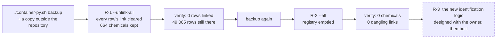

[← README](../../README.md) · [Handbook](../HANDBOOK.md) · [Glossary](../00-glossary.md) · [← Phase 05b](phase-05b-reproducible-builds-and-ci.md)

# Phase R — The registry reset: unlink everything, empty the registry, start again

**Version shipped:** 2.5.0 (the tools; the reset itself is an operation, run by the owner) · **Date:** 2026-09-08 · **Status:** in progress — R-1 built and tested; R-1 and R-2 wait on the owner's go; R-3 waits on the owner's description
**Prerequisites:** [Phase 04](phase-04-template-ingestion.md) for what identification is; the [playbook](../10-user-playbook.md) Parts 4–6 for the registry as it stands; on the VM, a backup you have copied outside the repository.
**Learning goal:** you understand what a link between a measurement and a compound is, where it is stored, why removing it is safe and reversible while deleting a compound is not, and how a data operation is made *provably dry* before it is made real.
**Deliverable:** two new modes on the removal script — `--unlink-all` and `--all` — each gated on `--apply`, batched, and covered by the script's first automated tests; a written procedure for the two steps on production; the registry emptied so that the new identification logic starts clean.

---

## Contents

1. [Why this phase exists](#why-this-phase-exists)
2. [What a link is, and where it lives](#what-a-link-is-and-where-it-lives)
3. [What we built](#what-we-built)
4. [Step 1 — Prove the dry run is dry](#step-1--prove-the-dry-run-is-dry)
5. [Step 2 — R-1: unlink every row, on production](#step-2--r-1-unlink-every-row-on-production)
6. [Step 3 — R-2: remove every chemical, on production](#step-3--r-2-remove-every-chemical-on-production)
7. [Step 4 — R-3: the new identification logic](#step-4--r-3-the-new-identification-logic)
8. [Checkpoint](#checkpoint)
9. [What this phase deliberately did not do](#what-this-phase-deliberately-did-not-do)
10. [Publish](#publish)

---

## Why this phase exists

The registry holds 664 compounds. Most were created by the identification
job from the screening export, under rules that are about to change: the
owner has a different logic in mind for deciding what a compound *is*. A
registry built under one set of rules and corrected under another would be
half one thing and half the other, and nobody could say which entries to
trust. It is cleaner to start again: detach every measurement from its
compound, empty the registry, and let the new logic rebuild it.

*Everyday version:* a library that catalogued its books under one scheme
and is switching to another. You do not re-label a few shelves; you take
every card out of the drawer, keep the books exactly where they are, and
re-catalogue under the new scheme. The books are the measurements; the cards
are the links; the drawer is the registry.

Two things make this safe rather than reckless:

- **The measurements are never touched.** A screening row keeps every value
  its source file had, including the compound *name* the laboratory wrote.
  Only the pointer to a registry entry is cleared.
- **A backup precedes each step, and each step is run twice:** once as a
  report that writes nothing, once for real.



---

## What a link is, and where it lives

When a screening row has been identified, it carries the identifier of a
registry entry, such as `CHEM-000042`. That identifier is stored **twice**,
on purpose: once inside the row's stored document (the truth, see
[the one design rule](../02-architecture.md#the-one-design-rule-everything-else-follows-from))
and once in an indexed column beside it (so that "every result for this
compound" is a fast lookup). Unlinking must clear both, or the two would
disagree and a later index rebuild would resurrect the link.


The same is true of samples and toxicology studies; production holds none
today, but the script treats all three the same way.

---

## What we built

| Piece | What it does | Where |
|---|---|---|
| `--unlink-all` | Clears the link on every screening, sample and toxicology row; keeps every chemical entry. Step R-1 | `backend/scripts/remove_chemicals.py` |
| `--all` | Unlinks every row, then deletes every chemical entry. Step R-2 | same |
| Batched commits | 5,000 rows per commit with a progress line, because one transaction per row on a 116 MB file once looked like a hang (lesson 18) | same |
| `run(argv, db)` | The script's logic callable from a test with a supplied session, so it can be exercised without a container | same |
| A latent crash fixed | A sample links through a list of chemical identifiers in its document, not a column; the script assumed a column and would have failed on the first sample. Found by the first test (lesson 30) | same |
| First tests | Six cases: the report writes nothing; removing one entry unlinks only its rows; `--unlink-all` clears column *and* document and keeps chemicals; `--all` empties the registry and the rows keep their source names; the job-only selector; nothing matching is an error | `backend/tests/test_remove_chemicals.py` |
| Buttons on the Screening page | A link or unlink icon on each row, *Link to a chemical…* and *Unlink* for ticked rows, *Unlink all rows…* with typed confirmation; backed by `POST /api/screening/link` and `/unlink` | `client/src/pages/ScreeningView.jsx`, `backend/app/routers/screening.py` |
| The procedure | Below, and in [`09-chemical-identification.md` → Resetting the registry](../09-chemical-identification.md#resetting-the-registry) | — |

---

## Step 1 — Prove the dry run is dry

**What:** run both reset modes without `--apply`, on any instance, and show
that nothing changed.

**How (on the VM, or on a Mac with data loaded; `docker` for `podman` if that is your runtime):**

```bash
curl --noproxy '*' -sSk https://localhost:49160/api/stats | head -c 120; echo
podman exec crucible-py python /app/backend/scripts/remove_chemicals.py --unlink-all
podman exec crucible-py python /app/backend/scripts/remove_chemicals.py --all
curl --noproxy '*' -sSk https://localhost:49160/api/stats | head -c 120; echo
```

**Why:** lesson 17 is a "dry run" that had already written 1,897 rows before
its closing rollback. The only proof a report mode is dry is the same counts
before and after. The automated test does this on a throwaway database; this
step does it on the real one.

**You should see:** each report print `REGISTRY RESET, step …`, the number
of rows it *would* unlink (`screening 43399` on production today), and
`Report only — nothing written.`; and the two stats lines identical.

---

## Step 2 — R-1: unlink every row, on production

**What:** clear every link; keep every chemical.

**How (VM production folder, only after the owner's "go"):**

```bash
cd ~/work/Pandora_toolbox/nr-nips-crucible
./container-py.sh backup
cp "$(ls -t backups/crucible-*.db | head -1)" ~/data-backup-$(date +%Y%m%d)-before-R1.db
podman exec crucible-py python /app/backend/scripts/remove_chemicals.py --unlink-all --apply
curl --noproxy '*' -sSk https://localhost:49160/api/screening/columns | python3 -c "import sys,json; d=json.load(sys.stdin); print('identified:', d.get('identified'))"
./verify-deploy.sh https://localhost:49160
```

**Why:** the backup outside the repository is the undo button; the report
has already been proven dry; the two checks afterwards say what changed.

**You should see:** progress lines every 5,000 rows, then
`Unlinked 43399 rows. All 664 chemical entries kept.`; `identified: 0`; and
`16 passed, 0 failed` — the "identification progress reported" check reports
`0 rows linked`, which is now the intended state.

**The same step from the browser:** on the Screening page, next to the count
of linked rows, **Unlink all rows…** opens a confirmation that asks you to
type `UNLINK ALL`, then calls `POST /api/screening/unlink` with `all: true`
— the same operation, the same outcome, no terminal needed. Take the backup
first either way.

**If instead:** the run stops part-way — it is safe to re-run; rows already
unlinked are simply reported as not linked. **If instead:** you want it back —
`./container-py.sh restore ~/data-backup-<date>-before-R1.db`.

---

## Step 3 — R-2: remove every chemical, on production

**What:** empty the registry.

**How (only after a second, separate "go"):**

```bash
./container-py.sh backup
cp "$(ls -t backups/crucible-*.db | head -1)" ~/data-backup-$(date +%Y%m%d)-before-R2.db
podman exec crucible-py python /app/backend/scripts/remove_chemicals.py --all --apply
curl --noproxy '*' -sSk https://localhost:49160/api/stats | head -c 60; echo
./verify-deploy.sh https://localhost:49160
```

**You should see:** `Removed 664 entries, unlinked 0 rows. 0 chemicals remain.`
(zero unlinked because R-1 already did that), `{"chemicals":{"total":0,…`,
and the post-deploy checks passing, including "no dangling chemical links".

---

## Step 4 — R-3: the new identification logic

Not designed yet. The owner will describe the rule; it is written down in
[`09-chemical-identification.md`](../09-chemical-identification.md) and
agreed *before* any code, because the last logic was changed once by
reasoning alone and registered 19 compounds with another substance's
chemistry (lesson 25).

---

## Checkpoint

For the tools (this commit):

```bash
cd backend && .venv/bin/pytest -q tests/test_remove_chemicals.py && cd ..   # expect: 6 passed
```

For R-1 and R-2, the outputs quoted in Steps 2 and 3, on production.

---

## What this phase deliberately did not do

- **Run anything on production.** The tools are built and tested; each step
  runs only on the owner's explicit go, after a backup.
- **Fix the delete endpoint.** After R-2 no row points at anything, so the
  orphaning behaviour has nothing to orphan; the endpoint change remains on
  the roadmap for when the registry is rebuilt.
- **Re-propose the 22 removed compounds.** Superseded: the new logic
  re-identifies everything.

---

## Publish

The tools ship as the v2.5.0 commit (2026-09-08). The scripts live inside the
image, so the VM deploy **rebuilds**, with a backup first, per
[`03-git-workflow.md` → Flow A](../03-git-workflow.md#4-flow-a---a-change-from-start-to-finish).
R-1 and R-2 are operations, recorded in the handbook's status box when done.

**Last Updated:** September 8, 2026
