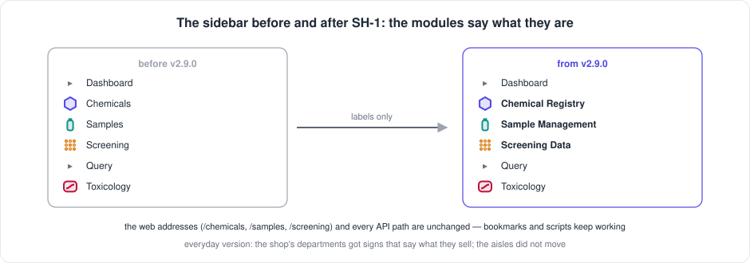

[← README](../../README.md) · [Handbook](../HANDBOOK.md) · [Glossary](../00-glossary.md) · [← Phase R](phase-r-registry-reset.md)

# Phase SH-1 — Module names: say what each part of the application is

**Version shipped:** 2.9.0 · **Date:** 2026-09-08 · **Status:** complete
**Track:** SH, the shared spine — the first phase named by its track code ([roadmap](../05-roadmap.md#sh--shared-spine))
**Prerequisites:** a setup guide completed for your platform; for the server, the deploy loop in [`03-git-workflow.md`](../03-git-workflow.md). Nothing else: this is the smallest phase in the repository and a good first one to follow end to end.
**Learning goal:** you understand what a *module* is in this application, the difference between a label and an address, why a rename that touches nine files is still a "small" change, and how a change to the web client reaches the server (it needs a rebuild, where a document change does not).
**Deliverable:** the sidebar, the page headings, the dashboard tiles, the interactive architecture page and every document call the three data modules **Chemical Registry**, **Sample Management** and **Screening Data**; every web address and API path is unchanged.



---

## Contents

1. [Why this phase exists](#why-this-phase-exists)
2. [What a module is, and what a label is not](#what-a-module-is-and-what-a-label-is-not)
3. [What we changed](#what-we-changed)
4. [Step 1 — Find every place a name appears](#step-1--find-every-place-a-name-appears)
5. [Step 2 — Change the labels in the web client](#step-2--change-the-labels-in-the-web-client)
6. [Step 3 — Change the documents that name them](#step-3--change-the-documents-that-name-them)
7. [Step 4 — Build the client and see it](#step-4--build-the-client-and-see-it)
8. [Step 5 — Run the checks](#step-5--run-the-checks)
9. [Checkpoint](#checkpoint)
10. [What this phase deliberately did not do](#what-this-phase-deliberately-did-not-do)
11. [Publish](#publish)

---

## Why this phase exists

The sidebar said *Chemicals*, *Samples*, *Screening*. Those are the names of
the *things*, not of what the application *does* with them. The first is a
registry — one entry per compound, the anchor every other record points at.
The second manages physical vials. The third holds laboratory screening
data. Saying so in the sidebar tells a newcomer what each door leads to
before they open it, and it matches the names the plan now uses for its
tracks ([`05-roadmap.md`](../05-roadmap.md#the-six-tracks)): the Chemical
Registry track is the work on the Chemical Registry module.

*Everyday version:* a shop whose departments were signed "Bread", "Milk",
"Tins" now has signs that say "Bakery", "Dairy", "Tinned goods". Nothing
moved; the signs now say what the department *is*.

It is also the right first phase after the plan was reorganised: hours of
work, no data touched, and every later document uses the final names.

---

## What a module is, and what a label is not

A **module** is one section of the application: one entry in the sidebar,
one kind of record, one set of pages (a table and an upload form). There are
five: the Chemical Registry, Sample Management, Screening Data, Toxicology
and the Query console. Each is also a track in the plan.

Two things carry a module's name, and only one of them changed:

| | What it is | Example | Changed? |
|---|---|---|---|
| **Label** | The words a person reads: in the sidebar, at the top of a page, on a dashboard tile | *Chemical Registry* | **Yes** |
| **Address** | Where the browser goes, and where scripts send requests | `/chemicals`, `/api/chemicals` | **No** |

*Everyday version:* the sign over the door versus the street address. You can
repaint the sign; the post still arrives.

Keeping the addresses is what makes this phase safe. A bookmark to
`/screening` still opens the screening table. A script that calls
`/api/chemicals` still works, and the tests that lock the API contract
([`02-architecture.md` → Testing](../02-architecture.md#testing)) did not
need to change. Renaming the addresses would have been a different, larger
phase with a compatibility story.

---

## What we changed

| Piece | Before | After | Where |
|---|---|---|---|
| Sidebar group | Chemicals | **Chemical Registry** | `client/src/components/Layout.jsx` |
| Sidebar group | Samples | **Sample Management** | same |
| Sidebar group | Screening | **Screening Data** | same |
| Sidebar entries | View Chemicals · Upload Screening (ELN) | View Chemical Registry · Upload Screening Data (ELN) | same |
| Page heading | Chemicals | Chemical Registry | `client/src/pages/ChemicalsView.jsx` |
| Page heading | Samples | Sample Management | `client/src/pages/SamplesView.jsx` |
| Dashboard tiles | Chemicals · Samples · Screening Records | Chemical Registry · Sample Management · Screening Data | `client/src/pages/Dashboard.jsx` |
| Interactive architecture page | the three boxes and two sentences | the new names | `docs/architecture-interactive.html` |
| Documents | every instruction of the form *Chemicals → Upload* | the new names | README module table, playbook, identification guide, API reference and cookbook, handbook, phase R tutorial, architecture diagram |
| Glossary | — | a **Module** entry naming all five, with the old labels | `docs/00-glossary.md` |

Not changed, on purpose: *Query* and *Toxicology* (not asked for, and their
labels already say what they are); the dashboard's *Upload Chemicals* and
*Upload Samples* buttons and the *Capacity* bars, which name the *records*
being counted, not the module; the browser tab title, which is the product
name; every address.

---

## Step 1 — Find every place a name appears

**What:** list every file that shows one of the three labels to a person.

**How:**

```bash
cd ~/Documents/Work/pandora_toolbox/nr-nips-crucible
grep -rn "'Chemicals'\|'Samples'\|'Screening'\|>Chemicals<\|>Samples<" client/src
grep -rn "Chemicals →\|Screening →\|Samples →\|Screening page\|Chemicals module" README.md docs --include=*.md
```

**Why:** a rename that misses one place leaves the documentation telling the
reader to click something that no longer exists — the failure mode
[lesson 15](../11-lessons-learned.md) records. Search first; edit second.

**You should see:** the sidebar array in `Layout.jsx`, one heading each in
the chemicals and samples views, the tile names in the dashboard, and a
dozen document lines of the shape *Chemicals → Upload Chemicals (ELN)*.

**If instead** `grep` prints nothing for the client, you are not at the
repository root: the paths above are relative to it.

---

## Step 2 — Change the labels in the web client

**What:** edit the strings, nothing else.

**How:** open `client/src/components/Layout.jsx` and change the three
`name:` values of the sidebar groups; open the two view files and change
their `<h1>` text; open `Dashboard.jsx` and change the three tile names. The
`href` values stay as they are.

**Why:** the sidebar is one array of objects, each with a `name` (the label)
and an `href` (the address). Changing `name` and leaving `href` is the whole
idea of this phase in one line of code.

**You should see** `git diff --stat client` reporting four files.

**If instead** you are tempted to rename the `href` or the route in
`App.jsx`: don't. That is an address, and changing it breaks bookmarks and
the API tests.

---

## Step 3 — Change the documents that name them

**What:** every instruction that tells the reader where to click.

**How:** the grep from Step 1, then edit each line. Add a glossary entry for
*Module* so the old labels are recorded, and update the interactive
architecture page's three boxes (they are SVG text inside the HTML file;
the boxes are 180 pixels wide and the new names fit at the existing font
sizes).

**Why:** the playbook is written to be followed literally. *Open Screening →
View Screening Data* is wrong the moment the sidebar says *Screening Data*.

**You should see** the documents in the table above in `git diff --stat`.

---

## Step 4 — Build the client and see it

**What:** turn the edited source into the files the server serves, and look.

**How, on the Mac:**

```bash
cd ~/Documents/Work/pandora_toolbox/nr-nips-crucible/client && npm run build && cd ..
grep -o "Chemical Registry" client/dist/assets/*.js | head -1     # the label is in the built bundle
./container-py.sh rebuild                                          # the image copies client/dist
curl --noproxy '*' -sS http://localhost:49160/api/stats | head -c 80; echo
```

Then open `http://localhost:49160` and read the sidebar.

**Why:** the browser never reads `client/src`. Vite compiles it into
`client/dist`, and the container image copies `client/dist` at build time.
So a client change needs *both* a build and a rebuild before anyone sees it
— unlike a document change, which the server never touches. This is the
rule in [`03-git-workflow.md`](../03-git-workflow.md): rebuild only when
something the app executes changed; `client/` counts.

**You should see** `✓ built in …` from Vite, one `Chemical Registry` match,
the container healthy, and the sidebar reading *Chemical Registry · Sample
Management · Screening Data*.

**If instead** `npm run build` says `vite: command not found`, the
dependencies are not installed on this machine: `cd client && npm ci` once
(the [macOS guide](../01-setup-macos.md) V-checks cover it), then build
again. If the sidebar still shows the old names after the rebuild, the
browser is caching the old bundle: reload with the cache bypassed
(Shift-reload).

**On Windows:** the same commands in Git Bash or WSL 2, per the
[Windows guide](../01-setup-windows.md); `npm` is the same on every platform.

---

## Step 5 — Run the checks

**What:** the same gates as every phase.

**How:**

```bash
cd ~/Documents/Work/pandora_toolbox/nr-nips-crucible
cd backend && .venv/bin/ruff check . && .venv/bin/pytest -q && cd ..
python3 check-links.py
python3 docs/img/make_figures.py && git status --short docs/img   # figures regenerate identically
./check-public-safe.sh
```

**Why:** the API tests prove the addresses did not change; the link check
proves no document points at a heading that moved; the figure script proves
the new figure is deterministic; the gate proves nothing internal slipped in.

**You should see** `All checks passed!`, `105 passed`, `links: clean`, only
the intentionally changed figures listed, and `✓ SAFE TO PUSH`.

---

## Checkpoint

```bash
grep -c "Chemical Registry\|Sample Management\|Screening Data" client/src/components/Layout.jsx   # expect: 8: six sidebar lines, plus the two product-name lines that already said "Sample Management"
grep -rn "'Chemicals'\|'Samples'\|'Screening'" client/src | wc -l                                  # expect: 0
```

And in the browser, the sidebar reads *Dashboard · Chemical Registry ·
Sample Management · Screening Data · Query · Toxicology*.

---

## What this phase deliberately did not do

- **Rename any address.** `/chemicals`, `/samples`, `/screening` and every
  `/api/...` path are unchanged. Bookmarks and scripts keep working.
- **Rename *Query* or *Toxicology*.** Not asked for; their labels already
  say what they are. The track names (*Query Console*) are the plan's, not
  the sidebar's.
- **Touch any data or any test.** The suite is 105 before and after.
- **Change the product name** in the browser tab.

---

## Publish

Ships as v2.9.0. The client changed, so the server deploy **rebuilds**, with
a backup first, per [`03-git-workflow.md` → Flow A](../03-git-workflow.md#4-flow-a---a-change-from-start-to-finish).
The handbook's status box and build log, the roadmap's SH row, the release
notes and this tutorial are in the same commit.

**Last Updated:** September 8, 2026
