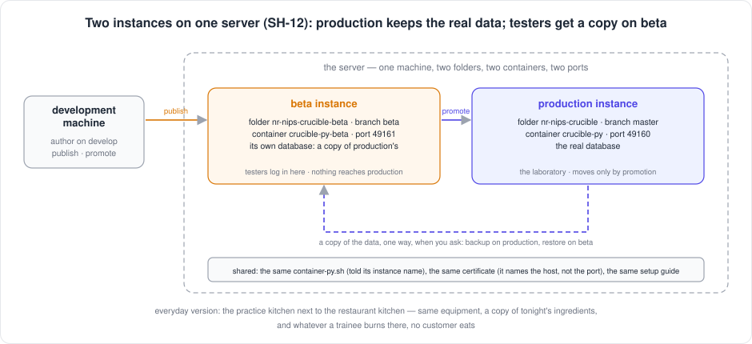
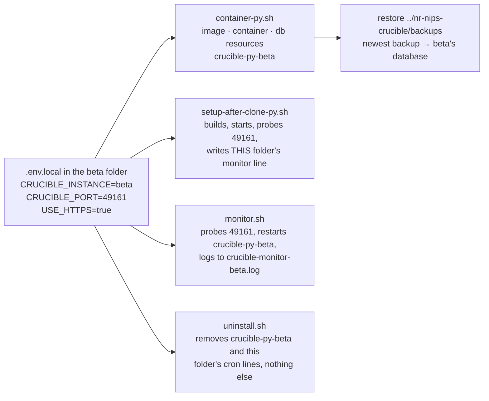
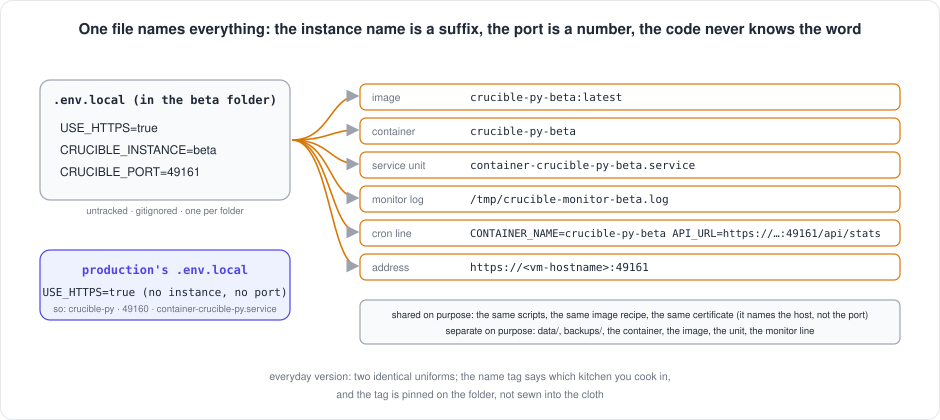

[← README](../../README.md) · [Handbook](../HANDBOOK.md) · [Glossary](../00-glossary.md) · [← Phase CR-11](phase-cr-11-counts-and-tags.md)

# Phase SH-12 — A beta instance for user testing: two copies of the application on one server

**Version shipped:** 2.20.0 (2.20.2 on the server) · **Date:** 2026-09-21, on the server 2026-09-22 · **Status:** complete (rehearsed end to end on a Mac; set up on the server by the operator the next morning, two containers side by side)
**Track:** SH, the shared spine ([roadmap](../05-roadmap.md#sh--shared-spine)); the owner's request of 2026-09-21, first of everything else so that end users can test without touching production.
**Prerequisites:** a setup guide completed for your platform ([macOS](../01-setup-macos.md), [RHEL 8](../01-setup-rhel8.md) or [Windows](../01-setup-windows.md)); the two-repository workflow read once ([`03-git-workflow.md`](../03-git-workflow.md)); the specification and its decisions ([`14-beta-instance.md`](../14-beta-instance.md), [ADR 0002](../adr/0002-beta-instance.md)).
**Learning goal:** you understand what an *instance* of an application is and why two of them on one machine must share nothing at run time; how one untracked file names every resource of an instance; why the `beta` branch now means something; and how a change reaches the testers the same day and the laboratory only when someone decides.
**Deliverable:** `container-py.sh`, `setup-after-clone-py.sh`, `monitor.sh` and `uninstall.sh` read `CRUCIBLE_INSTANCE` and `CRUCIBLE_PORT` from the folder's `.env.local`, so a second checkout runs as `crucible-py-beta` on port 49161 beside production and can never touch it; `restore` accepts a folder and takes its newest backup, which is how beta is refreshed from production in one line; the git workflow gains two moments — *publish* to beta, *promote* to production — written out for every machine; the RHEL 8 guide gains the section that sets the beta instance up. No application code changed: the suite stays at 145.



---

## Contents

1. [Why this phase exists](#why-this-phase-exists)
2. [The words you need](#the-words-you-need)
3. [What we built](#what-we-built)
4. [Step 1 — One file names everything](#step-1--one-file-names-everything)
5. [Step 2 — The second folder on the server](#step-2--the-second-folder-on-the-server)
6. [Step 3 — Give beta a copy of the data, one way](#step-3--give-beta-a-copy-of-the-data-one-way)
7. [Step 4 — Survive a reboot, and be watched](#step-4--survive-a-reboot-and-be-watched)
8. [Step 5 — Two moments in the workflow](#step-5--two-moments-in-the-workflow)
9. [Step 6 — Rehearse it on a laptop first](#step-6--rehearse-it-on-a-laptop-first)
10. [Checkpoint](#checkpoint)
11. [How to test it, by every route](#how-to-test-it-by-every-route)
12. [What this phase deliberately did not do](#what-this-phase-deliberately-did-not-do)
13. [Publish](#publish)

---

## Why this phase exists

The application is about to be put in front of end users. They will
upload files, link rows, merge entries, delete compounds, and — once the
login ships — log in and out, forget passwords and try things nobody
planned. Every one of those actions today lands in the one database the
laboratory trusts.

*Everyday version:* you would not train a new cook during the dinner
service, in the only kitchen, with tonight's ingredients. You build a
second kitchen next door with the same equipment, hand over a copy of the
ingredients, and let the trainee burn what they like. When a new recipe
works there, you bring it into the restaurant — deliberately, on a day you
choose.

The second kitchen is the **beta instance**. It costs one more folder on
the server, three lines in a file, and one extra step in the workflow.
Everything else already existed and only had to learn its own name.

---

## The words you need

| Term | Plain words | Everyday version |
|---|---|---|
| **Instance** | One running copy of the application: a folder, a container, a port, a database | One kitchen, fully equipped |
| **Instance name** | The word appended to everything an instance owns — `beta` makes `crucible-py-beta`; no name means the default, `crucible-py` | The name tag on the kitchen door |
| **`.env.local`** | The untracked file in a folder that holds that machine's settings; the instance name and the port live there | The sticky note on the fridge that says which kitchen this is |
| **Port** | The numbered door a program answers on; production 49160, beta 49161 | Two front doors on one building |
| **Branch** | A named line of history in git; `develop` is where changes are written, `beta` is what the beta instance runs, `master` is what production runs | Three copies of the recipe book: the draft, the one the trainee cooks from, the one the restaurant cooks from |
| **Publish** | Push a change to `develop` and `beta`; the beta instance pulls it the same day | Handing the trainee the new recipe |
| **Promote** | Push `beta` to `master`, by hand, when the testers agree; production pulls it | Putting the recipe on the restaurant's menu |
| **Restore** | Stop an instance, replace its database with a backup file, start it again | Swapping the trainee's ingredients for a fresh copy of tonight's |
| **Service unit** | The recipe card that tells the server to start a container at boot; one per instance, named after its container | The morning checklist pinned in each kitchen |
| **Monitor line** | The scheduled command that checks one instance every five minutes and restarts it if it stops answering; one per instance | The smoke alarm in each kitchen |

Every term is also in the [glossary](../00-glossary.md).

---

## What we built



| Piece | File | What changed |
|---|---|---|
| The instance name | `container-py.sh` | Reads `CRUCIBLE_INSTANCE` and `CRUCIBLE_PORT` from `.env.local` (the environment wins); appends the name to the image, the container and the optional Postgres container, network and volume; refuses a name that is not lowercase letters, digits and hyphens; prints the instance on every start and in `help` and `status`; `restore` accepts a folder and takes its newest `crucible-*.db` |
| The one-shot setup | `setup-after-clone-py.sh` | Names the image it builds, probes the instance's port, writes a monitor line that names this folder's container and port, and replaces only this folder's previous line |
| The monitor | `monitor.sh` | Reads the folder's `.env.local` when run by hand, so `./monitor.sh` in the beta folder probes and restarts beta; one log file per instance; the container's name in every log line |
| The uninstaller | `uninstall.sh` | Reads `.env.local`; removes this instance's container, image, service unit, Quadlet file, monitor log and only the cron lines that name this folder; reports how many lines for other checkouts it left alone |
| The workflow | [`03-git-workflow.md`](../03-git-workflow.md) | Four folders; Flow A publishes to `develop` and `beta`; a new promotion step moves `beta` to `master`; the beta folder's pull and rebuild |
| The server guide | [`01-setup-rhel8.md` §8](../01-setup-rhel8.md#8-a-second-instance-for-user-testing-beta) | Sets the beta instance up from an empty folder to a watched, reboot-proof copy of production |
| The figures | `docs/img/fig_publish_promote.svg`, `docs/img/fig_instance_name.svg` | The two moments; the one file that names everything |

**What did not change:** the application. No Python, no React, no
Dockerfile, no migration. The image beta runs is built from the same
recipe as production's; the word *beta* appears nowhere in the code.

---

## Step 1 — One file names everything

**What:** tell a checkout which instance it is.

**How:** in the folder that is to run beta, write the untracked settings
file. On the server it also carries the certificate settings production's
file already has (section 3.2 of the [RHEL 8 guide](../01-setup-rhel8.md#32-configure-the-certificate-source)).

```bash
# ▶ any machine — in the folder that will run the SECOND instance
cat > .env.local <<'EOF'
CRUCIBLE_INSTANCE=beta
CRUCIBLE_PORT=49161
EOF
./container-py.sh help | grep Usage
```

**Why a file and not a flag.** A flag has to be remembered on every
command by every person, and the day someone forgets `--instance beta` on
a `rebuild`, production is replaced. A file in the folder is read by every
script, every time, by whoever runs it — including the cron job and the
service unit, which never read a person's memory. The environment still
wins over the file, so a one-off `CRUCIBLE_INSTANCE=beta ./container-py.sh status`
from any folder works too.

**Why a suffix.** The image, the container and the database container are
all named `crucible-py` plus the instance name. Nothing else about them
differs, so a second instance is the same recipe with a different label,
and a machine that never sets a name is exactly what it was before this
phase — on Windows, macOS and RHEL 8 alike.



**You should see:**

```
Usage: ./container-py.sh [command]        (runtime: podman · instance: beta → crucible-py-beta, port 49161)
```

**What it means:** every command this script runs from this folder will
create, start, stop, back up or remove `crucible-py-beta` on port 49161,
and nothing named `crucible-py`.

**If instead** `✗ CRUCIBLE_INSTANCE='Beta Test' must be lowercase letters, digits and hyphens, e.g. beta`:
the name is used inside container and file names, which do not allow
spaces or capitals; the script refuses rather than guess (exit code 1).

**If instead** the `Usage` line says `instance: default → crucible-py, port 49160`
in a folder where you wrote the file: you are not in that folder
(`pwd`), or the file is named differently (`ls -la .env.local`).

---

## Step 2 — The second folder on the server

**What:** a complete second checkout of the private repository on the
server, on the `beta` branch, set up by the same one-shot script.

**How:** the full walk, with expected output at every step, is
[`01-setup-rhel8.md` §8](../01-setup-rhel8.md#8-a-second-instance-for-user-testing-beta).
In outline:

```bash
# ▶ VM
cd ~/work/Pandora_toolbox
git clone https://github.com/nestle-it/nr-nips-crucible.git nr-nips-crucible-beta
cd nr-nips-crucible-beta
git switch beta
chmod +x *.sh
cat > .env.local <<'EOF'
CERT_SOURCE=<cert-store-path>
USE_HTTPS=true
CRUCIBLE_INSTANCE=beta
CRUCIBLE_PORT=49161
EOF
SETUP_MONITOR=y ./setup-after-clone-py.sh
```

**Why a second clone and not a second container from the same folder.**
A folder holds one checkout of one branch, one `data/`, one `backups/`,
one `.env.local`. Two instances need two of each, and the beta instance
must be able to run a commit production does not have yet. A second
folder is the only arrangement that gives all of that with no new code.
It is also the arrangement the workflow already knew: the mirror folder
and the production folder are two checkouts of the same repository with
two jobs ([`03-git-workflow.md` §1](../03-git-workflow.md#1-the-two-repositories)).

**Why the same certificate.** The certificate names the *host*, not the
port. One certificate serves `https://<vm-hostname>:49160` and
`https://<vm-hostname>:49161` alike, so the setup script copies the same
pair from the corporate store into the beta folder's `certs/` and the
browser shows a padlock on both.

**You should see** the setup script open with

```
Instance: beta — image and container crucible-py-beta, port 49161
          (from .env.local or the environment; docs/14-beta-instance.md)
```

then `Step 2: Building the crucible-py-beta image`, `✓ Container started with HTTPS`
with the line `instance: beta · container: crucible-py-beta · image: crucible-py-beta:latest`,
`✓ API is answering:` followed by a stats line with `"chemicals":{"total":0`
(beta starts empty), and the monitor line naming `CONTAINER_NAME=crucible-py-beta`
and `https://localhost:49161`.

**What it means:** two containers now run on the server. `podman ps`
lists `crucible-py` on 49160 and `crucible-py-beta` on 49161, each from
its own image. (Beta's `PORTS` column also shows a bare `49160/tcp`
without an arrow: the image declares that port and the container does
not publish it. It is not listening there — `podman port crucible-py-beta`
prints only `49161/tcp -> 0.0.0.0:49161`.)

**If instead** `./setup-after-clone-py.sh` builds an image called
`crucible-py` and probes 49160: the `.env.local` was written after the
`cd`, or into the wrong folder. `cat .env.local` in the beta folder.

**If instead** the build stops at a port clash (`address already in use`):
`CRUCIBLE_PORT` is missing from the file and both instances asked for
49160. Add it and `./container-py.sh rebuild`.

---

## Step 3 — Give beta a copy of the data, one way

**What:** production's data, on beta, without production ever being
written.

**How:**

```bash
# ▶ VM — production folder: a consistent copy while the app keeps running
cd ~/work/Pandora_toolbox/nr-nips-crucible
./container-py.sh backup

# ▶ VM — beta folder: take production's NEWEST backup (a folder, not a file — no timestamp to copy)
cd ~/work/Pandora_toolbox/nr-nips-crucible-beta
./container-py.sh restore ../nr-nips-crucible/backups
curl --noproxy '*' -sSk https://localhost:49161/api/stats
```

**Why a backup and not a copy of the file.** The database is in use.
Copying a live SQLite file with `cp` can catch it mid-write and produce a
file that opens and is quietly wrong. `backup` uses SQLite's online-backup
mechanism inside the running container and writes a coherent snapshot
([`07-operations.md` → Backup and restore](../07-operations.md#backup-and-restore)).

**Why `restore` takes a folder now.** The old form,
`restore backups/crucible-20260921-184258.db`, asks a person to read a
timestamp off one listing and type it into another command — the kind of
step that goes wrong at 8 am. Given a folder, `restore` picks the newest
`crucible-*.db` in it and says which one it took. The old form still
works. Nothing is ever written to the folder it reads from.

**Why one way.** The restore runs in the beta folder against beta's
`data/`. There is no command that writes into production's `data/` from
anywhere but production's own folder, and this phase added none.
Production's database is only ever written by production.

**You should see:**

```
Newest backup in ../nr-nips-crucible/backups: crucible-20260921-184258.db
Stopping container 'crucible-py-beta' before restore...
  (current database kept as data/crucible.db.pre-restore)
✓ Restored crucible-20260921-184258.db → data/crucible.db  (instance: beta)
Container already exists. Starting...
✓ Container started successfully
  instance: beta · container: crucible-py-beta · image: crucible-py-beta:latest
```

and, from the `curl`, `"chemicals":{"total":12539` — the same number as
production's. Open `https://<vm-hostname>:49161/chemicals`: the strip
reads *All compounds 12,539* and the header's right-hand corner says
**Running on port 49161**.

**What it means:** the testers now judge the real registry, and whatever
they do to it stays on port 49161. Run the same two commands again
whenever you want them back on a clean copy; the previous beta database
is kept as `data/crucible.db.pre-restore` for one restore.

**If instead** `✗ No crucible-*.db backup found in folder ../nr-nips-crucible/backups`:
production has never been backed up, or you gave the wrong folder. Run
`./container-py.sh backup` in the production folder first.

---

## Step 4 — Survive a reboot, and be watched

**What:** a service unit and a monitor line for the second container, as
production has for the first.

**How:** the setup script already installed the monitor line if you
answered `y`. The service unit is the same three commands as section 4.2
of the RHEL 8 guide with the beta container's name:

```bash
# ▶ VM — beta folder, with crucible-py-beta running
mkdir -p ~/.config/systemd/user
podman generate systemd --new --name crucible-py-beta --files
mv container-crucible-py-beta.service ~/.config/systemd/user/
systemctl --user daemon-reload
systemctl --user enable --now container-crucible-py-beta.service
crontab -l | grep monitor.sh
```

**Why one unit and one line per instance.** A unit starts one named
container; a monitor line probes one address and restarts one named
container. Neither can be shared between two instances without one of
them being wrong. Both take their name from the container, so they follow
the instance name without anyone typing *beta* twice.

**Why the setup script only replaces its own line.** Before this phase,
re-running the setup removed every monitor line in your crontab and wrote
one. On a server with two checkouts that would have deleted production's
monitor the moment beta was set up. The line is now replaced only when it
names this folder — and `uninstall.sh` applies the same rule, matching the
path *with what follows it*, because `…/nr-nips-crucible-beta` begins with
`…/nr-nips-crucible` and a bare prefix match from the production folder
would have removed beta's lines too (lesson 35).

**You should see** from `crontab -l | grep monitor.sh` **two** lines, one
ending `CONTAINER_NAME=crucible-py API_URL=https://localhost:49160/api/stats ./monitor.sh`
and one ending `CONTAINER_NAME=crucible-py-beta API_URL=https://localhost:49161/api/stats ./monitor.sh`;
from `systemctl --user status container-crucible-py-beta.service`,
`active (running)`; and after the first five minutes,
`tail -2 /tmp/crucible-monitor-beta.log` showing
`✓ crucible-py-beta is healthy` while `/tmp/crucible-monitor.log` keeps
reporting on `crucible-py`.

**If instead** the two monitor lines name the same container: the beta
folder's `.env.local` was missing when the setup ran. Fix the file and
re-run `SETUP_MONITOR=y ./setup-after-clone-py.sh` in the beta folder; it
replaces its own line only.

**If instead** `systemctl --user list-units 'container-crucible-py*'` lists
only beta: production's unit is *inactive*, not gone. Every
`./container-py.sh rebuild` recreates the container outside systemd, and the
unit stays enabled for the next boot. `list-units --all` shows it as
`loaded inactive dead`; that is the expected state between a rebuild and a
reboot (seen on the server on 2026-09-22).

---

## Step 5 — Two moments in the workflow

**What:** the one publish command becomes two moments.


**How:** the complete commands for every machine, with expected output,
are in [`03-git-workflow.md` → Flow A](../03-git-workflow.md#4-flow-a---a-change-from-start-to-finish).
The change, in one table:

| Moment | Mac | Mirror folder (VM) | Which instance pulls |
|---|---|---|---|
| **Publish** — every change | `git push origin develop develop:beta` | copy the content, then `git push origin develop develop:beta` | **beta**: `git switch beta && git pull --ff-only origin beta`, rebuild if code changed |
| **Promote** — when the testers agree | `git fetch origin && git push origin origin/beta:master` | `git fetch origin && git push origin origin/beta:master` | **production**: backup, `git pull --ff-only origin master`, rebuild if code changed |

**Why `beta` and not a fourth branch.** The branch already exists in both
repositories and was pushed with every publish; until today it always
equalled `master` and meant nothing. Giving it a meaning costs one
workflow step and no new branch.

**Why `origin/beta`.** Neither the Mac nor the mirror folder has a local
branch called `beta`: publishing pushes `develop` *to* the remote's `beta`,
so the branch lives on the remote and as the remote-tracking copy
`origin/beta`. That copy, after a `git fetch`, is what promotion pushes to
`master`. (A first attempt with `beta:master` failed with
`src refspec beta does not match any`; the documents were corrected in
v2.20.1.)

**Why promotion is by hand.** The whole point of a beta instance is that
someone looks before the laboratory gets a change. A promotion that ran
on a timer, or on a green test run, would be a second publish with extra
steps. It is one command, typed by a person, on a day they choose.

**Why beta is promoted as a whole.** `origin/beta:master` moves `master` to
whatever `beta` runs today — every change published since the last
promotion, together. There is no picking one change out of three. A
change that is not ready for production is not published to beta either;
a fix goes to beta first, is tested, and the whole is promoted. This is
the ordinary way of working with one line of history, and it keeps the
two instances' histories fast-forward only, as before.

**You should see** after a publish: the beta instance shows the change,
`git log -1 --oneline` in the production folder does **not**. After a
promotion: both do, and `git diff --stat beta master` in the mirror
folder prints nothing.

---

## Step 6 — Rehearse it on a laptop first

**What:** the whole phase, on one Mac (or Windows PC), before touching
the server. This is how SH-12 was tested: the production folder is the
ordinary checkout; the beta folder is a second copy in a temporary place.

**How:**

```bash
# ▶ MAC — the production copy runs as usual on 49160
cd ~/Documents/Work/pandora_toolbox/nr-nips-crucible
./container-py.sh start

# a second copy of the checkout, anywhere — here beside it
rsync -a --exclude .git --exclude node_modules --exclude data --exclude backups \
      --exclude certs --exclude .venv --exclude client/dist ./ ../nr-nips-crucible-beta/
cd ../nr-nips-crucible-beta
printf 'CRUCIBLE_INSTANCE=beta\nCRUCIBLE_PORT=49161\n' > .env.local
./container-py.sh build && ./container-py.sh start          # a few minutes the first time
podman ps --format 'table {{.Names}}\t{{.Status}}\t{{.Ports}}'  # Docker: docker ps …

# the one-way copy, then look at both
(cd ../nr-nips-crucible && ./container-py.sh backup)
./container-py.sh restore ../nr-nips-crucible/backups
open http://localhost:49160/chemicals http://localhost:49161/chemicals   # Windows: start …

# prove the rebuild rule, then clean the rehearsal up
podman images --format '{{.Repository}} {{.ID}}' | grep crucible          # note both IDs
./container-py.sh rebuild                                                # in the BETA folder
podman images --format '{{.Repository}} {{.ID}}' | grep crucible          # production's ID unchanged
./container-py.sh clean                                                  # removes crucible-py-beta only
cd .. && rm -rf nr-nips-crucible-beta
```

**Why rehearse.** Every bug this phase found — the setup removing every
monitor line, the uninstaller matching the other folder's path — was found
here, on a laptop, with two containers and a fake crontab, not on the
server. A laptop rehearsal costs ten minutes and nothing else.

**Why it works on every platform.** The scripts read a file and append a
word to a name. There is nothing Linux-specific in that; podman and
Docker both accept the names, and the Windows guide's Git Bash runs the
same scripts. The Windows walk is still marked *untested*
([SH-6](../05-roadmap.md#sh--shared-spine)); the Mac walk is what this
tutorial records.

**You should see** two rows from `podman ps`, `crucible-py` on
`127.0.0.1:49160` and `crucible-py-beta` on `127.0.0.1:49161`; two
browser tabs whose headers say **Running on port 49160** and **Running on
port 49161**, both with *All compounds 12,539* after the restore; the same
production image ID before and after the beta rebuild; and after `clean`,
`podman ps -a` and `podman images` listing only `crucible-py`.

---

## Checkpoint

```bash
# ▶ VM — from any folder
podman ps --format 'table {{.Names}}\t{{.Status}}\t{{.Ports}}'
curl --noproxy '*' -sSk https://localhost:49160/api/stats | head -c 60; echo
curl --noproxy '*' -sSk https://localhost:49161/api/stats | head -c 60; echo
(cd ~/work/Pandora_toolbox/nr-nips-crucible-beta && ./verify-deploy.sh https://localhost:49161 | tail -2)
(cd ~/work/Pandora_toolbox/nr-nips-crucible      && ./verify-deploy.sh https://localhost:49160 | tail -2)
```

**You should see:**

```
NAMES             STATUS                  PORTS
crucible-py       Up 3 days (healthy)     0.0.0.0:49160->49160/tcp
crucible-py-beta  Up 2 hours (healthy)    0.0.0.0:49161->49161/tcp, 49160/tcp
{"chemicals":{"total":12539,"max":15000},"samples":{"total":0
{"chemicals":{"total":12539,"max":15000},"samples":{"total":0
  16 passed, 0 failed
  Everything checks out.
  16 passed, 0 failed
  Everything checks out.
```

Two containers, two ports, two databases with the same counts because one
was copied from the other, sixteen checks passing on each. Production's
image ID, data and checks are what they were before the phase.

---

## How to test it, by every route

The left column is the server after §8 of the RHEL 8 guide; the right
column is the Mac rehearsal of Step 6 (HTTP, `127.0.0.1`, the real
export's numbers because the Mac copy holds it). Replace `podman` with
`docker` on a machine that uses Docker.

| Route | How | You should see (server) | Mac rehearsal |
|---|---|---|---|
| **Browser, which instance am I on** | open `https://<vm-hostname>:49161` and `https://<vm-hostname>:49160` in two tabs | the header's right-hand corner says **Running on port 49161** in one tab and **Running on port 49160** in the other; same sidebar, same pages | `http://localhost:49161` · `http://localhost:49160`, the same two headers |
| **Browser, the data is a copy** | Chemical Registry page on both | *All compounds 12,539 · One batch 12,533 · Several batches 6 · Batch rows 12,561* on both after a restore; delete a compound on beta → beta says 12,538, production still 12,539 | the same |
| **Browser, the padlock** | click the padlock on the 49161 tab | the certificate names `<vm-hostname>`, valid, the same as on 49160 | — (HTTP on the Mac) |
| **API, two answers** | `curl --noproxy '*' -sSk https://localhost:49160/api/stats` then `…:49161/api/stats` | both `{"chemicals":{"total":12539,…` after a restore; only beta's changes when a tester acts | `curl --noproxy '*' -sS http://localhost:4916{0,1}/api/stats` |
| **API, the whole registry** | `curl --noproxy '*' -sSk https://localhost:49161/api/chemicals/summary` | `{"total":12539,"one_batch":12533,"several_batches":6,"batch_rows":12561,…}` | the same |
| **Terminal, the script knows its instance** | in each folder: `./container-py.sh help \| grep Usage` | production: `instance: default → crucible-py, port 49160`; beta: `instance: beta → crucible-py-beta, port 49161` | the same |
| **Terminal, status** | `./container-py.sh status` in the beta folder | `Container status (runtime: podman · instance: beta · folder: …/nr-nips-crucible-beta):` then one row, `crucible-py-beta`, and the stats | the same with `127.0.0.1` |
| **Terminal, the one-way copy** | production folder `./container-py.sh backup`; beta folder `./container-py.sh restore ../nr-nips-crucible/backups` | `Newest backup in ../nr-nips-crucible/backups: crucible-<stamp>.db` … `✓ Restored … (instance: beta)`; production's stats unchanged before and after | the same |
| **Terminal, a refused name** | `CRUCIBLE_INSTANCE='Beta Test' ./container-py.sh help; echo $?` | `✗ CRUCIBLE_INSTANCE='Beta Test' must be lowercase letters, digits and hyphens, e.g. beta` then `1` | the same |
| **Terminal, the environment wins** | from the **production** folder: `CRUCIBLE_INSTANCE=beta CRUCIBLE_PORT=49161 ./container-py.sh status` | the status of `crucible-py-beta`, not of the folder's own instance | the same |
| **Terminal, the shortcut runs in the right container** | beta folder: `./container-py.sh script registry_summary.py` | `12539 compounds: 12533 with one batch, 6 with several; 12561 batch rows.` from beta's database | the same |
| **Podman / Docker, two of everything** | `podman ps -a`, `podman images \| grep crucible`, `podman port crucible-py-beta` | two containers, two images (`crucible-py`, `crucible-py-beta`, different IDs), `49161/tcp -> 0.0.0.0:49161` | `-> 127.0.0.1:49161` |
| **Podman / Docker, the long form** | `podman exec crucible-py-beta python /app/backend/scripts/registry_summary.py --json` | the summary JSON from beta's database | the same |
| **Podman / Docker, each container's own port** | `podman exec crucible-py sh -c 'echo $PORT'` · `podman exec crucible-py-beta sh -c 'echo $PORT'` | `49160` · `49161` | the same |
| **Podman / Docker, a beta rebuild leaves production alone** | note `podman images` IDs; beta folder `./container-py.sh rebuild`; `podman images` again | `crucible-py-beta`'s ID changes (or not, if nothing changed); `crucible-py`'s ID identical; `crucible-py` never restarted (`podman ps` uptime) | the same |
| **Python directly, on a Mac** | `DATABASE_URL=sqlite:////absolute/path/to/nr-nips-crucible-beta/data/crucible.db backend/.venv/bin/python backend/scripts/registry_summary.py` | — | the same summary line, read from beta's file, with the test virtual environment |
| **Database, the query console** | Query page on 49161: `SELECT COUNT(*) AS chemicals FROM chemicals` | `12539`; the same query on 49160 gives production's count, which stops agreeing the moment a tester deletes something on beta | the same |
| **Database, two files** | `ls -la ~/work/Pandora_toolbox/nr-nips-crucible/data ~/work/Pandora_toolbox/nr-nips-crucible-beta/data` | two `crucible.db`, and `crucible.db.pre-restore` in beta's folder after a restore | the same |
| **Monitor, by hand** | beta folder: `./monitor.sh` then `ls /tmp/crucible-monitor*.log` | `Starting health check of crucible-py-beta at https://localhost:49161/api/stats...` · `✓ crucible-py-beta is healthy`; two log files, `crucible-monitor.log` and `crucible-monitor-beta.log` | `http://…` |
| **Monitor, from cron** | `crontab -l \| grep monitor.sh` | two lines, one per container and port | — (no cron on the rehearsal) |
| **Service unit** | `systemctl --user status container-crucible-py-beta.service` | `active (running)`, `enabled` | — |
| **Uninstaller, scoped** | beta folder: `./uninstall.sh --dry-run` | `Instance: beta — container crucible-py-beta, folder …/nr-nips-crucible-beta`; `Container: crucible-py-beta`, `Image: crucible-py-beta:latest`, `Log: /tmp/crucible-monitor-beta.log`, `user systemd unit container-crucible-py-beta.service`; and `Cron job(s) for other checkouts: N, left in place` | the same, `(none found)` for cron |
| **Deploy check, both** | `./verify-deploy.sh https://localhost:49161` in the beta folder; `./verify-deploy.sh https://localhost:49160` in production's | `16 passed, 0 failed` twice | `./verify-deploy.sh http://localhost:49161` · `./verify-deploy.sh` |
| **Automated tests** | `cd backend && .venv/bin/pytest -q` | — | `145 passed`; no application code changed |
| **Scripts parse** | `for f in container-py.sh setup-after-clone-py.sh monitor.sh uninstall.sh; do bash -n $f && echo ok; done` | `ok` four times | the same |

**Production untouched, the proof:** run the *Podman / Docker* rows and
the *API, two answers* row before and after every beta action in this
table. Production's image ID, uptime and counts do not move.

---

## What this phase deliberately did not do

- **A visible "BETA" ribbon in the page.** The header already says
  *Running on port 49161*, and the specification's rule was that no code
  knows the word *beta*. If the testers confuse the two tabs, an instance
  label passed through `/api/stats` and shown in the header is a small
  later item; it is on the roadmap as a note, not a phase.
- **A second machine.** Decision B1: the same server, as a second
  container; the design moves to another machine unchanged when IT offers
  one. Nothing here assumes the two folders share a disk except the
  one-way restore, which takes any path.
- **Automatic data refresh.** Decision B4: a copy on request, never on a
  timer. Testers in the middle of a scenario should not find their data
  replaced at 2 am.
- **The login.** It is the next phase, SH-3a and SH-3b together, and it
  lands on this instance first ([`13-authentication.md`](../13-authentication.md)).
- **Promoting part of beta.** `origin/beta:master` promotes everything on beta.
  A change that must not reach production is not published to beta.
- **A nightly backup and a certificate check for beta.** Beta's data is a
  copy that can be refreshed in two commands, and the certificate is the
  same file production's weekly check already watches. Add the backup
  line if the testers' work on beta becomes worth keeping.
- **The Windows walk.** The scripts are platform-agnostic and the Mac
  rehearsal passed; the Windows guide stays *untested* until SH-6.

---

## Publish

Ships as v2.20.0. Four shell scripts and the documents changed; no
application code. The production deploy is therefore a **`git pull` only,
no rebuild** — and, for the first time, the beta instance is set up from
[`01-setup-rhel8.md` §8](../01-setup-rhel8.md#8-a-second-instance-for-user-testing-beta)
after the pull. From this version on, Flow A in
[`03-git-workflow.md`](../03-git-workflow.md#4-flow-a---a-change-from-start-to-finish)
publishes to `develop` and `beta`, and a separate promotion moves
`master`. The handbook's status box, timeline, build log, operations table
and cheat sheet, the roadmap's SH-12 row, the specification (rewritten as
what exists, decisions recorded), the ADR (accepted), the RHEL 8 and
macOS and Windows guides, the operations runbook, the uninstall guides,
the architecture page, the playbook, the glossary, the figure index,
lesson 35 and the release note are in the same commit.

**Last Updated:** September 22, 2026
