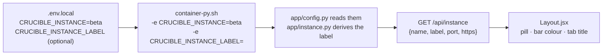

[← README](../../README.md) · [Handbook](../HANDBOOK.md) · [Glossary](../00-glossary.md) · [← Phase SH-12](phase-sh-12-beta-instance.md)

# Phase SH-13 — Prod and Beta, said in the page: the instance label

**Version shipped:** 2.21.0 · **Date:** 2026-09-22 · **Status:** complete
**Track:** SH, the shared spine ([roadmap](../05-roadmap.md#sh--shared-spine)); the owner's request of 2026-09-22, the morning the beta instance went live.
**Prerequisites:** [Phase SH-12](phase-sh-12-beta-instance.md), which put two instances on one server; a setup guide completed for your platform; the test virtual environment from its V7 check if you want to run the Python route.
**Learning goal:** you understand how a value set in a settings file travels into a container, out of an API and onto a page; why the page derives its label from the same name the scripts use rather than storing one; and why a change that rebuilds the container is the first real test of the two-moment workflow.
**Deliverable:** every page says which instance it is, in a word and in colour: a **Prod** pill in indigo on a white bar for production, a **Beta** pill in amber on an amber bar for the beta instance, and the same word in front of the browser tab's title. Behind it, one open endpoint, `GET /api/instance`, and two environment variables passed into the container by `container-py.sh`. Five tests; the suite at 150.


---

## Contents

1. [Why this phase exists](#why-this-phase-exists)
2. [The words you need](#the-words-you-need)
3. [What we built](#what-we-built)
4. [Step 1 — The name travels into the container](#step-1--the-name-travels-into-the-container)
5. [Step 2 — One open endpoint](#step-2--one-open-endpoint)
6. [Step 3 — The pill, the colour, the tab title](#step-3--the-pill-the-colour-the-tab-title)
7. [Step 4 — Tests, build, rebuild](#step-4--tests-build-rebuild)
8. [Step 5 — Deploy it, beta first](#step-5--deploy-it-beta-first)
9. [Checkpoint](#checkpoint)
10. [How to test it, by every route](#how-to-test-it-by-every-route)
11. [What this phase deliberately did not do](#what-this-phase-deliberately-did-not-do)
12. [Publish](#publish)

---

## Why this phase exists

The morning the beta instance went live, the two tabs looked identical. The
only difference was five characters at the end of the address and a grey
"Running on port 49161" in the corner. That is enough for the person who
set it up and not nearly enough for a tester with six tabs open who is
about to delete a compound. The owner asked for the page to say **Prod** or
**Beta**, in different colours, so that nobody has to read a port number to
know where they are.

*Everyday version:* two kitchens with the same equipment. The practice
kitchen gets amber walls and a name tag on the door. Nobody serves a
customer from the wrong room again.

---

## The words you need

| Term | Plain words | Everyday version |
|---|---|---|
| **Instance label** | The word the page shows for the instance it belongs to: *Prod* for the default, *Beta* for the beta instance | The name tag on the kitchen door |
| **Pill** | A small rounded badge with a word in it, next to the page title | A sticker on a lapel |
| **Environment variable** | A named value handed to a program when it starts; the container gets `CRUCIBLE_INSTANCE=beta` from the script that starts it | A note pinned inside the lunchbox lid |
| **Endpoint** | One address the application answers at; `GET /api/instance` answers with the name, label, port and scheme | One counter in a post office |
| **Derived** | Worked out from a fact that already exists, never stored; the label comes from the instance name the scripts already use | Reading the postmark instead of writing "from London" on the envelope |
| **Tab title** | The text a browser shows on the tab; the label goes in front of it, in square brackets | The label on the spine of a ring binder |
| **Override** | A second setting that replaces the derived word when you want it spelled differently: `CRUCIBLE_INSTANCE_LABEL=Production` | Writing your own name tag instead of the printed one |

Every term is also in the [glossary](../00-glossary.md).

---

## What we built



| Piece | File | What it does |
|---|---|---|
| The pass-through | `container-py.sh` | Both `podman run` commands pass `CRUCIBLE_INSTANCE` and `CRUCIBLE_INSTANCE_LABEL` into the container; `.env.local` may set the label; `help` lists it |
| The settings | `backend/app/config.py` | Reads the two variables once, at start |
| The rule | `backend/app/instance.py` | `instance_label(name, override)`: the override wins; no name means *Prod*; a name is capitalised. `instance_info(...)`: the endpoint's answer. Pure functions, no I/O |
| The endpoint | `backend/app/routers/instance.py` | `GET /api/instance`; registered in `backend/app/main.py` |
| The client call | `client/src/services/api.js` | `getInstance()` |
| The page | `client/src/components/Layout.jsx` | Fetches once per page load; the pill next to the title, the bar's colour, the tab title |
| Tests | `backend/tests/test_instance.py` | Five; the suite is 150 |

**What did not change:** the database, every other endpoint, the scripts'
names for anything. `/api/stats` keeps its exact shape, which a contract
test locks; that is why the instance has an endpoint of its own.

---

## Step 1 — The name travels into the container

**What:** the container has to know which instance it is. The scripts
already know; the container did not.

**How:** the two `podman run` commands in `container-py.sh` gained two
lines each:

```bash
-e CRUCIBLE_INSTANCE="${CRUCIBLE_INSTANCE}" \
-e CRUCIBLE_INSTANCE_LABEL="${CRUCIBLE_INSTANCE_LABEL}" \
```

`CRUCIBLE_INSTANCE` is the same variable SH-12 reads from `.env.local` to
name the image and the container. `CRUCIBLE_INSTANCE_LABEL` is new and
optional: leave it unset and the word is derived; set it to spell the word
your way.

**Why the same variable.** One fact, one place. If the label had its own
setting, a folder could be named `beta` and labelled `Prod`, and the page
would lie. Derived from the name the scripts use, the corner of the page
and the `Usage` line of the terminal cannot disagree.

**Why an environment variable and not a file.** The container already
receives its port that way, and an environment variable is the one thing a
container is guaranteed to have from its first instruction, before any
folder is mounted or any request arrives.

**You should see** after a `rebuild` in the beta folder:

```bash
podman exec crucible-py-beta sh -c 'echo "instance=$CRUCIBLE_INSTANCE label=$CRUCIBLE_INSTANCE_LABEL"'
```

```
instance=beta label=
```

and in production's folder the same command with `crucible-py` prints
`instance= label=`, both empty: the default instance has no name.

**If instead** the line is empty on beta: the container predates this
version. An existing container keeps the environment it was created with;
`./container-py.sh rebuild` recreates it (Step 5).

---

## Step 2 — One open endpoint

**What:** the application answers "which instance are you?"

**How:** `GET /api/instance` returns

```json
{"name": "beta", "label": "Beta", "port": 49161, "https": true}
```

on the beta instance and `{"name": "", "label": "Prod", "port": 49160, "https": true}`
on production. The rule that makes the label lives in `backend/app/instance.py`
and is three lines long: an override wins; no name is *Prod*; otherwise
the name with its first letter capitalised.

**Why its own endpoint.** `/api/stats` would have been the obvious place;
its shape is locked by a contract test, and a new key breaks it. A tiny
endpoint of its own costs nothing and reads nothing from the database.

**Why it stays open when the login arrives.** The login page has to say
which instance a person is about to sign into; it cannot ask a question
that needs a login to answer. So `/api/instance` joins `/api/health` on the
short list of open routes in [`13-authentication.md`](../13-authentication.md).
It holds nothing secret: a name, a word, a port number that is in the
address bar anyway.

**You should see:**

```bash
curl --noproxy '*' -sSk https://localhost:49161/api/instance; echo
curl --noproxy '*' -sSk https://localhost:49160/api/instance; echo
```

```
{"name":"beta","label":"Beta","port":49161,"https":true}
{"name":"","label":"Prod","port":49160,"https":true}
```

**If instead** `{"detail":"Not Found"}`: the container runs a version
before 2.21.0; pull and rebuild.

---

## Step 3 — The pill, the colour, the tab title

**What:** the page.

**How:** `Layout.jsx` asks `/api/instance` once when the page loads and
keeps the answer. Three things follow from it:

| Where | Default instance | Named instance |
|---|---|---|
| The pill next to the title | **Prod**, indigo text on a pale indigo pill | **Beta**, amber text on a pale amber pill |
| The top bar | white with a thin grey line | pale amber with an amber line |
| The tab title | `[Prod] Crucible: Pandora Toolbox Enhancement (v2.0) …` | `[Beta] Crucible: …` |

Hovering the pill shows a sentence: *the default instance: the real
registry* or *a named instance: a copy for testing, separate from
production*. "Running on port 49161" stays where it was.

**Why these colours.** Indigo is the colour every figure in the
documentation uses for production, amber for beta
([`14-beta-instance.md`](../14-beta-instance.md)). A tester who has read
one page of the documentation already knows the code.

**Why the tab title too.** A pill is visible on the page you are looking
at. Six tabs along, only the title is.

**Why the whole bar and not only the pill.** A pill is small. A bar is
the width of the screen and changes the feel of the page before you have
read anything. The sidebar is unchanged so the pages still look like one
application.

**You should see:** two tabs, one white bar with an indigo *Prod*, one
amber bar with an amber *Beta*, and the tab titles starting `[Prod]` and
`[Beta]`.

**If instead** there is no pill at all: the page could not reach
`/api/instance`; every other page still works. Check the endpoint with
`curl` as in Step 2, then reload the tab.

---

## Step 4 — Tests, build, rebuild

```bash
cd ~/Documents/Work/pandora_toolbox/nr-nips-crucible
cd backend && .venv/bin/ruff check . && .venv/bin/pytest -q && cd ..    # All checks passed! · 150 passed
cd client && npm run build && cd ..                                     # ✓ built
bash -n container-py.sh                                                 # silence
./container-py.sh rebuild                                               # backend, client and the script changed
curl --noproxy '*' -sS http://localhost:49160/api/instance; echo        # {"name":"","label":"Prod","port":49160,"https":false}
```

**The five tests** in `backend/tests/test_instance.py`: the rule for the
label (default, named, override), the endpoint's shape and its consistency
with the rule, the endpoint as the beta container sees it (the router's
settings patched to `beta`, 49161), and the override.

**What the tests cannot see:** the colour of a bar. The browser route below
is where that is checked, by a person, on both instances.

---

## Step 5 — Deploy it, beta first

**What:** the first change since the beta instance exists that rebuilds
the container. It goes the new way: publish, beta rebuilds and shows
*Beta*, the testers use it, you promote, production rebuilds and shows
*Prod*.

**How:** [`03-git-workflow.md` → Flow A](../03-git-workflow.md#4-flow-a---a-change-from-start-to-finish),
Steps 1–10 for the publish and Step 11 for the promotion. Two things are
particular to this change:

1. **Both instances rebuild** (`git log --stat -1` shows `backend/`,
   `client/` and `container-py.sh`), each after its own backup.
2. **The service unit has to match the new container**, and, as of
   v2.21.1, the script sees to it. A unit written by
   `podman generate systemd --new` records the exact `podman run` command
   of the container it was made from *and restarts the container when it
   dies*. Beta's unit was made the day before, without the two `-e` lines,
   and it was **active**. The first deploy of v2.21.0 showed what that
   means: the rebuild stopped the container, the unit noticed, ran its old
   command and replaced the script's new container with a nameless one, so
   port 49161 said *Prod* (lesson 36). Since v2.21.1 `container-py.sh`
   stops an active unit before it touches the container and rewrites the
   unit from the container it created:

```bash
# ▶ VM — beta folder
./container-py.sh rebuild
grep -o 'CRUCIBLE_INSTANCE=[a-z]*' ~/.config/systemd/user/container-crucible-py-beta.service
./container-py.sh status | head -4
```

**You should see** in the rebuild's output `Stopping the service
container-crucible-py-beta.service first` (only if it was active), then the
build, then `Rewriting container-crucible-py-beta.service from the
container just created`, `✓ … rewritten (enabled: enabled)`, `Handing the
container to the service …`, `✓ … is active` and `✓ The application
answers` (the hand-over and the wait came with v2.21.2, the same day);
`CRUCIBLE_INSTANCE=beta` from the `grep`; and in `status` a line
`service container-crucible-py-beta.service: active (enabled) — the service
runs the application`. The same happens in production's folder for
`crucible-py`. Everything about running, stopping and checking is on one
page, [`15-run-stop-status.md`](../15-run-stop-status.md); the manual four
commands remain in [`07-operations.md` → Auto-start on boot](../07-operations.md#auto-start-on-boot-systemd)
for the day the automatic step reports it could not run.

**Why beta first, in practice.** Between the publish and the promotion the
two tabs differ: beta says *Beta* in amber, production still says nothing.
That is the two-moment workflow doing its job, visible for the first time.

---

## Checkpoint

```bash
# ▶ VM — from any folder, after both instances have been rebuilt
curl --noproxy '*' -sSk https://localhost:49160/api/instance; echo
curl --noproxy '*' -sSk https://localhost:49161/api/instance; echo
podman exec crucible-py      sh -c 'echo "prod: instance=[$CRUCIBLE_INSTANCE]"'
podman exec crucible-py-beta sh -c 'echo "beta: instance=[$CRUCIBLE_INSTANCE]"'
grep -c 'CRUCIBLE_INSTANCE=beta' ~/.config/systemd/user/container-crucible-py-beta.service
```

**You should see:**

```
{"name":"","label":"Prod","port":49160,"https":true}
{"name":"beta","label":"Beta","port":49161,"https":true}
prod: instance=[]
beta: instance=[beta]
1
```

and, in a browser, an indigo *Prod* on a white bar at `:49160` and an amber
*Beta* on an amber bar at `:49161`, with `[Prod]` and `[Beta]` on the tabs.

---

## How to test it, by every route

The left column is the server; the right column is the development machine running the
default instance on 49160 (HTTP) and, for the rehearsal of this phase, a
second copy started as `beta` on 49161 ([SH-12, Step 6](phase-sh-12-beta-instance.md#step-6--rehearse-it-on-a-laptop-first)).
Replace `podman` with `docker` where that is the runtime.

| Route | How | You should see (server) | Rehearsal on the development machine |
|---|---|---|---|
| **Browser, the pill** | open `https://<vm-hostname>:49160` and `:49161` | an indigo **Prod** pill on a white bar; an amber **Beta** pill on a pale amber bar with an amber line under it | `http://localhost:4916{0,1}`, the same |
| **Browser, the tab** | look at the two tabs | `[Prod] Crucible: Pandora Toolbox Enhancement (v2.0) …` and `[Beta] Crucible: …` | the same |
| **Browser, the hint** | hover the pill | *the default instance: the real registry* / *a named instance: a copy for testing, separate from production* | the same |
| **Browser, every page** | click through Dashboard, Chemical Registry, Query | the bar and the pill stay on every page; "Running on port" unchanged | the same |
| **API** | `curl --noproxy '*' -sSk https://localhost:49160/api/instance` then `…:49161/api/instance` | `{"name":"","label":"Prod","port":49160,"https":true}` then `{"name":"beta","label":"Beta","port":49161,"https":true}` | `http://…`, `"https":false` |
| **API, the explorer** | `https://<vm-hostname>:49161/docs`, section *instance* | `GET /api/instance` with a *Try it out* button; the same answer | `http://localhost:49161/docs` |
| **Terminal, the scripts agree** | `./container-py.sh help \| grep Usage` in each folder | `instance: default → crucible-py, port 49160` · `instance: beta → crucible-py-beta, port 49161`, the same name the page shows | the same |
| **Terminal, the override** | in the beta folder add `CRUCIBLE_INSTANCE_LABEL=Staging` to `.env.local`, `./container-py.sh rebuild`, curl `/api/instance`; then remove the line and rebuild again | `"label":"Staging"` with `"name":"beta"` unchanged; then `Beta` again | the same |
| **Podman / Docker, the variable inside** | `podman exec crucible-py-beta sh -c 'echo $CRUCIBLE_INSTANCE'` · the same for `crucible-py` | `beta` · an empty line | the same |
| **Podman / Docker, the whole environment** | `podman inspect crucible-py-beta --format '{{range .Config.Env}}{{println .}}{{end}}' \| grep CRUCIBLE` | `CRUCIBLE_INSTANCE=beta` and `CRUCIBLE_INSTANCE_LABEL=` | the same |
| **Podman / Docker, the unit** | after Step 5: `grep -o 'CRUCIBLE_INSTANCE=[a-z]*' ~/.config/systemd/user/container-crucible-py-beta.service` | `CRUCIBLE_INSTANCE=beta` | — (no unit on the development machine) |
| **Python directly, the rule** | `cd backend && .venv/bin/python -c "from app.instance import instance_label as L; print(L('', ''), L('beta', ''), L('beta', 'Staging'))"` | — | `Prod Beta Staging` |
| **Python directly, the app** | `cd backend && CRUCIBLE_INSTANCE=beta PORT=8765 .venv/bin/python -m uvicorn app.main:app --port 8765` in one terminal, `curl -sS http://localhost:8765/api/instance` in another | — | `{"name":"beta","label":"Beta","port":8765,"https":false}` (Ctrl-C the server afterwards) |
| **Database** | Query page: `SELECT name FROM sqlite_master WHERE name LIKE '%instance%'` | no rows: the label is derived, never stored | the same |
| **Monitor** | `./monitor.sh` in the beta folder | `✓ crucible-py-beta is healthy` (unchanged: the monitor probes `/api/stats`, which did not change) | the same |
| **Deploy check** | `./verify-deploy.sh https://localhost:49161` | `16 passed, 0 failed` (unchanged checks; the new endpoint is not among them by design, so an old container still passes and the pill is the person's check) | `./verify-deploy.sh http://localhost:49161` |
| **Automated tests** | `cd backend && .venv/bin/pytest -q` | — | `150 passed` |

**Production untouched between the moments:** after the publish and
before the promotion, `curl …:49160/api/instance` still answers
`{"detail":"Not Found"}` and the production tab has no pill. That is
correct, and the promotion changes it.

| Route (v2.21.1 and v2.21.2) | How | You should see |
|---|---|---|
| **The unit follows the container** | beta folder: `./container-py.sh rebuild`, then `grep -c 'CRUCIBLE_INSTANCE=beta' ~/.config/systemd/user/container-crucible-py-beta.service` | the rebuild prints `Rewriting … rewritten (enabled: enabled)`, then `Handing the container to the service …`, `✓ … is active`, `✓ The application answers`; the grep prints `1` |
| **An active service is stopped first** | with the service active (it always is after v2.21.2): `./container-py.sh rebuild` | `Stopping the service container-crucible-py-beta.service first …`, then the build; afterwards the container has its name (`curl …/api/instance` → `Beta`) and the service is `active (enabled)` again |
| **Both doors agree** | `./container-py.sh status \| head -5` and `systemctl --user status container-crucible-py-beta.service \| head -3` | the container row, `service …: active (enabled) — the service runs the application`, and `Active: active (running)` |
| **Stop and start through either door** | `systemctl --user stop container-crucible-py-beta.service`, `./container-py.sh status`, then `./container-py.sh start` | no container row and `inactive (enabled)` after the stop; after the start, `Handing the container to the service …` and both doors say active |
| **A development machine is unaffected** | `./container-py.sh rebuild` on the development machine | no service lines at all: there is no unit file and no `systemctl`; `✓ The application answers` still appears |

---

## What this phase deliberately did not do

- **Colour the sidebar or the whole page.** One bar and one pill are
  enough to tell the instances apart, and the pages must still look like
  one application in screenshots and training material.
- **Add the label to `/api/stats`.** Its shape is a contract; the instance
  got its own endpoint.
- **Add the label to `verify-deploy.sh`.** The sixteen checks are the same
  on every version; a check that fails on every older container is not a
  deploy check. The pill is the person's check, and it is in the table.
- **Guess the label from the port.** The port is not the instance; the
  name the scripts use is. Deriving from the same fact is the whole point.
- **A Windows walk.** Nothing here is platform-specific; the rehearsal on the
  development machine is what this tutorial records, and the Windows guide stays *untested*
  until SH-6.

---

## Publish

Ships as v2.21.0. Backend, client and `container-py.sh` changed, so
**both instances rebuild**, beta first, each after its own backup, and
each unit is regenerated afterwards (Step 5). The two moments in
[`03-git-workflow.md`](../03-git-workflow.md#4-flow-a---a-change-from-start-to-finish).
The handbook's status box, timeline and build log, the roadmap's SH-13
row, the beta-instance page (the label, and "Many testers, one beta"), the
operations runbook (the per-instance status table, the label variable,
the regenerate-the-unit rule), the API reference and cookbook, the
playbook, the RHEL 8 guide's §8, the authentication page's open routes,
the architecture page, the glossary, the figure index and the release
note are in the same commit.

**Last Updated:** September 22, 2026
