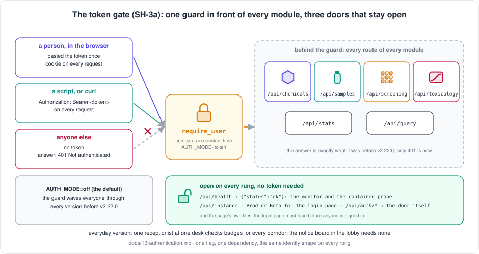
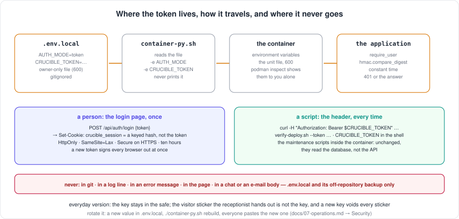

[← README](../../README.md) · [Handbook](../HANDBOOK.md) · [Glossary](../00-glossary.md) · [← Phase SH-13](phase-sh-13-instance-label.md)

# Phase SH-3a — The token gate: one guard on every route, a login page, one open health route

**Version shipped:** 2.22.0 · **Date:** 2026-09-22 · **Status:** complete (built and rehearsed on the development machine; delivered to the **beta instance** by [Step 7](#step-7--turn-it-on-beta-first); production stays open until its own promotion and its own two lines of settings)
**Track:** SH, the shared spine ([roadmap](../05-roadmap.md#sh--shared-spine)); the first rung of the authentication ladder planned in [`13-authentication.md`](../13-authentication.md) and decided in [ADR 0001](../adr/0001-authentication-ladder.md); the owner's priority of 2026-09-21, user testing with a login, and the go of 2026-09-22.
**Prerequisites:** [Phase SH-12](phase-sh-12-beta-instance.md) (the beta instance, where the login lands first) and [Phase SH-13](phase-sh-13-instance-label.md) (the instance label, which the login page shows); the plan read once; a setup guide completed for your platform; the test virtual environment from its V7 check if you want to run the Python route.
**Learning goal:** you understand what a login is at its simplest (one secret, presented two ways), where the secret lives and how it travels without ever being written down twice, why one route must stay open and which ones do, why the guard is one function rather than a change on every route, how a browser is remembered without holding the secret, and how to turn the gate on, test it from every direction, rotate the token and turn it off.
**Deliverable:** two lines in an instance's `.env.local`, `AUTH_MODE=token` and `CRUCIBLE_TOKEN=<a long random secret>`, close its port: every `/api` route of every module answers `401 Not authenticated` without the token, and exactly what it answered before with it. A script sends the token as a header; a person pastes it once into a **login page** and the browser is remembered for ten hours by a cookie that is not the token. Three routes stay open: `GET /api/health` (new, for the monitor and the container probe), `GET /api/instance` (the *Prod* / *Beta* label the login page shows) and `/api/auth/*` (the door itself). `verify-deploy.sh --token`, the monitor and the scripts' probes moved to the open route. The cross-origin policy is closed. With the flag at its default, `off`, nothing changes: the 150 contract tests run unchanged. Nineteen new tests; the suite at 169.



---

## Contents

1. [Why this phase exists](#why-this-phase-exists)
2. [The words you need](#the-words-you-need)
3. [What we built](#what-we-built)
4. [Step 1 — The flag and the secret travel into the container](#step-1--the-flag-and-the-secret-travel-into-the-container)
5. [Step 2 — One guard in front of every module](#step-2--one-guard-in-front-of-every-module)
6. [Step 3 — Three doors stay open](#step-3--three-doors-stay-open)
7. [Step 4 — The login page, the cookie and the 401 handler](#step-4--the-login-page-the-cookie-and-the-401-handler)
8. [Step 5 — The scripts learn the new probe, and the token](#step-5--the-scripts-learn-the-new-probe-and-the-token)
9. [Step 6 — Tests, build, rehearsal](#step-6--tests-build-rehearsal)
10. [Step 7 — Turn it on, beta first](#step-7--turn-it-on-beta-first)
11. [Rotate the token, or turn the gate off](#rotate-the-token-or-turn-the-gate-off)
12. [Checkpoint](#checkpoint)
13. [How to test it, by every route](#how-to-test-it-by-every-route)
14. [What this phase deliberately did not do](#what-this-phase-deliberately-did-not-do)
15. [Publish](#publish)

---

## Why this phase exists

Until this phase, anyone who could reach the server's port could read every
record, upload a file, delete a compound and run SQL against the database.
The application never asked who was calling. That was a deliberate choice
while the system was built on one trusted internal network for one
laboratory, and it stops being acceptable the moment the application is put
in front of a wider group, which is exactly what user testing on the beta
instance does.

*Everyday version:* a laboratory whose door has been unlocked because "only
we work here". The day visitors are invited in for a tour, the missing lock
is the whole problem, and the lock has to go in before the tour, not after.

The plan ([`13-authentication.md`](../13-authentication.md)) climbs a ladder
of three rungs, and this phase is the first: **one shared secret**, needing
nothing from anyone else, fitted in days, and useful forever because scripts
and service accounts will present a token on every later rung too. It does
not yet say *who* is calling; every caller with the token is "the token
holder". The next rung, local accounts with usernames and passwords
(SH-3b), gives *who*; this rung gives the frame, the lock housing and the
alarm wiring that every rung above it drops into.

---

## The words you need

| Term | Plain words | Everyday version |
|---|---|---|
| **Token** | A long random string; whoever presents it is trusted | A key cut for a door |
| **Bearer header** | The line a script adds to a request to present the token: `Authorization: Bearer <token>` | Holding the key up at the desk |
| **Cookie** | A small note the server gives a browser after the login, which the browser sends back with every later request without being asked | The visitor sticker you wear all day |
| **Session** | The server treating a browser with a valid cookie as signed in, for a while | The sticker being honoured until it expires |
| **Keyed hash** | A one-way scramble of a fixed text using the token as the key; the cookie's value. Anyone can compute it *with* the token and nobody can recover the token *from* it | A stamp on the sticker that only the desk's own stamp can make |
| **Constant-time comparison** | Checking a secret in a way that takes exactly as long whether the first or the last character is wrong, so timing tells a guesser nothing | Reading the whole key before saying "no", never stopping at the first wrong tooth |
| **401 Unauthorized** | The web's answer for "you have not shown me who you are"; the only new answer this phase adds | "Badge, please" at the desk |
| **Dependency (FastAPI)** | A function a route, or a whole router, declares it needs; the framework runs it first and hands the route the result, or the caller the error | The receptionist every visitor passes before any office |
| **Feature flag** | A setting that turns a capability on or off without changing code; here `AUTH_MODE` | The switch beside the badge reader |
| **Health route** | A route that says *ok* and nothing else, open on purpose, so a monitor can ask "are you alive?" without a badge | The notice board in the lobby |
| **Cross-origin policy (CORS)** | The rule saying which *other* web sites a browser may let call this API; closed here, because the page comes from this same server | Whether a neighbour's staff may use your reception |

---

## What we built

| Piece | What it is | Where |
|---|---|---|
| Two settings | `AUTH_MODE` (`off`, the default, or `token`) and `CRUCIBLE_TOKEN`; read from the environment like every other setting; on a server they live in the untracked `.env.local` | `backend/app/config.py` |
| The guard | `require_user`: one function that returns the caller's identity or answers 401, declared once per router | `backend/app/auth.py`, `backend/app/main.py` |
| The identity | Four fields, the same on every rung: `subject`, `display_name`, `roles`, `via` | `backend/app/auth.py` |
| The open health route | `GET /api/health` → `{"status":"ok"}` after touching the database with `SELECT 1`; 503 if it cannot | `backend/app/routers/health.py` |
| The door | `GET /api/auth/me` (open, always 200: which mode, signed in or not), `POST /api/auth/login` (the pasted token → a cookie), `POST /api/auth/logout` | `backend/app/routers/auth.py` |
| The login page | Asks for the token, shows the instance pill first, says the same words for a wrong and a missing token | `client/src/pages/Login.jsx` |
| The gate in the page | Asks `/api/auth/me` once on load; renders the login page or the application; listens for any 401 | `client/src/components/AuthGate.jsx` |
| The 401 handler | One interceptor in the API layer raises an event on any 401; nothing else in the client changed | `client/src/services/api.js` |
| Sign out | A button in the top bar when the login is on | `client/src/components/Layout.jsx`, `client/src/components/instanceStyle.js` |
| The scripts | `container-py.sh` reads the two settings, validates them, passes them in, probes `/api/health`, never prints the token; `monitor.sh` and the container's own probe moved to `/api/health` with a fallback; `setup-after-clone-py.sh` writes the new probe into the cron line; `verify-deploy.sh --token` | repository root, `backend/scripts/healthcheck.py`, `backend/Dockerfile` |
| Closed cross-origin policy | No other site may call the API from a browser unless `CORS_ORIGINS` names it | `backend/app/main.py` |
| Tests | Nineteen: the gate, the open routes, the cookie, downloads, logout, rotation, the settings that cannot work, the probe's path | `backend/tests/test_auth_token.py`, `backend/tests/test_healthcheck.py` |
| Figures | The gate with its open doors; where the token lives, travels and never goes | `docs/img/fig_token_gate.svg`, `docs/img/fig_token_travels.svg` |



---

## Step 1 — The flag and the secret travel into the container

**What:** two settings, read the same way as every other one.

**How:** in `backend/app/config.py`:

```python
AUTH_MODE: str = os.environ.get("AUTH_MODE", "off").strip().lower() or "off"
AUTH_MODES: tuple[str, ...] = ("off", "token")
CRUCIBLE_TOKEN: str = os.environ.get("CRUCIBLE_TOKEN", "").strip()
TOKEN_MIN_LENGTH: int = 32
SESSION_HOURS: int = int(os.environ.get("SESSION_HOURS", "10"))
```

and in `container-py.sh`, which already reads a folder's `.env.local` for
`USE_HTTPS`, `CRUCIBLE_INSTANCE` and `CRUCIBLE_PORT`, two more lines are
read the same way and passed into both `podman run` commands:

```bash
-e AUTH_MODE="${AUTH_MODE}" \
-e CRUCIBLE_TOKEN="${CRUCIBLE_TOKEN}" \
```

**Why:** the container is the isolation on every platform, so a setting
reaches the application as an environment variable or not at all. Keeping
the secret in `.env.local` means it is never in git (the file is ignored,
and the gate script refuses tracked `.env*` files) and survives a
`git pull`. The environment still wins over the file for a one-off
command, which is how the rehearsal on the development machine was done
without writing the file.

**You should see** (any folder with the two lines, or the two variables):

```
$ ./container-py.sh help | grep Usage
Usage: ./container-py.sh [command]        (runtime: podman · instance: beta → crucible-py-beta, port 49161 · login: token)
```

**What it means:** the script knows the login is on. It never prints the
token; `login: token` is all it says.

**If instead:** `✗ AUTH_MODE=token needs CRUCIBLE_TOKEN of at least 32 characters` —
the line is missing or short; the message prints the one-line generator.
`✗ AUTH_MODE='sso' must be off or token` — a later rung's mode on this
version. Both stop *every* command of the script, on purpose: a
misconfigured login is the one setting that must not be discovered by an
open port later.

**Three things the script does with a secret in its hands.** It makes
`.env.local` owner-only (`chmod 600`) the first time it sees a token in
it, because other accounts on a shared server could otherwise read the
file. It makes the systemd unit file it rewrites owner-only too, because
`podman generate systemd --new` records the exact run command, token
included. And it refuses to start the token mode over plain HTTP on any
interface but `127.0.0.1`, because a token over HTTP is a token on a
postcard (rule 2 of the plan); `CRUCIBLE_ALLOW_HTTP_LOGIN=true` overrides
that on a machine only you can reach.

---

## Step 2 — One guard in front of every module

**What:** one function, `require_user`, that every protected router
declares; the route runs only if it returned an identity.

**How:** `backend/app/auth.py` holds the function; `backend/app/main.py`
declares it once per router rather than once per route:

```python
guard = [Depends(require_user)]
application.include_router(chemicals.router, dependencies=guard)
application.include_router(samples.router, dependencies=guard)
application.include_router(screening.router, dependencies=guard)
application.include_router(toxicology.router, dependencies=guard)
application.include_router(stats.router, dependencies=guard)
application.include_router(query.router, dependencies=guard)
```

The function itself reads the settings at call time, accepts the token
either as a bearer header or as the cookie from Step 4, and compares in
constant time:

```python
def require_user(request: Request) -> Identity:
    who = identify(request)
    if who is None:
        raise HTTPException(status_code=401, detail="Not authenticated",
                            headers={"WWW-Authenticate": "Bearer"})
    return who
```

**Why one function, declared on the router.** A **dependency** is
FastAPI's way of saying "run this first": the same mechanism that gives
every route its database session (`get_db` in `backend/app/database.py`).
Declaring the guard on the router, once, means a route added next month is
guarded without anyone remembering to guard it; a per-route decorator is
the kind of rule that is followed on nine routes and forgotten on the
tenth. And because the guard produces the same four-field identity on
every rung, the routers never change when the flag moves from `token` to
`local` to `sso`: only `identify()` does.

**Why the same answer for a missing and a wrong token.** Rule 5 of the
plan: a different message for "no token" and "wrong token", or for "wrong
length", tells a guesser something. `{"error":"Not authenticated"}`, every
time, with a fixed quarter-second pause on a wrong login.

**Why the legacy error shape.** The API has always answered errors as
`{"error": "..."}`; the 401 does too, and it carries
`WWW-Authenticate: Bearer`, the standard header that tells a client how to
log in. The exception handler in `main.py` now keeps an exception's
headers, which it used to drop.

**You should see** (with the login on):

```
$ curl --noproxy '*' -sSk https://localhost:49161/api/stats; echo
{"error":"Not authenticated"}
$ curl --noproxy '*' -sSk -H "Authorization: Bearer <the token>" https://localhost:49161/api/stats | head -c 60; echo
{"chemicals":{"total":12539,"max":15000},"samples":{"total":
```

**What it means:** the same route, refused and then answered, with the
exact answer it gave before this phase. The contract did not change; the
only new answer anywhere is 401.

**If instead:** `{"error":"Not authenticated"}` *with* the header — the
token in the header is not the one in the container. Compare
`grep CRUCIBLE_TOKEN .env.local` with what you typed (a trailing space or a
missing character is the usual cause), and remember that a changed
`.env.local` reaches the container only when the container is recreated
([Rotate the token](#rotate-the-token-or-turn-the-gate-off)).

---

## Step 3 — Three doors stay open

**What:** three routes that must answer without a token, and why each.

| Open route | Why it must be open | What it gives away |
|---|---|---|
| `GET /api/health` | The container's own probe (every 30 s), the cron monitor (every 5 min) and `container-py.sh`'s wait-for-ready all ask "are you alive?". They have no token, and they must not restart a healthy application because it said "badge, please" | `{"status":"ok"}`, nothing else. It does touch the database with `SELECT 1`, because an application whose database is unreachable is not healthy whatever its process says; then it answers 503 |
| `GET /api/instance` | The login page must say *Prod* or *Beta* before anyone is signed in ([SH-13](phase-sh-13-instance-label.md)), or a tester cannot tell which address they are pasting a token into | the name, label, port and scheme; no data |
| `/api/auth/*` | The door itself: `me` (which mode, signed in or not), `login`, `logout` | whether *this* caller is signed in |

The page's own files (`/`, the built client, `/architecture`, the API
explorer at `/docs`) are open too: the login page has to load before
anyone can sign in, and none of them contain data.

**How:** `backend/app/routers/health.py` is eleven lines; the three routers
are registered in `main.py` *without* the guard. `backend/scripts/healthcheck.py`
(the container's probe) and `monitor.sh` now ask `/api/health`.

**Why the probes had to move first.** Before this phase the probes asked
`/api/stats`. With the login on, that answers 401, which a probe reads as
"dead": the container would be marked `unhealthy` and the cron monitor
would restart a perfectly healthy application every five minutes,
forever, while its log said `✓ Container restarted successfully`. That
is the recurring failure shape this project watches for — a check that
reports one thing while another is true ([lesson 38](../11-lessons-learned.md)).
So the open route was written before the gate, and the monitor keeps a
fallback: it always tries `/api/health` at the same address first, and
only when that route does not exist (an older container answers 404)
does it fall back to whatever address its cron line names. An old cron
line therefore keeps working; the setup script writes the new address
the next time it runs.

**You should see:**

```
$ curl --noproxy '*' -sSk https://localhost:49161/api/health; echo
{"status":"ok"}
$ curl --noproxy '*' -sSk https://localhost:49161/api/instance; echo
{"name":"beta","label":"Beta","port":49161,"https":true}
$ curl --noproxy '*' -sSk https://localhost:49161/api/auth/me; echo
{"mode":"token","authenticated":false,"user":null}
```

**If instead:** `/api/health` answers the HTML page — the container runs
an image older than v2.22.0 (the route is not there; the page's
catch-all answered instead). `./container-py.sh rebuild` in that folder.

---

## Step 4 — The login page, the cookie and the 401 handler

**What:** how a person gets in, and how the browser is remembered.

**How, in the browser:** open the address; the page asks
`GET /api/auth/me`; the answer says `mode: token, authenticated: false`,
so the page shows the login form with the instance pill on its bar. Paste
the token, *Sign in*: the page sends `POST /api/auth/login {"token": …}`.
The server checks it in constant time and answers with a **cookie**,
`crucible_session`, flagged `HttpOnly` (a script on a page cannot read
it), `SameSite=Lax` (another site cannot ride on it), `Secure` when the
connection is HTTPS, valid for ten hours (decision A6). From then on the
browser sends the cookie on every request by itself — including the
export and template downloads, which are plain links and could never
carry a header. *Sign out* in the top bar clears it.

**Why the cookie is not the token.** Its value is a **keyed hash**: the
token used as a key to scramble a fixed label (`hmac` with SHA-256, from
Python's standard library, no new dependency). Anyone holding the token
can compute it; nobody holding the cookie can recover the token, and a
leaked cookie cannot be replayed as a bearer header (the tests prove
both). Because the value depends on the token, **a new token signs every
browser out at once** — which is how a leaked token is dealt with.

**Why a page-wide gate rather than a check on every page.** The whole
application sits inside one component, `AuthGate`, which renders either
the login page or the routes. The API layer has one interceptor: any
answer of 401 from any call raises one event; the gate hears it and
shows the login page; after a successful login the routes mount again,
so the page that was interrupted asks for its data again. Nothing else
in the client changed: no page knows the login exists.

**Why the login page says which instance it is.** A tester with the
production and the beta address open would otherwise have no way to
tell where a token is being pasted. The same pill, the same colours, the
same `[Beta]` on the tab, from the same open endpoint.

**You should see:** the login page, with an amber *Beta* pill on an amber
bar on the beta instance; after a wrong token, *That token was not
accepted. Check for missing or extra characters and try again.*; after the
right one, the page you asked for, with *Sign out* in the top bar; after a
reload, still signed in; after *Sign out*, the login page again.

**If instead:** the page loads, shows a spinner and then the application
*without* asking — the instance's login is off (`/api/auth/me` says
`"mode":"off"`), which is production's state until its own two lines are
written. The login page appears on every click — the browser is refusing
the cookie: on a plain-HTTP address the cookie is sent without `Secure`,
so that is not it; a browser set to block all cookies, or a private window
that drops them, is.

---

## Step 5 — The scripts learn the new probe, and the token

**What:** four scripts, one new argument, and a probe that moved.

| Script | Change | Why |
|---|---|---|
| `container-py.sh` | reads `AUTH_MODE` and `CRUCIBLE_TOKEN` from `.env.local`; validates them; passes them into both run commands; `status`, `start`, `restart`, `rebuild` and `restore` wait on `/api/health` (with the same fallback as the monitor); `status` prints `login: token` or `login: off` and, with the token it holds, the counts; the unit file it rewrites is made owner-only; `help` shows the mode | the script is the one door on every platform; it must know the setting and must never leak it |
| `monitor.sh` | probes `/api/health` first at whatever address its cron line names; falls back to that address only on 404 | an old cron line keeps working; a healthy application is never restarted for saying 401 |
| `setup-after-clone-py.sh` | the wait-for-ready and the cron line it writes use `/api/health`; its closing lines say whether the login is on | the one-time setup produces the right monitor line from now on |
| `verify-deploy.sh` | `--token <t>` (or `CRUCIBLE_TOKEN` in the shell) is sent on every check; with a token, two more checks prove the gate: a call *without* the token is refused, and `/api/health` stays open; without a token against a gated instance, it says so and exits 2 instead of printing sixteen failures | the sixteen checks must run against a gated instance; and a deploy check that cannot fail is no check |
| `backend/scripts/healthcheck.py` | probes `/api/health` | the container's own `HEALTHCHECK` must not read 401 as dead |

**You should see** (beta folder on the server, the token in `.env.local`):

```
$ CRUCIBLE_TOKEN="$(grep '^CRUCIBLE_TOKEN=' .env.local | cut -d= -f2-)" ./verify-deploy.sh https://localhost:49161
Verifying https://localhost:49161

   PASS  the login is on: a call without the token is refused (401)
   PASS  health route stays open without the token
   PASS  screening list loads (was HTTP 400)
   …
  18 passed, 0 failed
  Everything checks out.
```

and without the token:

```
$ ./verify-deploy.sh https://localhost:49161
Verifying https://localhost:49161

  this instance needs a token (a call without one answers 401):
     ./verify-deploy.sh https://localhost:49161 --token <the token>   (or CRUCIBLE_TOKEN=<the token> in the shell)
```

**What it means:** eighteen checks with the login on, the sixteen of
before plus two that only make sense with a token; a gated instance
without a token is reported as such, exit status 2.

**If instead:** `FAIL login gate — a call without the token answered HTTP 200` —
the instance is *not* gated although you passed a token: its `.env.local`
lacks the two lines, or the container was not recreated after they were
written.

---

## Step 6 — Tests, build, rehearsal

**What:** prove it on the development machine before any server sees it.

**How (development machine):**

```bash
cd ~/Documents/Work/pandora_toolbox/nr-nips-crucible
cd backend && .venv/bin/ruff check . && .venv/bin/pytest -p no:warnings 2>&1 | grep -E '[0-9]+ (passed|failed)' && cd ..
for f in container-py.sh setup-after-clone-py.sh monitor.sh verify-deploy.sh; do bash -n $f; done
cd client && npm run build && cd ..
# the rehearsal: the two settings from the environment, so no .env.local is written on this machine
AUTH_MODE=token CRUCIBLE_TOKEN="$(python3 -c 'import secrets; print(secrets.token_urlsafe(48))')" ./container-py.sh rebuild
```

**Why the environment and not the file.** `.env.local` is the owner's,
not the repository's; the environment wins over the file for a one-off
command, and on macOS the scripts publish on `127.0.0.1`, which is the one
interface the HTTP-plus-token rule allows. The token above is generated
inline and never shown; for the browser walk you need to see it, so
generate it into a file you can read (`… > /tmp/token.txt`) instead and
use `CRUCIBLE_TOKEN="$(cat /tmp/token.txt)"`.

**You should see:** `All checks passed!` · `169 passed` · the client build
in about three seconds · the image build, then:

```
Creating and starting container (runtime: podman, port: 49160)...
✓ The application answers at http://localhost:49160/api/health
✓ Container started successfully
```

**What it means:** the suite runs with the login off (the contract
tests, unchanged) plus the nineteen that switch it on; the container came
up gated, and the script's own wait used the open route.

**If instead:** `✗ AUTH_MODE=token over plain HTTP on 0.0.0.0` — a Linux
or Windows development machine publishes on every interface; either
enable HTTPS (`./setup-ssl.sh`, then `USE_HTTPS=true`) or, on a machine
only you can reach, prefix `CRUCIBLE_ALLOW_HTTP_LOGIN=true`.

The whole rehearsal, route by route, is the
[test table](#how-to-test-it-by-every-route) below; the right-hand column
is what it printed here. To put the development machine's container back
the way it was (login off), recreate it without the two variables:
`./container-py.sh stop && podman rm crucible-py && ./container-py.sh start`.

---

## Step 7 — Turn it on, beta first

**What:** the login on the **beta instance**, and only there (decision
A9). Production keeps answering without a token until the testers have
used the login for a while; then the same two lines go into production's
`.env.local` and it is recreated, in a promotion of its own.

**How (server, beta folder), after block 3 of the six has pulled and
rebuilt this version:**

```bash
# ▶ VM - beta folder
cd ~/work/Pandora_toolbox/nr-nips-crucible-beta
git log --oneline -1                      # the v2.22.0 commit
# 1. generate the token straight into the file: it never appears on screen or in the shell history
printf 'AUTH_MODE=token\nCRUCIBLE_TOKEN=%s\n' "$(python3 -c 'import secrets; print(secrets.token_urlsafe(48))')" >> .env.local
chmod 600 .env.local
# 2. six lines now: CERT_SOURCE, USE_HTTPS, CRUCIBLE_INSTANCE, CRUCIBLE_PORT, AUTH_MODE, CRUCIBLE_TOKEN
grep -c . .env.local
./container-py.sh help | grep Usage
# 3. the setting reaches the container only when the container is recreated
./container-py.sh backup
./container-py.sh stop
./container-py.sh start
```

**Why `stop` then `start` and not `restart`.** The service runs the
application and its unit file records the run command the container was
created with, old environment included; `restart` would bring the old
container back without the login. `stop` through the service removes the
container; `start` creates a new one from the current image with the
current `.env.local`, rewrites the unit from it (owner-only now) and hands
it over. `rebuild` does the same and rebuilds the image first, which
block 3 already did.

**You should see:**

```
Usage: ./container-py.sh [command]        (runtime: podman · instance: beta → crucible-py-beta, port 49161 · login: token)
…
Stopping the application through its service container-crucible-py-beta.service...
✓ container-crucible-py-beta.service stopped; the container is removed (start, or the next boot, recreates it)
…
Creating and starting container (runtime: podman, port: 49161)...
Rewriting container-crucible-py-beta.service from the container just created (the unit records the exact run command)...
✓ container-crucible-py-beta.service rewritten (enabled: enabled)
Handing the container to the service container-crucible-py-beta.service, which runs it from now on...
✓ container-crucible-py-beta.service is active: the service runs the application (systemctl --user status container-crucible-py-beta.service)
✓ The application answers at https://localhost:49161/api/health
✓ Container started with HTTPS
```

Then prove it, from the same folder:

```bash
curl --noproxy '*' -sSk https://localhost:49161/api/stats; echo            # {"error":"Not authenticated"}
curl --noproxy '*' -sSk https://localhost:49161/api/health; echo           # {"status":"ok"}
CRUCIBLE_TOKEN="$(grep '^CRUCIBLE_TOKEN=' .env.local | cut -d= -f2-)" ./verify-deploy.sh https://localhost:49161   # 18 passed
./monitor.sh | tail -1                                                      # ✓ crucible-py-beta is healthy
ls -l ~/.config/systemd/user/container-crucible-py-beta.service             # -rw------- : owner-only
curl --noproxy '*' -sSk https://localhost:49160/api/stats | head -c 60; echo  # production: still the counts, no login
```

Then the browser: `https://<vm-hostname>:49161` shows the login page with
the amber **Beta** pill; paste the token; the application. Hand the token
to each tester **out of band** — in person, or through the organisation's
password manager — never in an e-mail body or a chat message. To read it
back when you need it: `grep '^CRUCIBLE_TOKEN=' .env.local`.

**What it means:** beta is closed to anyone without the token, its
monitor and its service are green, and production has not changed. The
old cron line for beta (which names `/api/stats`) keeps working because
the monitor tries `/api/health` first.

**If instead:** the browser shows the application without asking — the
tab still holds the page from before; reload it (Ctrl+F5, or Cmd+Shift+R
on macOS). `✗ AUTH_MODE=token needs CRUCIBLE_TOKEN of at least 32 characters` —
the `printf` did not run as one line; `tail -2 .env.local` shows what
landed. The monitor log shows a restart every five minutes — the
container runs an image older than v2.22.0 (the fallback found no
`/api/health` and `/api/stats` answered 401): `git log --oneline -1` in
the folder, then `./container-py.sh rebuild`.

**Production, later.** After the test, the promotion (blocks 4 to 6) puts
this version on production, which changes nothing there by itself: the
login is a setting, not code. Then the same three lines (`printf`,
`chmod`, `stop` and `start`) in production's folder close its port, after a
backup and at an agreed moment, because from that moment every script and
every person needs the token. The runbook is
[`07-operations.md` → Security](../07-operations.md#security).

---

## Rotate the token, or turn the gate off

**Rotate** (a leaver, a leak, or once a quarter): a new value in the file,
and the container recreated, because a setting reaches a container only
at creation:

```bash
# ▶ VM - the instance's folder
new="$(python3 -c 'import secrets; print(secrets.token_urlsafe(48))')" && sed -i "s|^CRUCIBLE_TOKEN=.*|CRUCIBLE_TOKEN=${new}|" .env.local && unset new
./container-py.sh stop && ./container-py.sh start
```

Every browser is signed out at once (the cookie was computed from the old
token) and every script needs the new value.

**Turn it off:** `sed -i 's|^AUTH_MODE=.*|AUTH_MODE=off|' .env.local`, then
the same `stop` and `start`. The token line can stay; it is ignored.

On a development machine, which has no service, `stop` leaves the old
container in place and `start` would reuse it, old environment included:
use `./container-py.sh rebuild` there, or remove the container by hand
between the two.

---

## Checkpoint

On the beta instance, from its folder on the server:

```bash
curl --noproxy '*' -sSk -o /dev/null -w '%{http_code}\n' https://localhost:49161/api/stats
curl --noproxy '*' -sSk https://localhost:49161/api/health; echo
CRUCIBLE_TOKEN="$(grep '^CRUCIBLE_TOKEN=' .env.local | cut -d= -f2-)" ./verify-deploy.sh https://localhost:49161 | tail -2
```

**You should see** `401`, `{"status":"ok"}`, and `18 passed, 0 failed` with
`Everything checks out.`; the browser at `https://<vm-hostname>:49161`
shows the login page with the amber **Beta** pill, and `:49160` still
opens without asking. That is "done" as the plan defined it: an
unauthenticated call answers 401, an authenticated one answers as before,
the monitor is green, the deploy checks pass with the token, production
untouched.

---

## How to test it, by every route

The left column is the beta instance on the server after Step 7; the
right column is the rehearsal on the development machine, the default
instance on 49160 over HTTP with the two settings passed from the
environment. Replace `podman` with `docker` where that is the runtime;
`$T` stands for the token.

| Route | How | You should see (server, beta) | Rehearsal on the development machine |
|---|---|---|---|
| **Browser, the login page** | open `https://<vm-hostname>:49161/chemicals` | the login page, not the table: an amber **Beta** pill on an amber bar, *Sign in with the access token*, the tab titled `[Beta] Sign in – Crucible …` | `http://localhost:49160/chemicals`: the same with an indigo **Prod** pill |
| **Browser, a wrong token** | type anything, *Sign in* | *That token was not accepted. Check for missing or extra characters and try again.* — the same words a missing token would get | the same |
| **Browser, the right token** | paste it, *Sign in* | the page you asked for (`/chemicals`, with its 12,539 compounds), *Sign out* in the top bar, the pill still there, the tab title back to `[Beta] Crucible …` | the same, `[Prod]` |
| **Browser, remembered** | reload the tab; open a second tab on the same address | no login page: the cookie is sent on every request; the second tab is signed in too | the same |
| **Browser, a download** | Screening Data → *Export* → CSV | the file downloads: a link carries the cookie, which a header could never do | the same |
| **Browser, sign out** | *Sign out* | the login page; a reload keeps showing it | the same |
| **Browser, the label first** | before signing in, hover the pill | *a named instance: a copy for testing, separate from production* | *the default instance: the real registry* |
| **API, the gate** | `curl --noproxy '*' -sSk -D- -o /dev/null https://localhost:49161/api/stats \| grep -iE 'HTTP\|www-auth'` | `HTTP/1.1 401 Unauthorized` and `www-authenticate: Bearer` | `http://localhost:49160`, the same |
| **API, the answer** | `curl --noproxy '*' -sSk https://localhost:49161/api/stats; echo` | `{"error":"Not authenticated"}` | the same |
| **API, a wrong token** | `… -H "Authorization: Bearer nope" …/api/stats` | `401`, the same body | the same |
| **API, the right token** | `… -H "Authorization: Bearer $T" …/api/stats \| head -c 60` | `{"chemicals":{"total":12539,"max":15000},…` — the old answer, unchanged | the same |
| **API, every module** | the same for `/api/chemicals`, `/api/samples`, `/api/screening`, `/api/toxicology`, `/api/query/schema`, and `-X POST …/api/query` | `401` each without the token; `200` each with it | the same |
| **API, the open routes** | `curl …/api/health`, `…/api/instance`, `…/api/auth/me` (no token) | `{"status":"ok"}` · `{"name":"beta","label":"Beta","port":49161,"https":true}` · `{"mode":"token","authenticated":false,"user":null}` | `…"name":"","label":"Prod","port":49160,"https":false…` |
| **API, who am I** | `… -H "Authorization: Bearer $T" …/api/auth/me` | `{"mode":"token","authenticated":true,"user":{"subject":"token","display_name":"Token holder","roles":["admin"],"via":"token"}}` | the same |
| **API, the login and its cookie** | `curl --noproxy '*' -sSk -c jar.txt -D- -o /dev/null -H 'Content-Type: application/json' -d "{\"token\":\"$T\"}" …/api/auth/login \| grep -i set-cookie` | `set-cookie: crucible_session=<64 hex characters>; HttpOnly; Max-Age=36000; Path=/; SameSite=lax; Secure` | the same without `Secure` (plain HTTP) |
| **API, the cookie opens the door** | `curl --noproxy '*' -sSk -b jar.txt -o /dev/null -w '%{http_code}\n' …/api/stats` and `…/api/screening/export?format=csv` | `200` and `200` | the same |
| **API, the cookie is not the token** | `… -H "Authorization: Bearer <the cookie's value>" …/api/stats` | `401`: a leaked cookie cannot be replayed as a header | the same |
| **API, a wrong login** | `… -d '{"token":"nope"}' …/api/auth/login` | `401`, `{"error":"Not authenticated"}`, after a quarter of a second, no cookie | the same |
| **API, logout** | `curl … -b jar.txt -c jar.txt -X POST …/api/auth/logout`, then the stats call with the jar | `{"mode":"token","authenticated":false,"user":null}`, then `401` | the same |
| **API, the explorer** | `https://<vm-hostname>:49161/docs`, sections *auth* and *health* | the four routes with *Try it out*; `GET /api/health` answers `ok`; `GET /api/stats` answers 401 from the explorer until a login has set the cookie in that browser | `http://localhost:49160/docs` |
| **API, cross-origin** | `curl … -X OPTIONS -H 'Origin: http://elsewhere.example' -H 'Access-Control-Request-Method: GET' -D- -o /dev/null …/api/stats \| grep -ci allow-origin` | `0`: no other site is allowed in | the same |
| **Terminal, the script knows** | `./container-py.sh help \| grep Usage` | `… port 49161 · login: token)` | `AUTH_MODE=token CRUCIBLE_TOKEN=$T ./container-py.sh help \| grep Usage` → `login: token` |
| **Terminal, status** | `./container-py.sh status \| tail -5` | `Testing API endpoint (https://localhost:49161/api/health)...`, `{"status":"ok"}`, `login: token — the page asks for it once; scripts send it as Authorization: Bearer`, then the counts; the token itself nowhere in the output | the same with the two variables in front |
| **Terminal, the token is never printed** | `./container-py.sh status \| grep -c "$T"` | `0` | the same |
| **Terminal, a short token** | `CRUCIBLE_TOKEN=short ./container-py.sh help` | `✗ AUTH_MODE=token needs CRUCIBLE_TOKEN of at least 32 characters …` and the generator line; exit 1 | the same, with `AUTH_MODE=token` in front too |
| **Terminal, a wrong mode** | `AUTH_MODE=sso ./container-py.sh help` | `✗ AUTH_MODE='sso' must be off or token (docs/13-authentication.md)` | the same |
| **Terminal, the deploy check** | `CRUCIBLE_TOKEN="$T" ./verify-deploy.sh https://localhost:49161` · `./verify-deploy.sh https://localhost:49161` | `18 passed, 0 failed` · `this instance needs a token …`, exit 2 | `http://localhost:49160`, the same |
| **Terminal, the monitor** | `./monitor.sh \| tail -1` · `API_URL=https://localhost:49161/api/stats ./monitor.sh \| tail -1` | `✓ crucible-py-beta is healthy` both times: the second is the old cron line's address, and the monitor tried `/api/health` first | `✓ crucible-py is healthy` |
| **Terminal, the file is owner-only** | `ls -l .env.local` | `-rw-------`: the script set it the first time it saw the token there | — (no file on the development machine) |
| **Podman / Docker, the variables inside** | `podman exec crucible-py-beta sh -c 'echo $AUTH_MODE; echo ${#CRUCIBLE_TOKEN}'` | `token` and `64` (the length; the value stays inside) | `crucible-py`, the same |
| **Podman / Docker, the whole environment** | `podman inspect crucible-py-beta --format '{{range .Config.Env}}{{println .}}{{end}}' \| grep -c CRUCIBLE_TOKEN` | `1`: the container has it, and only you can run `inspect` | the same |
| **Podman / Docker, the container's own probe** | `podman exec crucible-py-beta python /app/backend/scripts/healthcheck.py; echo $?` · `podman inspect crucible-py-beta --format '{{.State.Health.Status}}'` | `0` · `healthy`: the probe asks `/api/health`, which needs no token | the same |
| **Podman / Docker, the unit** | `grep -c CRUCIBLE_TOKEN ~/.config/systemd/user/container-crucible-py-beta.service` · `ls -l` the same file | `1` · `-rw-------`: the unit records the run command, so it is owner-only | — (no unit on the development machine) |
| **Python directly, the guard** | `cd backend && .venv/bin/python -c "from app import config, auth; config.AUTH_MODE='token'; config.CRUCIBLE_TOKEN='$T'; print(auth.token_matches('$T'), auth.token_matches('nope'), auth.session_value('$T') != '$T')"` | — | `True False True` |
| **Python directly, the app** | `cd backend && AUTH_MODE=token CRUCIBLE_TOKEN=$T PORT=8765 .venv/bin/python -m uvicorn app.main:app --port 8765` in one terminal; in another `curl -sS http://localhost:8765/api/health` and `curl -sS -o /dev/null -w '%{http_code}\n' http://localhost:8765/api/stats` | — | `{"status":"ok"}` and `401` (Ctrl-C the server afterwards) |
| **Python directly, a login that cannot work** | `cd backend && AUTH_MODE=token CRUCIBLE_TOKEN= .venv/bin/python -c 'import app.main'` | — | `RuntimeError: AUTH_MODE=token but CRUCIBLE_TOKEN is empty. Generate one with …`: the process refuses to start rather than serve an open port that looks closed |
| **Database** | Query page (signed in): `SELECT name FROM sqlite_master WHERE name LIKE '%token%' OR name LIKE '%session%' OR name LIKE '%user%'` | no rows: nothing about the login is stored; the cookie is recomputed from the token on every request | the same |
| **Automated tests** | `cd backend && .venv/bin/pytest -p no:warnings 2>&1 \| grep -E '[0-9]+ (passed\|failed)'` | — | `169 passed` |

**Production untouched between the moments:** after block 3 and before the
promotion, `curl …:49160/api/stats` still answers the counts without a
token, `curl …:49160/api/health` answers the HTML page (no such route yet),
and the production tab opens without asking. After the promotion,
`/api/health` answers `ok` on production too, and the port stays open
until production's own `.env.local` gets the two lines.

---

## What this phase deliberately did not do

- **Say who is calling.** Every holder of the token is "the token holder"
  with every right; there are no accounts and no roles yet. That is
  rung 2, [SH-3b](../13-authentication.md#rung-2--local-accounts), which
  drops into the same guard, the same login page and the same cookie.
- **Store anything.** No table, no migration: the cookie is recomputed
  from the token on every request. Rung 2 adds the `users` table.
- **Slide the session.** The cookie lasts ten hours from the login, not
  from the last click (decision A6 asked for sliding; the signed session
  of rung 2 does it, because it will carry a timestamp to slide).
- **Refuse to *start* without HTTPS inside the application.** The process
  cannot see how its port is published; the script can, and refuses the
  token mode over HTTP on anything but `127.0.0.1`. Rule 2 of the plan is
  enforced at the door the operator uses.
- **Add an *Authorize* button to the API explorer.** `/docs` is open and
  lists the routes; it does not know how to log in. Paste the token into
  the login page in the same browser first, and the explorer's *Try it
  out* uses the cookie.
- **Guard the page's own files.** `/`, the built client, `/architecture`
  and `/docs` contain no data, and the login page has to load before
  anyone can sign in.
- **Turn the login on in production.** By decision A9 it goes to beta
  first; the promotion of this version changes nothing on production by
  itself, because the login is a setting. When the testers agree, the two
  lines and a `stop` and `start` close production's port, at an agreed
  moment, after a backup.
- **Rewrite old cron lines.** The monitor tries `/api/health` first, so a
  line naming `/api/stats` keeps working; the setup script writes the new
  address the next time it runs in the folder.
- **A Windows walk.** Nothing here is platform-specific; the rehearsal on
  the development machine is what this tutorial records, and the Windows
  guide stays *untested* until SH-6.

---

## Publish

The six blocks of [`03-git-workflow.md`](../03-git-workflow.md#the-six-blocks-at-a-glance).
This release changes code under `backend/` and `client/`, so blocks 3 and
6 rebuild. The token itself is never part of a commit: it is written into
`.env.local` on the server in Step 7, after block 3.

```bash
# ▶ DEVELOPMENT MACHINE - block 1
cd ~/Documents/Work/pandora_toolbox/nr-nips-crucible
git add -A && ./check-public-safe.sh && python3 check-links.py
git commit -m "Put a token gate on every route, with a login page and one open health route" -m "- AUTH_MODE=token with CRUCIBLE_TOKEN in .env.local closes the open port: every /api route except health, instance and the login answers 401 without the token; scripts send it as a bearer header, a person pastes it once into the login page and the browser is remembered by a cookie that is a keyed hash of the token, not the token; with the mode off, the default, nothing changes and the contract tests run unchanged
- GET /api/health, open, for the container probe, the monitor and the scripts; the probes moved to it with a fallback for older containers; verify-deploy.sh --token proves the gate; the cross-origin policy is closed (decision A7)
- container-py.sh reads and validates the two settings, passes them in, keeps the token out of every message and out of world-readable files, and refuses the token mode over plain HTTP off the loopback
- nineteen tests (169), tutorial with a test for every route, two figures, docs, NEWS v2.22.0"
git push origin develop develop:beta
git tag -a v2.22.0 -m "v2.22.0: The token gate"
git push origin v2.22.0
```

Blocks 2 to 6 as the page says; block 3 is followed by Step 7 above.
