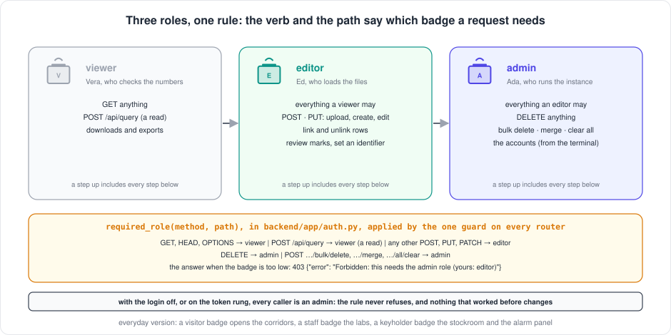

[← README](../../README.md) · [Handbook](../HANDBOOK.md) · [Glossary](../00-glossary.md) · [← Phase SH-3a](phase-sh-3a-token-gate.md)

# Phase SH-3b — Local accounts: one login per person, three roles, a signed session, personal tokens

**Version shipped:** 2.23.0 · **Date:** 2026-09-22 · **Status:** complete (built and rehearsed on the development machine; on the **beta instance** since 19:58 the same day by [Step 9](#step-9--turn-it-on-beta-first), three accounts, confirmed in the browser; on **production** in two moments by [Step 10](#step-10--production-in-two-moments-the-accounts-then-the-switch): its three accounts created on 2026-09-23 ([Step 10a](#step-10a--the-accounts-while-the-login-is-still-the-token), the login still the token), the switch ([Step 10b](#step-10b--the-switch-at-an-announced-moment)) at a moment the owner announces)
**Track:** SH, the shared spine ([roadmap](../05-roadmap.md#sh--shared-spine)); the second rung of the authentication ladder planned in [`13-authentication.md`](../13-authentication.md) and decided in [ADR 0001](../adr/0001-authentication-ladder.md); the owner's go of 2026-09-22, "build on what you have planned".
**Prerequisites:** [Phase SH-3a](phase-sh-3a-token-gate.md) (the guard, the login page, the open health route: this rung drops into all three), [Phase SH-12](phase-sh-12-beta-instance.md) (the beta instance, where the accounts land first); the plan read once; a setup guide completed for your platform; the test virtual environment from its V7 check if you want to run the Python route.
**Learning goal:** you understand what an account is made of and why a password is never stored, how a browser is remembered by a note it can read but cannot forge, why the ten hours now count from your last click, how three roles are decided by one rule rather than a hundred, how a script gets in without a password, how the operator creates, resets, disables and lists accounts from the terminal without ever seeing a password twice, and how to test every one of those claims from the browser, the API, the terminal, the container, Python and the database.
**Deliverable:** with `AUTH_MODE=local` and a `SESSION_SECRET` in an instance's `.env.local`, the instance asks for a **username and a password**. Each account has a **role**, viewer, editor or admin, and the guard applies one rule: reading needs a viewer, writing an editor, deleting an admin; too low a role answers `403` naming the role needed. The browser is remembered by a **signed cookie** that slides for ten hours from the last request. A **personal token** per account lets a script in, and is revoked by name. `./container-py.sh users add · reset · role · enable · disable · unlock · token · remove · list` manages the accounts inside the container; a *Change password* dialog lets each person replace the temporary password they were given. Ten wrong passwords lock an account for fifteen minutes. The `users` table holds hashes, never secrets, and the query console refuses it. Twenty-three new tests; the suite at 192. With the flag at `off` or `token`, nothing changes.


---

## Contents

1. [Why this phase exists](#why-this-phase-exists)
2. [The words you need](#the-words-you-need)
3. [What we built](#what-we-built)
4. [Step 1 — The users table and its migration](#step-1--the-users-table-and-its-migration)
5. [Step 2 — A password is never stored: Argon2](#step-2--a-password-is-never-stored-argon2)
6. [Step 3 — The signed, sliding session](#step-3--the-signed-sliding-session)
7. [Step 4 — Three roles, one rule](#step-4--three-roles-one-rule)
8. [Step 5 — The accounts, from the terminal](#step-5--the-accounts-from-the-terminal)
9. [Step 6 — The login form, who am I, Change password](#step-6--the-login-form-who-am-i-change-password)
10. [Step 7 — Personal tokens for scripts](#step-7--personal-tokens-for-scripts)
11. [Step 8 — Tests, build, rehearsal](#step-8--tests-build-rehearsal)
12. [Step 9 — Turn it on, beta first](#step-9--turn-it-on-beta-first)
13. [Step 10 — Production, in two moments: the accounts, then the switch](#step-10--production-in-two-moments-the-accounts-then-the-switch) · [10a the accounts](#step-10a--the-accounts-while-the-login-is-still-the-token) · [10b the switch](#step-10b--the-switch-at-an-announced-moment)
14. [Rotate the secret, reset a password, go back to the token](#rotate-the-secret-reset-a-password-go-back-to-the-token)
15. [Checkpoint](#checkpoint)
16. [How to test it, by every route](#how-to-test-it-by-every-route)
17. [What this phase deliberately did not do](#what-this-phase-deliberately-did-not-do)
18. [Publish](#publish)

---

## Why this phase exists

The token gate of [phase SH-3a](phase-sh-3a-token-gate.md) closed the
door, and it was the right first lock: nothing from anyone else, fitted in
a day, useful forever for scripts. But it knows one thing, "someone with
the token", and that is not enough for what comes next. The testers on the
beta instance need to be told apart: one of them should be able to look
and not touch, another to upload, only the operator to delete. A leaver
should lose access without everyone else pasting a new token. And the
audit trail the laboratory will eventually want, *who* changed *what*,
cannot be written until the application knows who is asking.

*Everyday version:* the building has a lock now, and one key for the whole
team. This phase gives every person their own badge with their name on it,
tells reception which doors each badge opens, and lets reception cancel one
badge without changing the lock.

This is rung 2 of the ladder, **local accounts**: Crucible keeps its own
list of people. The plan's decision A3 was revisited on 2026-09-21 to build
this rung in full rather than as one emergency admin, because user testing
needs it now and the corporate single sign-on has not been asked for.
Rung 3, single sign-on, is on hold at the owner's request; when it comes,
it replaces the passwords and keeps the accounts and the roles.

---

## The words you need

| Term | Plain words | Everyday version |
|---|---|---|
| **Account** | One row in the users table: a username, a display name, a role, an enabled flag, and the *hash* of a password | One line in reception's register |
| **Password hash** | A one-way scramble of a password. The database can check whether a password matches, but cannot recover the password from it | A fingerprint of the key, kept instead of the key |
| **Argon2 (Argon2id)** | The hashing algorithm chosen by the people who study this; slow and memory-hungry on purpose, so that guessing millions of passwords against a stolen hash is expensive while one honest check takes a fraction of a second | A lock that takes half a second to try one key, so a bag of ten million keys is useless |
| **Signed cookie** | A cookie whose contents can be read but not altered: the server adds a signature made with a secret only it holds, and refuses any cookie whose signature does not match | A dated visitor sticker stamped with reception's own stamp: anyone can read it, nobody else can make one |
| **Session secret** | `SESSION_SECRET`: the key that signs the cookie. In `.env.local`, never printed; a new value signs every browser out at once | Reception's stamp |
| **Sliding session** | The ten hours count from the *last request*, not from the login: a person who keeps working is never interrupted; a browser left alone signs out | The sticker is re-dated each time you pass reception |
| **Role** | What an account may do: **viewer** (read, export, query), **editor** (also upload, link, edit), **admin** (also delete, merge, clear, manage accounts). Each includes the ones below | Visitor, staff and keyholder badges |
| **403 Forbidden** | "I know who you are, and you may not do this"; different from 401, "I do not know who you are" | "Your badge does not open that door" |
| **Personal token** | `<username>:<secret>`: what a script presents instead of a password, as the same bearer header as rung 1; issued for one account, stored as a hash, revoked by name | A key with the holder's name engraved on it |
| **Lockout** | After ten wrong passwords in a row, the account is refused for fifteen minutes, right password or not | The card reader that goes quiet after too many wrong PINs |
| **Temporary password** | The password the operator's command generates and prints once; the person replaces it on the first visit | The PIN in the sealed envelope, changed at the first cash machine |
| **Migration** | A recorded, repeatable change to the database's shape, applied by Alembic when the container starts; this phase adds one, the `users` table | An amendment to the building plans, filed with a number |
| **The switch, in two moments** | How production moves to accounts: the accounts are created first, while the door still takes the token (they are stored and ignored); the mode is switched later, at an announced time. Any length of time may pass between the two | The new badges are printed and handed out during the week; the turnstile is switched to badges at the announced hour, and until then the old key still opens it |

---

## What we built

| Piece | What it is | Where |
|---|---|---|
| The table | `users`: `id`, `username` (unique, indexed), `created_at`, `seq`, `doc`, the same hybrid pattern as every table; migration `0002_users` | `backend/app/models.py`, `backend/alembic/versions/0002_users.py` |
| The accounts module | One module behind the login route, the guard and the script, so they cannot disagree: hashing, creating, resetting, enabling, roles, tokens, the lockout | `backend/app/accounts.py` |
| The settings | `AUTH_MODE=local`, `SESSION_SECRET`, the session's slide interval, the password rule, the lockout numbers | `backend/app/config.py` |
| The guard, extended | `identify()` knows the local mode (cookie or personal token, then a lookup of the account on every request); `required_role()` is the one rule; `require_user` answers 401 or 403 and slides the cookie | `backend/app/auth.py` |
| The door, extended | `POST /api/auth/login` takes `{username, password}`; `POST /api/auth/password` (new) lets a signed-in person change theirs | `backend/app/routers/auth.py` |
| The query console | Refuses the `users` table by name and leaves it out of the schema listing | `backend/app/routers/query.py` |
| The script | `manage_users.py add · reset · role · enable · disable · unlock · token · remove · list`, inside the container | `backend/scripts/manage_users.py` |
| The shortcut | `./container-py.sh users <verb> …`; the script reads and validates the two settings, passes them in, keeps the file owner-only, and in the local mode counts the records from the database in `status`; on the token rung `status` lists the accounts that wait for the switch (v2.23.3) | `container-py.sh` |
| The login page | A username and password form when the mode is `local`; the token box as before when it is `token` | `client/src/pages/Login.jsx` |
| The top bar | Who is signed in, with their role and a hint on what it allows; *Change password*; *Sign out* | `client/src/components/Layout.jsx`, `client/src/components/ChangePassword.jsx` (new) |
| The 403 handler | One toast, the server's own words, from the API layer | `client/src/services/api.js` |
| The deploy check | A nineteenth check with a token: the server says who the token belongs to | `verify-deploy.sh` |
| Two dependencies | `argon2-cffi` (the hashing) and `itsdangerous` (the signed cookie), through the lock | `backend/requirements.txt`, `backend/requirements.lock` |
| Tests | Twenty-three: the settings, the primitives, the rule, every wrong login, the cookie, the slide, disabling, resetting, the lockout, the three roles, the token, the password change, the hashes never leaving, the script, the migration | `backend/tests/test_auth_local.py` |
| Figures | The login with accounts; the three roles and the rule; the life of an account; the two moments of production's switch (v2.23.3) | `docs/img/fig_local_login.svg`, `fig_roles.svg`, `fig_account_lifecycle.svg`, `fig_two_moments.svg` |

---

## Step 1 — The users table and its migration

**What:** a place to keep the accounts, in the same shape as every other
record, and a migration that creates it on every existing database.

**How:** `backend/app/models.py` gains a fifth model, `User`, with the same
five columns as the others: `id`, the business key `username` (unique,
indexed), `created_at`, `seq` and `doc`. The document holds everything
else:

```json
{"username": "alice", "display_name": "Alice Smith", "role": "editor", "enabled": true,
 "password_hash": "$argon2id$v=19$m=65536,t=3,p=4$…", "password_version": 1,
 "token_hash": null, "token_issued_at": null,
 "created_at": "…", "updated_at": "…", "last_login": null, "failed_attempts": 0, "locked_until": null}
```

`backend/alembic/versions/0002_users.py` creates the table and its two
indexes; `store.py` learns that the table's key column is `username`.

**Why the same pattern.** [The one design rule](../02-architecture.md#the-one-design-rule-everything-else-follows-from):
the document is the truth and every other column is a derived index. An
account is a record like any other, and keeping it in the same shape means
the same `store` verbs, the same backup, the same restore, the same
migration machinery, with nothing new to learn.

**Why a migration and not `create_all`.** In the container Alembic owns the
schema ([phase 01](phase-01-postgres-alembic.md)): the entrypoint runs
`alembic upgrade head` before the application starts, so a database that
was at `0001_initial` gains the empty table on the first start after this
version, on SQLite and on PostgreSQL alike, with nothing else touched.
Downgrading drops it again.

**You should see** (the container's log, on the first start after the rebuild):

```
[db_bootstrap] Alembic-managed database -> upgrade head
[db_bootstrap] schema is at head.
```

and inside the container:

```
$ podman exec crucible-py python -c "import sqlite3; db=sqlite3.connect('/app/data/crucible.db'); print([r[0] for r in db.execute(\"SELECT name FROM sqlite_master WHERE type='table' ORDER BY name\")], db.execute('SELECT version_num FROM alembic_version').fetchone())"
['alembic_version', 'chemicals', 'samples', 'screening', 'toxicology', 'users'] ('0002_users',)
```

**What it means:** the schema is at revision `0002_users`; the table
exists and is empty; the 12,539 compounds and the 49,065 rows were not
touched.

**If instead:** `✗ There is no users table: the database has not been
migrated to v2.23.0` from a `users` command — the container runs an older
image, or was started without the entrypoint. `./container-py.sh rebuild`
in that folder.

---

## Step 2 — A password is never stored: Argon2

**What:** the one property everything else rests on. The database holds a
*hash* of each password, not the password; it can check, never reveal.

**How:** `backend/app/accounts.py`:

```python
_hasher = PasswordHasher()                       # Argon2id, the library's defaults

def hash_password(password: str) -> str:
    return _hasher.hash(password)

def verify_password(password_hash, password) -> bool:
    try:
        return _hasher.verify(password_hash, password)
    except VerificationError:
        return False
```

One rule for a password: at least eight characters (`PASSWORD_MIN_LENGTH`).

**Why Argon2id, and why a library.** Rule 4 of the plan: passwords are
hashed with Argon2id, never home-made. Argon2 won the public competition
held to choose a password hash (2015), and it is deliberately *slow and
memory-hungry*: one honest check costs a fraction of a second and 64 MB,
which nobody notices at a login, while someone holding a stolen hash and
trying ten million guesses pays that cost ten million times. The `id`
variant resists both kinds of attack the competition considered. The
`argon2-cffi` library is the maintained binding of the reference
implementation; its defaults are the current recommendation, and its hash
strings record their own parameters (`m=65536,t=3,p=4`), so raising them
later is a change of a constant and old hashes keep verifying.

**Why only a length rule.** Length is the one rule that measurably helps;
composition rules ("one digit, one symbol") produce `Password1!` and
annoyance in equal measure. Argon2's cost and the lockout of Step 5 do the
rest.

**You should see** (the Python route, from `backend/`):

```
$ .venv/bin/python -c "from app import accounts; h = accounts.hash_password('correct horse battery staple'); print(h[:30], accounts.verify_password(h, 'correct horse battery staple'), accounts.verify_password(h, 'wrong'))"
$argon2id$v=19$m=65536,t=3,p=4 True False
```

**What it means:** the hash names its algorithm and its cost, verifies the
right password, refuses a wrong one, and contains nothing of the password.
Hash the same password twice and you get two different strings: each is
salted.

**If instead:** `ModuleNotFoundError: No module named 'argon2'` — the
virtual environment predates this version: `cd backend && .venv/bin/pip
install -r requirements.lock`.

---

## Step 3 — The signed, sliding session

**What:** how the browser is remembered after the login, without the
server storing anything and without the cookie holding a secret.

**How:** the `itsdangerous` library signs a small payload with the
`SESSION_SECRET` and a timestamp; `backend/app/auth.py`:

```python
def issue_session(user):
    return _signer().dumps({"u": user["username"], "v": user["password_version"]})

def read_session(value):
    payload, issued = _signer().loads(value, max_age=config.SESSION_HOURS * 3600, return_timestamp=True)
    ...
```

The cookie is the same `crucible_session`, with the same flags as rung 1:
`HttpOnly`, `SameSite=Lax`, `Secure` on HTTPS, `Max-Age` ten hours. On
every request the guard reads it, checks the signature and the age, looks
the account up (still there? still enabled? same password version?) and,
if the cookie is older than five minutes, sends a freshly signed one back
with the answer.

**Why signed and not encrypted.** The cookie holds a username and a
number; nothing in it is secret, so nothing is lost if it is read. What
must be impossible is *making* one, and a signature does exactly that:
without the secret, no valid cookie can be produced, and one changed
character breaks it. Rung 1's cookie was a keyed hash of the token
because there was nothing to name; rung 2 has a name to carry.

**Why the password version is in it.** When a password is reset, or the
person changes it, the version moves, and every cookie issued under the
old version stops matching: a reset signs that person out of every
browser, with nothing stored server-side. The same lookup refuses a
disabled account on its next click. One minute of grace: a cookie of the
*previous* version is still honoured for sixty seconds after the change,
and such a request is handed the new cookie, because the browser that
changes its own password has slow requests in flight with the old one, and
a 401 on any of them would sign it out the moment it succeeded (found by
driving the page against the 12,539 real rows; [lesson 40](../11-lessons-learned.md)).
A disabled account gets no grace: that check is on the account, not the
version.

**Why it slides, finally.** Decision A6 asked for ten hours *sliding*;
rung 1 could not (a keyed hash carries no timestamp). Now the cookie is
re-issued after five minutes of age, so a person who keeps working is
never interrupted, and a browser left alone for ten hours is out.

**You should see:**

```
$ curl --noproxy '*' -sS -c jar.txt -D- -H 'Content-Type: application/json' -d '{"username":"ed","password":"…"}' http://localhost:49160/api/auth/login | grep -i set-cookie
set-cookie: crucible_session=eyJ1IjoiZWQiLCJ2IjoyfQ.arLPkw.IjUb0f43V54Gz0hWjE4LYjR5GPk; HttpOnly; Max-Age=36000; Path=/; SameSite=lax
$ echo eyJ1IjoiZWQiLCJ2IjoyfQ | base64 -d; echo
{"u":"ed","v":2}
```

**What it means:** three parts separated by dots: the payload (readable:
user `ed`, password version 2), the timestamp, the signature. Change any
character and the guard answers 401. Replay the value as a bearer header
and it also answers 401: a cookie is not a token.

**If instead:** signed in, but every click after a few minutes shows the
login page again — the container's clock is wrong by more than ten hours
(the timestamp is compared with the server's `time.time()`); `date` on
the server and `podman exec … date` inside should agree to the minute.

---

## Step 4 — Three roles, one rule

**What:** what each account may do, decided in one place.

**How:** `backend/app/auth.py`:

```python
def required_role(method: str, path: str) -> str:
    if method in ("GET", "HEAD", "OPTIONS"):
        return "viewer"
    if method == "DELETE":
        return "admin"
    if any(path.endswith(s) for s in ("/bulk/delete", "/merge", "/all/clear")):
        return "admin"
    if path in ("/api/query",):
        return "viewer"
    return "editor"
```

`require_user` applies it after the identity is known: `who.can(needed)`
or `403 {"error": "Forbidden: this needs the admin role (yours: editor)"}`.
Each role includes the ones below (`role_includes`).



**Why one rule and not a declaration on each route.** The same reason
the guard is declared per router in SH-3a: a rule that must be repeated on
every route is followed on nine and forgotten on the tenth, and the tenth
is the one that deletes. HTTP already says what a request *does*: `GET`
reads, `POST` and `PUT` write, `DELETE` deletes. The rule needs two
exceptions and states both: the read-only SQL console is a `POST` that
only reads, so a viewer may use it; and three `POST` routes destroy or
reshape records with one call (bulk delete, merge, clear all), so they
need an admin like `DELETE` itself.

**Why 403 says the role.** Rule 5 of the plan hides the reason from a
caller who has *not* identified themselves. A caller who has is known,
and telling them "this needs the admin role" is help, not a leak.

**Why nothing changes on the other rungs.** With the login off, everyone is
`ANYONE` with roles `["admin"]`; on the token rung everyone is the token
holder, also an admin. The rule never refuses either, so the 150 contract
tests run unchanged and a token-gated instance behaves exactly as before.

**You should see** (three people, three answers to the same request):

```
vera (viewer)  POST /api/chemicals → {"error":"Forbidden: this needs the editor role (yours: viewer)"} 403
ed   (editor)  POST /api/chemicals → 201 · PUT → 200 · DELETE → {"error":"Forbidden: this needs the admin role (yours: editor)"} 403
ada  (admin)   DELETE /api/chemicals/CHEM-REHEARSAL → {"message":"Chemical deleted successfully"} 200
```

**What it means:** the same route, three verdicts, by role alone; the
viewer's `POST` wrote nothing.

**If instead:** an editor's *Delete* button in the page answers a red
toast, *Forbidden: this needs the admin role (yours: editor)* — that is the
rule working; the button is not yet greyed out by role, which is SH-4.

---

## Step 5 — The accounts, from the terminal

**What:** how accounts are made, changed and removed, without a page for
it, and without the operator ever seeing a password twice.

**How:** `backend/scripts/manage_users.py` inside the image, run as
`./container-py.sh users <verb> …` from the instance's folder (which is
`podman exec <container> python /app/backend/scripts/manage_users.py …`,
with the terminal's input attached only for `--password-stdin` and
`--prompt`, the two verbs that read a password from it):

| Verb | What it does | What it prints |
|---|---|---|
| `add <name> [--role viewer\|editor\|admin] [--name "Display Name"]` | creates the account; the role defaults to viewer | a **temporary password, once** (or `--prompt` to type one twice, hidden; `--password-stdin` for a script) |
| `reset <name>` | a new password; every browser signed in as them is signed out | a temporary password, once (same options) |
| `role <name> <role>` | changes the role | `✓ alice is now admin` |
| `disable <name>` / `enable <name>` | a leaver: refused at once at the login page, by cookie and by token; and back | `✓ alice disabled: refused … from now` |
| `unlock <name>` | clears the lockout after ten wrong passwords | `✓ alice unlocked` |
| `token <name>` / `token <name> --revoke` | a personal token for scripts (Step 7), once; or ends it | `alice:…`, once |
| `remove <name> [--apply]` | deletes the account itself; a report without `--apply` | `Would remove …` / `✓ Removed alice` |
| `list [--json]` | every account: role, state, token, last login | never a hash |


**Why a script and not a page.** Decision A10: one operator, a handful of
testers, and a script that has to exist anyway so that the *first* admin
can be created and a locked-out operator can always get back in. The
script talks to the database directly, inside the container, so it works
whatever `AUTH_MODE` says: you create the accounts *before* switching the
mode, and nothing can lock you out. An accounts page in the browser is
SH-4.

**Why the password is generated and shown once.** The operator must hand
something over; a random sixteen-character temporary password, printed
once, handed over out of band (in person, or the organisation's password
manager, never an e-mail body) and replaced by the person on their first
visit (*Change password*, Step 6) is the least the operator can know. What
the table keeps is the hash.

**Why the lockout lives on the account.** Ten wrong passwords in a row set
`locked_until` fifteen minutes ahead; the right password is refused until
then, the log names the user and the count (never the password), and
`unlock` lifts it early. An unknown username is never counted: there is
nothing to lock and nothing for a guesser to learn. With the quarter-second
pause on every wrong login and Argon2's own cost, it is the third brake.

**You should see:**

```
$ ./container-py.sh users list
No accounts yet. Add the first administrator:  ./container-py.sh users add <name> --role admin
$ ./container-py.sh users add ada --role admin --name "Ada Admin"
✓ Added ada (admin), enabled
  temporary password: idrwguaCZAXtqF1K
  Shown once. Hand it over out of band; the person changes it in the page (Change password).
$ echo 'editor-pass-1' | ./container-py.sh users add ed --role editor --name "Ed Editor" --password-stdin
✓ Added ed (editor), enabled
$ ./container-py.sh users add ed
✗ a user named 'ed' already exists
$ ./container-py.sh users list
3 accounts:
  ada                  admin   enabled            no token                     last login never   Ada Admin
  ed                   editor  enabled            no token                     last login never   Ed Editor
  vera                 viewer  enabled            no token                     last login never   Vera Viewer

Roles: viewer reads, exports and queries; editor also uploads, links and edits; admin also deletes, merges and clears.
```

**What it means:** three accounts, one per role, one temporary password
shown and gone. A username is lowercased on the way in (`Bad.Name` becomes
`bad.name`): one account, one spelling, and the login page is not
case-sensitive either.

**If instead:** `✗ crucible-py is not running: the accounts live in its
database` — the script needs the container up (`./container-py.sh start`).
`✗ a username is 2 to 32 lowercase letters, digits, dots, hyphens or
underscores` — a space or a symbol in the name. The lines you pasted
*after* a `users` command did not run, with no error — the v2.23.0
shortcut attached the terminal's input to the container for every verb,
and the container read the rest of the paste (seen on the server while
proving block 3; [lesson 41](../11-lessons-learned.md)); since v2.23.1
only the two password-reading verbs attach it, and a pasted block runs as
one.

---

## Step 6 — The login form, who am I, Change password

**What:** what a person sees.

**How, in the browser:** the same gate and the same login page as SH-3a;
`GET /api/auth/me` now answers `"mode":"local"`, so the page shows a
**Username** and a **Password** box instead of the token box, under the
same instance pill. *Sign in* posts both to `POST /api/auth/login`; the
server checks the hash, sets the signed cookie, and answers the identity:

```json
{"mode":"local","authenticated":true,"user":{"subject":"ed","display_name":"Ed Editor","roles":["editor"],"via":"local"}}
```

The top bar then shows **who** is signed in, with a role pill (hover it:
*editor: you can also upload, link and edit; deleting and merging need an
admin*), a **Change password** button and **Sign out**. *Change password*
opens a dialog: the current password, the new one twice; the server checks
the current one, applies the length rule, moves the password version (every
*other* browser of that person is signed out within a minute) and hands
this browser a fresh cookie so it stays in. A 403 from any action shows one
red toast with the server's words; the action simply did not happen.

**Why the same words for every wrong login.** *That username and password
were not accepted. Check both and try again.* — for a wrong password, an
unknown name, a disabled account and a locked one alike (rule 5). The
login page's footer says so, and says why.

**Why a person changes their own password.** The operator knows the
temporary one; after the first visit nobody but the person does. The
dialog is the only place a password is typed that the operator never sees.

**You should see:** the login page with the pill and the two boxes; after a
wrong password, the sentence above; after the right one, the page you asked
for with *Ada Admin* and an **ADMIN** pill in the top bar; after a reload,
still signed in; the dialog refusing a wrong current password with *The
current password is not right*; a green *Password changed. Any other
browser signed in as you is signed out within a minute.*; after *Sign out*,
the login page, where the old password is now refused and the new one
accepted.

**If instead:** the page still shows *Sign in with the access token* — the
tab holds the old page or the container was not recreated after the mode
changed; reload (Ctrl+F5, Cmd+Shift+R on macOS), then check
`curl …/api/auth/me` says `local`. The dialog says *You are no longer
signed in* — the session expired or the account was reset while the dialog
was open; sign in again.

---

## Step 7 — Personal tokens for scripts

**What:** how `curl`, `verify-deploy.sh` and any script get in without a
password, and how each is revoked on its own.

**How:** `./container-py.sh users token <name>` generates
`<username>:<48 random characters>`, prints it once and stores its SHA-256
on the account; a script sends it as the same header as rung 1,
`Authorization: Bearer <the token>`. The guard splits the name off, finds
the account, compares the hash in constant time, and checks the account is
enabled; the identity is the account's, `via: "token"`, with the account's
role. `--revoke` clears the hash; a second `token` replaces the first.

**Why the name is in the token.** A key with a name engraved on it: the
lookup is direct (no scanning every account on every request), the
operator sees at a glance whose token a script holds, `list` shows who has
one, and a leaver's token dies with the account. The name is not a secret;
the 48 characters after the colon are.

**Why SHA-256 here and Argon2 for passwords.** Argon2 is slow on purpose,
to make guessing a *human* password expensive. A token is 48 random
characters, which nobody guesses in the lifetime of the universe; what
matters is that the *stored* form cannot be turned back into the token if
the database leaks, and a fast one-way hash does that without making every
script call wait half a second.

**Why the shared token retires.** In the local mode `CRUCIBLE_TOKEN` is
ignored: a shared key with no name on it is what this rung replaces. The
line may stay in `.env.local` as the way back to the token mode.

**The deploy check learns who.** `verify-deploy.sh` gains a nineteenth
check with a token: `/api/auth/me` must name the caller. A gate that lets
a token in but cannot say whose it is would be a gate with no register.

**You should see:**

```
$ ./container-py.sh users token ed
✓ Personal token for ed (any older one is void):
  ed:zvuYd8_gcn3rQ74vuSoXJ1OqM1lI5Nmk6kQpSmQQbIO4sPfz
  Shown once. Scripts send it as:  -H "Authorization: Bearer <the token>"
$ curl --noproxy '*' -sS -H "Authorization: Bearer ed:zvuY…" http://localhost:49160/api/auth/me
{"mode":"local","authenticated":true,"user":{"subject":"ed","display_name":"Ed Editor","roles":["editor"],"via":"token"}}
$ CRUCIBLE_TOKEN="ada:…" ./verify-deploy.sh http://localhost:49160 | grep -E 'belongs|passed'
   PASS  the server says who this token belongs to: ada (admin) via token
  19 passed, 0 failed
```

**What it means:** the token carries the account's identity and role (an
editor's token cannot delete either), and the deploy checks run through
the gate and name the caller. The whole walk for a script, from asking for
the token to cancelling it, with a shell script and a Python script that
use it, is one section of the cookbook:
[A script with a personal token, start to finish](../08-api-cookbook.md#a-script-with-a-personal-token-start-to-finish).

**If instead:** `401` with a token you just issued — a character was lost
in the copy (the token is one line, colon included), or the account was
disabled, or a second `token` command replaced it.

---

## Step 8 — Tests, build, rehearsal

**What:** prove it on the development machine before any server sees it.

**How (development machine):**

```bash
cd ~/Documents/Work/pandora_toolbox/nr-nips-crucible
./container-py.sh lock                                     # the two new dependencies, resolved inside the base image
cd backend && .venv/bin/pip install -r requirements.lock && .venv/bin/ruff check . && .venv/bin/pytest -p no:warnings 2>&1 | grep -E '[0-9]+ (passed|failed)' && cd ..
for f in container-py.sh setup-after-clone-py.sh monitor.sh verify-deploy.sh; do bash -n $f; done
cd client && npm run build && cd ..
python3 docs/img/make_figures.py && python3 docs/img/make_figures.py && git status --short docs/img   # deterministic: no diff on the second run
# the rehearsal: the two settings from the environment, so no .env.local is written on this machine
SESSION_SECRET="$(python3 -c 'import secrets; print(secrets.token_urlsafe(48))')"
AUTH_MODE=local SESSION_SECRET="$SESSION_SECRET" ./container-py.sh rebuild
./container-py.sh users add ada --role admin --name "Ada Admin"
```

**Why the lock first.** Two new packages enter the image only through
`requirements.lock` ([phase 05b](phase-05b-reproducible-builds-and-ci.md));
the Dockerfile, CI and the test virtual environment all install from it.
The resolve refreshed a few other pins on the way (SQLAlchemy, uvicorn,
pandas, psycopg and friends), which is what a fresh resolve does; the
tests ran green on them.

**You should see:** `All checks passed!` · `192 passed` · the client build
in about three seconds · the image build, then `✓ The application answers
at http://localhost:49160/api/health`, and the first `users add` printing a
temporary password. The whole rehearsal, route by route, is the
[test table](#how-to-test-it-by-every-route) below; the right-hand column
is what it printed here.

**If instead:** `✗ AUTH_MODE=local over plain HTTP on 0.0.0.0` — a Linux
or Windows development machine publishes on every interface; enable HTTPS
or, on a machine only you can reach, prefix `CRUCIBLE_ALLOW_HTTP_LOGIN=true`.
`✗ AUTH_MODE=local needs SESSION_SECRET of at least 32 characters` — the
variable is empty in this shell.

To put the development machine's container back the way it was (login
off): `./container-py.sh stop && podman rm crucible-py && ./container-py.sh start`.
The accounts stay in `data/crucible.db`; they are ignored while the login
is off.

---

## Step 9 — Turn it on, beta first

**What:** accounts on the **beta instance**, and only there (decisions A9
and B5). Production keeps its token until the testers have used their
accounts for a while and its own accounts exist; that is Step 10, in
two moments.

**How (server, beta folder), after block 3 of the six has pulled and
rebuilt this version.** The rebuild started the new image, whose entrypoint
ran the migration; the login is still the token, and the table is empty.
Four moves: check, create the accounts, switch the mode, prove it.

```bash
# ▶ VM - beta folder
cd ~/work/Pandora_toolbox/nr-nips-crucible-beta
git log --oneline -1                      # the v2.23.0 commit
podman logs crucible-py-beta 2>&1 | grep db_bootstrap      # Alembic-managed database -> upgrade head · schema is at head.
# 1. the accounts, while the login is still the token: yours first, as admin, then one per tester
./container-py.sh users add <your-username> --role admin --name "<Your Name>"
./container-py.sh users add <tester> --role editor --name "<Tester's Name>"      # or --role viewer
./container-py.sh users list
# 2. the mode: AUTH_MODE becomes local, a SESSION_SECRET is generated straight into the file; the CRUCIBLE_TOKEN line stays (ignored, and your way back)
sed -i 's|^AUTH_MODE=.*|AUTH_MODE=local|' .env.local
printf 'SESSION_SECRET=%s\n' "$(python3 -c 'import secrets; print(secrets.token_urlsafe(48))')" >> .env.local
chmod 600 .env.local
grep -c . .env.local                      # seven lines: CERT_SOURCE, USE_HTTPS, CRUCIBLE_INSTANCE, CRUCIBLE_PORT, AUTH_MODE, CRUCIBLE_TOKEN, SESSION_SECRET
./container-py.sh help | grep Usage       # … · login: local)
# 3. a setting reaches the container only when the container is recreated
./container-py.sh backup
./container-py.sh stop
./container-py.sh start
```

**Why the accounts before the switch.** The script works whatever the mode
says, so the order does not matter for safety; it matters for people: the
moment `start` finishes, the login page asks for a username, and every
tester should already have one. Write each temporary password down as it
is printed (it is printed once), and hand them over out of band.

**Why `stop` then `start`, not `restart`.** The same reason as SH-3a: the
service's unit records the run command the container was created with,
old environment included; `stop` through the service removes the
container, `start` creates one from the current file and rewrites the
unit, owner-only.

**You should see:**

```
✓ Added <your-username> (admin), enabled
  temporary password: …
  Shown once. Hand it over out of band; the person changes it in the page (Change password).
…
Usage: ./container-py.sh [command]        (runtime: podman · instance: beta → crucible-py-beta, port 49161 · login: local)
…
Stopping the application through its service container-crucible-py-beta.service...
✓ container-crucible-py-beta.service stopped; the container is removed (start, or the next boot, recreates it)
…
Rewriting container-crucible-py-beta.service from the container just created (the unit records the exact run command)...
✓ container-crucible-py-beta.service rewritten (enabled: enabled)
Handing the container to the service container-crucible-py-beta.service, which runs it from now on...
✓ container-crucible-py-beta.service is active: the service runs the application (systemctl --user status container-crucible-py-beta.service)
✓ The application answers at https://localhost:49161/api/health
✓ Container started with HTTPS
```

Then prove it, from the same folder:

```bash
curl --noproxy '*' -sSk https://localhost:49161/api/stats; echo            # {"error":"Not authenticated"}
curl --noproxy '*' -sSk https://localhost:49161/api/health; echo           # {"status":"ok"}
curl --noproxy '*' -sSk https://localhost:49161/api/auth/me; echo          # {"mode":"local","authenticated":false,"user":null}
./container-py.sh users token <your-username>                               # your personal token, once; keep it in your password manager
CRUCIBLE_TOKEN='<your-username>:…' ./verify-deploy.sh https://localhost:49161   # 19 passed
./container-py.sh status | tail -5                                          # login: local · the counts from the database · the accounts
./monitor.sh | tail -1                                                      # ✓ crucible-py-beta is healthy
ls -l .env.local ~/.config/systemd/user/container-crucible-py-beta.service  # -rw------- both
curl --noproxy '*' -sSk https://localhost:49160/api/auth/me; echo          # production: {"mode":"token",…}, unchanged
```

Then the browser: `https://<vm-hostname>:49161` shows the login page with
the amber **Beta** pill and the two boxes; sign in with your username and
the temporary password; *Change password* in the top bar, first thing.
Each tester does the same on their first visit.

**What it means:** beta asks every person who they are, its monitor and
service are green, the deploy checks pass through the gate and name you,
and production has not changed.

**If instead:** the login page still shows the token box — reload the tab.
`✗ AUTH_MODE=local needs SESSION_SECRET …` — the `printf` did not land;
`tail -2 .env.local`. A tester's login answers *not accepted* although the
password was copied carefully — `./container-py.sh users list` shows
`LOCKED` after ten tries (`users unlock <name>`) or the account disabled;
otherwise `users reset <name>` and hand the new one over. **After a
`restore` from production's backup**, beta's `users` table is production's
(the accounts live in the database like everything else): create the
testers again with `users add`, and note that production's accounts, if
any, now exist on beta too.

---

## Step 10 — Production, in two moments: the accounts, then the switch

**What:** the same four moves as Step 9 in production's folder, split into
**two moments**, the owner's decision of 2026-09-23: the accounts first
(Step 10a, at any quiet moment), the switch later (Step 10b, at a moment
the owner announces, once every person holds their password). Until 10b
production keeps `AUTH_MODE=token` with its own token, exactly as since
v2.22.1: the promotion of v2.23.0 added an empty `users` table and changed
nothing else.


**Why two moments and not one.** A temporary password is handed over out
of band, one person at a time, and people are not all at their desks at
once. If the accounts and the switch were one block, the door would ask
for a username the moment `start` finished, and whoever had not yet
received their password would be locked out of the real registry. Created
ahead, an account costs nothing: the management script writes to the
table whatever the mode says, and the door on the token rung never reads
that table (it compares the shared token, nothing else). So the operator
creates the accounts on a quiet morning, hands the passwords over during
the week, and flips the door at the announced hour, with a `stop` and a
`start` that take a minute. *Everyday version:* the new badges are printed
and handed out during the week; the turnstile is switched to badges at
the announced hour, and until then the old key still opens it.

**Why its own accounts and its own secret.** Decision A11 for the secret,
as for the token: generated in production's folder, never copied from
beta's. The accounts are per instance too: they live in each database, so
a beta password does not open production and a production one does not
open beta, even for the same username. The owner decided that production
gets **the same three accounts as beta** (the operator as admin, one
editor, one viewer), under the same usernames so that nobody has a second
name to remember; the roles are the ones agreed for the laboratory and
change later with one `users role <name> <role>`, and more people are one
`users add` each.

### Step 10a — The accounts, while the login is still the token

**What:** three `users add` lines and a `users list`, in production's
folder, nothing else. The settings file is not touched, the container is
not restarted, and nobody using production notices.

**How (server, production folder):**

```bash
# VM - production folder; the container runs v2.23.0 or later (block 6 rebuilt it)
cd ~/work/Pandora_toolbox/nr-nips-crucible
git log --oneline -1                                                        # the tip of master, v2.23.x
./container-py.sh users add <your-username> --role admin --name "<Your Name>"
./container-py.sh users add <editor> --role editor --name "<Their Name>"
./container-py.sh users add <viewer> --role viewer --name "<Their Name>"
./container-py.sh users list
curl --noproxy '*' -sSk https://localhost:49160/api/auth/me; echo           # still the token
./container-py.sh status | tail -3
```

**Why `users add` works before the switch.** The shortcut runs
`manage_users.py` inside the container, against the database directly
([Step 5](#step-5--the-accounts-from-the-terminal)); it reads the mode for
nothing. The door reads the mode and, on the token rung, only the shared
token. Three rows appear in the table; the door does not look at them yet.

**You should see** (the rehearsal on the development machine, 2026-09-23,
on the token rung; the server prints the same with the real names, and an
`Ignoring PORT=3000` line first, which is harmless: the server's shell
exports a generic `PORT` that the script ignores):

```
✓ Added <your-username> (admin), enabled
  temporary password: …
  Shown once. Hand it over out of band; the person changes it in the page (Change password).
✓ Added <editor> (editor), enabled
  temporary password: …
  Shown once. Hand it over out of band; the person changes it in the page (Change password).
✓ Added <viewer> (viewer), enabled
  temporary password: …
  Shown once. Hand it over out of band; the person changes it in the page (Change password).
3 accounts:
  <your-username>      admin   enabled            no token                     last login never   <Your Name>
  <editor>             editor  enabled            no token                     last login never   <Their Name>
  <viewer>             viewer  enabled            no token                     last login never   <Their Name>

Roles: viewer reads, exports and queries; editor also uploads, links and edits; admin also deletes, merges and clears.
{"mode":"token","authenticated":false,"user":null}
login: token — the page asks for it once; scripts send it as Authorization: Bearer (docs/13-authentication.md)
{"chemicals":{"total":12539,"max":15000},"samples":{"total":0,"max":1000},"screening":{"total":49065},...
accounts: 3 (<editor> editor, <viewer> viewer, <your-username> admin), waiting: the login uses them once AUTH_MODE=local (docs/13-authentication.md)
```

**What it means:** three rows in production's `users` table, each holding
a hash and never the password; the door has not changed (`"mode":"token"`);
and the last line, new with v2.23.3, is `status` telling the whole truth:
the accounts exist and are waiting for the switch (before v2.23.3 `status`
said `login: token` and nothing about them). Write each temporary password
down **as it is printed** and hand it over out of band; nothing else
happens until Step 10b. The beta passwords do not carry over: beta and
production are two databases, so the same three usernames have new hashes
here, and each person receives a new temporary password for production.

**If instead:** `✗ crucible-py is not running: the accounts live in its
database` → `./container-py.sh start` (or `status` to see why it is
down: [`15-run-stop-status.md`](../15-run-stop-status.md)).
`✗ a user named '<name>' already exists` → the block was run twice, or the
name was created earlier: `users list` shows it, and `users reset <name>`
issues a fresh temporary password if the first was lost. A temporary
password pasted into a chat or an e-mail by mistake → `users reset <name>`
at once; the old one is dead (what happened on beta on 2026-09-22, three
resets, no harm). A person tries their new username on production's login
page before Step 10b → refused, by design: the page still wants the token,
and tells them so in its title, *Sign in with the access token*.

### Step 10b — The switch, at an announced moment

**What:** the mode flips to `local` with production's own
`SESSION_SECRET`; a backup, a `stop` and a `start`; then the proofs.
**Announce the minute.** At the `stop`, every browser signed in with the
token is out (the token cookie fails the new signature) and the page asks
for a username from then on; a script that still sends the shared token
answers 401 until it is given a personal token.

**How (server, production folder, at the announced moment):**

```bash
# VM - production folder, at the announced moment; every person holds their password
cd ~/work/Pandora_toolbox/nr-nips-crucible
./container-py.sh users list                                                # the accounts from Step 10a
sed -i 's|^AUTH_MODE=.*|AUTH_MODE=local|' .env.local
printf 'SESSION_SECRET=%s\n' "$(python3 -c 'import secrets; print(secrets.token_urlsafe(48))')" >> .env.local
chmod 600 .env.local
grep -c '^SESSION_SECRET=' .env.local                                       # 1
./container-py.sh help | grep Usage                                         # ... login: local)
./container-py.sh backup
./container-py.sh stop
./container-py.sh start
```

Then the proofs, from the same folder:

```bash
curl --noproxy '*' -sSk https://localhost:49160/api/auth/me; echo           # {"mode":"local","authenticated":false,"user":null}
curl --noproxy '*' -sSk https://localhost:49160/api/stats; echo             # {"error":"Not authenticated"}
curl --noproxy '*' -sSk https://localhost:49160/api/health; echo            # {"status":"ok"}
T="$(./container-py.sh users token <your-username> | awk '/^  <your-username>:/{print $1}')"
CRUCIBLE_TOKEN="$T" ./verify-deploy.sh https://localhost:49160 | grep -E 'belongs|passed'   # <your-username> (admin) via token · 19 passed, 0 failed
./monitor.sh | tail -1                                                      # ✓ crucible-py is healthy
./container-py.sh status | tail -4                                          # login: local · the counts from the database · accounts: 3 (...)
ls -l .env.local ~/.config/systemd/user/container-crucible-py.service      # -rw------- both
diff <(grep '^SESSION_SECRET=' .env.local) <(grep '^SESSION_SECRET=' ../nr-nips-crucible-beta/.env.local) >/dev/null && echo "SAME secret on both" || echo "two different secrets, as intended"
curl --noproxy '*' -sSk https://localhost:49161/api/auth/me; echo           # beta: {"mode":"local",...}, unchanged
```

**You should see:** the same lines as Step 9 with
`container-crucible-py.service` and port 49160 (`Stopping the application
through its service` … `rewritten` … `is active` … `answers at
https://localhost:49160/api/health`); `19 passed, 0 failed` with your
username; `two different secrets, as intended`. In the browser,
`https://<vm-hostname>:49160` shows the login page with the indigo
**Prod** pill and the two boxes; sign in with your username and the
temporary password from Step 10a, then *Change password* in the top bar,
first thing. The `$T` line keeps your personal token in that terminal
only ([the cookbook walks a script through it](../08-api-cookbook.md#a-script-with-a-personal-token-start-to-finish)).

**What it means:** the laboratory's people each have a login of their own
on the real registry, the shared token has retired there too, a leaver is
one `users disable` away from being out, and beta was not touched.

**If instead:** the `$T` line prints nothing → the `awk` pattern must
carry your exact username (the token is the second line of the command's
output, indented two spaces); `19 passed` missing → the token in `$T` is
empty or another account's. Someone cannot sign in → `users list` shows
`LOCKED` (`users unlock`) or `DISABLED` (`users enable`); otherwise `users
reset <name>` and hand the new one over. The way back, at any time, is
one line and a restart: the next section.

---

## Rotate the secret, reset a password, go back to the token

**Rotate the session secret** (a leak, or once a quarter): a new value in
the file, then the container recreated. Every browser is signed out at
once; personal tokens are unaffected (they are checked against the table,
not signed).

```bash
# ▶ VM - the instance's folder
new="$(python3 -c 'import secrets; print(secrets.token_urlsafe(48))')" && sed -i "s|^SESSION_SECRET=.*|SESSION_SECRET=${new}|" .env.local && unset new
./container-py.sh stop && ./container-py.sh start
```

**Reset a password, disable a leaver, revoke a token:** one `users` command
each, no restart, effective on the person's next request
([Step 5](#step-5--the-accounts-from-the-terminal)).

**Go back to the token mode:** `sed -i 's|^AUTH_MODE=.*|AUTH_MODE=token|' .env.local`
(the `CRUCIBLE_TOKEN` line is still there), then the same `stop` and
`start`. The accounts stay in the database, ignored until the mode is
`local` again. **Turn the login off** the same way with `AUTH_MODE=off`.

On a development machine, which has no service, use `./container-py.sh rebuild`
or remove the container by hand between the `stop` and the `start`.

---

## Checkpoint

On the beta instance, from its folder on the server, with your personal token in `$T`:

```bash
curl --noproxy '*' -sSk https://localhost:49161/api/auth/me; echo
curl --noproxy '*' -sSk -H "Authorization: Bearer $T" https://localhost:49161/api/auth/me; echo
CRUCIBLE_TOKEN="$T" ./verify-deploy.sh https://localhost:49161 | tail -2
./container-py.sh users list | head -3
```

**You should see** `{"mode":"local","authenticated":false,"user":null}`;
then the same with `"authenticated":true` and your username, display name
and role; `19 passed, 0 failed` with `Everything checks out.`; and the
accounts, one per tester. In the browser, `https://<vm-hostname>:49161`
shows the login page with the amber **Beta** pill and the two boxes; a
tester with the viewer role sees *Forbidden: this needs the admin role
(yours: viewer)* when they try a delete. That is "done" as the plan defined
it: each tester logs in with a username and password on beta, a disabled
account is refused, a viewer cannot delete, the monitor is green, the deploy
checks pass with a personal token, production untouched.

---

## How to test it, by every route

The left column is the beta instance on the server after Step 9; the
right column is the rehearsal on the development machine, the default
instance on 49160 over HTTP with the two settings passed from the
environment, three accounts `ada` (admin), `ed` (editor) and `vera`
(viewer). Replace `podman` with `docker` where that is the runtime; `$T`
stands for a personal token; `$J` for `-H 'Content-Type: application/json'`.

| Route | How | You should see (server, beta) | Rehearsal on the development machine |
|---|---|---|---|
| **Browser, the login page** | open `https://<vm-hostname>:49161/chemicals` | the login page, not the table: the amber **Beta** pill, *Sign in with your account*, a **Username** and a **Password** box, the tab titled `[Beta] Sign in – Crucible …`, the footer *Login mode: local* | `http://localhost:49160/chemicals`: the same with an indigo **Prod** pill |
| **Browser, a wrong password** | any name, any password, *Sign in* | *That username and password were not accepted. Check both and try again.* — the same words for an unknown name, a disabled or a locked account | the same |
| **Browser, the right password** | your username and the temporary password | the page you asked for; in the top bar your display name, a role pill (**ADMIN**, **EDITOR** or **VIEWER**), *Change password*, *Sign out*; hover the role pill for what it allows | `Ada Admin` · **ADMIN** · *admin: you can do everything, including delete, merge and clear* |
| **Browser, remembered** | reload; open a second tab; come back after lunch | still signed in: the cookie slides with every request; only ten idle hours sign you out | the same |
| **Browser, Change password** | *Change password*, a wrong current password, then the right one | *The current password is not right*; then a green *Password changed. Any other browser signed in as you is signed out within a minute.*, and you are still signed in here (even with a slow request in flight: lesson 40) | the same |
| **Browser, the old password** | *Sign out*, sign in with the temporary password, then with the new one | refused, then accepted | the same |
| **Browser, a viewer's delete** | sign in as a viewer, Chemical Registry, the row's *Delete*, confirm | one red toast, *Forbidden: this needs the admin role (yours: viewer)*, and the row is still there | `vera`, the same |
| **Browser, an editor's upload** | sign in as an editor, *Upload Chemicals*, a template file | the upload runs as before; the same editor's *Delete* answers the red toast naming the admin role | `ed`, the same |
| **Browser, a disabled account** | `./container-py.sh users disable <name>` while they are signed in; they click anything | the login page comes back on that click; signing in again is refused until `users enable` | the same |
| **Browser, the label first** | before signing in, hover the pill | *a named instance: a copy for testing, separate from production* | *the default instance: the real registry* |
| **API, the gate** | `curl --noproxy '*' -sSk -D- -o /dev/null https://localhost:49161/api/stats \| grep -iE 'HTTP\|www-auth'` | `HTTP/1.1 401 Unauthorized` · `www-authenticate: Bearer` | `http://localhost:49160`, the same |
| **API, which mode** | `curl … /api/auth/me` (no credential) | `{"mode":"local","authenticated":false,"user":null}` | the same |
| **API, every wrong login** | `curl … $J -d '{"username":"vera","password":"wrong"}' …/api/auth/login` · `{"username":"nobody",…}` · `{"token":"anything"}` | `401` and `{"error":"Not authenticated"}` each time, after a quarter of a second, no `set-cookie` | the same |
| **API, the right login** | `curl … -c jar.txt -D- $J -d '{"username":"ed","password":"…"}' …/api/auth/login` | `HTTP/1.1 200 OK` · `set-cookie: crucible_session=<payload>.<time>.<signature>; HttpOnly; Max-Age=36000; Path=/; SameSite=lax; Secure` · `{"mode":"local","authenticated":true,"user":{"subject":"ed","display_name":"Ed Editor","roles":["editor"],"via":"local"}}` | the same without `Secure` (plain HTTP) |
| **API, the cookie is readable, not secret** | `echo <the payload before the first dot> \| base64 -d` | `{"u":"ed","v":2}`: the username and the password version; the signature is what cannot be forged | the same |
| **API, the cookie opens the door** | `curl … -b jar.txt …/api/stats \| head -c 60` · `…/api/screening/export?format=csv` · `…/api/auth/me` | `{"chemicals":{"total":12539,…` · `200` (a download: a link carries the cookie, never a header) · `authenticated: true, via local` | the same |
| **API, the cookie is not a token** | `curl … -H "Authorization: Bearer <the cookie's value>" …/api/stats` | `401` | the same |
| **API, a forged cookie** | change one character of the cookie in `jar.txt`, call again | `401`: the signature no longer matches | the same |
| **API, the roles: a viewer** | as `vera`: `GET …/api/chemicals?limit=1` · `POST …/api/query {"sql":"SELECT 1"}` · `POST …/api/chemicals {…}` · `DELETE …/api/chemicals/CHEM-000001` | `200` · `200` · `403 {"error":"Forbidden: this needs the editor role (yours: viewer)"}` · `403 … admin role (yours: viewer)` | the same |
| **API, the roles: an editor** | as `ed`: `POST …/api/chemicals {"chemical_id":"CHEM-REHEARSAL","name":"…"}` · `PUT …/CHEM-REHEARSAL` · `DELETE …/CHEM-REHEARSAL` · `POST …/api/chemicals/bulk/delete` | `201` · `200` · `403 … admin role (yours: editor)` · `403` | the same |
| **API, the roles: an admin** | as `ada`: `DELETE …/api/chemicals/CHEM-REHEARSAL` | `{"message":"Chemical deleted successfully"} 200` | the same |
| **API, the query console and the accounts** | as anyone: `POST …/api/query {"sql":"SELECT username, doc FROM users"}` · `GET …/api/query/schema` | `400 {"error":"The 'users' table holds the login's accounts and cannot be queried here."}` · the four data tables, no `users` | the same |
| **API, a personal token** | `./container-py.sh users token ed`, then `curl … -H "Authorization: Bearer $T" …/api/auth/me` · `… -X DELETE …/api/chemicals/CHEM-000001` | `ed:<48 characters>` shown once · `{"mode":"local","authenticated":true,"user":{"subject":"ed",…,"via":"token"}}` · `403`: the token carries the role | the same |
| **API, a wrong token** | one character changed · the secret under another name (`vera:<ed's secret>`) · after `users token ed --revoke` | `401` · `401` · `401` | the same |
| **API, a disabled account** | `users disable vera`, then her jar and her token | `401` on the next request, both | the same |
| **API, Change password** | as `vera`: `POST …/api/auth/password {"current":"wrong","new":"…"}` · `{"current":"…","new":"short"}` · the right pair (`-b jar.txt -c jar.txt`) · then her old password at the door · a second jar of hers from before the change, a minute later | `400 {"error":"The current password is not right"}` · `400 {"error":"A password needs at least 8 characters"}` · `200` and this jar still opens the door · `401` · `401` (within the minute it still answers, and is handed the new cookie) | the same |
| **API, the lockout** | ten `POST …/api/auth/login` with a wrong password for `ed`, then the right one | `401` ten times, then `401` for the right password; `users list` shows `enabled, LOCKED`; `users unlock ed`, then `200` | the same |
| **API, logout** | `curl … -b jar.txt -c jar.txt -X POST …/api/auth/logout`, then the stats call with the jar | `{"mode":"local","authenticated":false,"user":null}`, then `401` | the same |
| **API, the explorer** | `https://<vm-hostname>:49161/docs`, section *auth* | four routes: `me`, `login`, `logout`, `password`; *Try it out* on `login` with a username and password sets the cookie in that browser, and every other route's *Try it out* then works | `http://localhost:49160/docs` |
| **Terminal, the script knows** | `./container-py.sh help \| grep Usage` | `… port 49161 · login: local)` | `AUTH_MODE=local SESSION_SECRET=… ./container-py.sh help \| grep Usage` → `login: local` |
| **Terminal, the accounts** | `./container-py.sh users list` · `users add · reset · role · disable · enable · unlock · token · remove` | the table of accounts, never a hash; each verb's `✓` line ([Step 5](#step-5--the-accounts-from-the-terminal)) | the same |
| **Terminal, status** | `./container-py.sh status \| tail -5` | `{"status":"ok"}` · `login: local — usernames and passwords; scripts send a personal token …` · `counts, from the database: {'chemicals': 12539, …}` · `accounts: 3 (ada admin, ed editor, vera viewer)` | the same with the two variables in front |
| **Terminal, no secret is printed** | `./container-py.sh status \| grep -c "$SESSION_SECRET"` | `0` | the same |
| **Terminal, a short secret** | `SESSION_SECRET=short ./container-py.sh help` | `✗ AUTH_MODE=local needs SESSION_SECRET of at least 32 characters …` and the generator line; exit 1 | the same, with `AUTH_MODE=local` in front too |
| **Terminal, a wrong mode** | `AUTH_MODE=sso ./container-py.sh help` | `✗ AUTH_MODE='sso' must be off, token or local (docs/13-authentication.md)` | the same |
| **Terminal, the deploy check** | `CRUCIBLE_TOKEN="$T" ./verify-deploy.sh https://localhost:49161` · without a token | `PASS the server says who this token belongs to: <you> (admin) via token` … `19 passed, 0 failed` · `this instance needs a token …` with the `users token` hint, exit 2 | `http://localhost:49160`, the same |
| **Terminal, the monitor** | `./monitor.sh \| tail -1` | `✓ crucible-py-beta is healthy`: the probe is the open health route, the accounts change nothing for it | `PORT=3000 ./monitor.sh \| tail -1` → `✓ crucible-py is healthy` |
| **Terminal, the files are owner-only** | `ls -l .env.local ~/.config/systemd/user/container-crucible-py-beta.service` | `-rw-------` both: the file holds the secret, the unit records the run command | — (no file, no unit on the development machine) |
| **Podman / Docker, the variables inside** | `podman exec crucible-py-beta sh -c 'echo $AUTH_MODE; echo ${#SESSION_SECRET}'` | `local` and `64` (the length; the value stays inside) | `crucible-py`, the same |
| **Podman / Docker, the whole environment** | `podman inspect crucible-py-beta --format '{{range .Config.Env}}{{println .}}{{end}}' \| grep -c SESSION_SECRET` | `1` | the same |
| **Podman / Docker, the container's own probe** | `podman exec crucible-py-beta python /app/backend/scripts/healthcheck.py; echo $?` · `podman inspect crucible-py-beta --format '{{.State.Health.Status}}'` | `0` · `healthy` | the same |
| **Podman / Docker, the script by its long name** | `podman exec crucible-py-beta python /app/backend/scripts/manage_users.py list` | the same table as `./container-py.sh users list`: the shortcut is this line | the same |
| **Podman / Docker, the migration** | `podman logs crucible-py-beta 2>&1 \| grep db_bootstrap` | `[db_bootstrap] Alembic-managed database -> upgrade head` · `[db_bootstrap] schema is at head.` | the same |
| **Podman / Docker, the log on a bad login** | `podman logs crucible-py-beta 2>&1 \| grep 'login failed'` | `login failed for 'ed' (10 in a row): locked for 15 minutes` — the name and the count, never the password | the same |
| **Python directly, the primitives** | `cd backend && .venv/bin/python -c "from app import accounts, auth; h=accounts.hash_password('correct horse battery staple'); print(h[:30], accounts.verify_password(h,'correct horse battery staple'), accounts.verify_password(h,'wrong'), accounts.role_includes('editor','viewer'), auth.required_role('DELETE','/api/chemicals/X'))"` | — | `$argon2id$v=19$m=65536,t=3,p=4 True False True admin` |
| **Python directly, the signed cookie** | `cd backend && AUTH_MODE=local SESSION_SECRET=… .venv/bin/python -c "from app import auth; v=auth.issue_session({'username':'ada','password_version':1}); print(v, auth.read_session(v)[0], auth.read_session(v[:-2]+'zz'))"` | — | `eyJ1IjoiYWRhIiwidiI6MX0.<time>.<signature> {'u': 'ada', 'v': 1} None` |
| **Python directly, a login that cannot work** | `cd backend && AUTH_MODE=local SESSION_SECRET= .venv/bin/python -c 'import app.main'` | — | `RuntimeError: AUTH_MODE=local but SESSION_SECRET is empty. Generate one with …`: the process refuses to start rather than serve a door with no lock |
| **Python directly, the app** | `cd backend && AUTH_MODE=local SESSION_SECRET=… PORT=8765 .venv/bin/python -m uvicorn app.main:app --port 8765` in one terminal; `.venv/bin/python scripts/manage_users.py add me --role admin` in another, then `curl -sS $J -d '{"username":"me","password":"<it>"}' http://localhost:8765/api/auth/login` | — | `200` and the identity (against `data/crucible.db`; Ctrl-C the server afterwards) |
| **Database, inside the container** | `podman exec crucible-py-beta python -c "import sqlite3, json; db=sqlite3.connect('/app/data/crucible.db'); print([r[1] for r in db.execute('PRAGMA table_info(users)')]); d=json.loads(db.execute(\"SELECT doc FROM users LIMIT 1\").fetchone()[0]); print(sorted(d), d['password_hash'][:12])"` | `['id', 'username', 'created_at', 'seq', 'doc']` · the document's keys · `$argon2id$v=`: a hash, not a password | the same |
| **Database, the Query page** | signed in, Query: `SELECT username FROM users` · `SELECT name FROM sqlite_master WHERE type='table'` | *The 'users' table holds the login's accounts and cannot be queried here.* · the five tables including `users`, which is fine: its name is not its contents | the same |
| **Automated tests** | `cd backend && .venv/bin/pytest -p no:warnings 2>&1 \| grep -E '[0-9]+ (passed\|failed)'` | — | `193 passed` (the 150 contract tests with the login off, the 19 of the token rung, the 23 of this one, and the one of v2.23.3 for the two moments) |

### Between the two moments: production after Step 10a, before Step 10b

After the promotion and Step 10a, production is in a state of its own:
three accounts in its table, the door still on the token. This is the
state to test after 10a, so that the switch holds no surprise. Every
route, with what it proves; `$J` stands for
`-H 'Content-Type: application/json'`, the shared token comes from
`grep '^CRUCIBLE_TOKEN=' .env.local | cut -d= -f2-` in production's
folder. The rehearsal on the development machine (the default instance on
49160 over HTTP, the two settings passed from the environment, the three
rehearsal accounts) printed the same lines.

| Route | How | You should see |
|---|---|---|
| **Browser, the login page** | open `https://<vm-hostname>:49160` | the login page with the indigo **Prod** pill, the title *Sign in with the access token*, **one** box, and a footer about `Authorization: Bearer`; no username box anywhere. The page asked the server which rung is on (`/api/auth/me` said `token`) and shows that form |
| **Browser, a username in the box** | type a username, or a temporary password, into the token box, *Sign in* | *That token was not accepted. Check for missing or extra characters and try again.* The account exists in the table; the door on this rung compares the shared token only |
| **Browser, the shared token** | paste production's token, *Sign in* | the registry as before; the top bar says **Token holder · ADMIN** and *Sign out*; **no *Change password* button** (nothing to change on this rung); everyone with the token is the same *Token holder* |
| **Browser, the label** | hover the pill | *the default instance: the real registry* |
| **Browser, beta beside it** | open `https://<vm-hostname>:49161` | the amber **Beta** pill and **two** boxes: the two instances are on different rungs, and each door reads its own file |
| **API, which rung** | `curl --noproxy '*' -sSk https://localhost:49160/api/auth/me; echo` | `{"mode":"token","authenticated":false,"user":null}` |
| **API, a username and password at the door** | `curl --noproxy '*' -sSk -D- $J -d '{"username":"<name>","password":"<the temporary one>"}' https://localhost:49160/api/auth/login` | `HTTP/1.1 401 Unauthorized` · `www-authenticate: Bearer` · `{"error":"Not authenticated"}`, after a quarter of a second, no `set-cookie`: the right password, refused, because this rung does not read passwords |
| **API, the shared token still opens** | `curl --noproxy '*' -sSk -H "Authorization: Bearer <production's token>" https://localhost:49160/api/auth/me; echo` | `{"mode":"token","authenticated":true,"user":{"subject":"token","display_name":"Token holder","roles":["admin"],"via":"token"}}` |
| **API, a personal token issued now** | `./container-py.sh users token <name>`, then `curl --noproxy '*' -sSk -D- -o /dev/null -H "Authorization: Bearer <name>:…" https://localhost:49160/api/stats \| grep HTTP` | `HTTP/1.1 401 Unauthorized`: the token is real and stored (`users list` says `token issued …`), and honoured from Step 10b; the door on this rung compares the shared token only. `/api/auth/me` with it: `"authenticated":false` |
| **API, Change password** | `curl --noproxy '*' -sSk -H "Authorization: Bearer <production's token>" $J -d '{"current":"x","new":"yyyyyyyyy"}' https://localhost:49160/api/auth/password; echo` | `{"error":"AUTH_MODE='token' has no passwords to change"}` (400) |
| **API, the query console** | with the shared token: `POST …/api/query {"sql":"SELECT username FROM users"}` · `GET …/api/query/schema` | `400 {"error":"The 'users' table holds the login's accounts and cannot be queried here."}` · the four data tables, no `users`: the refusal does not depend on the rung |
| **API, the gate** | `curl --noproxy '*' -sSk -D- -o /dev/null https://localhost:49160/api/stats \| grep -iE 'HTTP\|www-auth'` | `HTTP/1.1 401 Unauthorized` · `www-authenticate: Bearer`, as since v2.22.1 |
| **Terminal, the accounts** | `./container-py.sh users list` | `3 accounts:` and the three rows, `no token`, `last login never`; never a hash |
| **Terminal, a count for a script** | `./container-py.sh users list --json \| python3 -c 'import json, sys; a = json.load(sys.stdin); print(len(a), sorted(u["username"] for u in a))'` | `3 ['<editor>', '<viewer>', '<your-username>']` |
| **Terminal, the script knows the rung** | `./container-py.sh help \| grep Usage` | `… port 49160 · login: token)` |
| **Terminal, status tells the whole truth** | `./container-py.sh status \| tail -3` | `login: token — …` · the counts through the token · `accounts: 3 (…), waiting: the login uses them once AUTH_MODE=local (docs/13-authentication.md)` (v2.23.3; before it, the last line was missing) |
| **Terminal, a name twice** | `./container-py.sh users add <name> --role viewer` again | `✗ a user named '<name>' already exists`, exit 1; nothing changed |
| **Terminal, the deploy check** | `CRUCIBLE_TOKEN="$(grep '^CRUCIBLE_TOKEN=' .env.local \| cut -d= -f2-)" ./verify-deploy.sh https://localhost:49160 \| grep -E 'belongs\|passed'` | `PASS the server says who this token belongs to: token (admin) via token` · `19 passed, 0 failed` |
| **Terminal, the monitor** | `./monitor.sh \| tail -1` (safe by hand in this folder since v2.22.1) | `✓ crucible-py is healthy` |
| **Terminal, the file is unchanged** | `grep -c '^SESSION_SECRET=' .env.local; ls -l .env.local` | `0` · `-rw-------`: no secret yet; the file was last changed by Step 8 of SH-3a |
| **Podman / Docker, the variables inside** | `podman exec crucible-py sh -c 'echo $AUTH_MODE; echo ${#SESSION_SECRET}'` | `token` · `0`: the container was created before the switch and holds no secret |
| **Podman / Docker, the script by its long name** | `podman exec crucible-py python /app/backend/scripts/manage_users.py list` | the same three rows: the shortcut is this line |
| **Podman / Docker, the migration** | `podman logs crucible-py 2>&1 \| grep db_bootstrap` | `[db_bootstrap] Alembic-managed database -> upgrade head` · `[db_bootstrap] schema is at head.` |
| **Podman / Docker, the migration stamp** | `podman exec crucible-py python -c "import sqlite3; print(sqlite3.connect('/app/data/crucible.db').execute('SELECT version_num FROM alembic_version').fetchone())"` | `('0002_users',)` |
| **Podman / Docker, the table inside** | `podman exec crucible-py python -c "import sqlite3, json; db = sqlite3.connect('/app/data/crucible.db'); print(db.execute('SELECT count(*) FROM users').fetchone()[0]); [print(u, json.loads(d)['role'], json.loads(d)['password_hash'][:10]) for u, d in db.execute('SELECT username, doc FROM users ORDER BY username')]"` | `3`, then three lines ending `$argon2id$`: a hash each, no password |
| **Podman / Docker, the container's own probe** | `podman exec crucible-py python /app/backend/scripts/healthcheck.py; echo $?` | `0` |
| **Python, a script piped into the container** | save the script below as `accounts_report.py`, then `podman exec -i crucible-py python - < accounts_report.py` | `3 accounts in the users table`, one line per account ending `hash starts $argon2id$`, and `no key holds a password: True` |
| **Python, a script at the door** | the second script below, run from anywhere with Python 3: `python3 door_check.py` (on the server, `-k` is the `context` line) | `me: {'mode': 'token', 'authenticated': False, 'user': None}` · `username/password login on the token rung: 401 {"error":"Not authenticated"}` |
| **Python directly, the rule of this rung** | `cd backend && AUTH_MODE=token CRUCIBLE_TOKEN=<64 characters> .venv/bin/python -c "from app import auth, config; print(config.AUTH_MODE, auth.token_matches('nope'), auth.token_matches(config.CRUCIBLE_TOKEN))"` (development machine) | `token False True`: on this rung `identify()` calls `token_matches` and never `accounts.authenticate_token` |
| **Database, from the host, read-only** | development machine: `sqlite3 -readonly data/crucible.db "SELECT username, json_extract(doc,'$.role'), substr(json_extract(doc,'$.password_hash'),1,10) FROM users ORDER BY username;"` · server (no `sqlite3` command needed): `python3 -c "import sqlite3, json; db = sqlite3.connect('file:data/crucible.db?mode=ro', uri=True); print([(u, json.loads(d)['role']) for u, d in db.execute('SELECT username, doc FROM users ORDER BY username')])"` | three rows, `$argon2id$` · `[('<editor>', 'editor'), ('<viewer>', 'viewer'), ('<your-username>', 'admin')]` |
| **Database, the Query page** | signed in with the token, Query: `SELECT username FROM users` · `SELECT count(*) FROM chemicals` | *The 'users' table holds the login's accounts and cannot be queried here.* · `12539` |
| **Database, a backup carries the accounts** | `./container-py.sh backup`, then the read-only line above against `backups/<the newest>.db` | the same three rows: the accounts travel with the database, which is why a `restore` of production's backup into beta replaces beta's accounts |
| **Automated tests** | `cd backend && .venv/bin/pytest -p no:warnings 2>&1 \| grep -E '[0-9]+ (passed\|failed)'` | `193 passed`: the one added with v2.23.3 creates an account on the token rung, proves the door ignores it and the shared token still opens, then switches the mode and proves the same rows sign in and the shared token is out |

The two scripts of the Python rows, kept short on purpose:

```python
# accounts_report.py: reads the users table inside the container; prints roles and the start of each hash, never a password
import json, sqlite3
db = sqlite3.connect("file:/app/data/crucible.db?mode=ro", uri=True)
rows = [(u, json.loads(d)) for u, d in db.execute("SELECT username, doc FROM users ORDER BY username")]
print(f"{len(rows)} accounts in the users table")
for u, d in rows:
    print(f"  {u:<12} {d['role']:<7} {'enabled' if d['enabled'] else 'DISABLED':<9} hash starts {d['password_hash'][:10]}")
print("no key holds a password:", not any(k == "password" for _, d in rows for k in d))
```

```python
# door_check.py: asks the door which rung is on, then tries a username and password on it
import json, ssl, urllib.error, urllib.request
base = "https://localhost:49160"                     # on the development machine: http://localhost:49160
context = ssl._create_unverified_context()          # the server's certificate names the host, not localhost (curl's -k)
with urllib.request.urlopen(base + "/api/auth/me", context=context) as r:
    print("me:", json.load(r))
req = urllib.request.Request(base + "/api/auth/login", data=json.dumps({"username": "<name>", "password": "<the temporary one>"}).encode(),
                             headers={"Content-Type": "application/json"}, method="POST")
try:
    urllib.request.urlopen(req, context=context)
except urllib.error.HTTPError as e:
    print("username/password login on the token rung:", e.code, e.read().decode())
```

After Step 10b the first table above holds for production too, with the
indigo **Prod** pill and the laboratory's own accounts, and the personal
token issued in the row above opens the door.

---

## What this phase deliberately did not do

- **An accounts page in the browser.** Creating, resetting and disabling
  is the operator's, from the terminal (decision A10); a page for the admin
  is SH-4, when the testers say the terminal is in the way.
- **Grey out buttons by role.** A viewer sees the *Delete* button and gets
  a plain refusal; the server is the rule, the page only reports it.
  Hiding what a role cannot do is SH-4.
- **Force a password change on the first visit.** The temporary password
  works until the person replaces it; the login page and the operator's
  command both say to replace it, and the audit trail (SH-4) will show who
  never did.
- **More than one token per account, or tokens with a narrower role.** One
  personal token, with the account's role; a second `token` replaces the
  first. A service account is an account like any other, with a viewer's
  role if that is all it needs.
- **Write *who* on the records.** The identity is known on every request
  now; putting it on `created_at`'s neighbour, `created_by`, is the audit
  trail, SH-4.
- **Accept the shared token in the local mode.** A key with no name is
  what this rung replaces; the line may stay in `.env.local` as the way
  back.
- **Self-service password reset.** There is no e-mail service to send a
  link through; a forgotten password is `users reset <name>` and a word
  with the operator.
- **Single sign-on.** On hold at the owner's request; when it comes, it
  replaces the password check and keeps the accounts, the roles, the
  session and the tokens.
- **A walk on PostgreSQL or Windows.** The migration is dialect-safe (the
  same `JSON`-with-`JSONB` variant as the four other tables) and nothing
  here is platform-specific, but only SQLite on the development machine
  and the server was walked; the Windows guide stays *untested* until SH-6.

---

## Publish

The six blocks of [`03-git-workflow.md`](../03-git-workflow.md#the-six-blocks-at-a-glance).
This release changes code under `backend/` and `client/` and the
dependency lock, so blocks 3 and 6 rebuild. No secret is part of any
commit: the session secret is generated into `.env.local` on the server in
Step 9, and the accounts are created there.

```bash
# ▶ DEVELOPMENT MACHINE - block 1
cd ~/Documents/Work/pandora_toolbox/nr-nips-crucible
git add -A && ./check-public-safe.sh && python3 check-links.py
git commit -m "Add local accounts: usernames, passwords, roles, a sliding session and personal tokens" -m "- AUTH_MODE=local with SESSION_SECRET in .env.local: a person signs in with a username and a password checked against an Argon2 hash in a new users table (migration 0002); the browser is remembered by a signed cookie that slides for ten hours from the last request; a disabled account or a reset password is refused on the next click; ten wrong passwords lock the account for fifteen minutes; the same 401 for every wrong login
- three roles, viewer, editor and admin, enforced by one rule in the guard from the verb and the path: reading needs a viewer, writing an editor, deleting, merging and clearing an admin; 403 names the role needed; with the login off or on the token rung nothing changes
- manage_users.py behind ./container-py.sh users: add, reset, role, enable, disable, unlock, token, remove, list; a password or a token is shown once and stored as a hash; one personal token per account for scripts, revoked by name; the users table is refused by the query console
- the login page's username and password form, who is signed in and their role in the top bar, a change-password dialog; verify-deploy.sh says who a token belongs to (19 checks); status counts from the database in the local mode
- twenty-three tests (192), tutorial with a test for every route, three figures, docs, NEWS v2.23.0; requirements.lock regenerated for argon2-cffi and itsdangerous"
git push origin develop develop:beta
git tag -a v2.23.0 -m "v2.23.0: Local accounts"
git push origin v2.23.0
```

Blocks 2 to 6 as the page says; block 3 is followed by Step 9 above, and
block 6, at a later moment of the owner's choosing, by Step 10.

**Later releases of this phase**, each a helper script and documents, so
blocks 3 and 6 are a `git pull` each: v2.23.1 (the `users` shortcut no
longer swallows the lines pasted after it, lesson 41), v2.23.2 (the
cookbook's start-to-finish token walk; beta recorded on accounts), v2.23.3
(Step 10 in two moments, `status` listing the accounts that wait, the
between-moments table above, one test; production's accounts created
2026-09-23 by Step 10a).

**Last Updated:** September 23, 2026
