[← README](../README.md) · [Handbook](HANDBOOK.md) · [Glossary](00-glossary.md)

# Roadmap — six tracks, what each one builds next, and what it waits on

**What this is:** the plan for *this* system, the internal system of record.
The longer view — from here to an industrialised, hosted product, with a
verdict on every candidate technology — is
[`06-product-and-technology-roadmap.md`](06-product-and-technology-roadmap.md).
**How to read it:** work is grouped into **tracks**, one per module of the
application plus a shared spine, the same way my other projects split their
plans (SegAudit and StableSeg each run two tracks over one shared core). A
**phase** is one shippable unit inside a track, named by the track's code and
a number: `CR-3` is the third phase of the Chemical Registry track. Each phase
says what it adds, why it matters, and what it waits on. That last column is
the honest part: most of these are not hard to build; they are blocked on a
decision or on each other. An item that waits on nothing is simply not built
yet.

*Everyday version:* a house renovation run as separate trades. The plumber,
the electrician and the decorator each have their own list (a track), the
lists are worked in an agreed order (the phases), and some jobs on one list
wait for a job on another — the tiles wait on the plumber. Writing the lists
per trade is what lets you see, at a glance, what each one is doing next.

---

## Contents

- [How to read status](#how-to-read-status)
- [The six tracks](#the-six-tracks)
- [Where each track stands, and its next phase](#where-each-track-stands-and-its-next-phase)
- [CR — Chemical Registry](#cr--chemical-registry)
- [SD — Screening Data](#sd--screening-data)
- [SM — Sample Management](#sm--sample-management)
- [TX — Toxicology](#tx--toxicology)
- [QC — Query Console](#qc--query-console)
- [SH — Shared spine](#sh--shared-spine)
- [Why this order](#why-this-order)
- [Carried items, none blocking](#carried-items-none-blocking)
- [Deliberately not planned](#deliberately-not-planned)
- [How this document is maintained](#how-this-document-is-maintained)

---

## How to read status

| Symbol | Meaning |
|---|---|
| ✅ | done and verified on production |
| 🔨 | in progress — some of it shipped, the rest agreed |
| 📝 | specified — written down and agreed, no code yet |
| 🔜 | planned — the approach is written; nothing built |
| ⏸ | waiting on a decision, a window, or another phase |

The same symbols are used in the handbook's [build log](HANDBOOK.md#7-the-build-phase-by-phase),
which is the only place the *history* of phases is kept. This page holds the
*future*: what each track does next.

---

## The six tracks

One track per module the user sees in the sidebar, plus one for everything
the modules share. The module names are the ones the interface will carry
after phase SH-1 (today's names in brackets).

| Code | Track | What it covers | Why it is a track of its own |
|---|---|---|---|
| **CR** | Chemical Registry (*Chemicals*) | The registry itself: getting compounds in by every route, seeing them, completing their metadata, keeping the entries correct | The registry is the anchor every other record points at; its quality bounds everything else |
| **SD** | Screening Data (*Screening*) | Laboratory screening exports: ingestion by every route, how rows attach to registered compounds, linking by hand | The largest dataset (49,065 rows) and the module whose attachment rule is changing |
| **SM** | Sample Management (*Samples*) | Physical samples: the SLIMS upload, the table, exports | Same needs as the registry table, smaller data, a different upload layout |
| **TX** | Toxicology (*Toxicology*) | Study data: upload, table, exports | Same needs again; waits on a real study export to design against |
| **QC** | Query Console (*Query*) | The read-only SQL console and the query cookbook | Cuts across every table; changes when the schema does |
| **SH** | Shared spine | The platform, the documents, CI, the schema, authentication, module names | Anything that changes all modules at once, or none in particular |

A phase that belongs to two tracks is listed under both and carries both
codes, the way phase R (the registry reset) is CR and SD at once.

---

## Where each track stands, and its next phase

| Track | Shipped so far | Next phase | Status |
|---|---|---|---|
| CR | Registry CRUD and uploads (CSV, TSV, XLSX, SDF); PubChem linking and enrichment scripts; audit, merge and removal scripts; R-1 unlinked every row (2026-09-08) | **CR-3 · Every way in** (JSON upload, one terminal command), then **CR-1 · Sort, search and filter per column** | 🔨 phase R; 🔜 CR-3 |
| SD | Template ingestion of the Cergy export as data; the table built from the file; export in four formats; link and unlink buttons with select-all-matching and a confirmation | **SD-1 · The registry-first rule** — [specified](09-chemical-identification.md#the-next-rule-registry-first--specification) 2026-09-08, awaiting agreement | 📝 SD-1 |
| SM | SLIMS three-row-header upload, table, detail view | **SM-1 · Sort, search, filter and views**, after CR-1 proves the pattern | 🔜 |
| TX | XLSX upload, table | **TX-1 · A real study export as a template spec** | ⏸ a file |
| QC | Read-only console, the query cookbook | **QC-1 · Saved queries and download** | 🔜 |
| SH | Phases 00–05b: the Python backend, PostgreSQL option, public-repository hygiene, platform verification, the document set, reproducible builds and CI | **SH-1 · Module names** (hours), then **SH-2 · Schema normalisation** (was phase 06) | 🔜 |

---

## CR — Chemical Registry

**Goal of the track:** a registry the laboratory trusts, filled by whichever
route the data arrives on, with nothing silently missing.

| Phase | What it adds | Why it matters | Waits on | Status |
|---|---|---|---|---|
| R (with SD) | Registry reset: R-1 unlink every row ✅ · R-2 remove every chemical · R-3 the new attachment rule (became SD-1) | The identification rule is changing; correcting 664 entries one by one is the wrong tool — [phase R](04-phase-tutorials/phase-r-registry-reset.md) | R-2: a backup and the owner's go, after SD-1 is agreed | 🔨 |
| **CR-3** | **Every way in.** Register compounds from the browser *and* from a terminal on the server, in JSON as well as today's CSV, TSV, XLSX and SDF: a JSON upload endpoint and page; one command inside the container, `import_file.py chemicals <file>`, that uses the same parsers as the upload page so both routes behave identically; the playbook and the cookbook show all three routes (browser, `curl`, terminal) side by side | After R-2 the registry is empty and must be refilled from a curated file. Today JSON is accepted one record at a time only, and the terminal route is `curl` against the API | nothing — first after R-2 | 🔜 |
| **CR-1** | **Sort, search and filter per column.** Click a column header to sort; a search box under every header filters that column; a page-size chooser; the parameters go on the existing list endpoint (additive, contract kept), following the screening table's `_apply_filters` pattern | The registry table today has one free-text box, fixed twenty-row pages and no ordering | nothing | 🔜 |
| **CR-2** | **Three views.** *Compact* (today's columns, the default), *Complete* (every field the records hold, including the spreadsheet's extra columns kept under `metadata`, discovered from the data as the screening table does), *PubChem* (the identifier, title, IUPAC name, formula, weight, SMILES, InChI, InChIKey and how the match was made); a column chooser underneath, remembered per browser | Different questions need different columns: a chemist wants structure fields, a data manager wants provenance | CR-1 (shares the column machinery) | 🔜 |
| **CR-5** | **Unregistered compounds from screening data.** A notice in the registry, always visible while any exist: *N compounds in the screening data are not registered — review them*. It opens a table of every distinct name + CAS pair with no registry entry, with the row count, source file and dates; download as CSV or XLSX; tick some or all and **Register** them with the basic information the screening data carries (name, CAS, provenance), which also links their rows — never asking PubChem | The other half of the registry-first rule: rows that could not attach must be visible somewhere, and the decision to register is the user's | SD-1 (defines the unregistered set) | 🔜 |
| **CR-4** | **Incomplete entries.** A definition of *complete* (a named set of fields, signed off first); a notice in the registry, always visible while any entry is incomplete: *N registered compounds are missing metadata — review them*; a table of those entries and what each lacks; download; **Mark as complete** for entries that will never have more; **Fetch from PubChem** for the ticked entries, by name + CAS agreement, producing a review table that shows, per compound, each missing field and the value PubChem offers, so the user ticks what to accept before anything is written to the registry | Entries registered from screening data carry a name and a CAS number and nothing else; the gaps must be visible and filled deliberately, with a person deciding | CR-5 (produces the incomplete entries) and the field-set sign-off | 🔜 |
| CR-6 | Deleting a chemical through the API unlinks its rows first (the removal script does; the endpoint does not) | Orphaned pointers are the failure mode lesson 22 records | nothing; the response shape is kept, the behaviour is announced | 🔜 |
| CR-7 | Compound-name normalisation: hold house-style names (`tertiobutyl` for `tert-butyl`) as synonyms so the strict PubChem match in CR-4 finds them | Around 456 compounds carry a valid CAS and a name external databases do not recognise | CR-4 | 🔜 |
| CR-8 | Merge duplicate entries from the browser (the script exists) | A registry rebuilt by hand will acquire duplicates | CR-1 | 🔜 |

**The 22 compounds** removed in 2026-08 after a lookup bug are superseded by
the reset: under the new rule they are registered with everything else, by a
person, from the CR-5 review table. Kept as a sentence so the pointer in
[`11-lessons-learned.md`](11-lessons-learned.md) still resolves.

---

## SD — Screening Data

**Goal of the track:** every screening export in, by any route, with each row
attached to a registered compound only when the registry says so.

| Phase | What it adds | Why it matters | Waits on | Status |
|---|---|---|---|---|
| 04 | Template ingestion: the Cergy export as a spec, the table from the data, export, the SQL console | The first real laboratory data — [phase 04](04-phase-tutorials/phase-04-template-ingestion.md) | — | ✅ |
| R (with CR) | Link and unlink buttons, select all matching rows, the confirmation, per-chemical summaries | The registry reset needed the tools first — [phase R](04-phase-tutorials/phase-r-registry-reset.md) | — | ✅ tools · 🔨 R-2 |
| **SD-1** | **The registry-first rule.** Five rules, written as a specification in [`09-chemical-identification.md`](09-chemical-identification.md#the-next-rule-registry-first--specification): a row attaches only when **both** its name **and** its CAS number match one registered compound; otherwise the user is told the compound is not registered and offered the choice to register it from the file's own information; declining keeps the rows, unlinked, and the registry shows the unregistered notice (CR-5); ingestion never asks PubChem; linking by hand is only ever to a registered compound, with a clear message when a row's compound is not one. Also: a command and an endpoint to **re-run the rule over rows already loaded**, so a registry refilled after R-2 attaches the 49,065 existing rows without re-uploading the file | Replaces the two-stage rule, whose second stage inferred identity from an outside database and once registered 19 compounds with another substance's chemistry | the owner agreeing the specification and its listed decisions | 📝 |
| **SD-2** | **Every way in.** The same terminal command as CR-3 for screening files (`import_file.py screening <file> [--register-unregistered]`); the template detector reads XLSX as well as CSV; the playbook and cookbook show browser, `curl` and terminal side by side | Today the only route besides the browser is `curl` against the API, and the Cergy template is recognised only from a CSV | CR-3 (shares the command) | 🔜 |
| SD-3 | Further laboratory templates, each a spec, not a parser | The pattern holds; if a template needs new code the design has failed | the files | ⏸ |
| SD-4 | Batch validation: report every problem in a file at once instead of stopping at the first | Fewer upload round-trips | nothing | 🔜 |

---

## SM — Sample Management

**Goal of the track:** the registry-table conveniences, applied to samples.

| Phase | What it adds | Why it matters | Waits on | Status |
|---|---|---|---|---|
| SM-1 | Sort, search and filter per column; Compact and Complete views; page size | Parity with the registry table | CR-1 and CR-2 (the same components, reused) | 🔜 |
| SM-2 | Every way in: JSON upload and the terminal command for samples; export in the four formats | Parity with CR-3 | CR-3 | 🔜 |
| SM-3 | Samples of unregistered compounds: the same notice and review as CR-5, since a sample also points at a chemical | The registry-first rule applies to every record type that links | SD-1, CR-5 | ⏸ |

---

## TX — Toxicology

**Goal of the track:** study data described as a template, like the screening export.

| Phase | What it adds | Why it matters | Waits on | Status |
|---|---|---|---|---|
| TX-1 | A real study export as a `TemplateSpec`, with the table built from the data | The module holds the generic upload only; no real study has been loaded | a file from the laboratory | ⏸ |
| TX-2 | Sort, search, filter, views, every way in, exports | Parity | TX-1, CR-1, CR-3 | ⏸ |

---

## QC — Query Console

**Goal of the track:** the console keeps answering as the schema changes.

| Phase | What it adds | Why it matters | Waits on | Status |
|---|---|---|---|---|
| QC-1 | Saved queries (named, per browser) and download of a result as CSV or XLSX | The cookbook's recipes are retyped today | nothing | 🔜 |
| QC-2 | Recipes and the console's column help updated for the normalised columns | After SH-2 the useful queries change shape | SH-2 | ⏸ |

---

## SH — Shared spine

**Goal of the track:** everything the modules stand on.

| Phase | What it adds | Why it matters | Waits on | Status |
|---|---|---|---|---|
| 00–05b | The Python backend, the PostgreSQL option, public-repository hygiene, platform verification, the document set, reproducible builds and CI | — [build log](HANDBOOK.md#7-the-build-phase-by-phase) | — | ✅ |
| **SH-1** | **Module names.** *Chemicals* → **Chemical Registry**, *Samples* → **Sample Management**, *Screening* → **Screening Data** in the sidebar, page headings, upload pages, dashboard tiles, the browser tab title and every document that names them | The names should say what the modules are | nothing — one commit, no data touched | 🔜 |
| **SH-2** | **Schema normalisation** (was phase 06): the frequently filtered and sorted fields promoted from the JSON document into indexed columns, without changing the API. Read the design rule first: [`02-architecture.md`](02-architecture.md#the-one-design-rule-everything-else-follows-from) | Per-column filters (CR-1, SM-1) read every row's JSON; measurable now | the list of hot fields, proposed from the client's filters and `store.py`, signed off before any migration | 🔜 |
| **SH-3** | **Authentication** (was phase 07): a login in front of `/api/*`, behind a feature flag | The largest gap; deliberate for an internal network, first thing a wider audience needs | a decision between corporate SSO/OIDC and a token scheme | ⏸ |
| SH-4 | Role-based access, audit trail and version history, rate limiting | Meaningless without identity | SH-3 | ⏸ |
| SH-5 | Remove the sixteen one-line stubs left at the old document paths by phase 05 | Due since v2.4 | nothing | 🔜 |
| SH-6 | Walk the Windows guide on a real PC, then a Windows CI runner | The guide is written and says *untested* | a Windows machine | ⏸ |
| SH-7 | Export from every module in the four formats (the screening table has it) | Convenience; the API already returns the data | nothing | 🔜 |
| SH-8 | A `LICENSE` file | Public on GitHub without one legally means all rights reserved | the owner's decision | ⏸ |

---

## Why this order

```mermaid
flowchart LR
    SH1["SH-1 module names<br/>hours, no data"] --> SD1s["SD-1 spec agreed<br/>this release"]
    SD1s --> R2["R-2 empty the registry<br/>backup + go"]
    R2 --> CR3["CR-3 every way in<br/>refill from a curated file"]
    CR3 --> SD1["SD-1 build<br/>the registry-first rule + re-identify"]
    SD1 --> CR5["CR-5 unregistered review"]
    CR5 --> CR1["CR-1 sort · filter"] --> CR2["CR-2 views"]
    CR2 --> CR4["CR-4 incomplete entries + PubChem review"]
    CR4 --> SH2["SH-2 schema normalisation"] --> SH3["SH-3 authentication"]
```

1. **SH-1 first** because it is hours of work, touches no data, and every
   later document then uses the final names.
2. **SD-1 is agreed before R-2 runs.** Emptying the registry only makes sense
   once we know the rule the refilled registry must satisfy. The
   specification is written; R-2 waits on the owner's agreement and go.
3. **CR-3 before the SD-1 build.** Under the new rule nothing attaches until
   a compound is registered, so the empty registry has to be refillable from
   a curated file by every route first. The pre-R-1 backup on the server
   still holds the 664 old entries; exported as JSON and reviewed, they are a
   candidate first file.
4. **SD-1 then CR-5** because they are two halves of one behaviour: the rule
   decides what is unregistered; the review table lets a person act on it.
   The re-identify command in SD-1 is what attaches the 49,065 rows already
   loaded once the registry is refilled — there is no need to upload the
   export again.
5. **CR-1, CR-2, CR-4** are the registry's conveniences and its completeness
   loop; they need real registered entries to be worth testing against.
6. **SH-2 after the tables have their filters**, because the hot-field list
   is read off the filters people actually use.

---

## Carried items, none blocking

Things known and accepted, carried from release to release until their
trigger arrives. They are listed so that nobody rediscovers them.

- **The RHEL 8 reboot check (V9)** has not been performed; it waits on a
  maintenance window. After the next reboot, re-run V1 and confirm the systemd
  user unit is active.
- **The RHEL 8 VM cannot run the test suite bare-metal**: its system Python is
  3.6. The container ships its own 3.12. Documented as a named outcome, not a
  fault.
- **2,278 compounds cannot be attached automatically** — the source export
  carries no CAS number for them, and the registry-first rule needs both
  identifiers. They can be linked by hand to a registered compound. The only
  full fix is upstream, in the exporting system.
- **The dependency scanner reports vulnerabilities on the private repository**,
  almost all in the Node build tooling. The multi-stage build discards the
  Node stage, so nothing from `node_modules` ships in the image. Real, not
  urgent; one focused session.
- **The playbook has no section on uploading a chemicals file** — the
  instruction is one line inside the recovery section. CR-3 writes it.

---

## Deliberately not planned

- **An analysis platform.** Crucible is a system of record. Statistics beyond
  counts, plotting and modelling belong in the tools that read from its API.
- **A second web server.** The same Python process serves the API and the
  built client; a reverse proxy would add a moving part without a need.
- **Multi-writer scale.** SQLite takes one writer at a time, which is right
  for bulk uploads and many reads. PostgreSQL is supported for the case where
  that stops being true; it is not the default because nothing yet needs it.
- **PubChem during ingestion.** Rule 4 of the registry-first specification:
  uploads never ask an outside database. PubChem is consulted only from the
  registry, on request, for entries a person has already registered (CR-4).

---

## How this document is maintained

- A phase that ships moves from here to the handbook's
  [build log](HANDBOOK.md#7-the-build-phase-by-phase) in the same commit, with
  its tutorial in `04-phase-tutorials/` named by its code
  (`phase-cr-3-every-way-in.md`).
- A new request lands in its track's table with a status, a *waits on*, and
  nothing else invented; the "why this order" list is re-read whenever a
  track's next phase changes.
- The status box in [`HANDBOOK.md` §0](HANDBOOK.md#0-where-we-are) names the
  next phase of the track being worked; this page names the next phase of
  every track.

**Last Updated:** September 8, 2026
