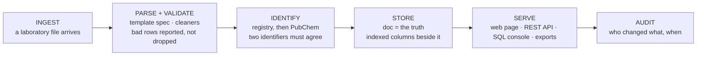

[← README](../README.md) · [Handbook](HANDBOOK.md) · [Glossary](00-glossary.md)

# Product and technology roadmap — from a system of record on one VM to a product

**Prerequisites:** none. Every term is explained here with an everyday comparison; [`02-architecture.md`](02-architecture.md) is useful background, and [`05-roadmap.md`](05-roadmap.md) is the near-term plan this page looks beyond.
**Learning goal:** you understand what it would take to turn Crucible from one container on one laboratory VM into an industrialised, hosted product — and, just as importantly, why almost none of that belongs in the system *today*.
**How to read this page:** every technology option is answered with the same three questions — *Is it required now? Why? What is the concrete benefit, and what is the cost?* — and ends with a **verdict** and a **trigger**. The verdicts:

| Verdict | Meaning |
|---|---|
| **Required now** | In the build plan already; the system is incomplete without it |
| **Recommended later** | Clearly worth it, at a stated trigger — not before |
| **Optional** | Useful in some futures; adopt only if its trigger fires |
| **Not needed** | Adds cost without benefit for this product's shape |

The governing rule: **justify, don't accumulate.** Every technology is a cost
— install, learn, maintain, secure — before it is a benefit. Nothing enters
the running system without a *Required now* verdict. A one-line summary of
every option is at the [bottom](#summary-every-option-one-line-each).

---

## Contents

1. [The finished product, described honestly](#1-the-finished-product-described-honestly)
2. [The end-to-end pipeline, and what already exists](#2-the-end-to-end-pipeline-and-what-already-exists)
3. [Product surface](#3-product-surface)
4. [Identity and access](#4-identity-and-access)
5. [Data platform](#5-data-platform)
6. [Chemistry and knowledge](#6-chemistry-and-knowledge)
7. [Language-model and agent components](#7-language-model-and-agent-components)
8. [Cloud and operations](#8-cloud-and-operations)
9. [The regulatory frame for laboratory data](#9-the-regulatory-frame-for-laboratory-data)
10. [Discoverability and go-to-market](#10-discoverability-and-go-to-market)
11. [Summary: every option, one line each](#summary-every-option-one-line-each)

---

## 1. The finished product, described honestly

Imagine a research organisation with several laboratories. Each produces
spreadsheets: screening results, sample inventories, toxicology studies. Each
names compounds its own way. Today the question *has this compound been
measured before, and where is the result?* is answered by asking people.

The finished Crucible product is a service those laboratories point their
exports at. It reads each file through a template that describes it, gives
every compound one identity, keeps every measurement attached to that
identity with its original values intact, and answers questions — from a web
page, from a script, from another tool — with an audit trail that says who
loaded what and when. Several laboratories share one registry; each sees its
own data and the shared compound identities.

Today's system already *is* that, for one laboratory, on one machine, for
users who are trusted because they are on the internal network. What
productisation adds is the walls around it: identity, isolation, hosting,
compliance. The stages in the middle do not change, which is why the
architecture rule — the stored document is the truth — matters so much.

---

## 2. The end-to-end pipeline, and what already exists

| Stage | What exists today | Status | What productisation adds |
|---|---|---|---|
| Ingest | Upload pages; a template spec per laboratory format; the first real export loaded (49,000 rows) | ✅ | An upload endpoint per customer; watched folders or object storage; per-laboratory isolation |
| Parse + validate | Cleaning primitives for null tokens, formula errors, dates, mixed CAS cells, header echoes; rows reported rather than dropped | ✅ | Whole-file validation reports; a template editor instead of a Python spec |
| Identify | Two-stage identification; a registry of 664 compounds; audit and maintenance scripts | ✅ | Name normalisation and synonyms; scheduled identification over new arrivals; InChIKey as the canonical key |
| Store | SQLite by default, PostgreSQL optional, Alembic-owned schema; the hybrid document pattern | ✅ | PostgreSQL as default; hot fields normalised (phase 06); object storage for the original files |
| Serve | React client; REST API with a locked contract; read-only SQL console; export in four formats | ✅ | Authentication and roles; rate limiting; an agent interface for other tools |
| Audit | None — records can change with no record of who | ❌ | An audit trail and version history, which authentication makes possible |

The honest headline: **five of six stages exist and are exercised on real
data.** The missing one, audit, waits on identity, and identity is the next
phase after schema normalisation.

---

## 3. Product surface

### The existing React client

*What it is:* the web page in the browser — upload, view, dashboard, the
screening table, the query tab. *Analogy:* the shop counter; the API behind
it is the warehouse.
*Required now?* **Yes, and it exists.** *Why:* it is the API's first client
and the way every current user works.
*Benefit:* nothing to install for a user. *Cost:* a build step (Node, Vite)
that must be kept current; the security scanner's findings on that tooling
never reach the image, but they must be triaged.
*Verdict:* **Required now** — *trigger:* none; already in place.

### Multi-user hosted deployment

*What it is:* one instance serving several laboratories or organisations, each
seeing its own data. *Analogy:* an apartment building instead of a house — one
roof, separate front doors.
*Required now?* **No.** *Why:* one laboratory, one VM, one trusted network.
Isolation between tenants is meaningless with one tenant.
*Benefit:* one deployment to operate, shared compound identities across
laboratories. *Cost:* tenancy in every query, per-tenant backups, and the
whole of section 4 first.
*Verdict:* **Recommended later** — *trigger:* a second laboratory wants in.

### Desktop packaging

*What it is:* an installer that puts the whole system on a laptop with no
container runtime. *Analogy:* a camping stove instead of a kitchen.
*Required now?* **No.** *Why:* the container already runs on a laptop with
one command, and the registry's value is in being shared, not carried.
*Verdict:* **Not needed** — *trigger:* a field site with no network and no
container runtime allowed.

### Licensing and payments

*What it is:* keys, subscriptions, invoices. *Required now?* **No.** *Why:*
an internal system of record has no customer to invoice.
*Verdict:* **Not needed** — *trigger:* an external customer.

---

## 4. Identity and access

These head [`05-roadmap.md`](05-roadmap.md); here they get the cost and
benefit treatment.

### Authentication: corporate SSO / OIDC versus a token scheme

*What it is:* a login. **SSO** (single sign-on) means the organisation's
existing identity service vouches for the user; **OIDC** (OpenID Connect) is
the standard protocol it speaks. A **token scheme** is simpler: a long
secret in a request header, issued by hand. *Analogy:* SSO is the building's
badge system; a token is a key you cut for each person.
*Required now?* **Yes, next but one.** *Why:* `/api/*` is open to anyone who
can reach the port. Acceptable on a trusted internal network with one
laboratory; unacceptable the moment a second group, a wider network or the
query console's convenience enters the picture.
*Benefit:* every later control — roles, audit, rate limits — depends on
knowing who. *Cost:* SSO means integrating with a corporate identity
provider (an external dependency and a support relationship); a token scheme
means issuing and rotating secrets by hand. Either needs a **feature flag**
so that internal users are not locked out mid-week.
*Verdict:* **Required now**, as a ladder — *decided in principle on
2026-09-08, details pending the owner's answers:* a token gate first (SH-3a,
days, needs nothing from anyone), local accounts only as far as needed
(SH-3b), and **single sign-on as the destination** (SH-3c, when the identity
team's application registration arrives — requested now, because it is the
long pole). The full plan, with every method explained, the ones rejected,
and what to ask the organisation for, is
[`13-authentication.md`](13-authentication.md); the decision is
[ADR 0001](adr/0001-authentication-ladder.md).

### Role-based access control

*What it is:* what each identity may do — read, upload, delete, administer.
*Required now?* **No.** *Why:* roles are meaningless without identity.
*Verdict:* **Recommended later** — *trigger:* authentication in place and a
second class of user (a reader who must not upload).

### Audit trail and version history

*What it is:* a permanent record of every change: who, what, before and
after. *Analogy:* the laboratory notebook's rule that nothing is erased,
only struck through and initialled.
*Required now?* **No, but soon.** *Why:* a log that cannot say *who* is a
change log, not an audit trail; it waits on identity. The hybrid document
pattern makes the *what* cheap — keep the previous `doc` beside the new one.
*Benefit:* the regulatory frame in section 9 is unreachable without it.
*Cost:* storage growth; a UI to read it.
*Verdict:* **Recommended later** — *trigger:* authentication in place.

### Rate limiting

*What it is:* refusing a caller who sends too many requests. *Required now?*
**No.** *Why:* without identity the only handle is the IP address, and on a
corporate network that is often one proxy.
*Verdict:* **Optional** — *trigger:* authentication in place and an
automated client misbehaving.

---

## 5. Data platform

### PostgreSQL as the default rather than optional

*What it is:* the database server already supported by one setting
([phase 01](04-phase-tutorials/phase-01-postgres-alembic.md)). *Analogy:*
SQLite is a notebook you carry; PostgreSQL is a filing room with a clerk.
*Required now?* **No.** *Why:* one writer at a time is the right shape for
bulk uploads and many reads on one machine; the notebook is faster and has
no moving parts. The swap is one setting because phase 01 made it so.
*Benefit:* concurrent writers, permissions, a server that stays up. *Cost:* a
service to run, patch and back up, forever.
*Verdict:* **Recommended later** — *trigger:* two laboratories uploading at
once, or the hosted product.

### Object storage for the original upload files

*What it is:* a service that stores files by name at any scale (S3 and its
compatible cousins). *Analogy:* the off-site archive box for the paper
originals.
*Required now?* **No.** *Why:* the original *values* are already kept
verbatim in `doc`; the original *file* is on the VM's disk, gitignored. One
laboratory's files fit on one disk.
*Benefit:* the file that produced every row is retrievable forever, from
anywhere. *Cost:* credentials, a bucket, a lifecycle policy.
*Verdict:* **Recommended later** — *trigger:* the first cloud deployment, or
an auditor asking for the original file.

### An orchestrator (Airflow / Dagster / Prefect)

*What it is:* a program that runs pipeline steps on a schedule, in order,
with retries and a web page showing what ran. *Analogy:* an alarm clock with
a checklist.
*Required now?* **No.** *Why:* identification is a command a person runs
after an upload; there is no schedule and no fan-out. Two cron lines cover
monitoring and backups.
*Benefit (later):* identify arriving files nightly; re-audit the registry
weekly; alert on failure. *Cost:* a long-running service plus its database.
If the trigger fires, Prefect or Dagster over Airflow: lighter to self-host.
*Verdict:* **Recommended later** — *trigger:* files arrive without a person
to run the command.

### dbt

*What it is:* a tool that turns SQL files into a tested, documented
transformation pipeline inside a warehouse. *Required now?* **No.** *Why:*
Crucible's transformations are Python over spreadsheets; its SQL is
*queries*. dbt without a warehouse is a hammer without nails.
*Verdict:* **Optional** — *trigger:* a warehouse exists and the query
cookbook grows past a folder.

### Databricks / Snowflake

*What they are:* rented cloud platforms for very large data. *Analogy:*
container-port logistics; this registry is a delivery van.
*Required now?* **No.** *Why:* 49,000 rows fit in a 118 MB file. These begin
to pay at millions of rows and many concurrent analysts, and they meter money
by the hour.
*Verdict:* **Optional** — *trigger:* tens of millions of measurements, or a
customer whose data already lives there and may not leave.

### Data and schema versioning beyond Alembic

*What it is:* versioning the *data* the way Alembic versions the *schema*.
*Required now?* **No.** *Why:* backups are timestamped snapshots; the audit
trail (section 4) gives per-record history. Between them, most needs are
met.
*Verdict:* **Not needed** — *trigger:* a regulatory requirement to
reconstruct the whole registry as of a date, faster than restoring a backup.

---

## 6. Chemistry and knowledge

### PubChem, ChEBI, and InChIKey as the canonical identifier

*What they are:* PubChem is the public compound database stage 2 already
consults; **ChEBI** is a curated dictionary of biologically relevant
compounds; an **InChIKey** is a fixed-length fingerprint computed from a
structure, the same for a compound whatever it is called. *Analogy:* CAS is
a passport number issued by a registry; InChIKey is a fingerprint — nobody
issues it, it follows from the structure.
*Required now?* **Partly, and partly exists.** *Why:* PubChem is in use;
InChIKey is already stored when a structure is known. Making InChIKey the
*canonical* key would let two registries agree without a shared numbering
authority.
*Benefit:* duplicates become impossible to register when a structure is
known. *Cost:* many laboratory rows carry a name and a CAS, no structure;
the key cannot be computed for them.
*Verdict:* **Recommended later** — *trigger:* structures arrive for most
compounds, or a second registry must be merged.

### Synonym and house-style name normalisation

*What it is:* turning `Phenol, 2,4-di-tertiobutyl` into the form public
databases recognise, or holding both as synonyms of one identity. *Analogy:*
a phone book that knows "Bob" and "Robert" are one person.
*Required now?* **Yes, soon.** *Why:* around 456 compounds carry a valid CAS
and a house-style name and stay unidentified under the two-identifier rule.
Normalisation recovers them *without* weakening the rule — the argument
against weakening it is in the lessons file.
*Benefit:* a large share of the unidentified rows linked. *Cost:* a rule set
per laboratory style; false merges if done carelessly.
*Verdict:* **Required now** (on the near-term roadmap) — *trigger:* none;
the data is waiting.

### A knowledge graph over compounds, samples and studies

*What it is:* the records as nodes with typed edges (compound → sample →
result → study), queried by relationship. *Analogy:* a corkboard with
string, instead of four filing cabinets.
*Required now?* **No.** *Why:* the four tables and their foreign keys *are*
that graph; SQL joins answer today's questions.
*Verdict:* **Optional** — *trigger:* questions that span many hops (which
studies used samples of compounds similar to this one) become routine.

### Regulatory vocabularies: GHS hazard classes, OECD test guidelines

*What they are:* **GHS** is the global system of hazard classification (the
pictograms on a bottle); **OECD test guidelines** are the numbered standard
protocols toxicology studies follow. *Analogy:* the standard forms an
inspector expects, rather than free text.
*Required now?* **No.** *Why:* toxicology records store what the spreadsheet
said; nothing yet validates a study against a guideline number.
*Benefit:* studies become comparable and reportable in the language
regulators use. *Cost:* controlled vocabularies to maintain.
*Verdict:* **Recommended later** — *trigger:* toxicology data is loaded at
volume, or a report must cite guideline numbers.

---

## 7. Language-model and agent components

None enter the running system without a *Required now* verdict, and none has
one. Vendor names are deliberately absent; these are technology categories.

### Retrieval over notebook entries and study text

*What it is:* indexing free text (study descriptions, notebook entries) so
that a language model can answer questions grounded in it. *Analogy:* a
research assistant who has read the filing cabinet and cites the page.
*Required now?* **No.** *Why:* the free text is small and the structured
fields answer the questions asked today.
*Verdict:* **Optional** — *trigger:* hundreds of study documents and
questions that structured fields cannot answer.

### A model context protocol server

*What it is:* a standard way for agent tools to call a system's functions —
look up a compound, list a sample's results, start an upload — with the
system's own rules enforced. *Analogy:* a service hatch with a menu, so
another program can order without entering the kitchen.
*Required now?* **No.** *Why:* the REST API already is the machine
interface; an agent can call it. A protocol server would mainly add
discoverability.
*Verdict:* **Optional** — *trigger:* a second tool that should drive the
registry without custom code.

### Grounded report drafting

*What it is:* a model writing a first draft of a study summary from the
registry's own records, every figure traceable to a row. *Required now?*
**No.** *Why:* no reporting stage exists yet to draft for.
*Verdict:* **Optional** — *trigger:* a recurring report that people write by
hand from the registry.

---

## 8. Cloud and operations

### The container image

*Verdict:* **Required now** — in place. One image, two runtimes, three
platforms; the isolation layer everything else relies on.

### Kubernetes, serverless, or the current single VM

*What they are:* **Kubernetes** runs many containers across many machines
with scheduling and self-healing; **serverless** runs code on demand with no
machine to manage. *Analogy:* a fleet with a dispatcher; a taxi you hail;
today's system is one van with a driver.
*Required now?* **No.** *Why:* one container, one file, one VM. Kubernetes
would orchestrate one pod; serverless does not suit a stateful single-file
database.
*Verdict:* **Optional** — *trigger:* the hosted product with PostgreSQL and
more than one instance.

### Continuous integration and deployment

*What it is:* a service that runs the tests and the gate on every push and
tells you before you deploy. *Analogy:* a smoke alarm that is tested every
time you cook.
*Required now?* **Yes, small.** *Why:* the gates run by hand today and rely
on discipline; on the public repository they cost nothing to automate
(`ruff` and `pytest` on Linux and macOS runners). The private repository
would not run it.
*Verdict:* **Required now** — delivered as [phase 05b](04-phase-tutorials/phase-05b-reproducible-builds-and-ci.md): `.github/workflows/ci.yml` on the public repository, installing from the lock on Python 3.12.

### Monitoring beyond the cron health check

*What it is:* metrics, dashboards, alerts to a person. *Required now?*
**No.** *Why:* one instance, one cron line that restarts it, one weekly
certificate check; the failure modes are known and cheap.
*Verdict:* **Recommended later** — *trigger:* a second instance, or an
outage nobody noticed for a day.

### A cost model

*What it is:* what running the product costs per month, per laboratory.
*Required now?* **No.** *Why:* today's cost is one VM already owned.
*Verdict:* **Recommended later** — *trigger:* the first hosting decision.

---

## 9. The regulatory frame for laboratory data

None of these is a technology; each is a set of expectations a laboratory
registry will meet when it moves from "internal convenience" to "record".

| Frame | What it asks | Where Crucible stands | Waits on |
|---|---|---|---|
| **GxP data integrity, ALCOA+** | Data must be attributable, legible, contemporaneous, original, accurate — plus complete, consistent, enduring, available | Original values are kept verbatim (original, accurate); no *who* (not attributable); no change history (not enduring in the required sense) | Authentication, then the audit trail |
| **21 CFR Part 11-style audit trails** | Electronic records with a secure, time-stamped audit trail and signatures | None | The same two, plus a signing step |
| **GDPR** | Personal data protected, purpose-limited, deletable | Sample metadata may name people (who logged a vial); no personal data is required by the system | A review of which template fields carry names, and a retention rule |
| **ISO 27001** | An information-security management system for hosting | Not applicable to one internal VM | The hosted product |

*Verdict for the frame as a whole:* **Recommended later** — *trigger:* the
registry is cited as the source of a regulatory submission, or hosted for
others.

---

## 10. Discoverability and go-to-market

**SEO** (search-engine optimisation) makes a public site findable; **AEO**
(answer-engine optimisation) shapes content so that question-answering tools
quote it; **GEO** (generative-engine optimisation) does the same for
generative tools. **Pricing and packaging** decide what is sold to whom.

For an internal system of record, all four have the same honest verdict:
**Not needed** — *trigger:* offered outside the organisation. The public
repository exists so that the *work* is visible, not so that the *product* is
marketed.

---

## Summary: every option, one line each

| Option | Verdict | Trigger |
|---|---|---|
| React client | **Required now** (exists) | — |
| Multi-user hosted deployment | Recommended later | A second laboratory |
| Desktop packaging | Not needed | Field site with no runtime allowed |
| Licensing and payments | Not needed | An external customer |
| Authentication — a ladder: token gate → local accounts → SSO ([plan](13-authentication.md)) | **Required now** (SH-3a/b/c) | SH-3a: the owner's go · SH-3c: the identity team's registration |
| Role-based access control | Recommended later | Authentication + a second user class |
| Audit trail and version history | Recommended later | Authentication |
| Rate limiting | Optional | Authentication + a misbehaving client |
| PostgreSQL as default | Recommended later | Concurrent writers or hosting |
| Object storage for originals | Recommended later | First cloud deployment or an auditor |
| Orchestrator | Recommended later | Files arriving without a person |
| dbt | Optional | A warehouse exists |
| Databricks / Snowflake | Optional | Tens of millions of rows |
| Data versioning beyond Alembic | Not needed | A reconstruct-as-of-date requirement |
| InChIKey as canonical key | Recommended later | Structures for most compounds |
| Name normalisation and synonyms | **Required now** (roadmap) | — |
| Knowledge graph | Optional | Multi-hop questions become routine |
| GHS / OECD vocabularies | Recommended later | Toxicology at volume |
| Retrieval over study text | Optional | Hundreds of documents |
| Model context protocol server | Optional | A second driving tool |
| Grounded report drafting | Optional | A recurring hand-written report |
| Container image | **Required now** (exists) | — |
| Kubernetes / serverless | Optional | Hosted product, multiple instances |
| CI on the public repository | **Required now** (exists, phase 05b) | — |
| Monitoring beyond cron | Recommended later | Second instance or an unnoticed outage |
| Cost model | Recommended later | First hosting decision |
| Regulatory frame (ALCOA+, Part 11, GDPR, ISO 27001) | Recommended later | A regulatory citation or hosting |
| SEO / AEO / GEO, pricing | Not needed | Offered outside the organisation |

**Last Updated:** September 7, 2026
