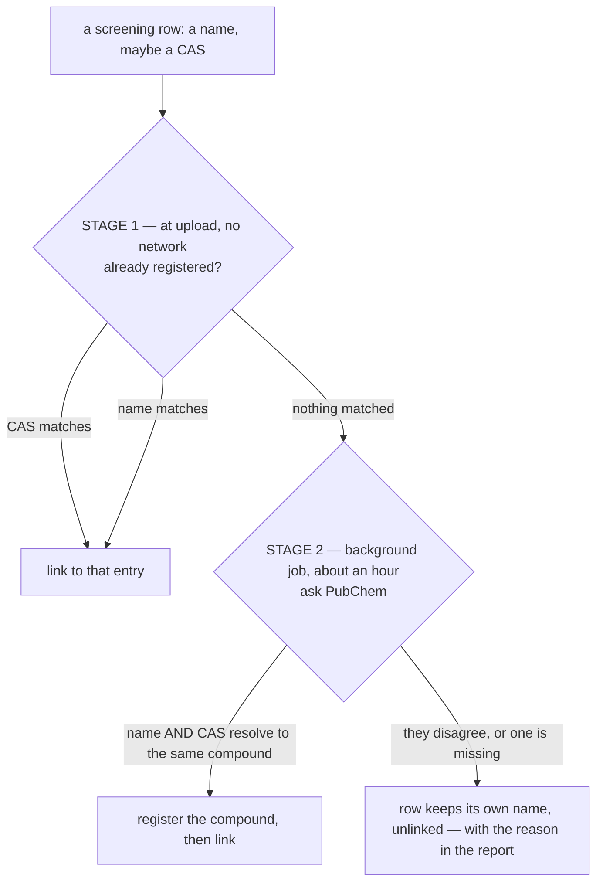
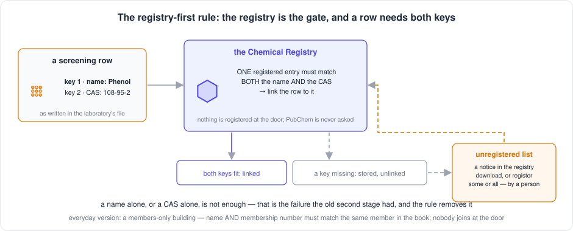
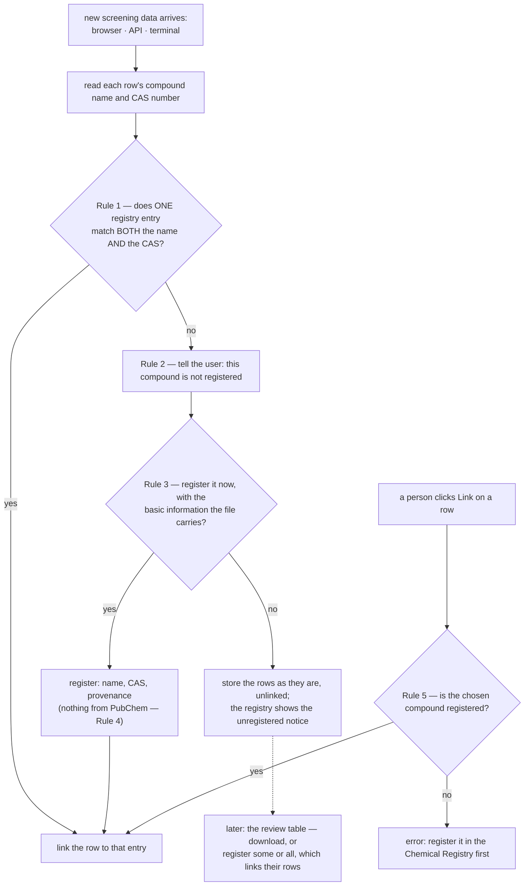

[← README](../README.md) · [Handbook](HANDBOOK.md) · [Glossary](00-glossary.md)

# Chemical identification — turning compound names into a registry

**Prerequisites:** a running instance with screening data loaded. No chemistry
or database knowledge assumed.
**Learning goal:** after this you will understand why screening data needs
compounds to be *identified*, exactly when a row links to a compound you
already have and when it asks an external database, and how to run and read the
identification job.
**Time:** ten minutes to read; the job itself runs in the background.

> **New here?** [The Playbook](10-user-playbook.md) puts this step in sequence with
> everything around it — loading a file, checking the result, correcting it —
> and explains the vocabulary from scratch. This guide is the detail behind its
> Part 4 and Part 5.

## Table of Contents

- [The problem, in your own data](#the-problem-in-your-own-data)
- [The everyday version](#the-everyday-version)
- [What identification gets you](#what-identification-gets-you)
- [How a compound gets identified](#how-a-compound-gets-identified)
- [Stage 1 — your own registry](#stage-1--your-own-registry)
- [Stage 2 — PubChem](#stage-2--pubchem)
- [Every scenario, side by side](#every-scenario-side-by-side)
- [Why it will not create duplicates](#why-it-will-not-create-duplicates)
- [Running it](#running-it)
- [Reading the report](#reading-the-report)
- [The next rule: registry-first — specification](#the-next-rule-registry-first--specification)
- [Maintaining the registry](#maintaining-the-registry)
  - [Auditing what is registered](#auditing-what-is-registered)
- [When something goes wrong](#when-something-goes-wrong)

---

## The problem, in your own data

A screening export records the compound it detected as **free text**, typed by
whoever ran the analysis. Here is one substance, exactly as one real export
spells it:

```
EICOSANE (POSH)      Eicosane (POSH)      EICOSANE
EICOSANE (posh)      Eicosane (posh)      EICOSANE POSH)     <- bracket typo
Eicosane             EICOSANE (POSh)      …and two more
```

**Ten spellings. Six hundred-odd rows. One substance.** Every one of them
carries the same number: `112-95-8`.

It is not an isolated case. In the same file, one compound appears under ten
spellings across 703 rows, and another under eleven across 434.

The file also contains **no chemistry at all** — no molecular formula, no
molecular weight, no structure. It has a name someone typed and, less than half
the time, a registry number.

**Identification** is the step that fixes both: it decides which compound each
row is *about*, and attaches the chemistry the file never had.

---

## The everyday version

Think about the messages on your phone.

Someone texts you from their work phone, their personal phone, and a messaging
app. Your phone shows three separate conversations — *"+41 79 …"*, *"Mum"*,
*"Mother"*. You know they are one person. Your phone does not.

**Saving them as a contact** changes two things:

1. Three conversations become one person, so *"show me everything from Mum"*
   finally works.
2. You gain information the messages never held — a photo, an address, a
   birthday. That came from your address book, not from the texts.

That is exactly this:

| On your phone | In Crucible |
|---|---|
| Ten conversations, one person | Ten spellings, one compound |
| Their phone number | The **CAS number** — a compound's internationally agreed identifier, the same in every laboratory on earth |
| Saving them as a contact | Registering the compound in the Chemical Registry module |
| Photo, address, birthday | Molecular formula, weight, structure |
| Your address book | **PubChem**, a free public chemical database run by the US National Library of Medicine |

---

## What identification gets you

**Counting becomes possible.** Ask *"how much eicosane migrated across all our
packaging?"* today and you get ten answers, one per spelling — including one for
the bracket typo. Identified, you get one number.

**Chemistry the file does not contain.** Formula, molecular weight, SMILES,
InChIKey. None of it is in the export; it cannot be recovered from the export;
it has to come from somewhere else.

**Later files line up automatically.** When a second laboratory's data arrives
calling the same substance `n-Eicosane`, it resolves to the same compound.
Without a registry you get a second, unconnected pile of rows and no way to
prove they describe one substance. This is the whole premise of the
application — see the README's opening.

**One page per compound.** Click a name in the screening table and see every
result for that compound, across every sample and every simulant.

> **It is optional.** The screening table, its filters, sorting, export and the
> query console all work without any of this. Unidentified rows simply show the
> compound name exactly as the file recorded it. Identification adds
> cross-referencing; it is not a prerequisite for using your data.

---

## How a compound gets identified

> **This is the rule that runs today.** It is being replaced by the
> registry-first rule, [specified below](#the-next-rule-registry-first--specification)
> on 2026-09-08 and not yet built. Until phase SD-1 ships, what follows is
> what the code does.


Two stages, and they are tried in order. **The second is only reached if the
first finds nothing.**



**The two stages use deliberately different rules**, and this is the part worth
reading twice:

| Stage | Rule |
|---|---|
| **Your registry** | **EITHER** the CAS **or** the name matches → link |
| **PubChem** | **BOTH** the CAS **and** the name must agree → link |

Why the difference? Your registry is curated by you. If you entered CAS
`100-52-7` against a compound, you meant it, and one match is enough to trust.
PubChem is an outside database you are *inferring* identity from, so you require
two independent identifiers to agree before accepting it.

---

## Stage 1 — your own registry

Runs the moment screening data is uploaded. No network, no waiting.

It tries the **CAS number first**, then the **name**:

```
Registry:  CHEM-000001   name='Our name for it'   cas=100-52-7
           CHEM-000002   name='Testene'           cas=(none)
```

| The screening row says | Result |
|---|---|
| name `Our name for it`, cas `100-52-7` — both match | → `CHEM-000001` |
| name `Totally different`, cas `100-52-7` — **only the CAS matches** | → `CHEM-000001` |
| name `Testene`, no CAS — **only the name matches** | → `CHEM-000002` |
| name `Testene`, cas `999-99-9` — name matches, CAS unrecognised | → `CHEM-000002` |
| name `Brand new thing`, cas `55-55-5` — neither matches | → stage 2 |

Two rules decide the awkward cases:

**If the name and the CAS point at different registered compounds, the CAS
wins.** A CAS number is an internationally agreed identifier; a name is a label
someone typed.

**A name match is refused when the row's CAS contradicts the one on file.** If
your registry records `Alpha` as `100-52-7` and a row claims `Alpha` is
`999-99-9`, those disagree about what the substance *is*. The row is left
unlinked for a person to look at, rather than being attached to a compound it
may not be. This is the same disagreement that causes a rejection in stage 2 —
treating it as a match here would apply opposite rules to identical evidence.

> **Practical consequence: upload your chemicals list first.** Every screening
> row whose compound you already know then links instantly at upload, with no
> network call and no strict rule to satisfy — because you vouched for it.
> PubChem is left to deal only with the genuinely unknown remainder, which is
> both faster and more accurate.

---

## Stage 2 — PubChem

Only compounds that matched nothing in your registry get here.

The rule: **register the compound only when the name and the CAS number both
resolve to the same PubChem compound.**

| The row says | PubChem says | Result |
|---|---|---|
| `Benzaldehyde` + `100-52-7` | both → compound 240 | ✅ registered and linked |
| `Phenol, 2,4-di-tertiobutyl` + `96-76-4` | CAS → 7311, name → *unknown* | ❌ unlinked |
| `Acetyl tributyl citrate` + `77-90-7` | CAS → 6505, name → 65058 | ❌ unlinked, they disagree |
| `Alkene`, no CAS | nothing to cross-check | ❌ unlinked |

**Why so strict?** A compound is often measured as a salt, a hydrate or an
ester, whose CAS number legitimately belongs to a *different* substance than the
name suggests. Accepting the CAS alone would attach migration results to the
wrong compound. In a food-contact safety dataset that is worth being fussy
about.

**What it costs.** Row 2 above is a real compound with a valid CAS, rejected
only because the laboratory writes `tertiobutyl` where PubChem expects
`tert-butyl`. On a sample of forty compounds carrying a valid CAS, thirty-five
failed for that reason and only one was a genuine conflict. Expect roughly
20–25% of distinct compounds to be confirmed — though they cover a much larger
share of *rows*, because common compounds appear hundreds of times each.

The report tells you which is which, so the ones failing on spelling alone are a
working list rather than a mystery.

---

## Every scenario, side by side

| # | Registry has | Row says | What happens |
|---|---|---|---|
| 1 | same CAS | name + CAS | links to the registered compound |
| 2 | same CAS, different name | name + CAS | links — the CAS is decisive |
| 3 | same name, no CAS | name only | links on the name |
| 4 | same name, no CAS | name + unknown CAS | links — nothing to contradict |
| 5 | same name **with** a CAS | name + **different** CAS | **refused** — they disagree |
| 6 | CAS → compound A, name → compound B | name + CAS | links to **A**; the CAS wins |
| 7 | nothing | name + CAS, PubChem agrees | **registers** a new compound and links |
| 8 | nothing | name + CAS, PubChem disagrees | unlinked |
| 9 | nothing | name + CAS, PubChem does not know the name | unlinked |
| 10 | nothing | name, no CAS | unlinked |

Rows 8–10 are not failures. The row keeps the name the file gave it and appears
in the table exactly as recorded — the observation is real even when the
identity is not established.

---

## Why it will not create duplicates

Registering one substance twice would defeat the point, so three things prevent
it:

**The CAS map.** Before registering anything, the job checks a map of every CAS
number already registered. Ten spellings sharing one CAS produce **one** entry:
the first spelling registers it, and the other nine link to the same one without
asking PubChem again. The map is rebuilt from the database at the start of every
run, so this holds across runs and restarts.

**Name matching.** A compound you registered by name with no CAS is matched by
name, so the job links the row rather than creating a rival entry.

**The database.** `chemical_id` is a unique column. An attempt to register the
same identifier twice fails outright rather than silently duplicating.

Demonstrated: three uploads of five spellings each — fifteen rows — leave the
Chemicals table holding exactly **one** compound, with twelve rows pointing at
it.

> **The identifier never moves.** A compound is created once. Screening rows
> hold a *pointer* to it, the way messages point at a contact. New screening
> data, corrections, a sixth spelling — none of it changes the compound record.
> Twelve rows can point at `CHEM-000001`; there is still one `CHEM-000001`.

`./verify-deploy.sh` checks for duplicates by CAS, by PubChem identifier and by
name on every deployment. The PubChem identifier is checked separately because
two CAS numbers can legitimately point at one compound, so a repeated identifier
is a duplicate even when the CAS numbers differ.

---

## Running it

Stage 1 needs nothing — it happens at upload.

Stage 2 is a background job. It lives inside the container, which matters
because the RHEL8 host's own Python is too old to run it.

```bash
cd ~/work/Pandora_toolbox/nr-nips-crucible

# 1. Always back up first — this writes to every row it links
./container-py.sh backup

# 2. Preview. Writes nothing; prints what it would do.
./container-py.sh script link_pubchem.py --limit 60
```

**You should see** progress every five compounds, then a breakdown by reason.

**What it means:** `confirmed` are compounds the name and CAS agreed on;
`rejected` are genuine disagreements; the rest could not be checked.

```bash
# 3. The real run, detached, keeping a log and a report
podman exec -d crucible-py sh -c \
  'python /app/backend/scripts/link_pubchem.py --apply --report /app/backend/unlinked.csv \
   > /app/backend/link.log 2>&1'
```

Roughly an hour for a few thousand compounds. **This is a politeness limit, not
slow code**: PubChem asks callers not to exceed five requests a second, and each
compound needs three or four.

Check on it at any point:

```bash
podman top crucible-py | grep link_pubchem          # a line = running, empty = finished
podman exec crucible-py tail -5 /app/backend/link.log
sqlite3 data/crucible.db "SELECT (SELECT COUNT(*) FROM chemicals) AS chemicals, (SELECT COUNT(*) FROM screening WHERE chemical_id IS NOT NULL) AS linked_rows;"
```

> Do **not** use `ps` inside the container — the image is a slim one and has no
> `ps`, and piping the failure into `grep -c` prints `0`, which reads exactly
> like "not running". `podman top` runs on the host and is reliable.

**It is safe to interrupt and safe to re-run.** Work is committed as it goes,
and a re-run skips every compound already registered.

---

## Reading the report

```bash
podman cp crucible-py:/app/backend/unlinked.csv ./unlinked.csv
cut -d, -f3 unlinked.csv | sort | uniq -c | sort -rn
```

**You should see** something like:

```
   2210 "no CAS to corroborate the name"
    850 "name not in PubChem"
     40 "name=CID 6505 but CAS=CID 65058"
      9 "CAS not in PubChem"
```

**What each line means:**

- **no CAS to corroborate the name** — the largest group. The row named a
  compound but gave no registry number, so there is nothing to check the name
  against. Adding CAS numbers at source is what fixes this.
- **name not in PubChem** — the CAS is fine; the *name* is written in a house
  style PubChem does not recognise. Normalising those names, or adding them as
  synonyms, would link these on the next run with no change to the rule.
- **name=CID … but CAS=CID …** — a genuine disagreement. This is the check
  earning its keep; each of these deserves a human look.
- **CAS not in PubChem** — usually a malformed or obsolete number.

---

## The next rule: registry-first — specification

> **Status: agreed, not yet built.** Written on 2026-09-08 from the owner's
> description and agreed the same day (decision log below), as phase **SD-1**
> of the [roadmap](05-roadmap.md#sd--screening-data). R-2 may now run.
> Everything above this heading describes the rule that runs *today*; this
> section is the rule that replaces it, written down and agreed **before any
> code**, because the last rule was changed once by reasoning alone and
> registered 19 compounds with another substance's chemistry
> ([lesson 25](11-lessons-learned.md)). The decisions at the end are the parts
> the description left open; each has a recommendation.



### The idea in one sentence

**The registry is the gate.** A screening row attaches to a compound only
when the registry already holds that compound, recognised by *both* its name
*and* its CAS number; nothing in the upload path invents a compound or asks
an outside database.

**A compound may be registered without a CAS number.** That is valid and
normal — many substances, mixtures and house materials have none — and the
registry accepts such entries by every route (the browser form, the
uploads, the API) today and after this rule. The rule above governs only
*automatic attachment of screening rows*, which needs both identifiers; an
entry without a CAS receives rows by hand (Rule 5) or under decision D11.

*Everyday version:* a members-only building. A visitor gives a name and a
membership number; the receptionist looks both up in the members' book and
lets them in only if the *same* member has that name and that number. Nobody
is signed up at the door on the strength of a business card. If the visitor
is not in the book, reception says so, notes them on the "asked to join" list,
and a member of staff decides later whether to add them — the visitor is not
turned away, they wait in the lobby (the row is stored, unlinked).

### The five rules



| # | Rule | What it means in the system |
|---|---|---|
| **1** | **Both identifiers, one entry.** When screening data is added — from the browser, the API or a terminal — each row's compound name and CAS number are looked up in the registry. The row links only if *one* registered compound matches **both**. | The upload path keeps the registry lookup it has (`resolve_chemicals` in `backend/app/ingest.py`) but the condition changes from *CAS or name* to *name and CAS, same entry*. A name match with a different CAS, or a CAS match with a different name, is **not** a link. |
| **2** | **Say so.** When a row's name + CAS pair has no registered match, the user is told the compound does not appear in the registry. | The upload response and the upload page report the count of unregistered compounds and list the pairs (name, CAS, rows). |
| **3** | **Offer, don't assume.** The user is asked whether to register those compounds now with the basic information the screening data carries. **Yes:** they are registered from the file's own fields and their rows link. **No:** the rows are stored exactly as they are, unlinked, and the **Chemical Registry** shows a notice — *N compounds in the screening data are not registered; review them* — with a link to a table of those compounds and their metadata, downloadable, from which the user can register some or all later. | The upload itself never registers. A separate action, *Register from screening data*, does, taking a list of pairs or *all*; the same action serves the upload page's *Yes* and the review table's *Register selected*. The unregistered table is derived from the data (distinct name + CAS pairs among unlinked rows with no matching entry), not stored. |
| **4** | **Never PubChem during ingestion.** No part of adding screening data, or of registering from it, fetches anything from PubChem or any outside source. | The background identification job (`link_pubchem.py`, stage 2 above) is retired for screening rows. PubChem is consulted only from the registry, on request, for entries a person has already registered — phase [CR-4](05-roadmap.md#cr--chemical-registry). |
| **5** | **Link only to what is registered.** A row can be linked by hand only to a compound that exists in the registry. If the user tries to link a row whose compound is not registered, the system says so instead of linking. | The chooser lists registered compounds only (it already does; the endpoint answers 404 for an unknown identifier). New: opening the chooser from a row pre-searches that row's name and CAS; when nothing matches both, the chooser shows *Not registered: name (CAS) — register it in the Chemical Registry first*, with a link to the unregistered table. Choosing a *different* registered compound by hand remains allowed — that is the user's decision, and it targets a registered entry. |

### What "basic information" means

When a compound is registered from screening data (Rule 3, *yes*), the entry
holds exactly what the file can vouch for and nothing inferred:

| Field | From |
|---|---|
| `name` | the row's compound name, as written in the file |
| `cas_number` | the first well-formed CAS number in the row's CAS cell, or empty when the row has none — an entry without a CAS is valid |
| `cas_alternatives` | any further CAS numbers found in the same cell |
| `chemical_id` | generated, `CAS-<number>` when there is a CAS, otherwise `NAME-<stable hash of the name>` as today, so the same compound registered twice gets the same identifier either way |
| `identification` | `"registered from screening data"` — the provenance tag every entry carries |
| `source` | the upload's provenance tag (`Cergy_data` for the first template) |
| `created_at`, `updated_at` | now |

Formula, weight, SMILES, InChI and the rest stay empty. That is deliberate:
those entries are *incomplete*, the registry's incomplete-entries notice
(CR-4) shows them, and a person fills them — by hand, or by asking PubChem
from the registry with a review step. The gap is visible, not papered over.

### Re-running the rule over rows already loaded

After the reset (R-2) the registry is empty and the 49,065 rows are unlinked.
As compounds are registered — from a curated file, or from the review table —
their rows must attach without the export being uploaded again. Two routes,
same logic:

| Route | Where | What it does |
|---|---|---|
| Terminal, on the server | `backend/scripts/identify_screening.py`, report by default, `--apply` to write | Applies Rule 1 to every unlinked row (or to `--pubchem-registered`, `--tag`, or named chemicals), prints rows per chemical before and after, batched commits |
| API and browser | `POST /api/screening/identify` with `{"all": true}` or `{"match": …}`; a button *Attach rows to registered compounds* on the Screening Data page | The same, over the rows the table shows |
| On registration | every route that registers a compound (upload page, API, terminal, the review table) | Rule 1 for the new entries only, so registering a compound attaches its waiting rows in the same operation, and the response says how many |

### Decisions to agree before code

Each is a place the description could be read two ways. The recommendation
is what the code will do unless the owner says otherwise.

| # | Question | Recommendation | Why |
|---|---|---|---|
| D1 | How is a *name match* judged? | Exact after normalisation: lower-case, whitespace collapsed, the same key function used today (`_name_key`). No fuzzy or partial matching. | Fuzzy matching is inference, and inference is what the rule removes |
| D2 | A CAS cell holding two numbers (`96-76-4; 128-39-2`)? | The row matches an entry if the name matches **and** *any* of the row's well-formed CAS numbers equals the entry's `cas_number`. The first number is the row's CAS for registration; the others go to `cas_alternatives`. | The cell is the laboratory's evidence; either number is a genuine claim |
| D3 | Rows with no CAS number (2,278 compounds)? | Never attached automatically by Rule 1, which needs both identifiers. They may be linked by hand to any registered compound (Rule 5 holds: the target is registered). They appear on the unregistered table with an empty CAS and **can be registered from it**, as a compound without a CAS — valid, per the owner — with the person choosing to do so. | The rule stops the *system* from inferring an identity from a name alone; it does not stop a *person* from registering a compound they know has no CAS |
| D4 | Two registry entries with the same name **and** CAS? | No automatic link; the pair is reported as a duplicate for the audit and the merge tool. | A link must be unambiguous |
| D5 | The default when the API or the terminal adds screening data? | Do **not** register (`register_unregistered=false`); the response lists the unregistered pairs and counts. The browser asks; scripts must ask explicitly. | An unattended route must never widen the registry by default |
| D6 | The upload page's question (Rule 3): before or after the rows are written? | **After.** Rows are written unlinked, then the dialog offers *Register these N compounds and link their rows* / *Not now*. | One upload endpoint for every route; the *yes* is the same action the review table uses; nothing is lost if the browser closes |
| D7 | Does registering a compound attach its waiting rows? | **Yes**, on every registration route, for the new entries only; the response reports rows linked per compound. | Otherwise every registration needs a second, easily forgotten step |
| D8 | What becomes of stage 2 and the PubChem scripts? | `link_pubchem.py` no longer runs against screening rows; `propose_chemicals.py` is superseded by the review table; `enrich_pubchem.py` becomes the engine behind CR-4's *Fetch from PubChem* with a review step. The scripts stay in the image until CR-4 ships, then are retired in one commit with their documentation. | Nothing is deleted before its replacement exists |
| D9 | Do the samples and toxicology modules follow the same rule? | Yes, when their tracks reach it (SM-3). Until then their upload paths are unchanged. | One rule for every record type that links; but each module's change is its own phase |
| D10 | The 664 entries in the pre-R-1 backup? | Export them as JSON, review, and load the good ones through CR-3 as the first curated file. | Most were registered under the strict PubChem rule and carry correct chemistry; the review is the safeguard |
| D11 | **A registered compound with no CAS, and a screening row with the same name and no CAS — do they attach automatically?** | **Recommendation: yes, but only when the registered entry was created by a person** (registered by hand, from a curated file, or from the review table — not by an old inference job) **and the row's CAS cell is empty**: the two identifiers then agree on both counts, name equal and CAS absent on both sides. A row *with* a CAS never attaches to an entry *without* one, and the reverse. | Otherwise the 2,278 no-CAS rows could never attach except one by one by hand, even after the person has deliberately registered the compound; the "created by a person" condition keeps inference out. If the owner prefers strictness, answer "no": then those rows attach by hand only, in bulk with *select all matching rows* |

### Decision log

The owner's answers, as they arrive. A row that says *recommendation* means
the recommendation above stands as the answer; a changed answer is written
out in full, dated, and the row above is left as it was so the reasoning
stays readable.

| # | Answer | Date |
|---|---|---|
| D1–D11 | **All agreed as written** — every recommendation above is the answer, including D11 (a person-registered compound with no CAS attaches rows with the same name and no CAS) | 2026-09-08 |

### What "done" means for SD-1

- The upload path links on name **and** CAS, and the parity tests for the
  Cergy template are updated to show it (a name-only match no longer links; a
  CAS-only match no longer links; a both-match links; a no-CAS row against a
  person-registered no-CAS entry follows D11).
- A compound can still be registered without a CAS by every route, and a
  test proves it.
- Every route that adds screening data reports unregistered pairs; none of
  them touches PubChem (a test asserts no network call).
- *Register from screening data* exists as one action behind the upload
  page's question and the review table, registers only the fields above, and
  links the rows of what it registers.
- The re-identify command and endpoint exist, are `--apply`-gated, batched,
  and print rows per chemical; a dry run is provably dry.
- The link chooser, opened from a row whose compound is not registered, says
  so and does not link.
- The playbook, the API reference, the cookbook, this page's "How a compound
  gets identified" section and its figure describe the new rule, and the old
  two-stage description moves to [`12-history.md`](12-history.md).

---

## Maintaining the registry

> **Looking for the routine tasks — add, load, edit, link, remove, merge,
> audit, export — by browser, API and terminal side by side?** That is one
> page: [`10-registry-tasks.md`](10-registry-tasks.md). This section is the
> detail behind its maintenance rows.

Four scripts, all living inside the container image — so changing any of them
means rebuilding, not just pulling. Each **reports before it writes**: run it
without `--apply` first and read what it intends to do.

Always take a backup first. Every one of these changes data.

```bash
cd ~/work/Pandora_toolbox/nr-nips-crucible
./container-py.sh backup
```

### Recovering compounds rejected on their name alone

A large group fails identification with a perfectly good CAS number, purely
because the name is written in a house style PubChem does not recognise —
`Phenol, 2,4-di-tertiobutyl` for 2,4-di-tert-butylphenol. Their CAS *does*
resolve, so the chemistry is retrievable; what is missing is somebody willing to
say "yes, that is the same compound".

`propose_chemicals.py` prepares that decision. It reads the unlinked report,
looks each CAS up, and writes a chemicals upload carrying **your** name for the
compound alongside PubChem's, so you can compare them.

```bash
podman cp unlinked.csv crucible-py:/app/backend/unlinked.csv

./container-py.sh script propose_chemicals.py \
  /app/backend/unlinked.csv -o /app/backend/proposed.xlsx --limit 20   # sample first

./container-py.sh script propose_chemicals.py \
  /app/backend/unlinked.csv -o /app/backend/proposed.xlsx             # the full set

podman cp crucible-py:/app/backend/proposed.xlsx ./proposed.xlsx
```

**You should see** a `PUBCHEM_NAME` column beside `CHEMICAL_NAME`.

> ⚠️ **Review the file before uploading it.** The script registers nothing —
> uploading is you vouching for those compounds, which is exactly the
> corroboration the strict rule could not obtain automatically. Compare the two
> name columns row by row and delete anything that does not match.
>
> This is not a formality. On 2026-08-25 the file was uploaded unreviewed and
> `Glycerol, 2-monohexadecanoate` (CAS 23470-00-0) went in carrying the
> chemistry of 2-methoxyaniline — a small aromatic amine where a C19 glycerol
> ester was expected. A compound registered with somebody else's molecular
> weight is worse than one left unidentified.

Then upload through **Chemical Registry → Upload Chemicals (ELN)**, and re-link:

```bash
./container-py.sh script link_pubchem.py --apply
```

**You should see** `Re-linked N rows to compounds registered by an earlier run.`
Those are your newly registered compounds being matched by CAS, no PubChem
involved.

### Auditing what is registered

**Why this is necessary.** A compound registered from a proposal file carries
your laboratory's name alongside chemistry fetched from PubChem using the CAS
number. If the wrong compound is fetched, the entry keeps the right name and
acquires somebody else's formula, weight and structure — and every screening
row linked to it inherits that.

This is not hypothetical. On 2026-08-31 an audit of 686 registered compounds
found **19 carrying another substance's chemistry**: a food antioxidant holding
nicotine's formula, o-xylene holding an antibiotic's, three entries named
"Hydrocarbon (POSH)" holding halogenated compounds. The CAS numbers in the
source file were correct; the fault was in how they were looked up (see
[When something goes wrong](#when-something-goes-wrong)).

```bash
./container-py.sh script audit_chemicals.py
```

**You should see:**

```
664 entries checked (0 skipped for having no formula).
0 look doubtful.
```

**What it means:** every registered compound whose formula can be compared
against its own name agrees with it.

**If instead** entries are listed, each comes with the reason it was flagged:

```
  ??  CHEM-000413
        yours   : Glycerol, 2-monohexadecanoate
        pubchem : 2-Methoxyaniline
        cas=23470-00-0  formula=C7H9NO  mw=123.15
        -> name says 'hexadec…' (16 carbons) but the formula has 7
        -> formula has N but nothing in the name accounts for it
```

#### What the two checks look for

**A carbon chain the formula cannot hold.** A name saying *hexadecanoate*
claims a sixteen-carbon chain. Seven carbons cannot provide one, and no naming
convention explains the gap.

**An element the name never mentions.** An ester, a diol or a benzoate is built
from carbon, hydrogen and oxygen. Nitrogen or chlorine in the formula has to be
earned by the name — *amide*, *chloro*, *phosph*. `Carbamic acid, butyl ester`
contains nitrogen and says *carbam*, so it passes; `Dipropylene glycol
dibenzoate` contains nitrogen and explains none of it, so it does not.

Two exemptions stop the checks crying wolf:

- **Both names agreeing.** When your name and PubChem's are the same string
  there is no disagreement to investigate, whatever the elements. `Caffeine` can
  never hint at its own nitrogen, and PubChem agreeing with it is better
  evidence than any word list.
- **Cells naming two compounds.** `Acrylic acid, diester with tetraethyleneglycol
  + Eicosane (POSH)` describes co-eluting peaks. A chain named by the second
  compound is not evidence against the first, so the carbon test is skipped.

> ⚠️ **A pass is not a guarantee.** These flag contradictions that can be
> *measured*. A wrong CAS pointing at a compound of similar composition leaves
> nothing to measure — three such entries were found only by reading the pairs
> by hand, including dibutyl phthalate stored as plain phthalic acid. To read
> them all:
>
> ```bash
> ./container-py.sh script audit_chemicals.py --all | less
> ```

#### Acting on the result

```bash
# Write the flagged identifiers to a file
./container-py.sh script audit_chemicals.py \
  -o /app/backend/suspect.txt
podman cp crucible-py:/app/backend/suspect.txt ./suspect.txt
```

**Read each flagged pair and decide.** The file is a *removal list*: delete from
it any line you want to keep, and what remains gets removed. Add any identifier
you found wrong by eye that the checks did not flag.

Then follow [Removing entries that are wrong](#removing-entries-that-are-wrong)
below.

Afterwards, re-run the audit to confirm:

```bash
./container-py.sh script audit_chemicals.py
./verify-deploy.sh https://localhost:49160
```

**You should see** `0 look doubtful` and `no dangling chemical links`.

#### Recovering what you removed

A removed compound is usually still a real substance with a valid CAS — it was
the *lookup* that failed, not the source data. Re-proposing it now returns the
right chemistry:

```bash
./container-py.sh script propose_chemicals.py \
  /app/backend/unlinked.csv -o /app/backend/proposed-v2.xlsx
```

Review that file before uploading. That review is the step which would have
prevented the whole episode.

> The files these procedures produce — `unlinked.csv`, `proposed*.xlsx`,
> `suspect.txt`, `bad-ids.txt` — carry real compound names and are gitignored.
> Keep the removal list somewhere outside the repository as a record of what was
> removed and when.

### Removing entries that are wrong

**Unlink first, then delete — enforced since v2.11.0.** A row left
pointing at a deleted entry is a link to nowhere, reported by
`verify-deploy.sh` as dangling; it happened once, to 1,897 rows. Now the
browser and the plain API refuse to delete a compound while rows point at
it, and the API with `force=true` and the script below unlink first, then
delete ([how deletion works](#how-deletion-will-work-after-cr-6--specification);
every route side by side in [`10-registry-tasks.md`](10-registry-tasks.md#7-remove-a-compound)).

```bash
# By identifier — report first
./container-py.sh script remove_chemicals.py CHEM-000123
./container-py.sh script remove_chemicals.py CHEM-000123 --apply

# From a list
podman cp bad-ids.txt crucible-py:/app/backend/bad-ids.txt
./container-py.sh script remove_chemicals.py \
  --from-file /app/backend/bad-ids.txt --apply

# Everything the identification job created, to rebuild the registry
./container-py.sh script remove_chemicals.py \
  --pubchem-registered --apply
```

**What it means:** the rows are not deleted. They lose their link and fall back
to showing the compound name their source file recorded, which is the honest
state for a compound whose identity is not established. Registering it again
later re-links them.

### How deletion will work after CR-6 — specification

> **Status: built and shipped as v2.11.0 on 2026-09-09** — phase
> [CR-6](04-phase-tutorials/phase-cr-6-delete-unlinks-first.md). The table
> below is what the code does; the specification it was built from is kept
> as written.

Two rules, one for a person and one for the machine:

| Who is deleting | What happens when rows are still linked to the compound |
|---|---|
| **A person, in the browser** | The delete is **refused**. The dialog says *N screening rows are linked to this compound — unlink them first* and offers a link to the Screening Data page with the compound's rows already selected. Nothing is deleted. Once no row is linked, the delete goes ahead after the usual confirmation. The same for *Delete Selected* and *Clear All*: refused while anything is linked, with the counts. |
| **The API, plain** | `DELETE /api/chemicals/{id}`, `bulk/delete` and `all/clear` answer **409** with the count of linked rows and do nothing — the browser's behaviour, because the browser calls these. |
| **The API, forced** | The same calls with `force=true` **unlink every linked row first, then delete**, automatically and always in that order, and answer with both counts: rows unlinked, entries deleted. |
| **The terminal script** | `remove_chemicals.py` already behaves as the forced route: unlink, then delete, with a report first and `--apply` to write. Unchanged. |

*Everyday version:* the filing clerk (the browser) will not let you throw
away a folder that still has documents in it — you empty it first. The
archivist with the master key (the forced API, the script) empties it for
you, always before the folder goes.

**Why two rules and not one.** A person clicking delete may not know rows
are linked; refusing and saying so is the safe default. A script that asks
to force has said, in its own code, that it knows. Making the plain API
refuse is also what makes the browser refuse, without the browser having
to check anything itself.

**What "done" means:** the four cases above have a test each; the API
contract tests still pass (with no rows linked, the plain calls behave
exactly as today); the API reference documents `force` and the 409; the
playbook's [removal table](10-user-playbook.md#removing-a-compound-every-route)
loses its "unlink first" caveat for the browser and gains the refusal
message; a note beside the delete buttons says what the rule is.

### Merging entries that describe one substance

Two CAS numbers can legitimately point at one compound. Production held
`1-Docosanol` twice, as `30303-65-2` and `661-19-8`, both PubChem 12620.

```bash
./container-py.sh script merge_duplicate_chemicals.py
./container-py.sh script merge_duplicate_chemicals.py --apply
```

It keeps the **oldest** entry, copies over any field only the duplicate carried,
repoints every screening, sample and toxicology row, and deletes only then.

**Grouping is by PubChem compound id**, falling back to name only where no
compound id exists. A shared *name* with different CAS numbers and different
compound ids is **not** a duplicate — those are different substances carrying
one label, such as isomers or a name truncated in the source, and merging them
would destroy a real distinction.

### Resetting the registry

When the identification logic itself changes, correcting entries one by one
is the wrong tool: the registry starts again. Two steps, each behind a backup
and run first as a report that writes nothing:

```bash
./container-py.sh backup                     # the undo button — copy it outside the repository too
./container-py.sh script remove_chemicals.py --unlink-all          # report
./container-py.sh script remove_chemicals.py --unlink-all --apply  # R-1: every row unlinked, chemicals kept
./container-py.sh backup
./container-py.sh script remove_chemicals.py --all --apply         # R-2: every chemical removed
./verify-deploy.sh https://localhost:49160
```

Rows keep the compound name their source file recorded; only the pointer
to a registry entry is cleared, in both places it lives (the indexed column
and the stored document). To detach the rows of *particular* chemicals while
keeping their entries, name them with `--unlink-only` instead:
`remove_chemicals.py CHEM-000374 CHEM-000375 --unlink-only --apply`. Every
mode prints the rows per chemical it touches, most first. The full procedure,
with expected output at each step and the reasoning, is
[phase R](04-phase-tutorials/phase-r-registry-reset.md); the same actions
from the browser are in the [playbook](10-user-playbook.md#linking-and-unlinking-by-hand).

**Done on production on 2026-09-08**, both steps, after a backup each;
the output at each step is recorded in [phase R](04-phase-tutorials/phase-r-registry-reset.md).

### Confirming afterwards

```bash
./verify-deploy.sh https://localhost:49160
```

**You should see** `no dangling chemical links` and `no duplicate chemicals`
among the passes.

---

## When something goes wrong

**If instead:** a registered compound carries chemistry belonging to a
different substance — this happened to 19 entries and is worth understanding.

PubChem's `xref/rn` endpoint returns **every compound whose record references a
registry number**, ordered by identifier rather than by relevance. Asking for
`95-47-6` returns three compounds, and o-xylene is the *second*:

```
CAS 95-47-6  →  [4831, 7237, 12245919]
                 └ Pipemidic Acid   └ o-Xylene
```

An earlier version took the first, which was a coin toss — caffeine happened to
win, o-xylene did not. The compound that genuinely owns a registry number lists
it among its own synonyms and the others do not, so candidates are now checked
and one extra request settles it. Where nothing claims the number the lookup
returns nothing, and the run reports how often that happened rather than
guessing.

**Identification was never affected by this**, because it requires a compound's
name and its CAS to resolve to the *same* PubChem compound. When the CAS lookup
went astray the name lookup did not, they disagreed, and the entry was
rejected — which is precisely what that rule is for. Only the proposal path,
which looks up by CAS alone with nothing to corroborate it, let the fault
through.

**If instead:** the summary says *"PubChem throttled this run N times"* —
PubChem was refusing requests because you were asking too fast. Compounds it
refused are reported as *not in PubChem* but were **never actually asked**.
Re-run; it skips what is already registered and retries the rest.

**If instead:** *"N lookups gave up after retries"* — transient network faults.
Same remedy: re-run.

**If instead:** the job disappears with no report — it ended early. The log
records why, and everything already committed is kept. Re-running resumes.

**If instead:** `CERTIFICATE_VERIFY_FAILED` — a corporate proxy re-signs HTTPS
with an internal root that Python does not trust by default. Point at the host's
bundle:

```bash
./container-py.sh script link_pubchem.py \
  --ca-bundle /etc/pki/tls/certs/ca-bundle.crt --limit 20
```

**If instead:** every lookup times out — the machine has no outbound internet, or
needs a proxy. Test it in isolation:

```bash
podman exec crucible-py python -c "
import sys; sys.path.insert(0,'/app/backend')
from app.utils.pubchem import PubChemClient
c = PubChemClient(); r = c.lookup('Benzaldehyde','100-52-7')
print('OK cid=%d' % r.cid if r else 'FAILED: %s' % c.last_error)"
```

**You should see** `OK cid=240`.

> **A note on what leaves the building.** Identification sends compound names
> and CAS numbers to PubChem, an external service. Those are not secret — a CAS
> number is a public identifier — but it is outbound traffic carrying your
> compound list, and worth knowing about rather than discovering.

---

**Last Updated:** August 31, 2026
