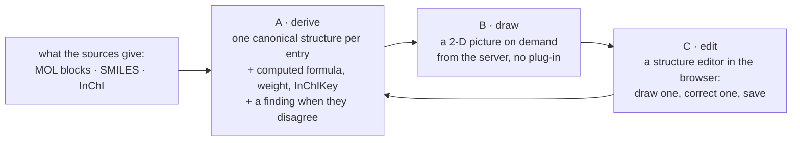

[← README](../README.md) · [Handbook](HANDBOOK.md) · [Glossary](00-glossary.md)

# Chemical structures — derive, draw, edit

**Status:** specification 📝, written 2026-09-14 from the owner's request; the
decisions S1–S5 below await the owner, then it is built as phase **CR-12**
in three releases. This page becomes the reference for structures once
they ship; until then it says what will exist and why.

**Who this is for:** anyone who wants to *see* a compound rather than read
its name — and anyone who has to correct a structure the source got wrong.
No chemistry beyond "a molecule is atoms joined by bonds" is assumed; every
term is explained the first time and is in the [glossary](00-glossary.md).

---

## Contents

- [The idea, in plain words](#the-idea-in-plain-words)
- [What the registry holds today](#what-the-registry-holds-today)
- [Step A — Derive one structure per entry, and check it](#step-a--derive-one-structure-per-entry-and-check-it)
- [Step B — Draw it](#step-b--draw-it)
- [Step C — Edit it in the browser](#step-c--edit-it-in-the-browser)
- [What "like ChemDraw" means here, and what it does not](#what-like-chemdraw-means-here-and-what-it-does-not)
- [Decisions S1–S5](#decisions-s1s5)
- [Done means](#done-means)

---

## The idea, in plain words

A compound's **structure** is the drawing chemists actually think in: which
atoms, joined how. A name is a label for it and a CAS number is a
registration of it, but both can be wrong and neither can be *checked*
against the other. A structure can: from the drawing alone a program can
compute the formula, the molecular weight and a fingerprint (the
**InChIKey**) that is the same for the compound whatever it is called. That
is what "accurate" means on this page — not "looks right", but "the
structure the entry carries agrees with the formula and weight the entry
carries, and a person can see it".

*Everyday version:* the name on a parcel is what the sender wrote; the
structure is the X-ray of what is inside.

Three things follow, in order:

---

## What the registry holds today

Counted on the Mac copy of the real export on 2026-09-14 (12,539 entries):

| Structure source on the entry | Entries | Where it came from |
|---|---|---|
| A **MOL block** (`mol_block`, already read by RDKit into `structural`) | 77 | the registry SDF, merged on DTXSID |
| **SMILES** (`smiles`) | 6,411 | the export's `SMILES_ORIGINAL`; the export also carries `SMILES_NEUT` under `metadata` |
| **InChI** (`inchi` / `inchi_string`) | 6,447 | the export's `INCHI` |
| **Any** of the three | 6,553 | — |
| **None** | 5,986 | entries the source system itself has no structure for |

Today the detail view draws the 77 MOL blocks with a small viewer written
for this project (`client/src/components/MoleculeViewer.jsx`) and shows a
SMILES string as text for the rest. Nothing is computed from a SMILES or an
InChI; nothing is checked; nothing can be drawn by a person.

---

## Step A — Derive one structure per entry, and check it

**What:** for every entry that has any structure source, compute one
canonical structure with **RDKit** (the chemistry library the application
already uses) and store the computed facts beside — never over — the
laboratory's own fields.

**From what, in what order** (decision S5): the MOL block if there is one
(a drawing is the most explicit source), else `SMILES_ORIGINAL` (what the
chemist entered), else the InChI. Whichever is used is recorded.

**What is stored**, under one new key on the entry, `structure`:

| Field | Meaning |
|---|---|
| `source` | `mol_block`, `smiles` or `inchi` — which field the structure was derived from |
| `smiles` | the canonical SMILES RDKit writes for it |
| `inchi`, `inchikey` | computed, not copied |
| `formula`, `weight` | computed from the structure |
| `atoms`, `bonds`, `rings`, `charge` | counts, for the table and the filters |
| `derived_at` | when |

The one design rule holds: `structure` is one more fact in the document.
No column, no migration.

**The check.** A computed formula that differs from the entry's
`molecular_formula`, a computed InChIKey that differs from an InChI the
export carried, a SMILES RDKit cannot read at all — each becomes a
**structure finding**, a fifth kind on the [attention page](04-phase-tutorials/phase-cr-10-attention-page.md),
with the two values side by side and the same *mark reviewed* as the
others. That is how the registry says which of its structures it cannot
vouch for, instead of drawing them all with equal confidence.

**By every route.** `POST /api/chemicals/structures/derive` (all entries,
or a list of identifiers; report first, `apply` to write) and the script
`derive_structures.py` with the same options; a button on the attention
page runs it. Both call one module, as the audit does.

**What it does not do:** ask PubChem for the 5,986 entries with no
structure. That is enrichment, and enrichment goes through the review
table of CR-4, one accepted value at a time, under the two-identifier
rule. A structure fetched by CAS alone is exactly how lesson 24 happened.

---

## Step B — Draw it

**What:** a picture of the structure wherever the entry is shown.

**How:** the server draws it. `GET /api/chemicals/{id}/structure.svg`
renders the derived structure with RDKit's own depiction code as an SVG
image, cached on the entry's `derived_at`. The browser shows it as an
image: in the detail view (replacing the project's viewer), as a
thumbnail column the views can switch on, and in the chooser dialogs where
a person confirms a compound before linking or merging.

**Why on the server:** one drawing engine, the same picture from the
browser, from a script, from a report; no chemistry library shipped to the
browser for viewing; the same image can be saved from the API. The
existing viewer stays as the fallback for an entry that has a MOL block
but no derived structure yet.

---

## Step C — Edit it in the browser

**What:** a **structure editor** — a drawing canvas for molecules, with
the tools chemists expect from Elemental, ChemDraw or MolView: atoms,
bonds, rings and templates, charges, stereo bonds, clean-up, and import
and export as MOL, SMILES and InChI.

**How:** an open-source editor embedded in the client, bundled with it
(the browser on the laboratory's network cannot be assumed to reach a
content network), opened from the detail view with **Edit structure** or,
for an entry with none, **Draw structure**. On save the editor hands back
a MOL block; the server reads it with RDKit, refuses one it cannot read,
stores it as `mol_block`, re-runs Step A for that entry, and keeps the
previous structure under `structure_history` with a timestamp, so a
correction is never silent and can be undone.

**Which editor** (decision S1): the candidates, judged on licence, upkeep
and fit with a React client:

| Editor | Licence | Notes |
|---|---|---|
| **Ketcher** (EPAM) | Apache-2.0 | Actively maintained; a React component; runs standalone in the browser with no server of its own; reads and writes MOL V2000/V3000, SMILES, InChI; embedded by several electronic notebooks. **Recommended.** |
| JSME | BSD-style, free | Small and mature; older interface; no React component |
| Kekule.js | MIT | Capable; smaller community; heavier to integrate |
| OpenChemLib JS | BSD | A chemistry library with an editor inside; less editor polish |
| Marvin JS, ChemDoodle Web | commercial / GPL | Not considered: cost, or a licence the project cannot carry |

A dependency is added only with a *Required now* verdict; the owner asked
for this capability on 2026-09-14, so the verdict is recorded in
[`06-product-and-technology-roadmap.md`](06-product-and-technology-roadmap.md#drawing-and-editing-structures).

---

## What "like ChemDraw" means here, and what it does not

**Will exist after CR-12:** draw and edit a 2-D structure with rings,
templates, charges and stereo; clean up the drawing; import a MOL, SMILES
or InChI into the editor; export the same; see every stored structure as a
picture; know which structures the registry cannot vouch for.

**Will not, and says so:** 3-D models and conformers; reaction schemes and
arrows; name-to-structure ("type *caffeine*, get the drawing" — a
separate tool, OPSIN, could be added later as its own decision);
spectra; property prediction beyond formula and weight. Each is a
candidate for the product roadmap with its own trigger, not a gap in this
phase.

---

## Decisions S1–S5

| # | Question | Recommendation | Why |
|---|---|---|---|
| S1 | Which editor? | **Ketcher**, standalone mode, bundled with the client | Apache-2.0, maintained, React, no server of its own, reads and writes every format the registry holds |
| S2 | Who may edit a structure, and is the old one kept? | Anyone who can edit the entry (there are no roles until SH-3); the previous structure is kept under `structure_history` | A correction must be reversible and visible; roles come with authentication |
| S3 | Fetch missing structures from PubChem? | **Not in CR-12.** Through CR-4's review table, per compound, name and CAS agreeing | The two-identifier rule; lesson 24 |
| S4 | A thumbnail column in the registry views? | Yes, off by default in Compact, offered in Complete and Batches | 12,539 images on a page is a lot; a person switches it on |
| S5 | Which source wins when an entry has several? | MOL block, then `SMILES_ORIGINAL`, then InChI; the InChI is then used to *check* | The drawing is the most explicit; the chemist's SMILES is what was entered; a computed InChIKey that differs from the export's InChI is a finding, not a silent choice |

---

## Done means

- Step A: every entry with a structure source has a `structure`; the
  attention page shows the structure findings with their counts; the
  script and the endpoint report first and write on `apply`.
- Step B: `GET /api/chemicals/{id}/structure.svg` answers for every derived
  structure; the detail view and the chooser dialogs show it.
- Step C: **Draw structure** and **Edit structure** open the editor; a save
  is validated by RDKit, re-derives the entry, keeps the history, and the
  picture changes at once.
- Each step has its tests, its every-route test table in the phase
  tutorial, and its release note.

**Last Updated:** September 14, 2026
