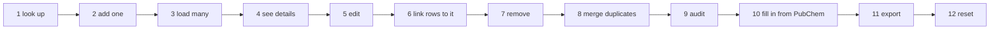

[← README](../README.md) · [Handbook](HANDBOOK.md) · [Glossary](00-glossary.md)

# Chemical Registry — routine tasks, by every route

**Who this is for:** anyone who looks after the registry day to day. No
chemistry, database or command-line knowledge assumed; every term is
explained the first time and lives in the [glossary](00-glossary.md).
**What this page is:** one table per task, in the order the tasks come up,
each showing the **browser**, the **API** and the **terminal** route side by
side, with a link to the page that explains the detail. It does not repeat
those pages; it tells you which one to open.
**The three routes, once:**

| Route | What it is | When you use it |
|---|---|---|
| **Browser** | The web pages, at `https://<vm-hostname>:49160` on the server or `http://localhost:49160` on your own machine | Day-to-day work, one thing at a time, with confirmations |
| **API** | The same actions as web requests, sent with `curl` from any machine that can reach the server. `-k` is needed on the server because the certificate names the full host, not `localhost`; on a Mac use `http://` and drop `-k` | Scripts, bulk work, anything you want repeatable |
| **Terminal** | The maintenance scripts that run *inside* the container and talk to the database directly: `./container-py.sh script <name.py> [arguments]` from the repository folder, on any platform (it finds podman or Docker for you; `./container-py.sh script` alone lists the scripts). On a Mac with the test environment they also run directly: `cd backend && .venv/bin/python scripts/<name.py> …` | Bulk maintenance: audit, merge, remove, reset. The scripts that change data (remove, merge) report first and write only with `--apply`; the audit only reports; the PubChem scripts write as they go, in batches |

*Everyday version:* the shop counter, the order form, and the stockroom
door. Same stock, three ways to reach it.

---

## Contents

1. [Look up a compound](#1-look-up-a-compound)
2. [Add one compound](#2-add-one-compound)
3. [Load many compounds from a file](#3-load-many-compounds-from-a-file)
4. [See everything about one compound](#4-see-everything-about-one-compound)
5. [Edit a compound](#5-edit-a-compound)
6. [Link measurements to a compound, or unlink them](#6-link-measurements-to-a-compound-or-unlink-them)
7. [Remove a compound](#7-remove-a-compound)
8. [Merge two entries for one substance](#8-merge-two-entries-for-one-substance)
9. [Audit the registry](#9-audit-the-registry)
10. [Fill in missing information from PubChem](#10-fill-in-missing-information-from-pubchem)
11. [Export the registry](#11-export-the-registry)
12. [Reset the registry](#12-reset-the-registry)
- [Two rules that apply to every task](#two-rules-that-apply-to-every-task)
- [What is planned for these tasks](#what-is-planned-for-these-tasks)

---

## 1. Look up a compound

| Browser | API | Terminal |
|---|---|---|
| **Chemical Registry** → type part of a name, an identifier (`CHEM-000042`) or a CAS number in the search box → **Search**. Twenty rows a page in the browser, *Previous* / *Next* underneath (the API defaults to fifty). | `curl --noproxy '*' -sSk "https://localhost:49160/api/chemicals?search=phenol&limit=20&page=1"` | The read-only SQL console: **Query** page, or `POST /api/query` with `{"sql": "SELECT chemical_id, json_extract(doc,'$.name') FROM chemicals WHERE json_extract(doc,'$.name') LIKE '%phenol%'"}` — recipes in [`09-query-cookbook.md`](09-query-cookbook.md) |

**You should see** matching rows with identifier, name, CAS, formula and
weight. Sorting by a column and filtering per column are not there yet
(planned: [CR-1](05-roadmap.md#cr--chemical-registry)). Detail:
[API reference → List Chemicals](08-api-reference.md#list-chemicals).

## 2. Add one compound

| Browser | API | Terminal |
|---|---|---|
| **Chemical Registry** → **Upload Chemicals** → choose **Manual Entry** → fill in at least the identifier and the name (CAS, formula, weight, SMILES, InChI, supplier, purity, storage, hazards are optional) → submit | `curl --noproxy '*' -sSk -X POST https://localhost:49160/api/chemicals -H 'Content-Type: application/json' -d '{"chemical_id":"CHEM-000901","name":"Caffeine","cas_number":"58-08-2"}'` | The same `curl`, from the server's shell |

**You should see** the new row in the registry. A second add with the same
identifier is refused with *Chemical ID already exists*. **A CAS number is
optional**: a compound without one is a valid entry. Detail:
[API reference → Add Single Chemical](08-api-reference.md#add-single-chemical).

## 3. Load many compounds from a file

| Browser | API | Terminal |
|---|---|---|
| **Chemical Registry** → **Upload Chemicals** → **Excel/CSV** (`.xlsx`, `.xls`, `.csv`, `.tsv`) or **SDF** (`.sdf`, structures) → choose the file → upload | `curl --noproxy '*' -sSk -X POST https://localhost:49160/api/chemicals/upload/excel -F "file=@chemicals.csv"` — or `…/upload/sdf -F "file=@compounds.sdf"` | The same `curl` from the server's shell, with the file on the server |

**You should see** `Successfully processed N chemicals (N new, 0 updated)`.
Loading the same file twice updates rather than duplicates. The columns each
format needs are in [`excel-templates/README.md`](excel-templates/README.md);
the API detail in [Upload Chemicals (Excel)](08-api-reference.md#upload-chemicals-excel)
and [(SDF)](08-api-reference.md#upload-chemicals-sdf). Planned: a JSON
upload and one terminal command that shares the same parsers
([CR-3](05-roadmap.md#cr--chemical-registry)).

## 4. See everything about one compound

| Browser | API | Terminal |
|---|---|---|
| **Chemical Registry** → the **eye icon** at the end of the row → a panel with every field, the structure drawn from the SMILES or MOL block, and the spreadsheet's extra columns | `curl --noproxy '*' -sSk https://localhost:49160/api/chemicals/CHEM-000042` | SQL console: `SELECT doc FROM chemicals WHERE chemical_id='CHEM-000042'` — the whole record is the `doc` ([the one design rule](02-architecture.md#the-one-design-rule-everything-else-follows-from)) |

Detail: [API reference → Get Single Chemical](08-api-reference.md#get-single-chemical).

## 5. Edit a compound

| Browser | API | Terminal |
|---|---|---|
| **Chemical Registry** → tick the row (or several) → **Edit Selected** → change supplier, CAS number, formula or weight → save. Other fields are edited through the API today | one compound: `curl --noproxy '*' -sSk -X PUT https://localhost:49160/api/chemicals/CHEM-000042 -H 'Content-Type: application/json' -d '{"supplier":"New supplier"}'` · several at once: `POST /api/chemicals/bulk/update` with `{"chemical_ids":[…],"updates":{…}}` | The same `curl` from the server's shell |

**You should see** the changed value in the row and `updated_at` moved to
now. The identifier itself cannot be changed. Detail:
[Update Chemical](08-api-reference.md#update-chemical),
[Bulk Update Chemicals](08-api-reference.md#bulk-update-chemicals).

## 6. Link measurements to a compound, or unlink them

Linking lives on the **Screening Data** page, because it is the rows that
get the pointer, not the compound.

| Browser | API | Terminal |
|---|---|---|
| **Screening Data** → search for the rows → tick them, or tick the header box and **Select all N matching rows** → **Link to a chemical…** → pick the compound → confirm its name and CAS → **Yes, link**. **Unlink** in the same bar; **Unlink all rows…** beside the count | `POST /api/screening/link` with `{"record_ids":[…],"chemical_id":"CHEM-000042"}` or `{"match":{…},"chemical_id":…}`; `POST /api/screening/unlink` with `{"record_ids":[…]}`, `{"match":{…}}` or `{"all":true}` | `remove_chemicals.py CHEM-000042 --unlink-only` (report), then `--apply`: detach the rows and keep the entry |

The rule that decides which rows attach *automatically* at upload is
changing: [the registry-first rule](09-chemical-identification.md#the-next-rule-registry-first--specification).
Detail: [playbook → Linking and unlinking by hand](10-user-playbook.md#linking-and-unlinking-by-hand),
[API reference → Link or unlink screening records](08-api-reference.md#link-or-unlink-screening-records).

## 7. Remove a compound

**Unlink before you delete — and since v2.11.0 the system holds you to
it.** Deleting an entry while measurements still point at it would leave
those rows pointing at nothing — a *dangling link*. So: in the browser and
with the plain API, a compound with linked rows **cannot** be deleted; you
are told how many rows and sent to unlink them first (task 6). The API with
`force=true` and the terminal script **unlink first, then delete**,
automatically, and report both counts. The rule and why:
[phase CR-6](04-phase-tutorials/phase-cr-6-delete-unlinks-first.md).

| You want to remove | Browser | API | Terminal |
|---|---|---|---|
| **One** compound | **Chemical Registry** → find it → the **bin icon** at the end of its row → confirm. If rows are linked: the dialog *Not deleted — rows are still linked* → **Open the linked rows** → unlink them → delete again | `curl --noproxy '*' -sSk -X DELETE https://localhost:49160/api/chemicals/CHEM-000042` — `409` while rows are linked; add `?force=true` to unlink then delete | `remove_chemicals.py CHEM-000042` (report: shows the linked rows), then `--apply` (unlinks, then deletes) |
| **Several** | tick their boxes → **Delete Selected** → confirm; refused with the count while any is linked | `POST /api/chemicals/bulk/delete` with `{"chemical_ids":[…]}` — add `"force": true` to unlink then delete | `remove_chemicals.py CHEM-000042 CHEM-000043 --apply`, or `--from-file ids.txt --apply` |
| **Every compound the identification job created** | not in the browser | not in the API | `remove_chemicals.py --pubchem-registered --apply` |
| **Every compound** (the reset, R-2) | **Clear All** → confirm; refused while anything is linked — unlink everything first with **Unlink all rows…** on Screening Data | `DELETE /api/chemicals/all/clear` — `409` while anything is linked; `?force=true` unlinks everything then clears; no undo | `remove_chemicals.py --all --apply` — [phase R](04-phase-tutorials/phase-r-registry-reset.md) |

**You should see**, from the script, rows per chemical before and after and
`Removed N entries, unlinked M rows`. **What happens to the measurements:**
nothing is deleted; they lose their pointer and show the compound name their
file recorded. Detail: [`09-chemical-identification.md` → Removing entries](09-chemical-identification.md#removing-entries-that-are-wrong),
[playbook Part 6](10-user-playbook.md#part-6--correct-what-is-wrong),
[API reference → Delete Chemical](08-api-reference.md#delete-chemical).

## 8. Merge two entries for one substance

| Browser | API | Terminal |
|---|---|---|
| not yet ([CR-8](05-roadmap.md#cr--chemical-registry)) | not yet | `merge_duplicate_chemicals.py` — finds entries that describe one substance (same PubChem compound, or two CAS numbers for one substance), repoints every measurement to the survivor first, deletes the other second; report, then `--apply` |

Detail: [`09-chemical-identification.md` → Merging entries](09-chemical-identification.md#merging-entries-that-describe-one-substance).

## 9. Audit the registry

| Browser | API | Terminal |
|---|---|---|
| — | `./verify-deploy.sh https://localhost:49160` from the repository folder on the server: no dangling links, sequential identifiers, no duplicates by CAS, PubChem id or name | `audit_chemicals.py` — flags entries whose formula contradicts their own name and other inconsistencies; report only |

Detail: [`09-chemical-identification.md` → Auditing what is registered](09-chemical-identification.md#auditing-what-is-registered).

## 10. Fill in missing information from PubChem

| Browser | API | Terminal |
|---|---|---|
| not yet — planned as a notice of incomplete entries with a review table ([CR-4](05-roadmap.md#cr--chemical-registry)) | not yet | `enrich_pubchem.py` for registered entries — it writes as it goes (`--limit N` to stop after N lookups, `--batch` to set how often it commits, `--retry-misses` to try again); `link_pubchem.py` was the old stage-2 job and is retired for screening rows under the new rule |

**Rule:** PubChem is asked only from the registry, for entries a person
registered, and only on request; never during a screening upload
([the registry-first rule, Rule 4](09-chemical-identification.md#the-five-rules)).

## 11. Export the registry

| Browser | API | Terminal |
|---|---|---|
| **Query** page → `SELECT * FROM chemicals` (or a narrower select) → **Download CSV**. The registry page itself has no export button yet ([SH-7](05-roadmap.md#sh--shared-spine)) | `curl --noproxy '*' -sSk "https://localhost:49160/api/chemicals?limit=1000&page=1" > chemicals-page1.json` — JSON, a page at a time | `./container-py.sh backup` gives the whole database as one file; a copy outside the repository is the real export |

## 12. Reset the registry

Two gated steps, each behind a backup and an explicit go: unlink every row
(R-1), remove every entry (R-2). The full procedure with expected output at
each step, the browser route (*Unlink all rows…*, *Clear All*) and the
terminal route (`remove_chemicals.py --unlink-all --apply`, then `--all
--apply`), and how it was run on 2026-09-08:
[phase R](04-phase-tutorials/phase-r-registry-reset.md). How to check it
from every route afterwards: [the phase's test section](04-phase-tutorials/phase-r-registry-reset.md#how-to-test-it-by-every-route).

---

## Two rules that apply to every task

1. **Unlink before you delete** (task 7). Measurements are never deleted with
   a compound; they are detached first, by you or by the script.
2. **A person registers; the system only proposes.** Nothing is added to the
   registry by inference. A compound may be registered without a CAS number.
   Screening rows attach automatically only when both name and CAS match a
   registered compound ([the registry-first rule](09-chemical-identification.md#the-next-rule-registry-first--specification)).

## What is planned for these tasks

| Task | Planned change | Phase |
|---|---|---|
| 1 look up | sort by column, filter per column, page size | [CR-1](05-roadmap.md#cr--chemical-registry) |
| 1, 4 | Compact, Complete and PubChem views | CR-2 |
| 3 load many | JSON upload; one terminal command for every file type | CR-3 |
| 8 merge | from the browser | CR-8 |
| 10 PubChem | notice of incomplete entries, fetch with a review table, mark as complete | CR-4 |
| 6 link | the registry-first rule; unregistered compounds notice and review | SD-1, CR-5 |
| 11 export | an export button on the registry page | SH-7 |

**Last Updated:** September 8, 2026
