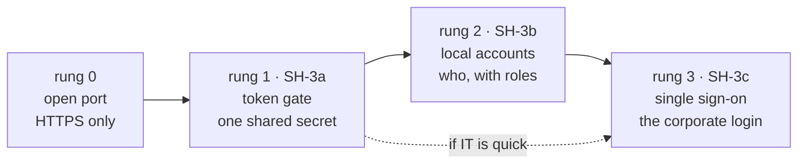
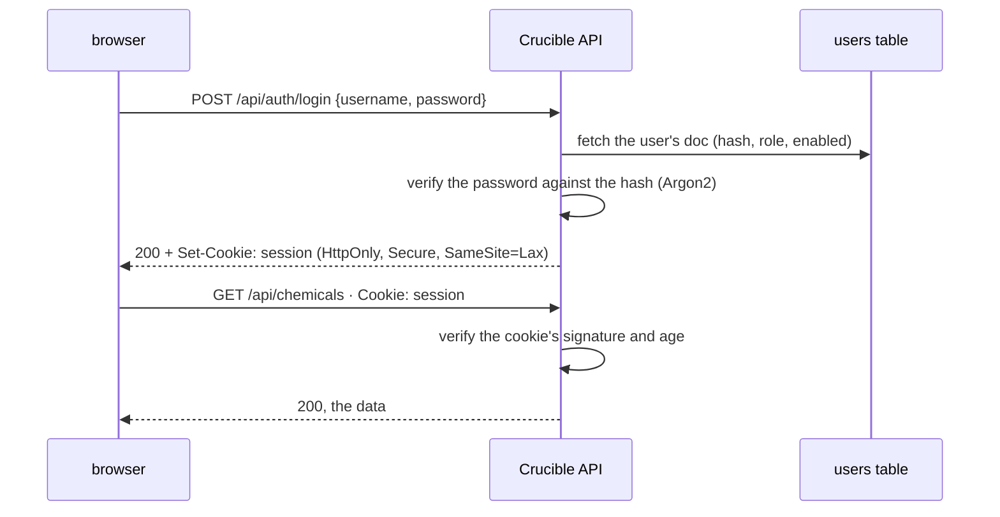
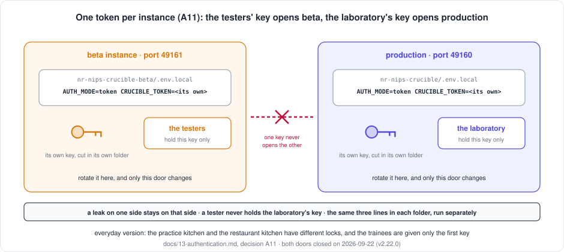
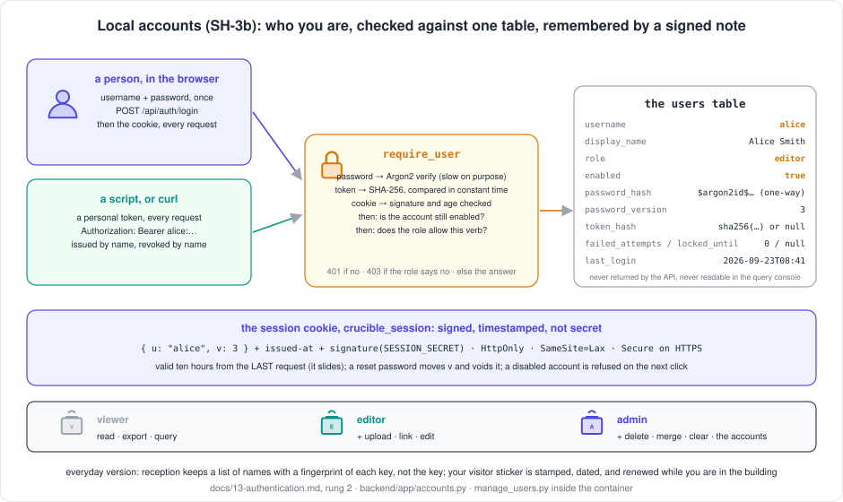

[← README](../README.md) · [Handbook](HANDBOOK.md) · [Glossary](00-glossary.md)

# Authentication — the ladder from an open port to single sign-on

**Prerequisites:** none. Every term is explained here with an everyday comparison. [`02-architecture.md`](02-architecture.md) helps for *where* the pieces go; [`07-operations.md`](07-operations.md) for how the server is run today.
**Learning goal:** you understand what a login actually is (three separate ideas people run together), why Crucible has none yet and what that exposes, the three secure ways to add one, why they are built in that order, what each one needs from the organisation, and how a person and a script log in at each step.
**Deliverable of this page:** the plan for phases **SH-3a**, **SH-3b** and **SH-3c** of the shared spine ([roadmap](05-roadmap.md#sh--shared-spine)): three rungs of one ladder, each secure on its own, the last one **single sign-on**, which is the destination. The decision itself is recorded in [ADR 0001](adr/0001-authentication-ladder.md).
**Status:** ✅ agreed 2026-09-08 (decision log at the end). **Rung 1 built and shipped as v2.22.0 ([phase SH-3a](04-phase-tutorials/phase-sh-3a-token-gate.md), 2026-09-22): on the beta instance at 17:31 and on production at 18:06 the same day, each with its own token (A11). Rung 2 built and shipped as v2.23.0 ([phase SH-3b](04-phase-tutorials/phase-sh-3b-local-accounts.md), 2026-09-22): usernames, passwords, roles and personal tokens, on the beta instance since 19:58 the same day with one account per tester; production followed on 2026-09-23 at 01:17 server time (Step 10, in two moments: the accounts first, then the switch), with its own three accounts and its own secret. Both instances use accounts; the shared token is retired on both.** Rung 3 waits: no single sign-on for the moment, the owner's decision of 2026-09-22.


---

> **2026-09-21 — the login is now the top of the plan.** The owner wants
> the application in front of end users for testing, which needs each
> tester to log in, and needs a place to try it that is not production.
> So: a **beta instance** first ([`14-beta-instance.md`](14-beta-instance.md)
> — **built the same day as phase SH-12, v2.20.0**), then rungs 1 **and 2 in
> full** (SH-3a + SH-3b) delivered to it, tested by the testers, then
> promoted to production. Decision A3 is revisited below; A3, A9 and A10
> were agreed with the go for SH-12. **Open routes:** `/api/health` and,
> since v2.21.0, `/api/instance` (the page's *Prod* / *Beta* label, which
> the login page itself must be able to show) stay outside the guard.
>
> **2026-09-22 — rung 1 is built.** SH-3a shipped as v2.22.0: the flag,
> the guard, the open health route, the login page, the 401 handler, the
> deploy check with a token, the closed cross-origin policy; on beta by
> [Step 7 of its tutorial](04-phase-tutorials/phase-sh-3a-token-gate.md#step-7--turn-it-on-beta-first).
> The same day the owner decided that **single sign-on is not needed for
> the moment**; SH-3c is on hold and SH-3b, local accounts, goes next.
> Production followed at 18:06 with its own token (A11, v2.22.1).
>
> **2026-09-22, late — rung 2 is built.** SH-3b shipped as v2.23.0: the
> `users` table and its migration, Argon2 hashing, a signed sliding
> session, the three roles enforced by one rule, `manage_users.py` behind
> `./container-py.sh users`, the login page's username-and-password form,
> a change-password dialog, personal tokens for scripts, the lockout, and
> the users table kept out of the query console. On the beta instance
> since 19:58 the same day by [Step 9 of its tutorial](04-phase-tutorials/phase-sh-3b-local-accounts.md#step-9--turn-it-on-beta-first),
> three accounts, confirmed in the browser; production follows when its
> accounts exist ([Step 10](04-phase-tutorials/phase-sh-3b-local-accounts.md#step-10--production-in-two-moments-the-accounts-then-the-switch)).
>
> **2026-09-23 — production's accounts, ahead of its switch.** The owner
> decided that production gets the same three accounts as beta, created
> before the switch: Step 10 of the tutorial is now two moments,
> [10a the accounts](04-phase-tutorials/phase-sh-3b-local-accounts.md#step-10a--the-accounts-while-the-login-is-still-the-token) (done 2026-09-23 in production's folder,
> the login still the token) and [10b the switch](04-phase-tutorials/phase-sh-3b-local-accounts.md#step-10b--the-switch-at-an-announced-moment) at a moment
> the owner announces, once every person holds their password. The rows
> sit in the table, ignored by the door until the mode is `local`;
> `./container-py.sh status` says so (v2.23.3), and the state between
> the two moments is tested by every route in the tutorial.
>
> **2026-09-23, 01:17 server time — production on accounts.** Step 10b
> done: the mode switched with production's own secret, a backup, a
> `stop` and a `start`; `/api/auth/me` answers `local`, the gate `401`,
> the deploy checks pass 19 with the operator's personal token, the
> monitor is green, the two secrets differ, beta untouched; the login page
> and the dashboard confirmed in the browser. The shared token has retired
> on both instances. The state after the switch is tested by every route
> [in the tutorial](04-phase-tutorials/phase-sh-3b-local-accounts.md#after-the-switch-production-on-accounts-step-10b) (v2.23.4).

## Contents

- [Why a login, in plain words](#why-a-login-in-plain-words)
- [The words you need](#the-words-you-need)
- [Where we stand today: rung 0](#where-we-stand-today-rung-0)
- [The ladder](#the-ladder)
- [What every rung shares](#what-every-rung-shares)
- [Rung 1 — a token gate](#rung-1--a-token-gate)
- [Rung 2 — local accounts](#rung-2--local-accounts)
- [Rung 3 — single sign-on](#rung-3--single-sign-on)
- [Other ways in, and why not](#other-ways-in-and-why-not)
- [Rules that hold on every rung](#rules-that-hold-on-every-rung)
- [How a person and a script log in, rung by rung](#how-a-person-and-a-script-log-in-rung-by-rung)
- [What to ask the organisation for, now](#what-to-ask-the-organisation-for-now)
- [Decisions to agree](#decisions-to-agree)
- [The phases](#the-phases)
- [Related pages](#related-pages)

---

## Why a login, in plain words

Today anyone who can reach the server's port can read every record, upload
a file, delete a compound and run SQL against the database. There is no
way to tell who did what, because the application never asks. That is
acceptable on a trusted internal network with one laboratory, and it was a
deliberate choice while the system was being built. It stops being
acceptable the moment a second group, a wider network or a regulator enters
the picture — and every later control (who may delete, an audit trail that
says *who*, a limit on runaway scripts) depends on the application knowing
who is asking.

*Everyday version:* a laboratory whose door is unlocked because "only we
work here". Fine on day one. The day someone from another floor wanders in,
or an auditor asks who signed the last entry in the notebook, the missing
lock is the whole problem.

**Why not jump straight to single sign-on?** Because it depends on another
team. The organisation's identity service must be asked to register this
application, and that request has a lead time we do not control. A lock we
can fit ourselves this week is better than a badge reader that arrives in
two months — and the badge reader is still the destination.

---

## The words you need

| Term | Plain words | Everyday version |
|---|---|---|
| **Authentication** | Proving *who* you are | Showing your badge at reception |
| **Authorisation** | What you are *allowed* to do once known | Which doors the badge opens |
| **Identity** | The *who*: a person, or a script acting for one | The name on the badge |
| **Credential** | The thing you present to prove identity: a password, a token, a badge | The badge itself |
| **Secret** | Any credential or key that must not be seen by others — never in git, never in a log | The PIN behind the badge |
| **Token (API key)** | A long random string presented on every request. Whoever holds it is trusted | A key cut for a door |
| **Password hashing** | Storing a scrambled, one-way version of a password so that even the database cannot reveal it | Keeping a fingerprint of the key, not the key |
| **Session** | The server remembering that *this* browser logged in a moment ago, so it need not ask again on every click | The visitor sticker you wear all day after signing in |
| **Cookie** | The small note the browser sends with every request so the server can find the session | The sticker's number |
| **Identity provider (IdP)** | The organisation's central login service, which already knows every employee | The company's badge office |
| **Single sign-on (SSO)** | Logging into many applications with the one corporate login, vouched for by the identity provider | One badge for every building |
| **OpenID Connect (OIDC)** | The standard protocol an application uses to ask the identity provider "who is this?" | The agreed form the badge office fills in |
| **Redirect URI** | The address the identity provider sends the user back to after a login | The return envelope |
| **Client ID and secret** | This application's own credential with the identity provider | The application's badge |
| **Claim** | One fact the identity provider states about the user: name, e-mail, groups | One line on the badge |
| **Role** | A named bundle of permissions: *viewer*, *editor*, *admin* | Visitor, staff, keyholder |
| **Feature flag** | A setting that turns a capability on or off without changing code — here `AUTH_MODE` | The switch beside the badge reader |
| **Break-glass account** | One local admin login kept for the day the identity provider is unreachable | The physical key in the box marked *emergency* |
| **HTTPS** | Encrypted transport, so a credential cannot be read in transit. Mandatory the moment there is one | Sealed envelopes instead of postcards |

---

## Where we stand today: rung 0

| | Today |
|---|---|
| Transport | HTTPS on the server with the organisation's certificate; HTTP on a development machine |
| Login | none; every `/api/*` route answers anyone |
| Cross-origin policy | open (any web page may call the API) |
| Who is recorded | nobody; records carry `created_at` and `updated_at`, no *by whom* |
| Health check | the container probes `/api/stats` every 30 s; the cron monitor does the same |
| Scripts | the maintenance scripts run *inside* the container against the database directly and need no HTTP at all |

The last two rows matter for the plan: the health probe must keep working
once the API needs a login, and the scripts are unaffected by any rung.

**Since v2.22.0 (2026-09-22), rung 1 on both instances:** every `/api`
route needs the token except `/api/health`, `/api/instance` and
`/api/auth/*`; the probes ask `/api/health`; the cross-origin policy is
closed; who is recorded is still nobody (rung 2). Beta and production each
have their own token ([A11](#decisions-to-agree)).

**Since v2.23.0 (2026-09-22, later), rung 2 exists and beta moves to it:**
with `AUTH_MODE=local` an instance asks for a username and a password,
knows *who* is calling and with which role, and lets a script in with a
personal token that is revoked by name. The same open routes, the same
probes, the same closed cross-origin policy. Production stays on the token
rung until the operator has created its accounts.

---

## The ladder



| Rung | What it is | Who is identified | Needs from the organisation | Effort | Protects against | Does not give |
|---|---|---|---|---|---|---|
| **1 · token gate** | One long secret; every request must carry it | "someone with the token" | nothing | about two days | strangers on the network; accidental clicks from the wrong machine | *who*; per-person revocation |
| **2 · local accounts** | Usernames and passwords held by Crucible, hashed; roles | each person | nothing | one to two weeks | everything rung 1 does, plus: a leaver keeps access; a viewer deleting | the corporate login; passwords to manage |
| **3 · single sign-on** | The corporate identity provider vouches; Crucible never sees a password | each person, as the organisation knows them | an application registration (client ID, secret, redirect URI, group claim) | one to two weeks *after* registration | everything above, plus: leavers lose access the day they leave; no passwords held here | — this is the destination |

**Each rung keeps what the one below gave.** Tokens stay for scripts and
service accounts at every rung. A local admin account stays as the
break-glass login under single sign-on. Nothing is thrown away when the
next rung is climbed; the flag just moves.

**The recommended path** is rung 1 now, the registration request to IT the
same week, then rung 3 as soon as IT delivers, with rung 2 built only in
its smallest form (one break-glass admin) — *unless* the registration takes
long, in which case rung 2 goes in fully so that the laboratory has
per-person logins in the meantime. That is decision A3 below.

---

## What every rung shares

Built once, in SH-3a (✅ v2.22.0), and reused by the rungs above.

| Piece | What it is | Where |
|---|---|---|
| `AUTH_MODE` | The feature flag: `off` (today), `token`, `local`, `sso`. Read from the environment like every other setting; on the server it lives in the untracked `.env.local` | `backend/app/config.py`, `container-py.sh` passes it in |
| `require_user` | One FastAPI dependency (a function every protected route declares, the same way `get_db` supplies the database session — see [`02-architecture.md`](02-architecture.md#the-one-design-rule-everything-else-follows-from)) that returns the current identity or answers **401** | `backend/app/auth.py` |
| The identity | A small record: `subject` (who), `display_name`, `roles`, `via` (`token` / `local` / `sso`). Every rung produces the same shape, so nothing above the dependency changes between rungs | same |
| `GET /api/health` | A new endpoint that answers `{"status": "ok"}` with **no** login, so the container probe and the cron monitor keep working; `healthcheck.py` and `monitor.sh` move to it | `backend/app/routers/health.py` |
| `GET /api/auth/me` | Who am I, according to the server; the client calls it on load to decide whether to show the login page | `backend/app/routers/auth.py` |
| The login page | One page in the client, whose contents depend on the mode: a token box, a username and password form, or a *Sign in with the organisation* button | `client/src/pages/Login.jsx` |
| The 401 handler | The client's API layer catches **401** on any call and shows the login page, then retries; nothing else in the client changes | `client/src/services/api.js` |
| Tests per mode | The suite runs with `AUTH_MODE=off` (the contract tests, unchanged) plus one test file per rung that proves: no credential → 401, wrong credential → 401, right credential → 200, health open | `backend/tests/test_auth_*.py` |
| The deploy check | `verify-deploy.sh` gains `--token <t>` (or reads `CRUCIBLE_TOKEN`) so it can run against a protected server | repository root |

*Everyday version:* fit the door frame, the lock housing and the alarm
wiring once; the three rungs are three different lock mechanisms that
drop into the same housing.

---

## Rung 1 — a token gate

**What:** one long random secret, generated once, kept in `.env.local` on
the server. Every request to `/api/*` (except health) must carry it, either
as a header for scripts or from the browser after the user has pasted it
once into the login page.

**How it works:**

```mermaid
sequenceDiagram
    participant B as browser
    participant A as Crucible API
    B->>A: GET /api/auth/me (open)
    A-->>B: {"mode":"token","authenticated":false}: the page shows the login
    B->>A: POST /api/auth/login {token}, pasted once
    A->>A: compare with CRUCIBLE_TOKEN in constant time
    A-->>B: Set-Cookie: crucible_session — a keyed hash of the token, not the token; HttpOnly, SameSite=Lax, Secure, ten hours
    B->>A: GET /api/chemicals · Cookie: crucible_session
    A-->>B: 200, the data
    Note over B: a script sends Authorization: Bearer <token> instead, on every request;<br/>a new token voids every cookie at once
```


**Why first:** it is the smallest change that closes the open port, it
needs nothing from anyone else, and it stays useful forever — scripts and
service accounts use tokens on every rung.

**What the operator does, on the server** (done on beta, then on production, 2026-09-22; the full walk with
every output is [Step 7](04-phase-tutorials/phase-sh-3a-token-gate.md#step-7--turn-it-on-beta-first) and [Step 8](04-phase-tutorials/phase-sh-3a-token-gate.md#step-8--turn-it-on-for-production-its-own-token) of the tutorial; run the generation line in **each** folder, never copy one folder's line into the other):

```bash
cd ~/work/Pandora_toolbox/nr-nips-crucible-beta
# the token is generated straight into the file: never on screen, never in the shell history
printf 'AUTH_MODE=token\nCRUCIBLE_TOKEN=%s\n' "$(python3 -c 'import secrets; print(secrets.token_urlsafe(48))')" >> .env.local
chmod 600 .env.local
./container-py.sh backup
./container-py.sh stop && ./container-py.sh start      # a setting reaches a container only when it is created
curl --noproxy '*' -sSk https://localhost:49161/api/stats; echo            # {"error":"Not authenticated"}
curl --noproxy '*' -sSk -H "Authorization: Bearer $(grep '^CRUCIBLE_TOKEN=' .env.local | cut -d= -f2-)" https://localhost:49161/api/stats | head -c 60; echo   # the counts
```

Rotating the token is a new value on the same line and the same `stop` and
`start`; every browser is signed out at once and everyone pastes the new
one ([how](04-phase-tutorials/phase-sh-3a-token-gate.md#rotate-the-token-or-turn-the-gate-off)).
That is the cost of a shared secret, and the reason this is a rung and not
the destination.

**What it does not give:** *who*. Every user is "the token". A leaver keeps
access until the token is rotated. There are no roles. Fine for one
laboratory for a few weeks; not fine for longer.

**Built:** [phase SH-3a](04-phase-tutorials/phase-sh-3a-token-gate.md), v2.22.0, 2026-09-22; nineteen tests; the cookie is a keyed hash of the token (`hmac`, standard library, no new dependency), ten hours fixed rather than sliding (the sliding session arrives with rung 2's signed cookie).

**Effort:** about two days, including the shared pieces above, the tests
and the documentation. No new dependency: FastAPI already provides the
header parsing, and Python's standard library the constant-time compare.

---

## Rung 2 — local accounts

**What:** Crucible keeps its own list of users. Each has a username, a
hashed password, a display name and a role. A person logs in with a
username and password; the server sets a session cookie; the browser sends
it on every request until logout or expiry.

**How it works:**



**The pieces:**

| Piece | Detail |
|---|---|
| `users` table | The same hybrid pattern as every table ([`02-database-schema.md`](02-database-schema.md#the-users-table)): `id`, `username` (indexed, unique), `doc` holding `display_name`, `password_hash`, `role`, `enabled`, `created_at`, `last_login`. One Alembic migration |
| Hashing | **Argon2id** via `argon2-cffi` — a new dependency, justified because password hashing must never be home-made; it is the current recommendation of the people who study this. The hash is one-way: the database can check a password, never reveal it |
| Session | A signed cookie: the server signs `{subject, roles, issued_at}` with a secret from `.env.local` (`SESSION_SECRET`); nothing is stored server-side, so a restart logs nobody out. Flags `HttpOnly` (scripts on a page cannot read it), `Secure` (HTTPS only), `SameSite=Lax` (another site cannot ride on it). Expires after a working day; decision A6 |
| Managing users | A script inside the image, `backend/scripts/manage_users.py add|reset|disable|enable|list` (as built: also `role`, `unlock`, `token`, `remove`), run with `podman exec` like the other maintenance scripts, `./container-py.sh users …` for short; the first admin is created by it. No user administration page in the browser until roles need one |
| Roles | Three, minimal: **viewer** (read, export, query), **editor** (plus upload, link, edit), **admin** (plus delete, users). Stored on the user's doc; enforced by the same dependency, through one rule from the request's verb and path rather than a declaration on each route (as built; decision A14) |
| Brute force | A short delay after a failed login and a per-username lockout after ten (fifteen minutes, as built); the failed attempts are logged without the password |
| Scripts | Keep using a token; a token is now issued *per person or service* and stored hashed in the same table, so it can be revoked one at a time |

**Why it is a rung and not the destination:** it gives *who* and roles,
which unlocks the audit trail and per-person revocation — but it means
Crucible holds passwords, which the organisation would rather it did not,
and a leaver keeps access until someone disables the account. Single
sign-on removes both.

**Built:** [phase SH-3b](04-phase-tutorials/phase-sh-3b-local-accounts.md),
v2.23.0, 2026-09-22; twenty-three tests (192). What shipped, against the
table above, and the four details the plan left open:

| Piece | As built |
|---|---|
| `users` table | as planned; migration `0002_users`; the document also holds `password_version` (moves on every reset, which voids that person's cookies), `token_hash`, `failed_attempts`, `locked_until`, `last_login`. Never returned by the API; the query console refuses the table by name |
| Hashing | Argon2id through `argon2-cffi`, the library's defaults; one rule for a password, at least eight characters |
| Session | `itsdangerous` signs `{username, password_version}` with a timestamp under **`SESSION_SECRET`**, a third line in `.env.local` (decision A12); ten hours from the **last request**: a cookie older than five minutes is re-issued with the answer, so the session slides (A6, finally). Same flags as rung 1 |
| Managing users | `backend/scripts/manage_users.py add · reset · role · enable · disable · unlock · token · remove · list`, run as `./container-py.sh users <verb>` inside the container, against the database directly, so it works whatever the mode says and can never lock the operator out. A password or a token is printed once, when made |
| Roles | viewer, editor, admin, one per account, **enforced by one rule from the verb and the path** (`required_role`): reading needs a viewer, writing an editor, deleting, bulk deleting, merging and clearing an admin; the read-only SQL console is a read (decision A14). Too low a role answers `403` naming the role needed |
| Brute force | a quarter-second pause on every wrong login; ten wrong passwords in a row lock the account for fifteen minutes, right password or not; the log names the user and the count, never the password |
| Scripts | one personal token per account, `<username>:<secret>` (decision A13), issued and revoked by name; only its SHA-256 is stored; sent as the same bearer header; a disabled account's token is refused at once. The shared token of rung 1 opens nothing on this rung |
| Changing one's own password | `POST /api/auth/password` and a *Change password* dialog in the top bar: the operator hands out a temporary password, the person replaces it on the first visit; every other browser of theirs is signed out within a minute (the previous version is honoured for sixty seconds so that requests in flight complete; lesson 40) |

**Effort:** one to two weeks including the migration, the script, the
login form, the tests and the runbook. Two new dependencies (`argon2-cffi`,
and `itsdangerous` for the signed cookie), both small and widely used; they
enter `requirements.lock` through the usual `./container-py.sh lock`
([phase 05b](04-phase-tutorials/phase-05b-reproducible-builds-and-ci.md)).

**How much of it to build** depends on decision A3: the whole rung, or only
one break-glass admin account created by the script, with the roles and
the login form arriving with single sign-on.

---

## Rung 3 — single sign-on

**What:** the organisation's identity provider does the login. Crucible
never sees a password. A person clicks *Sign in with the organisation*, is
sent to the corporate login page (which they may already be signed into),
and is sent back with a signed statement of who they are. Crucible reads
that statement, maps the person's groups to a role, and sets the same
session cookie as rung 2.

**How it works:**

```mermaid
sequenceDiagram
    participant B as browser
    participant A as Crucible API
    participant I as identity provider
    B->>A: GET /api/auth/login (sso mode)
    A-->>B: redirect to the identity provider, with Crucible's client ID, the redirect URI, and a one-time state
    B->>I: the corporate login page (already signed in? then no prompt)
    I-->>B: redirect back to https://<vm-hostname>:49160/api/auth/callback?code=…&state=…
    B->>A: GET /api/auth/callback?code=…
    A->>I: exchange the code for an ID token (server to server, with the client secret)
    I-->>A: ID token: name, e-mail, groups — signed
    A->>A: verify the signature and audience; map groups → role
    A-->>B: Set-Cookie: session; redirect to the app
```

*Everyday version:* you arrive at a building whose reception phones the
company's badge office instead of checking a list of its own. The badge
office confirms who you are and which department you are in; reception
gives you a visitor sticker for the day. The building never keeps a copy of
your badge.

**The pieces:**

| Piece | Detail |
|---|---|
| Protocol | OpenID Connect, *authorization code flow with PKCE* — the standard, browser-based flow every corporate identity provider supports (Microsoft Entra ID, Okta, Keycloak and the rest speak the same protocol; the plan names none, because the choice is the organisation's) |
| Library | `authlib` — a new dependency; the flow has enough security detail (state, nonce, signature verification, discovery) that a maintained library is the responsible choice |
| Configuration | Four values in `.env.local`: `OIDC_ISSUER` (the provider's discovery address), `OIDC_CLIENT_ID`, `OIDC_CLIENT_SECRET`, `OIDC_REDIRECT_URI`; plus `OIDC_ROLE_MAP` (which group claim value means which Crucible role) |
| Session | The same signed cookie as rung 2, so everything above the dependency is unchanged |
| Roles | From the group claim, mapped by configuration; a person in no mapped group is a *viewer* or is refused — decision A5 |
| Break-glass | One local admin account (the smallest piece of rung 2) so that an identity-provider outage or a mis-mapped group cannot lock everyone out |
| Scripts and service accounts | Tokens, as before; a scheduled job does not have a browser to log in with. Issued per service by the admin, revocable one at a time |
| Logout | Clears the cookie; optionally sends the browser to the provider's logout so the corporate session ends too |

**What the organisation must provide, and why it is the long pole:** an
*application registration* with the identity provider. That is a request
to another team, produces the client ID and secret, and must name the exact
redirect URI. The request can be made **today**, before a line of rung 3 is
written; the checklist is [below](#what-to-ask-the-organisation-for-now).

**Effort:** one to two weeks after the registration arrives: the callback
routes, the role mapping, the login button, tests with a fake provider (a
tiny in-process OIDC server so the suite needs no network), the runbook,
and the removal of any rung 2 pieces not kept.

---

## Other ways in, and why not

Each option gets the same three questions as the product roadmap
([`06-product-and-technology-roadmap.md`](06-product-and-technology-roadmap.md)):
required, why, benefit and cost — and a verdict with a trigger.

| Option | What it is | Verdict | Why, and the trigger |
|---|---|---|---|
| An authenticating reverse proxy in front (for example a corporate gateway or `oauth2-proxy`) | A separate server that does the login and passes the user's name to Crucible in a header | **Optional** | It moves the login out of the code, which is elegant, but it is a second web server — something the roadmap [deliberately does not plan](05-roadmap.md#deliberately-not-planned). *Trigger:* the organisation offers a managed gateway that does single sign-on for internal applications; then rung 3 becomes "trust the gateway's header" and is smaller |
| HTTP Basic authentication | The browser's built-in username-and-password prompt | **Not needed** | Rung 1 is simpler for scripts and rung 2 gives a proper login page; Basic gives neither sessions nor logout |
| LDAP bind | Checking a username and password against the corporate directory directly | **Optional** | It gives corporate passwords without single sign-on. *Trigger:* the identity provider refuses or delays the registration and the directory is reachable from the server; then it replaces rung 2's password check and nothing else |
| Client certificates (mutual TLS) | Each user's browser presents its own certificate | **Not needed** | Issuing and installing certificates per person is the badge office's job, which is exactly what single sign-on delegates to it |
| A network allow-list (only these addresses may connect) | The server refusing unknown addresses | **Not sufficient alone** | On a corporate network many people sit behind one address; useful as a *second* layer with any rung, never as the login |
| A password written in the code | — | **Never** | It would be published to the public repository by the next push. The gate script exists to catch exactly this |
| E-mailed one-time links | A login link sent to the person's mailbox | **Not needed** | Needs an outbound mail service; single sign-on gives the same "no password here" property without one |

---

## Rules that hold on every rung

1. **Secrets live in `.env.local` only.** The token, the session secret and
   the client secret are never in git, never in a log line, never in an
   error message. `.env.local` is already ignored; the gate script already
   refuses tracked `.env*` files.
2. **HTTPS is mandatory when `AUTH_MODE` is not `off`.** A credential over
   plain HTTP is a credential on a postcard. The server already runs HTTPS;
   the app refuses to start in a login mode without it, except on
   `localhost` for development.
3. **The open routes say nothing worth reading.** `/api/health` says *ok*
   and nothing else — no counts, no versions; `/api/instance` the label;
   `/api/auth/me` whether *this* caller is in. Everything else is behind
   the guard.
4. **Compare secrets in constant time**, hash passwords with Argon2id,
   sign cookies, and never write a credential to a log. Standard, and each
   has a test.
5. **A wrong credential says only "not authenticated".** Not "no such user"
   and not "wrong password": the difference tells an attacker which
   usernames exist.
6. **Everything is a setting, nothing is platform-specific.** The same
   environment variables on Windows, macOS and the RHEL 8 server; the
   container is the isolation; the tests run with the mode `off` so CI on
   Linux and macOS is unchanged.
7. **The API contract does not change.** Every route answers exactly as
   before once the caller is authenticated; the only new answer is 401.
   The parity tests prove it by running unchanged in mode `off`, and a
   second run in mode `token` with the token supplied.

---

## How a person and a script log in, rung by rung

| | Rung 1 · token | Rung 2 · local | Rung 3 · SSO |
|---|---|---|---|
| A person, in the browser | Pastes the shared token once into the login page; a cookie remembers the browser for ten hours, or until *Sign out* | Username and password on the login page | Clicks *Sign in with the organisation*; usually no prompt at all |
| A script or `curl` | `-H "Authorization: Bearer <token>"` | A personal token issued by the admin, same header ([start to finish](08-api-cookbook.md#a-script-with-a-personal-token-start-to-finish)) | The same, issued per service |
| `verify-deploy.sh` | `--token` or `CRUCIBLE_TOKEN` in the shell | the same | the same |
| The maintenance scripts inside the container | unchanged — they never use HTTP | unchanged | unchanged |
| The cron monitor and the container probe | `/api/health`, open | the same | the same |
| A leaver | rotate the token; everyone pastes the new one | `./container-py.sh users disable <name>`: refused at once, cookie and token alike | automatic, the day the corporate account closes |
| A forgotten password | — (there is none) | `./container-py.sh users reset <name>`: a new temporary one, shown once; the person changes it in the page | the badge office's problem |

---

## What to ask the organisation for, now

The registration request is the long pole of rung 3, and none of it needs
code first. What to ask the identity team for, in their words:

- [ ] An **OpenID Connect application registration** for "Crucible, internal laboratory registry", *web application* type, authorization code flow with PKCE.
- [ ] The **redirect URI** to register: `https://<vm-hostname>:49160/api/auth/callback` (the server's full name; and, for testing on a development machine, `http://localhost:49160/api/auth/callback` if their policy allows a localhost URI).
- [ ] A **post-logout redirect URI**: `https://<vm-hostname>:49160/`.
- [ ] The **client ID** and a **client secret** (delivered by a secure channel, never by e-mail body; it goes into `.env.local` only).
- [ ] The **issuer / discovery URL** (the `…/.well-known/openid-configuration` address).
- [ ] A **group claim** in the ID token, and the names of two or three groups to map to *viewer*, *editor* and *admin* — or confirmation that roles will be managed inside Crucible instead (decision A5).
- [ ] Confirmation that the **server can reach the identity provider** (outbound HTTPS from the VM; the proxy question — the same one PubChem raised in [phase 04](04-phase-tutorials/phase-04-template-ingestion.md)).
- [ ] Two **test users** in different groups.

Put the answers, except the secret, in this page's decision table when
they arrive; the secret goes into `.env.local` and its backup, following
the certificate's rule in [`07-operations.md`](07-operations.md#security).

### The request, ready to send

Placeholders in angle brackets are the server's real name and your own
details, which this public page does not carry.

> **Subject:** OpenID Connect application registration for Crucible (internal laboratory registry)
>
> Hello,
>
> I run Crucible, an internal web application for our laboratory's chemical
> and sample records, hosted on `<vm-hostname>`. I would like to put it behind
> our corporate single sign-on. Could you please register it as an OpenID
> Connect application with the following details?
>
> - Application name: Crucible — internal laboratory registry
> - Type: web application, authorization code flow with PKCE
> - Redirect URI: `https://<vm-hostname>:49160/api/auth/callback`
> - Post-logout redirect URI: `https://<vm-hostname>:49160/`
> - Optional, for development only: `http://localhost:49160/api/auth/callback`, if policy allows a localhost URI
>
> I would need back: the client ID; the client secret through a secure
> channel rather than e-mail; the issuer or discovery URL; and, if possible,
> a group claim in the ID token with two or three groups I can map to
> viewer, editor and administrator roles. Two test users in different
> groups would let me verify the mapping.
>
> Could you also confirm that outbound HTTPS from `<vm-hostname>` to the
> identity provider is allowed, or what proxy it should use?
>
> Separately, and only if you are the right team: the application's source
> is mirrored to a public repository under my name with all internal
> identifiers and data removed. May it carry an open-source licence (MIT,
> like my other public projects, or Apache-2.0 if preferred), and in whose
> name should the copyright line be?
>
> Thank you,
> `<your name>`


---

## Decisions to agree

| # | Question | Recommendation | Why |
|---|---|---|---|
| A1 | Which identity provider? | The organisation's, whatever it is; the plan is protocol-based (OpenID Connect) and names no vendor | Every corporate provider speaks it; the code does not change with the choice |
| A2 | Build rung 1 now, before the registration request is answered? | **Yes** | Two days closes the open port; nothing is wasted, because tokens remain for scripts on every rung |
| A3 | How much of rung 2? | ~~Only the break-glass admin account, unless the registration takes more than about six weeks~~ **Revisited 2026-09-21: the full rung — usernames, passwords, roles — now.** User testing needs each tester identified, and the registration has not arrived. Single sign-on later replaces the passwords and keeps the accounts and the roles | Passwords held here are a liability the organisation would rather not have; but a group of testers cannot share one token, and the laboratory should not wait months for per-person logins |
| A4 | Default `AUTH_MODE` in the image? | `off`, with the server's `.env.local` setting `token` (then `sso`); the setup guides say so at the step that writes `.env.local` | Developers and CI keep the frictionless mode; production is protected from its first restart after deployment |
| A5 | Roles from the provider's groups, or managed in Crucible? | From groups, if the identity team can add a group claim; otherwise a small admin page later | Leavers and movers are handled by the badge office, not by us |
| A6 | Session length? | One working day (10 hours), sliding | Long enough not to interrupt a day's work; short enough that a forgotten browser is not a permanent door |
| A7 | Tighten the cross-origin policy at the same time? | Yes, to the server's own origin, in SH-3a | With cookies in play an open policy is a real hole; today it is only untidy |
| A8 | Who may hold a token for scripts under SSO? | Issued by an admin per service, listed by `manage_users.py list`, revocable individually | A token is a key; keys are signed out by name |
| A9 | Where does the login go first? | **The beta instance** ([`14-beta-instance.md`](14-beta-instance.md)), with one account per tester; production adopts it after the test, in a promotion of its own | The login is the change most worth rehearsing before it stands between the laboratory and its data |
| A11 | One token for both instances, or one per instance? | **One per instance**, generated in each folder separately (agreed 2026-09-22) | A token opens one door only: a leak or a rotation on one side never touches the other, and a tester never holds the laboratory's key. The cost, two values to hand out, is exactly the separation wanted |
| A10 | Who creates the tester accounts, and how? | The operator, with `manage_users.py add <name> --role viewer|editor|admin` inside the beta container; passwords handed over out of band; an admin page later (SH-4) | One person, a handful of testers, a script that has to exist anyway for the break-glass admin |
| A12 | What signs the rung-2 cookie? | **Its own secret, `SESSION_SECRET`**, a third line in `.env.local`, generated like the token; not derived from the shared token | The shared token retires when the mode becomes `local`; the cookie's key must outlive it, and rotating one must not depend on the other |
| A13 | What does a script present on rung 2? | **One personal token per account**, `<username>:<secret>`, issued and revoked by name, only its hash stored | A token is a key with a name engraved on it: the operator sees whose it is, revokes one without touching the rest, and a leaver's token dies with the account |
| A14 | How are roles enforced? | **One rule from the verb and the path** (`required_role` in the guard): read = viewer, write = editor, delete/merge/clear = admin; the SQL console is a read | The same reason the guard is declared per router: a route added next month is covered without anyone remembering to cover it |

---





### Decision log

| # | Answer | Date |
|---|---|---|
| A1–A8 | **All agreed as written** — token gate now; from rung 2 only the break-glass admin unless the registration takes over six weeks; the image defaults to `off`, the server sets `token`; roles from the provider's group claim; ten-hour sliding sessions; the cross-origin policy tightened in SH-3a; service tokens issued per service by an admin | 2026-09-08 |
| Registration request | the owner sends it this week, from the draft above | 2026-09-08 |
| A3 revisited, A9, A10 | **agreed 2026-09-21** (with the go for SH-12): rung 2 in full, on the beta instance first, accounts created by the operator | 2026-09-21 |
| Licence question | on hold with the organisation | 2026-09-08 |
| SH-3a | **built and shipped, v2.22.0**: the rung-1 cookie is a keyed hash of the token (no new dependency), ten hours fixed, not sliding; the cross-origin policy closed (A7); the guard declared once per router | 2026-09-22 |
| Single sign-on | **not needed for the moment**; the owner will revisit. SH-3c on hold; SH-3b, local accounts, goes ahead | 2026-09-22 |
| A11, production | **one token per instance**, agreed; production's login turned on at 18:06 the same day with its own token, after beta's at 17:31 (v2.22.1) | 2026-09-22 |
| SH-3b, A12–A14 | **built and shipped, v2.23.0** with the go for rung 2 ("build on what you have planned"): `SESSION_SECRET` its own line; one personal token per account, named; roles by one rule from the verb and the path; a change-password dialog added; on beta since 19:58 the same day (three accounts), production when its accounts exist | 2026-09-22 |
| A15, production's accounts | **the same three accounts as beta, created ahead of the switch** ([Step 10a](04-phase-tutorials/phase-sh-3b-local-accounts.md#step-10a--the-accounts-while-the-login-is-still-the-token), done 2026-09-23 with the login still the token); the switch ([Step 10b](04-phase-tutorials/phase-sh-3b-local-accounts.md#step-10b--the-switch-at-an-announced-moment)) done the same night at 01:17 server time, every proof passing; the roles as on beta, changed later with `users role` | 2026-09-23 |

## The phases

| Phase | What ships | Waits on | "Done" means |
|---|---|---|---|
| **SH-3a · Token gate** ✅ v2.22.0 — [phase SH-3a](04-phase-tutorials/phase-sh-3a-token-gate.md) | The shared pieces (`AUTH_MODE`, `require_user`, `/api/health`, the login page, the 401 handler, `verify-deploy.sh --token`), the token mode, tests, runbook in [`07-operations.md`](07-operations.md), the setup guides' `.env.local` step updated | ~~SH-12~~ ✅ v2.20.0 (the beta instance to deliver it to — [phase SH-12](04-phase-tutorials/phase-sh-12-beta-instance.md)); decisions A2, A4, A7 — agreed | on **beta**, `AUTH_MODE=token`: an unauthenticated call answers 401, an authenticated one answers as before, the monitor is green, 18 deploy checks pass with `--token` (the sixteen plus two that prove the gate); production untouched until its own step — **built and rehearsed 2026-09-22; on beta (Step 7, 17:31) and on production (Step 8, 18:06) the same day, each with its own token** |
| **SH-3b · Local accounts** ✅ v2.23.0 — [phase SH-3b](04-phase-tutorials/phase-sh-3b-local-accounts.md) | The `users` table and migration, Argon2 hashing, the signed sliding session, `manage_users.py` behind `./container-py.sh users`, the login form and a change-password dialog, roles by one rule, per-person tokens, the lockout — **in full** (A3 revisited) | ~~SH-3a~~ ✅ v2.22.0 | each tester logs in with a username and password on beta, a disabled account is refused, a viewer cannot delete, the monitor is green, 19 deploy checks pass with a personal token; after the test, the same on production — **built and rehearsed 2026-09-22; on beta by Step 9; production's accounts created 2026-09-23 by Step 10a and its switch done by Step 10b at 01:17 server time: both instances on accounts** |
| **SH-3c · Single sign-on** | The OpenID Connect flow, group-to-role mapping, the sign-in button, a fake provider for the tests, the runbook; rung 2's unused pieces removed | SH-3a; the registration from the organisation; decisions A1, A5, A6, A8; **on hold: no single sign-on for the moment (the owner, 2026-09-22), to be revisited** | a person signs in with the corporate login and lands with the right role; the break-glass admin still works with the provider unreachable; a service token still works |
| SH-4 · Roles everywhere, audit trail, rate limiting | What identity makes possible ([`06-product-and-technology-roadmap.md`](06-product-and-technology-roadmap.md#4-identity-and-access)): buttons greyed out per role in the page, *who* on every record, an accounts page for the admin | ~~SH-3b~~ ✅ v2.23.0 | — |

Each ships with its tutorial in `04-phase-tutorials/` (`phase-sh-3a-token-gate.md`,
`phase-sh-3b-local-accounts.md`), its release note, and the handbook's status
box and build log updated in the same commit.

---

## Related pages

- [`05-roadmap.md` → SH](05-roadmap.md#sh--shared-spine) — where these phases sit among the others.
- [`06-product-and-technology-roadmap.md` → Identity and access](06-product-and-technology-roadmap.md#4-identity-and-access) — the verdicts these phases fulfil.
- [ADR 0001](adr/0001-authentication-ladder.md) — the decision, in one page.
- [Phase SH-3a](04-phase-tutorials/phase-sh-3a-token-gate.md) and [phase SH-3b](04-phase-tutorials/phase-sh-3b-local-accounts.md) — the two rungs as built, each with a test for every route.
- [`07-operations.md` → Accounts](07-operations.md#accounts-add-a-person-reset-a-password-disable-a-leaver-issue-a-token) — the operator's runbook for rung 2.
- [`02-architecture.md` → Security](02-architecture.md#security-architecture) and [`07-operations.md` → Security](07-operations.md#security) — what exists today.
- [`00-glossary.md`](00-glossary.md) — every term above, in one place.

**Last Updated:** September 23, 2026 (v2.23.4, production on accounts)
