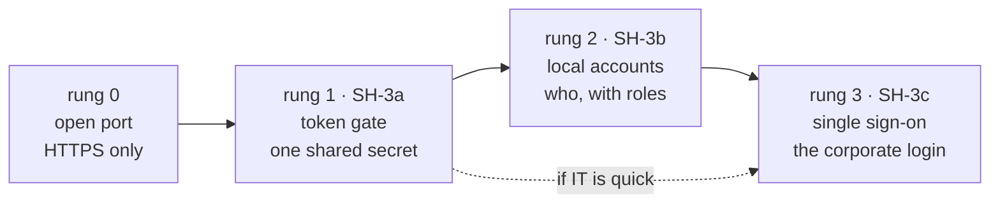
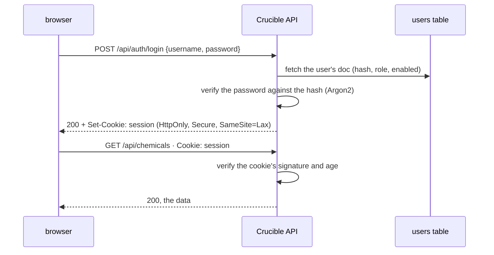

[← README](../README.md) · [Handbook](HANDBOOK.md) · [Glossary](00-glossary.md)

# Authentication — the ladder from an open port to single sign-on

**Prerequisites:** none. Every term is explained here with an everyday comparison. [`02-architecture.md`](02-architecture.md) helps for *where* the pieces go; [`07-operations.md`](07-operations.md) for how the server is run today.
**Learning goal:** you understand what a login actually is (three separate ideas people run together), why Crucible has none yet and what that exposes, the three secure ways to add one, why they are built in that order, what each one needs from the organisation, and how a person and a script log in at each step.
**Deliverable of this page:** the plan for phases **SH-3a**, **SH-3b** and **SH-3c** of the shared spine ([roadmap](05-roadmap.md#sh--shared-spine)): three rungs of one ladder, each secure on its own, the last one **single sign-on**, which is the destination. The decision itself is recorded in [ADR 0001](adr/0001-authentication-ladder.md).
**Status:** 📝 planned, nothing built. The decisions at the end are the owner's.


---

## Contents

- [Why a login, in plain words](#why-a-login-in-plain-words)
- [The words you need](#the-words-you-need)
- [Where we stand today: rung 0](#where-we-stand-today-rung-0)
- [The ladder](#the-ladder)
- [What every rung shares](#what-every-rung-shares)
- [Rung 1 — a token gate](#rung-1--a-token-gate)
- [Rung 2 — local accounts](#rung-2--local-accounts)
- [Rung 3 — single sign-on](#rung-3--single-sign-on)
- [Other ways in, and why not](#other-ways-in-and-why-not)
- [Rules that hold on every rung](#rules-that-hold-on-every-rung)
- [How a person and a script log in, rung by rung](#how-a-person-and-a-script-log-in-rung-by-rung)
- [What to ask the organisation for, now](#what-to-ask-the-organisation-for-now)
- [Decisions to agree](#decisions-to-agree)
- [The phases](#the-phases)
- [Related pages](#related-pages)

---

## Why a login, in plain words

Today anyone who can reach the server's port can read every record, upload
a file, delete a compound and run SQL against the database. There is no
way to tell who did what, because the application never asks. That is
acceptable on a trusted internal network with one laboratory, and it was a
deliberate choice while the system was being built. It stops being
acceptable the moment a second group, a wider network or a regulator enters
the picture — and every later control (who may delete, an audit trail that
says *who*, a limit on runaway scripts) depends on the application knowing
who is asking.

*Everyday version:* a laboratory whose door is unlocked because "only we
work here". Fine on day one. The day someone from another floor wanders in,
or an auditor asks who signed the last entry in the notebook, the missing
lock is the whole problem.

**Why not jump straight to single sign-on?** Because it depends on another
team. The organisation's identity service must be asked to register this
application, and that request has a lead time we do not control. A lock we
can fit ourselves this week is better than a badge reader that arrives in
two months — and the badge reader is still the destination.

---

## The words you need

| Term | Plain words | Everyday version |
|---|---|---|
| **Authentication** | Proving *who* you are | Showing your badge at reception |
| **Authorisation** | What you are *allowed* to do once known | Which doors the badge opens |
| **Identity** | The *who*: a person, or a script acting for one | The name on the badge |
| **Credential** | The thing you present to prove identity: a password, a token, a badge | The badge itself |
| **Secret** | Any credential or key that must not be seen by others — never in git, never in a log | The PIN behind the badge |
| **Token (API key)** | A long random string presented on every request. Whoever holds it is trusted | A key cut for a door |
| **Password hashing** | Storing a scrambled, one-way version of a password so that even the database cannot reveal it | Keeping a fingerprint of the key, not the key |
| **Session** | The server remembering that *this* browser logged in a moment ago, so it need not ask again on every click | The visitor sticker you wear all day after signing in |
| **Cookie** | The small note the browser sends with every request so the server can find the session | The sticker's number |
| **Identity provider (IdP)** | The organisation's central login service, which already knows every employee | The company's badge office |
| **Single sign-on (SSO)** | Logging into many applications with the one corporate login, vouched for by the identity provider | One badge for every building |
| **OpenID Connect (OIDC)** | The standard protocol an application uses to ask the identity provider "who is this?" | The agreed form the badge office fills in |
| **Redirect URI** | The address the identity provider sends the user back to after a login | The return envelope |
| **Client ID and secret** | This application's own credential with the identity provider | The application's badge |
| **Claim** | One fact the identity provider states about the user: name, e-mail, groups | One line on the badge |
| **Role** | A named bundle of permissions: *viewer*, *editor*, *admin* | Visitor, staff, keyholder |
| **Feature flag** | A setting that turns a capability on or off without changing code — here `AUTH_MODE` | The switch beside the badge reader |
| **Break-glass account** | One local admin login kept for the day the identity provider is unreachable | The physical key in the box marked *emergency* |
| **HTTPS** | Encrypted transport, so a credential cannot be read in transit. Mandatory the moment there is one | Sealed envelopes instead of postcards |

---

## Where we stand today: rung 0

| | Today |
|---|---|
| Transport | HTTPS on the server with the organisation's certificate; HTTP on a developer's Mac |
| Login | none; every `/api/*` route answers anyone |
| Cross-origin policy | open (any web page may call the API) |
| Who is recorded | nobody; records carry `created_at` and `updated_at`, no *by whom* |
| Health check | the container probes `/api/stats` every 30 s; the cron monitor does the same |
| Scripts | the maintenance scripts run *inside* the container against the database directly and need no HTTP at all |

The last two rows matter for the plan: the health probe must keep working
once the API needs a login, and the scripts are unaffected by any rung.

---

## The ladder



| Rung | What it is | Who is identified | Needs from the organisation | Effort | Protects against | Does not give |
|---|---|---|---|---|---|---|
| **1 · token gate** | One long secret; every request must carry it | "someone with the token" | nothing | about two days | strangers on the network; accidental clicks from the wrong machine | *who*; per-person revocation |
| **2 · local accounts** | Usernames and passwords held by Crucible, hashed; roles | each person | nothing | one to two weeks | everything rung 1 does, plus: a leaver keeps access; a viewer deleting | the corporate login; passwords to manage |
| **3 · single sign-on** | The corporate identity provider vouches; Crucible never sees a password | each person, as the organisation knows them | an application registration (client ID, secret, redirect URI, group claim) | one to two weeks *after* registration | everything above, plus: leavers lose access the day they leave; no passwords held here | — this is the destination |

**Each rung keeps what the one below gave.** Tokens stay for scripts and
service accounts at every rung. A local admin account stays as the
break-glass login under single sign-on. Nothing is thrown away when the
next rung is climbed; the flag just moves.

**The recommended path** is rung 1 now, the registration request to IT the
same week, then rung 3 as soon as IT delivers, with rung 2 built only in
its smallest form (one break-glass admin) — *unless* the registration takes
long, in which case rung 2 goes in fully so that the laboratory has
per-person logins in the meantime. That is decision A3 below.

---

## What every rung shares

Built once, in SH-3a, and reused by the rungs above.

| Piece | What it is | Where |
|---|---|---|
| `AUTH_MODE` | The feature flag: `off` (today), `token`, `local`, `sso`. Read from the environment like every other setting; on the server it lives in the untracked `.env.local` | `backend/app/config.py`, `container-py.sh` passes it in |
| `require_user` | One FastAPI dependency (a function every protected route declares, the same way `get_db` supplies the database session — see [`02-architecture.md`](02-architecture.md#the-one-design-rule-everything-else-follows-from)) that returns the current identity or answers **401** | `backend/app/auth.py` |
| The identity | A small record: `subject` (who), `display_name`, `roles`, `via` (`token` / `local` / `sso`). Every rung produces the same shape, so nothing above the dependency changes between rungs | same |
| `GET /api/health` | A new endpoint that answers `{"status": "ok"}` with **no** login, so the container probe and the cron monitor keep working; `healthcheck.py` and `monitor.sh` move to it | `backend/app/routers/health.py` |
| `GET /api/auth/me` | Who am I, according to the server; the client calls it on load to decide whether to show the login page | `backend/app/routers/auth.py` |
| The login page | One page in the client, whose contents depend on the mode: a token box, a username and password form, or a *Sign in with the organisation* button | `client/src/pages/Login.jsx` |
| The 401 handler | The client's API layer catches **401** on any call and shows the login page, then retries; nothing else in the client changes | `client/src/services/api.js` |
| Tests per mode | The suite runs with `AUTH_MODE=off` (the contract tests, unchanged) plus one test file per rung that proves: no credential → 401, wrong credential → 401, right credential → 200, health open | `backend/tests/test_auth_*.py` |
| The deploy check | `verify-deploy.sh` gains `--token <t>` (or reads `CRUCIBLE_TOKEN`) so it can run against a protected server | repository root |

*Everyday version:* fit the door frame, the lock housing and the alarm
wiring once; the three rungs are three different lock mechanisms that
drop into the same housing.

---

## Rung 1 — a token gate

**What:** one long random secret, generated once, kept in `.env.local` on
the server. Every request to `/api/*` (except health) must carry it, either
as a header for scripts or from the browser after the user has pasted it
once into the login page.

**How it works:**

```mermaid
sequenceDiagram
    participant B as browser
    participant A as Crucible API
    B->>A: GET /api/chemicals (no token yet)
    A-->>B: 401
    B->>B: show the login page; the user pastes the token once
    B->>A: GET /api/chemicals · Authorization: Bearer <token>
    A->>A: compare with CRUCIBLE_TOKEN in constant time
    A-->>B: 200, the data
    Note over B: the token is kept in the browser's session storage<br/>and sent on every later request; closing the tab forgets it
```

**Why first:** it is the smallest change that closes the open port, it
needs nothing from anyone else, and it stays useful forever — scripts and
service accounts use tokens on every rung.

**What the operator does, on the server:**

```bash
cd ~/work/Pandora_toolbox/nr-nips-crucible
python3 -c "import secrets; print(secrets.token_urlsafe(48))"     # generate; copy the output
printf 'AUTH_MODE=token\nCRUCIBLE_TOKEN=<paste it here>\n' >> .env.local
./container-py.sh restart
curl --noproxy '*' -sSk https://localhost:49160/api/chemicals?limit=1 | head -c 60; echo      # expect: {"error":"Not authenticated"} · 401
curl --noproxy '*' -sSk -H "Authorization: Bearer <the token>" https://localhost:49160/api/chemicals?limit=1 | head -c 60; echo   # expect: data
```

Rotating the token is the same three lines with a new value; everyone
pastes the new one. That is the cost of a shared secret, and the reason
this is a rung and not the destination.

**What it does not give:** *who*. Every user is "the token". A leaver keeps
access until the token is rotated. There are no roles. Fine for one
laboratory for a few weeks; not fine for longer.

**Effort:** about two days, including the shared pieces above, the tests
and the documentation. No new dependency: FastAPI already provides the
header parsing, and Python's standard library the constant-time compare.

---

## Rung 2 — local accounts

**What:** Crucible keeps its own list of users. Each has a username, a
hashed password, a display name and a role. A person logs in with a
username and password; the server sets a session cookie; the browser sends
it on every request until logout or expiry.

**How it works:**



**The pieces:**

| Piece | Detail |
|---|---|
| `users` table | The same hybrid pattern as every table ([`02-database-schema.md`](02-database-schema.md)): `id`, `username` (indexed, unique), `doc` holding `display_name`, `password_hash`, `role`, `enabled`, `created_at`, `last_login`. One Alembic migration |
| Hashing | **Argon2id** via `argon2-cffi` — a new dependency, justified because password hashing must never be home-made; it is the current recommendation of the people who study this. The hash is one-way: the database can check a password, never reveal it |
| Session | A signed cookie: the server signs `{subject, roles, issued_at}` with a secret from `.env.local` (`SESSION_SECRET`); nothing is stored server-side, so a restart logs nobody out. Flags `HttpOnly` (scripts on a page cannot read it), `Secure` (HTTPS only), `SameSite=Lax` (another site cannot ride on it). Expires after a working day; decision A6 |
| Managing users | A script inside the image, `backend/scripts/manage_users.py add|reset|disable|enable|list`, run with `podman exec` like the other maintenance scripts; the first admin is created by it. No user administration page in the browser until roles need one |
| Roles | Three, minimal: **viewer** (read, export, query), **editor** (plus upload, link, edit), **admin** (plus delete, users). Stored on the user's doc; enforced by the same dependency (`require_user(role="editor")`) |
| Brute force | A short delay after a failed login and a per-username lockout after ten; the failed attempts are logged without the password |
| Scripts | Keep using a token; a token is now issued *per person or service* and stored hashed in the same table, so it can be revoked one at a time |

**Why it is a rung and not the destination:** it gives *who* and roles,
which unlocks the audit trail and per-person revocation — but it means
Crucible holds passwords, which the organisation would rather it did not,
and a leaver keeps access until someone disables the account. Single
sign-on removes both.

**Effort:** one to two weeks including the migration, the script, the
login form, the tests and the runbook. Two new dependencies (`argon2-cffi`,
and `itsdangerous` for the signed cookie), both small and widely used; they
enter `requirements.lock` through the usual `./container-py.sh lock`
([phase 05b](04-phase-tutorials/phase-05b-reproducible-builds-and-ci.md)).

**How much of it to build** depends on decision A3: the whole rung, or only
one break-glass admin account created by the script, with the roles and
the login form arriving with single sign-on.

---

## Rung 3 — single sign-on

**What:** the organisation's identity provider does the login. Crucible
never sees a password. A person clicks *Sign in with the organisation*, is
sent to the corporate login page (which they may already be signed into),
and is sent back with a signed statement of who they are. Crucible reads
that statement, maps the person's groups to a role, and sets the same
session cookie as rung 2.

**How it works:**

```mermaid
sequenceDiagram
    participant B as browser
    participant A as Crucible API
    participant I as identity provider
    B->>A: GET /api/auth/login (sso mode)
    A-->>B: redirect to the identity provider, with Crucible's client ID, the redirect URI, and a one-time state
    B->>I: the corporate login page (already signed in? then no prompt)
    I-->>B: redirect back to https://<vm-hostname>:49160/api/auth/callback?code=…&state=…
    B->>A: GET /api/auth/callback?code=…
    A->>I: exchange the code for an ID token (server to server, with the client secret)
    I-->>A: ID token: name, e-mail, groups — signed
    A->>A: verify the signature and audience; map groups → role
    A-->>B: Set-Cookie: session; redirect to the app
```

*Everyday version:* you arrive at a building whose reception phones the
company's badge office instead of checking a list of its own. The badge
office confirms who you are and which department you are in; reception
gives you a visitor sticker for the day. The building never keeps a copy of
your badge.

**The pieces:**

| Piece | Detail |
|---|---|
| Protocol | OpenID Connect, *authorization code flow with PKCE* — the standard, browser-based flow every corporate identity provider supports (Microsoft Entra ID, Okta, Keycloak and the rest speak the same protocol; the plan names none, because the choice is the organisation's) |
| Library | `authlib` — a new dependency; the flow has enough security detail (state, nonce, signature verification, discovery) that a maintained library is the responsible choice |
| Configuration | Four values in `.env.local`: `OIDC_ISSUER` (the provider's discovery address), `OIDC_CLIENT_ID`, `OIDC_CLIENT_SECRET`, `OIDC_REDIRECT_URI`; plus `OIDC_ROLE_MAP` (which group claim value means which Crucible role) |
| Session | The same signed cookie as rung 2, so everything above the dependency is unchanged |
| Roles | From the group claim, mapped by configuration; a person in no mapped group is a *viewer* or is refused — decision A5 |
| Break-glass | One local admin account (the smallest piece of rung 2) so that an identity-provider outage or a mis-mapped group cannot lock everyone out |
| Scripts and service accounts | Tokens, as before; a scheduled job does not have a browser to log in with. Issued per service by the admin, revocable one at a time |
| Logout | Clears the cookie; optionally sends the browser to the provider's logout so the corporate session ends too |

**What the organisation must provide, and why it is the long pole:** an
*application registration* with the identity provider. That is a request
to another team, produces the client ID and secret, and must name the exact
redirect URI. The request can be made **today**, before a line of rung 3 is
written; the checklist is [below](#what-to-ask-the-organisation-for-now).

**Effort:** one to two weeks after the registration arrives: the callback
routes, the role mapping, the login button, tests with a fake provider (a
tiny in-process OIDC server so the suite needs no network), the runbook,
and the removal of any rung 2 pieces not kept.

---

## Other ways in, and why not

Each option gets the same three questions as the product roadmap
([`06-product-and-technology-roadmap.md`](06-product-and-technology-roadmap.md)):
required, why, benefit and cost — and a verdict with a trigger.

| Option | What it is | Verdict | Why, and the trigger |
|---|---|---|---|
| An authenticating reverse proxy in front (for example a corporate gateway or `oauth2-proxy`) | A separate server that does the login and passes the user's name to Crucible in a header | **Optional** | It moves the login out of the code, which is elegant, but it is a second web server — something the roadmap [deliberately does not plan](05-roadmap.md#deliberately-not-planned). *Trigger:* the organisation offers a managed gateway that does single sign-on for internal applications; then rung 3 becomes "trust the gateway's header" and is smaller |
| HTTP Basic authentication | The browser's built-in username-and-password prompt | **Not needed** | Rung 1 is simpler for scripts and rung 2 gives a proper login page; Basic gives neither sessions nor logout |
| LDAP bind | Checking a username and password against the corporate directory directly | **Optional** | It gives corporate passwords without single sign-on. *Trigger:* the identity provider refuses or delays the registration and the directory is reachable from the server; then it replaces rung 2's password check and nothing else |
| Client certificates (mutual TLS) | Each user's browser presents its own certificate | **Not needed** | Issuing and installing certificates per person is the badge office's job, which is exactly what single sign-on delegates to it |
| A network allow-list (only these addresses may connect) | The server refusing unknown addresses | **Not sufficient alone** | On a corporate network many people sit behind one address; useful as a *second* layer with any rung, never as the login |
| A password written in the code | — | **Never** | It would be published to the public repository by the next push. The gate script exists to catch exactly this |
| E-mailed one-time links | A login link sent to the person's mailbox | **Not needed** | Needs an outbound mail service; single sign-on gives the same "no password here" property without one |

---

## Rules that hold on every rung

1. **Secrets live in `.env.local` only.** The token, the session secret and
   the client secret are never in git, never in a log line, never in an
   error message. `.env.local` is already ignored; the gate script already
   refuses tracked `.env*` files.
2. **HTTPS is mandatory when `AUTH_MODE` is not `off`.** A credential over
   plain HTTP is a credential on a postcard. The server already runs HTTPS;
   the app refuses to start in a login mode without it, except on
   `localhost` for development.
3. **The health endpoint is the only open route.** It says *ok* and
   nothing else — no counts, no versions.
4. **Compare secrets in constant time**, hash passwords with Argon2id,
   sign cookies, and never write a credential to a log. Standard, and each
   has a test.
5. **A wrong credential says only "not authenticated".** Not "no such user"
   and not "wrong password": the difference tells an attacker which
   usernames exist.
6. **Everything is a setting, nothing is platform-specific.** The same
   environment variables on Windows, macOS and the RHEL 8 server; the
   container is the isolation; the tests run with the mode `off` so CI on
   Linux and macOS is unchanged.
7. **The API contract does not change.** Every route answers exactly as
   before once the caller is authenticated; the only new answer is 401.
   The parity tests prove it by running unchanged in mode `off`, and a
   second run in mode `token` with the token supplied.

---

## How a person and a script log in, rung by rung

| | Rung 1 · token | Rung 2 · local | Rung 3 · SSO |
|---|---|---|---|
| A person, in the browser | Pastes the shared token once per browser session | Username and password on the login page | Clicks *Sign in with the organisation*; usually no prompt at all |
| A script or `curl` | `-H "Authorization: Bearer <token>"` | A personal token issued by the admin, same header | The same, issued per service |
| `verify-deploy.sh` | `--token` or `CRUCIBLE_TOKEN` in the shell | the same | the same |
| The maintenance scripts inside the container | unchanged — they never use HTTP | unchanged | unchanged |
| The cron monitor and the container probe | `/api/health`, open | the same | the same |
| A leaver | rotate the token; everyone pastes the new one | `manage_users.py disable <name>` | automatic, the day the corporate account closes |

---

## What to ask the organisation for, now

The registration request is the long pole of rung 3, and none of it needs
code first. What to ask the identity team for, in their words:

- [ ] An **OpenID Connect application registration** for "Crucible, internal laboratory registry", *web application* type, authorization code flow with PKCE.
- [ ] The **redirect URI** to register: `https://<vm-hostname>:49160/api/auth/callback` (the server's full name; and, for testing on a developer's Mac, `http://localhost:49160/api/auth/callback` if their policy allows a localhost URI).
- [ ] A **post-logout redirect URI**: `https://<vm-hostname>:49160/`.
- [ ] The **client ID** and a **client secret** (delivered by a secure channel, never by e-mail body; it goes into `.env.local` only).
- [ ] The **issuer / discovery URL** (the `…/.well-known/openid-configuration` address).
- [ ] A **group claim** in the ID token, and the names of two or three groups to map to *viewer*, *editor* and *admin* — or confirmation that roles will be managed inside Crucible instead (decision A5).
- [ ] Confirmation that the **server can reach the identity provider** (outbound HTTPS from the VM; the proxy question — the same one PubChem raised in [phase 04](04-phase-tutorials/phase-04-template-ingestion.md)).
- [ ] Two **test users** in different groups.

Put the answers, except the secret, in this page's decision table when
they arrive; the secret goes into `.env.local` and its backup, following
the certificate's rule in [`07-operations.md`](07-operations.md#security).

---

## Decisions to agree

| # | Question | Recommendation | Why |
|---|---|---|---|
| A1 | Which identity provider? | The organisation's, whatever it is; the plan is protocol-based (OpenID Connect) and names no vendor | Every corporate provider speaks it; the code does not change with the choice |
| A2 | Build rung 1 now, before the registration request is answered? | **Yes** | Two days closes the open port; nothing is wasted, because tokens remain for scripts on every rung |
| A3 | How much of rung 2? | Only the break-glass admin account, *unless* the registration takes more than about six weeks — then the full rung with roles | Passwords held here are a liability the organisation would rather not have; but the laboratory should not wait months for per-person logins either |
| A4 | Default `AUTH_MODE` in the image? | `off`, with the server's `.env.local` setting `token` (then `sso`); the setup guides say so at the step that writes `.env.local` | Developers and CI keep the frictionless mode; production is protected from its first restart after deployment |
| A5 | Roles from the provider's groups, or managed in Crucible? | From groups, if the identity team can add a group claim; otherwise a small admin page later | Leavers and movers are handled by the badge office, not by us |
| A6 | Session length? | One working day (10 hours), sliding | Long enough not to interrupt a day's work; short enough that a forgotten browser is not a permanent door |
| A7 | Tighten the cross-origin policy at the same time? | Yes, to the server's own origin, in SH-3a | With cookies in play an open policy is a real hole; today it is only untidy |
| A8 | Who may hold a token for scripts under SSO? | Issued by an admin per service, listed by `manage_users.py list`, revocable individually | A token is a key; keys are signed out by name |

---

## The phases

| Phase | What ships | Waits on | "Done" means |
|---|---|---|---|
| **SH-3a · Token gate** | The shared pieces (`AUTH_MODE`, `require_user`, `/api/health`, the login page, the 401 handler, `verify-deploy.sh --token`), the token mode, tests, runbook in [`07-operations.md`](07-operations.md), the setup guides' `.env.local` step updated | decisions A2, A4, A7 | on the server, `AUTH_MODE=token`: an unauthenticated call answers 401, an authenticated one answers as before, the monitor is green, 16 deploy checks pass with `--token` |
| **SH-3b · Local accounts** | The `users` table and migration, Argon2 hashing, the signed session, `manage_users.py`, the login form, roles, per-person tokens; or only the break-glass admin (A3) | SH-3a; decision A3 | a person logs in with a username and password, a disabled account is refused, a viewer cannot delete |
| **SH-3c · Single sign-on** | The OpenID Connect flow, group-to-role mapping, the sign-in button, a fake provider for the tests, the runbook; rung 2's unused pieces removed | SH-3a; the registration from the organisation; decisions A1, A5, A6, A8 | a person signs in with the corporate login and lands with the right role; the break-glass admin still works with the provider unreachable; a service token still works |
| SH-4 · Roles everywhere, audit trail, rate limiting | What identity makes possible ([`06-product-and-technology-roadmap.md`](06-product-and-technology-roadmap.md#4-identity-and-access)) | SH-3b or SH-3c | — |

Each ships with its tutorial in `04-phase-tutorials/` (`phase-sh-3a-token-gate.md`
and so on), its release note, and the handbook's status box and build log
updated in the same commit.

---

## Related pages

- [`05-roadmap.md` → SH](05-roadmap.md#sh--shared-spine) — where these phases sit among the others.
- [`06-product-and-technology-roadmap.md` → Identity and access](06-product-and-technology-roadmap.md#4-identity-and-access) — the verdicts these phases fulfil.
- [ADR 0001](adr/0001-authentication-ladder.md) — the decision, in one page.
- [`02-architecture.md` → Security](02-architecture.md#security-architecture) and [`07-operations.md` → Security](07-operations.md#security) — what exists today.
- [`00-glossary.md`](00-glossary.md) — every term above, in one place.

**Last Updated:** September 8, 2026
