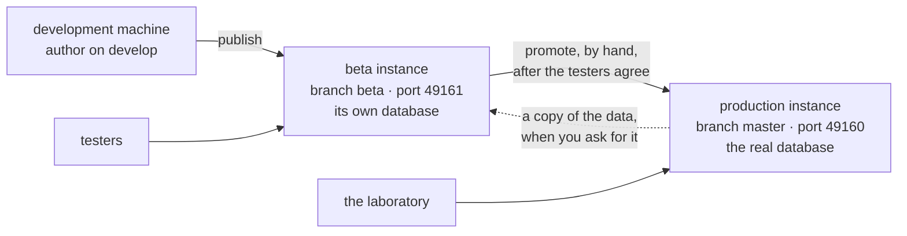
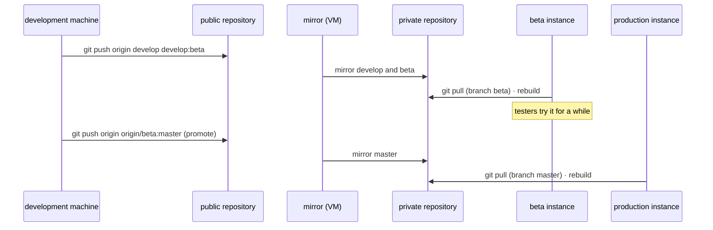
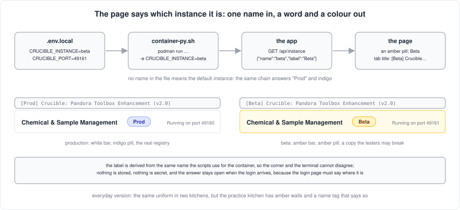

[← README](../README.md) · [Handbook](HANDBOOK.md) · [Glossary](00-glossary.md)

# A beta instance for user testing — two copies of the application on one server

**Status:** built ✅ as phase **SH-12**, v2.20.0, 2026-09-21, and **live on the server since 2026-09-22** — built the same day
the owner asked for the application to be rolled out to end users for
testing without touching production. Decisions B1–B6 below were taken as
recommended (the owner's go, 2026-09-21). The scripts and the workflow are
what this page describes; the step-by-step walk with a test for every route
is [phase SH-12](04-phase-tutorials/phase-sh-12-beta-instance.md), and the
server setup is [`01-setup-rhel8.md` §8](01-setup-rhel8.md#8-a-second-instance-for-user-testing-beta).
The login ([`13-authentication.md`](13-authentication.md)) is delivered to
this instance first: its first rung, the token gate, since v2.22.0
([phase SH-3a](04-phase-tutorials/phase-sh-3a-token-gate.md)).

**Who this is for:** the person who runs the server and has to give a
group of testers something to try; and the testers, who need to know that
nothing they do reaches the real data. No knowledge of containers, git or
networking is assumed; every term is explained the first time and is in
the [glossary](00-glossary.md).

---

## Contents

- [The idea, in plain words](#the-idea-in-plain-words)
- [What exists today that this builds on](#what-exists-today-that-this-builds-on)
- [The design: two instances, side by side](#the-design-two-instances-side-by-side)
- [How a change travels once there are two](#how-a-change-travels-once-there-are-two)
- [What the scripts gained](#what-the-scripts-gained)
- [The data the testers see](#the-data-the-testers-see)
- [Which instance am I looking at? The label](#which-instance-am-i-looking-at-the-label)
- [Many testers, one beta](#many-testers-one-beta)
- [Who can log in, and where](#who-can-log-in-and-where)
- [Decisions B1–B6](#decisions-b1b6)
- [Done means — and what was done](#done-means--and-what-was-done)
- [Related pages](#related-pages)

---

## The idea, in plain words

Today there is one copy of the application on the server, and it is the
real one: its database is the registry the laboratory trusts. Asking
testers to "try things" on it is asking them to rehearse on the stage
during the performance.

A **beta instance** is a second, complete copy of the application running
beside the first: its own web address, its own database (a copy of the
real one, taken when you say so), its own version of the code. Testers log
in there, upload, link, merge, delete — and none of it reaches production,
because the two copies share nothing. When a change has been tried on beta
and found good, it is **promoted** to production by one deliberate step.

*Everyday version:* a practice kitchen next to the restaurant kitchen. Same
equipment, same recipes, a copy of tonight's ingredients — and whatever a
trainee burns there, no customer eats.



---

## What exists today that this builds on

Nothing here is invented from scratch; each piece is already in the
repository and needs a small extension.

| Already there | Where | What it gives the beta instance |
|---|---|---|
| Three folders, two repositories | [`03-git-workflow.md`](03-git-workflow.md) | A fourth folder on the server, checked out on its own branch, is the same pattern once more |
| A `beta` branch in both repositories | every publish pushes `develop:beta develop:master` together | Today `beta` is always identical to `master` and means nothing; it becomes the branch the beta instance runs |
| `container-py.sh` reads `.env.local` in its own folder | [`07-operations.md` → Environment variables](07-operations.md#environment-variables) | The port and the HTTPS switch are already per folder; the container and image names are the one thing still fixed |
| `data/`, `backups/`, `certs/` live inside each folder | [`07-operations.md` → Live-mounted directories](07-operations.md#live-mounted-directories) | A second folder has a second database, second backups, its own copy of the certificates — with no extra work |
| `./container-py.sh backup` and `restore <file>` | [`07-operations.md` → Backup and restore](07-operations.md#backup-and-restore) | The way a copy of production's data gets to beta |
| One systemd unit per container, one cron monitor line per container | [`01-setup-rhel8.md`](01-setup-rhel8.md), [`07-operations.md` → Health monitoring](07-operations.md#health-monitoring) | A second unit and a second cron line, named for the second container |
| `verify-deploy.sh <base-url>` | repository root | Already takes the address; runs against either instance |
| The authentication ladder | [`13-authentication.md`](13-authentication.md) | The login the testers use; built on beta first |

---

## The design: two instances, side by side


| | Production | Beta |
|---|---|---|
| Folder on the server | `~/work/Pandora_toolbox/nr-nips-crucible` | `~/work/Pandora_toolbox/nr-nips-crucible-beta` |
| Branch it runs | `master` | `beta` |
| `.env.local` | `USE_HTTPS=true` (+ `AUTH_MODE` and `CRUCIBLE_TOKEN` once the login is turned on there) | the same, plus `CRUCIBLE_INSTANCE=beta` and `CRUCIBLE_PORT=49161`, and since v2.22.0 `AUTH_MODE=token` and `CRUCIBLE_TOKEN=…` |
| Container name | `crucible-py` | `crucible-py-beta` |
| Image name | `crucible-py` | `crucible-py-beta` (its own, so a beta rebuild can never replace production's image) |
| Port | 49160 | 49161 |
| Address | `https://<vm-hostname>:49160` | `https://<vm-hostname>:49161` |
| Database | `data/crucible.db` — the real one | `data/crucible.db` in its own folder — a copy, refreshed on request |
| Backups | `backups/` in its folder, nightly | `backups/` in its folder |
| Certificates | `certs/` from the corporate store | the same files, copied by the setup script; the certificate names the host, not the port, so one certificate serves both |
| Service unit | `container-crucible-py.service` | `container-crucible-py-beta.service` |
| Monitor | a cron line every five minutes probing port 49160 | a second cron line probing 49161 |
| Who uses it | the laboratory | the testers |
| What the page says (SH-13) | **Prod**, an indigo pill on a white bar; `[Prod]` on the tab | **Beta**, an amber pill on an amber bar; `[Beta]` on the tab |

Everything in the *Beta* column is decided by three lines in that folder's
`.env.local` and by which branch the folder has checked out. There is no
separate "beta build", no second image recipe, no code that knows the word
*beta*: the same `container-py.sh`, told its instance name, does the rest.

---

## How a change travels once there are two

Today a publish pushes `develop` to `develop`, `beta` and `master` in one
command, and production pulls `master`. With a beta instance the one
command becomes two moments:



1. **Publish** — every change goes to `develop` and `beta`, on both
   repositories; the beta instance pulls and rebuilds. Testers see it the
   same day ([Flow A, Steps 1–10](03-git-workflow.md#4-flow-a---a-change-from-start-to-finish)).
2. **Promote** — when the testers (or you) are satisfied, `beta` is pushed
   to `master` by hand, in a step of its own; production pulls and
   rebuilds, after its backup, as before ([Step 11](03-git-workflow.md#step-11---promote-to-production-when-the-testers-agree)).

A fix found on beta is made on the development machine and published again; nothing is
edited on the server. A change that turns out to be wrong simply never
gets promoted. Beta is promoted as a whole — everything published since
the last promotion, together — so a change that is not ready for
production is not published to beta either. In practice every change is
handed over as **six blocks**, three per moment (development machine, mirror folder,
instance folder), written out with why each exists in
[`03-git-workflow.md` → The six blocks](03-git-workflow.md#the-six-blocks-at-a-glance).


---

## What the scripts gained


| Script | Before v2.20.0 | Since v2.20.0 |
|---|---|---|
| `container-py.sh` | image and container names fixed to `crucible-py` | `CRUCIBLE_INSTANCE=<name>` (from `.env.local`; the environment wins) suffixes the image, the container and the optional Postgres container, network and volume: `crucible-py-beta`; a name that is not lowercase letters, digits and hyphens is refused; `help`, `status` and every start print the instance; `restore` given a **folder** takes its newest `crucible-*.db`. Unset, nothing changes |
| `setup-after-clone-py.sh` | printed and probed port 49160; wrote the cron line for `crucible-py` and removed **every** other monitor line | names the image it builds, probes the folder's port, writes a cron line naming this folder's container and port, and replaces only **this folder's** previous line |
| `monitor.sh` | `CONTAINER_NAME` and `API_URL` from the cron line, else `crucible-py` on 49160 | the cron line still wins; run by hand it reads the folder's `.env.local`, so `./monitor.sh` in the beta folder probes and restarts beta; one log per instance (`/tmp/crucible-monitor-beta.log`); the container's name in every line |
| `uninstall.sh` | removed `crucible-py`, its unit, and **every** crucible cron line | reads `.env.local`; removes this instance's container, image, unit, Quadlet file, monitor log and only the cron lines naming this folder (matched with what follows the path, since the beta path begins with production's); says how many lines for other checkouts it left |
| `container-py.sh`, from v2.21.1 | the service unit and the script could fight: an active unit recreated its old container underneath a `rebuild` | the script stops an active unit before it touches the container and rewrites the unit from the container it created, so the boot-time recipe always matches what runs (lesson 36) |
| `container-py.sh`, from v2.21.2 | two supervisors, and which one could stop the application depended on which one had started it | one supervisor: the script hands every container it creates to the service and its status, stop, start and restart go through the service; both doors always agree; a command returns only when the application answers — [`15-run-stop-status.md`](15-run-stop-status.md) |
| `verify-deploy.sh` | takes the base address | unchanged; run it against `https://localhost:49161` |
| `healthcheck.py` | reads `PORT` inside the container | unchanged; each container has its own |

A machine that never sets `CRUCIBLE_INSTANCE` behaves exactly as before, on
every platform: the same script, the same one-time setup, on Windows, macOS
and RHEL 8. The application code did not change at all.

---

## The data the testers see

Beta starts empty, like any fresh checkout. To give the testers something
real to test against, production's data is copied over — one direction
only, on request, never automatically and never back:

```bash
# on the server — a consistent copy of production, while it keeps running
cd ~/work/Pandora_toolbox/nr-nips-crucible
./container-py.sh backup

# hand it to beta: given a FOLDER, restore takes its newest backup (the restore
# stops beta, swaps its database, restarts it; beta's old one is kept as .pre-restore)
cd ~/work/Pandora_toolbox/nr-nips-crucible-beta
./container-py.sh restore ../nr-nips-crucible/backups
```

**You should see:** `Newest backup in ../nr-nips-crucible/backups: crucible-<stamp>.db`,
`✓ Restored … (instance: beta)`, and then beta's registry page showing the
same 12,539 compounds as production, with **Running on port 49161** in the
header's right-hand corner — the tester's way of knowing which instance a
tab shows.

Whatever the testers change on beta stays on beta. When you want them back
on a clean copy, run the two commands again. The restore never runs the
other way: production's database is only ever written by production.

---

## Which instance am I looking at? The label

Since v2.21.0 (phase SH-13) every page says which instance it belongs to,
in a word and in colour. Production shows a **Prod** pill in indigo next to
the page title on a white bar; the beta instance shows a **Beta** pill in
amber on a pale amber bar. The browser tab's title starts with the same
word in square brackets, so ten open tabs are told apart without clicking
any of them. "Running on port 49161" stays in the corner for the person
who prefers the number.



The word is not stored anywhere and not chosen separately: it is derived
from the same `CRUCIBLE_INSTANCE` the scripts use to name the container,
passed into the container by `container-py.sh` and answered by one open
endpoint, `GET /api/instance`. The corner of the page and the `Usage` line
of the terminal therefore cannot disagree. To spell it differently, set
`CRUCIBLE_INSTANCE_LABEL=Production` (or any word) in the folder's
`.env.local` and rebuild. How it was built and how to test it by every
route: [phase SH-13](04-phase-tutorials/phase-sh-13-instance-label.md).

---

## Many testers, one beta

Several people will test at once, and the question comes up whether each
should have an instance of their own. The answer is no, on purpose.

Crucible is a **system of record**: one registry, one identity per
compound, one database everyone reads and writes. Production will be
shared by the whole laboratory. Testers sharing one beta is therefore not
a limitation of the test; it is the thing most worth testing. An upload
deduplicates against what is already there, a merge by one person is seen
by the next, a deletion is a deletion for everyone. Those behaviours only
show themselves with more than one person in the room.

What keeps testers from tripping over each other:

| Measure | What it gives | When |
|---|---|---|
| **The login and roles** ([`13-authentication.md`](13-authentication.md)) | one account per tester; viewers change nothing, editors upload and link, only admins delete or merge | SH-3a ✅ v2.22.0: one shared token for the testers, the gate and the login page; SH-3b next: one account per tester, with roles |
| **A test plan with named scenarios** | each tester works a distinct corner: the structure file, the limited list, the attention page, the screening table | written with the login, from the every-route tables of the phase tutorials |
| **A reset between rounds** | two commands put beta back to a fresh copy of production ([above](#the-data-the-testers-see)); announce it, run it, start the next round | any time, in under a minute |
| **An audit trail** | who changed what and when, on the entry itself; answers "who did this?" rather than preventing it | SH-4, after the login |

*Everyday version:* one practice kitchen, several trainees, each with a
station and a name badge, and a fresh delivery of ingredients between
sessions. Not one kitchen per trainee.

**A private sandbox, when someone needs one.** For destructive exploration
(delete everything, import junk, see what breaks) SH-12 makes a personal
instance cheap: one more folder with `CRUCIBLE_INSTANCE=alice` and
`CRUCIBLE_PORT=49162`, set up with [`01-setup-rhel8.md` §8](01-setup-rhel8.md#8-a-second-instance-for-user-testing-beta)
in fifteen minutes, its page saying **Alice** in amber, removed afterwards
with `./uninstall.sh --full` in that folder, which touches nothing else.
Each costs one container and a copy of the database. Keep it for one or
two people and one afternoon: sandboxes are pulled and rebuilt one by one,
and teach nothing about shared use.

**What is not planned:** per-user project folders inside one instance, a
form of multi-tenancy. A registry with several parallel truths is no
longer a registry; the verdict in [`06-product-and-technology-roadmap.md`](06-product-and-technology-roadmap.md)
on multi-user hosting covers the case where it ever changes.

---

## Who can log in, and where

The beta instance is where the **login** ([`13-authentication.md`](13-authentication.md))
arrives first, rung by rung. **Since v2.22.0 (SH-3a)** its `.env.local` sets
`AUTH_MODE=token` and `CRUCIBLE_TOKEN`: one shared token, handed to each
tester out of band, pasted once into the login page
([how the operator turns it on](04-phase-tutorials/phase-sh-3a-token-gate.md#step-7--turn-it-on-beta-first)).
**Next (SH-3b)** the mode becomes `local`: each tester gets a username and a
password, created by the operator with `manage_users.py` inside the beta
container, with the role that fits the test (viewer, editor or admin).
Production stays as it is today until the testers have used the login for a
while; then production's `.env.local` gets the same setting, its own
accounts are created, and the port that has been open since the beginning
is closed. That order is decision B5 and the revisited decision A3 on the
authentication page.

---

## Decisions B1–B6

All six taken **as recommended, 2026-09-21**, with the owner's go for the
build ("build on what you have planned").

| # | Question | Decision | Why |
|---|---|---|---|
| B1 | The same server, or another machine? | **The same server**, as a second container | It exists, it has the certificates and the network reach; a second machine is a request to another team. Move beta when IT offers a machine; nothing in the design changes |
| B2 | Which port? | **49161**, the next one up | No firewall on the server to open; one number to remember |
| B3 | What the `beta` branch means | **The beta instance runs it.** Publish goes to `develop` and `beta`; `master` moves only by promotion, by hand | The branch already exists in both repositories and today means nothing; giving it this meaning costs one workflow step |
| B4 | The data on beta | **A copy of production's latest backup, restored on request**, never the other way | Testers need real data; production must never be written by anything but production |
| B5 | Where the login goes first | **Beta**, with the full local-accounts rung; production follows after the test | A login is the thing most worth rehearsing before it stands between the laboratory and its data |
| B6 | Who administers the tester accounts | **The operator**, with `manage_users.py` in the beta container; an admin page later (SH-4) | One person, a handful of testers, a script that already has to exist for the break-glass admin |

---

## Done means — and what was done

- ✅ The scripts know their instance; rehearsed end to end on the development machine with
  two containers side by side (`crucible-py` on 49160, `crucible-py-beta`
  on 49161), the one-way restore, a beta rebuild that left production's
  image untouched, sixteen deploy checks passing on each, and the
  uninstaller's dry run naming beta only
  ([phase SH-12 → How to test it](04-phase-tutorials/phase-sh-12-beta-instance.md#how-to-test-it-by-every-route)).
- ✅ One publish reaches beta only; one promotion reaches production only;
  both written out in [`03-git-workflow.md`](03-git-workflow.md) with the
  commands for every machine.
- ✅ A blank macOS or Windows machine following its setup guide is
  unaffected: no instance name, the same names as before.
- ✅ The phase tutorial has the every-route test table — browser, API,
  terminal, the container, Python, the database, the monitor, the unit,
  the uninstaller, the deploy check — with the exact output for each
  instance.
- ✅ **On the server, 2026-09-22:** the second folder on branch `beta`,
  with its own `.env.local`, certificates, service unit and monitor line,
  set up from [`01-setup-rhel8.md` §8](01-setup-rhel8.md#8-a-second-instance-for-user-testing-beta)
  in about twenty minutes; `https://<vm-hostname>:49161` answers with the
  morning's copy of production's data (12,539 compounds on both ports),
  `./verify-deploy.sh https://localhost:49161` passes 16 of 16, and
  production's container was not restarted.
- 🔜 **The login's first rung on beta (v2.22.0, SH-3a):** two lines in this
  folder's `.env.local`, a `stop` and a `start`, and the port is closed to
  anyone without the token; done by the operator after block 3 of that
  release; production's port stays open
  ([phase SH-3a → Step 7](04-phase-tutorials/phase-sh-3a-token-gate.md#step-7--turn-it-on-beta-first)).

---

## Related pages

- [Phase SH-12](04-phase-tutorials/phase-sh-12-beta-instance.md) — how it was built, step by step, and how to test it by every route.
- [`01-setup-rhel8.md` §8](01-setup-rhel8.md#8-a-second-instance-for-user-testing-beta) — setting the beta instance up on the server.
- [`13-authentication.md`](13-authentication.md) — the login that beta receives first; decision A3 revisited.
- [`05-roadmap.md` → SH](05-roadmap.md#sh--shared-spine) — SH-12 among the other phases, and why it is first now.
- [`03-git-workflow.md`](03-git-workflow.md) — the three folders today; the fourth is added when SH-12 ships.
- [`07-operations.md`](07-operations.md) — the runbook pieces the beta instance reuses: environment variables, mounted folders, backup and restore, the monitor, systemd.
- [ADR 0002](adr/0002-beta-instance.md) — the decision, in one page.

**Last Updated:** September 22, 2026
