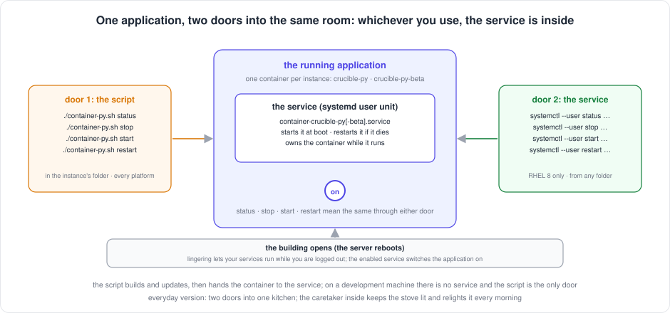

[← README](../README.md) · [Handbook](HANDBOOK.md) · [Glossary](00-glossary.md)

# Starting, stopping and checking the application, and keeping it running after a reboot

**Who this is for:** anyone who has to answer "is it running?", stop it,
start it, or make sure it comes back after the server restarts, on the
development machine where it is developed or on the RHEL 8 server where it runs. No
knowledge of containers or Linux services is assumed; every term is
explained the first time and is in the [glossary](00-glossary.md).
**Time to read:** ten minutes. **Time to do any one thing in it:** under a
minute.

This page is the one home for these commands. Every other page that
mentions starting, stopping or status links here instead of repeating it.

---

## Contents

1. [The picture, first](#the-picture-first)
2. [The three words you need](#the-three-words-you-need)
3. [Before any command: which instance, which folder](#before-any-command-which-instance-which-folder)
4. [The commands, in one table](#the-commands-in-one-table)
5. [Step by step: is it running?](#step-by-step-is-it-running)
6. [Step by step: stop it](#step-by-step-stop-it)
7. [Step by step: start it](#step-by-step-start-it)
8. [Step by step: restart it](#step-by-step-restart-it)
9. [Keeping it running after the server restarts](#keeping-it-running-after-the-server-restarts)
10. [The monitor: who restarts it at 3 am](#the-monitor-who-restarts-it-at-3-am)
11. [When something looks wrong](#when-something-looks-wrong)
12. [What not to do](#what-not-to-do)
13. [How it got this way, in one paragraph](#how-it-got-this-way-in-one-paragraph)

---

## The picture, first



There is **one running application per instance**: production on port
49160, beta on port 49161. On the server, a **service** lives inside each
one: it switches the application on when the server boots and switches it
back on if it ever dies. There are **two doors** into that room, and they
lead to the same place:

- **Door 1, the script**, `./container-py.sh`, run in the instance's
  folder. It works on the development machine and on the server.
- **Door 2, the service**, `systemctl --user …`, run from anywhere on the
  server. It does not exist on a development machine.

Since v2.21.2 the two doors always agree: the script builds and updates
the application, then hands the container to the service, and its
`status`, `stop`, `start` and `restart` go *through* the service when the
service is running it. Whichever door you use, you see the same thing and
you change the same thing.

*Everyday version:* a kitchen with two doors and a caretaker inside. The
caretaker lights the stove every morning when the building opens and
relights it if it goes out. You can talk to the caretaker from either door;
the stove is the same stove.

---

## The three words you need

| Word | Plain words | Everyday version |
|---|---|---|
| **Container** | The application, packed with everything it needs, running as one sealed process. `crucible-py` is production's; `crucible-py-beta` is beta's. When it is stopped and removed, nothing is lost: the data lives in the folder's `data/` on the disk, not inside it | The stove: it can be switched off and even wheeled out; the food is in the fridge |
| **Service** (a systemd user unit) | A short recipe card on the server that says how to start one container, kept in `~/.config/systemd/user/`. Named after the container: `container-crucible-py.service`, `container-crucible-py-beta.service`. **Enabled** means "start this at boot"; **active** means "I am running it now" | The caretaker's instruction card: what to switch on, and to do it every morning |
| **Instance** | One folder, one container, one port, one database. Production and beta are two instances. Every script command acts on the instance of the folder it runs in | One kitchen |

Two more you will meet in the outputs:

| Word | Plain words |
|---|---|
| **Lingering** | Permission for your services to keep running while you are not logged in. Without it every rootless container dies when you log out. It was switched on once at install ([RHEL 8 guide §1.3](01-setup-rhel8.md#13-lingering)) |
| **Healthy / starting** | What `podman ps` says in the STATUS column. `starting` for the first half minute, then `healthy` once the built-in check has seen the application answer |

---

## Before any command: which instance, which folder

The script acts on the folder you are in. Production's folder is
`~/work/Pandora_toolbox/nr-nips-crucible`; beta's is
`~/work/Pandora_toolbox/nr-nips-crucible-beta`. The service is named after
the container, so with `systemctl` you name the instance in the command.

```bash
cd ~/work/Pandora_toolbox/nr-nips-crucible-beta      # or …/nr-nips-crucible for production
./container-py.sh help | grep Usage
```

**You should see** `instance: beta → crucible-py-beta, port 49161` in the
beta folder and `instance: default → crucible-py, port 49160` in
production's. If it is not what you meant, `cd` to the other folder. That
one line is the whole safeguard, so read it.

---

## The commands, in one table

Both columns do the same thing on the server. On a development machine only
the left column exists.

| I want to… | Door 1: the script, in the instance's folder | Door 2: the service, from anywhere (server) |
|---|---|---|
| Know whether it is running | `./container-py.sh status` | `systemctl --user status container-crucible-py-beta.service` |
| See both instances at once | `podman ps` | `systemctl --user list-units 'container-crucible-py*'` |
| Stop it | `./container-py.sh stop` | `systemctl --user stop container-crucible-py-beta.service` |
| Start it | `./container-py.sh start` | `systemctl --user start container-crucible-py-beta.service` |
| Restart it | `./container-py.sh restart` | `systemctl --user restart container-crucible-py-beta.service` |
| Read its log | `./container-py.sh logs` (Ctrl-C to leave) | `podman logs --tail 50 crucible-py-beta` |
| Update it to a new version | `./container-py.sh backup` then `git pull --ff-only origin beta` then `./container-py.sh rebuild` | not through the service: the rebuild builds, hands over, and the service runs the result |
| Prove it end to end | `./verify-deploy.sh https://localhost:49161` | same |

For production, replace `-beta` with nothing (`container-crucible-py.service`,
`crucible-py`) and `49161` with `49160`.

---

## Step by step: is it running?

Three checks, each answering a slightly different question. The first is
enough on most days.

**1. Ask the script.**

```bash
cd ~/work/Pandora_toolbox/nr-nips-crucible-beta
./container-py.sh status
```

**You should see**, when it is running:

```
Container status (runtime: podman · instance: beta · folder: /home/<your-user>/work/Pandora_toolbox/nr-nips-crucible-beta):
NAMES             STATUS                   PORTS
crucible-py-beta  Up 2 hours (healthy)     0.0.0.0:49161->49161/tcp
service container-crucible-py-beta.service: active (enabled) — the service runs the application

✓ Container is running

Testing API endpoint (https://localhost:49161/api/health)...
{"status":"ok"}
login: token — the page asks for it once; scripts send it as Authorization: Bearer (docs/13-authentication.md)
{"chemicals":{"total":12539,"max":15000},...
```

or, with accounts (`AUTH_MODE=local`, v2.23.0):

```
login: local — usernames and passwords; scripts send a personal token as Authorization: Bearer (docs/13-authentication.md)
counts, from the database: {'chemicals': 12539, 'samples': 0, 'screening': 49065, 'toxicology': 0}
accounts: 3 (ada admin, ed editor, vera viewer)
```

**What it means**, line by line: the folder and instance the command acted
on; one row for this instance's container, `Up` and `healthy`; the service
is `active` (running it now) and `enabled` (will start it at boot); and the
application answered the open health route; since v2.22.0 the next line
says whether the login is on (`login: off` until it is), and the counts
follow, fetched with the token when there is one; with accounts the script
holds no token of its own, so it reads the counts from the database inside
the container and lists the accounts instead.

**You should see**, when it is stopped:

```
NAMES             STATUS   PORTS
service container-crucible-py-beta.service: inactive (enabled) — the application is stopped, or runs outside the service; ./container-py.sh start hands it over

✗ Container is not running
```

No container row at all (a stopped service removes its container), the
service `inactive` but still `enabled`, and the red line.

**2. Ask the service.** The same answer, from any folder:

```bash
systemctl --user status container-crucible-py-beta.service --no-pager | head -3
```

**You should see** `Active: active (running) since …` when it is running,
or `Active: inactive (dead)` when it is not. Both lines also show
`enabled` in the `Loaded:` line.

**3. Ask the application itself.** The only check that proves people can
use it:

```bash
curl --noproxy '*' -sSk https://localhost:49161/api/instance; echo
```

**You should see** `{"name":"beta","label":"Beta","port":49161,"https":true}`.
`curl: (7) Failed to connect` means nothing is listening on that port:
it is stopped.

**If instead** the container row says `Up` but the service says
`inactive`: the application runs, but outside the service (a version
before v2.21.2 started it, or someone used `podman` by hand). It works,
but the service does not own it. `./container-py.sh start` hands it over;
see [When something looks wrong](#when-something-looks-wrong).

---

## Step by step: stop it

**What:** switch the application off. People get "cannot connect" until
you start it again. The data is untouched.

**How**, either door:

```bash
cd ~/work/Pandora_toolbox/nr-nips-crucible-beta
./container-py.sh stop
```

```bash
systemctl --user stop container-crucible-py-beta.service
```

**Why it is safe.** The database is a file in the folder's `data/`, on the
disk. Stopping, and even removing, the container does not touch it.

**You should see** from the script:

```
Stopping the application through its service container-crucible-py-beta.service...
✓ container-crucible-py-beta.service stopped; the container is removed (start, or the next boot, recreates it)
```

and nothing from `systemctl` (silence is success for it). Then
`./container-py.sh status` shows no container row and `inactive (enabled)`.

**What it means.** The service stopped the container and removed it; that
is how these services work, and it is why the row disappears. `enabled`
stays: **the service will start the application again at the next boot**
even though you stopped it. If you want it to stay down across a reboot,
also run `systemctl --user disable container-crucible-py-beta.service`,
and `enable` it again afterwards.

**If instead** the script says `Container 'crucible-py-beta' was not running`
and no service line: the service was not running it (see the last "If
instead" above) and the container was already stopped.

---

## Step by step: start it

**What:** switch it on.

**How**, either door:

```bash
cd ~/work/Pandora_toolbox/nr-nips-crucible-beta
./container-py.sh start
```

```bash
systemctl --user start container-crucible-py-beta.service
```

**You should see** from the script, in this order:

```
Creating and starting container (runtime: podman, port: 49161)...
Rewriting container-crucible-py-beta.service from the container just created (the unit records the exact run command)...
✓ container-crucible-py-beta.service rewritten (enabled: enabled)
Handing the container to the service container-crucible-py-beta.service, which runs it from now on...
✓ container-crucible-py-beta.service is active: the service runs the application (systemctl --user status container-crucible-py-beta.service)
✓ The application answers at https://localhost:49161/api/health
✓ Container started with HTTPS
```

**What it means.** The script created the container, wrote the service's
recipe card from it (so the card is never older than what runs), started
the service, which took the container over, and waited until the
application answered. The command returns only when people can use it.

From `systemctl` you see nothing; check with step 1 of
[is it running?](#step-by-step-is-it-running). The service starts the
container from its recipe card, which the last script command kept
current.

**Which door should I use to start?** Either. The script is the safer
habit after an update (it rewrites the recipe card first); the service is
fine on an ordinary day.

**If instead** `⚠ The application did not answer within 60 s`: the
container started but the application inside did not come up.
`./container-py.sh logs` shows why; the last twenty lines usually say it in
plain words.

---

## Step by step: restart it

**What:** stop and start in one go. Use it when the application misbehaves
and you want a clean start, or after the certificate was replaced.

```bash
cd ~/work/Pandora_toolbox/nr-nips-crucible-beta
./container-py.sh restart
```

```bash
systemctl --user restart container-crucible-py-beta.service
```

**You should see** from the script `Restarting the application through its
service container-crucible-py-beta.service...` then
`✓ The application answers at …`. About ten seconds of "cannot connect"
for anyone using it.

**A restart is not an update.** It runs the same version again. A new
version needs `git pull` and `./container-py.sh rebuild`
([`03-git-workflow.md` Step 10](03-git-workflow.md#step-10---deploy-to-the-beta-instance)).

---

## Keeping it running after the server restarts

Two things have to be true on the server, and both were set once at
install. Check them in a minute:

```bash
loginctl show-user $USER | grep Linger
systemctl --user is-enabled container-crucible-py.service container-crucible-py-beta.service
```

**You should see** `Linger=yes`, then `enabled` twice.

**What they mean.**

1. **`Linger=yes`**: your services are allowed to run while you are logged
   out. Without it, everything you started dies with your login session
   and nothing starts at boot. It was switched on with
   `sudo loginctl enable-linger $USER` ([RHEL 8 guide §1.3](01-setup-rhel8.md#13-lingering)).
2. **`enabled`**: the service starts its container when the server boots,
   without anyone logging in. It was switched on with
   `systemctl --user enable --now …` ([RHEL 8 guide §4.2](01-setup-rhel8.md#42-generate-and-enable-the-unit) for production, [§8.5](01-setup-rhel8.md#85-make-it-survive-a-reboot) for beta).

**What happens at boot**, in order: the server comes up; because of
lingering your user services are started; each enabled service runs its
recipe card, which creates the container from the image and the folder's
`data/`; half a minute later `podman ps` says `healthy`; the monitor's
first check of the day passes. Nobody types anything.

**Why the recipe card must be current.** The card records the exact
command that creates the container, including the port, the certificate
folder and the instance name. A new version can change that command
(v2.21.0 added the instance name). Since v2.21.1 the script rewrites the
card after every container it creates, so it is never older than what
runs. Before that, a card left stale would have started the old command at
boot, which is lesson 36 in [`11-lessons-learned.md`](11-lessons-learned.md).

**To rehearse a reboot without rebooting**: stop and start the service
(`systemctl --user restart …`) and check with
[is it running?](#step-by-step-is-it-running). That exercises the same
recipe card the boot uses. The real reboot check is V9 in the
[RHEL 8 guide §5](01-setup-rhel8.md#5-verification-checklist); it has
been waiting on a maintenance window since 2026-08-25.

**If instead** `Linger=no`: run `sudo loginctl enable-linger $USER` once.
**If instead** `disabled`: run `systemctl --user enable container-crucible-py-beta.service`
(it does not start anything; add `--now` if you also want it started now).

---

## The monitor: who restarts it at 3 am

A scheduled command (a **cron** job, one line per instance in `crontab -l`)
runs `monitor.sh` every five minutes. It asks the application's open
health route, `/api/health` (no login needed, so the gate cannot fool it);
if the answer is not a `200`, and the port it asked is the one the
instance publishes (v2.22.1, lesson 39), it restarts the instance, through
the service when the service runs it, and writes what it did to a log:

```bash
crontab -l | grep monitor.sh
tail -3 /tmp/crucible-monitor.log          # production
tail -3 /tmp/crucible-monitor-beta.log     # beta
```

**You should see** two cron lines (one per instance) and, in each log,
lines like `✓ crucible-py-beta is healthy` five minutes apart. A
`⚠️ Health check failed` followed by `✓ Container restarted successfully`
means the monitor did its job while you slept; a run of failures means
the application cannot start and the log (`./container-py.sh logs`) has
the reason. Details: [`07-operations.md` → Health monitoring](07-operations.md#health-monitoring).

---

## When something looks wrong

| You see | It means | Do |
|---|---|---|
| `./container-py.sh status` shows a container `Up` but `service …: inactive` | The application runs outside the service (started by an older version, or by `podman` by hand). It works, but a reboot would start the service's copy beside it or instead of it | `./container-py.sh start` in that folder: it hands the container to the service and the two agree again |
| The service says `active` but `curl` says `Failed to connect` | The container is up but the application inside is not answering, or is still starting | Wait 30 s and try again; then `./container-py.sh logs` |
| `podman ps` shows the container `Exited` | It stopped on its own (a crash) or someone ran `podman stop`. The service, if it was running it, has already tried to restart it | `./container-py.sh start`; then `./container-py.sh logs` for the reason |
| `systemctl --user status` says `Failed to connect to bus` | Your login session cannot reach your user services: the classic rootless-over-SSH problem | Confirm `Linger=yes`, log out completely, log in, try again |
| `Unit container-crucible-py-beta.service could not be found` | The recipe card does not exist in `~/.config/systemd/user/` | Create it: [RHEL 8 guide §8.5](01-setup-rhel8.md#85-make-it-survive-a-reboot) (or §4.2 for production) |
| The status in one folder shows the *other* instance's row | A version before v2.21.2 matched names by prefix | Update; until then `podman ps` shows both correctly |
| `Ignoring PORT=3000 from the environment` at the top of every command | Something on the server exports a `PORT` variable; the script ignores it on purpose and says so | Nothing; it is informational |
| After a reboot the page says *Prod* on port 49161 | The recipe card was older than the container (a version before v2.21.1) | `./container-py.sh start` in the beta folder rewrites the card and hands over |

---

## What not to do

- **Do not use `podman stop`, `podman rm` or `podman run` by hand** on
  these containers. Either door is fine; a hand-driven podman command is a
  third one the service does not know about, and you are back to two
  things fighting over one container.
- **Do not run the script in the wrong folder.** Read the `Usage` line.
- **Do not expect `stop` to last across a reboot.** The service is
  enabled; it will start the application again. `disable` it if you mean
  it to stay down.
- **Do not `rebuild` from `systemctl`.** A new version is built and handed
  over by the script; the service only runs what it is given.

---

## How it got this way, in one paragraph

Until v2.21.1 there were two supervisors and no rule between them. The
script created containers and the service created containers, and which
one you had to use to stop the application depended on which one had
started it. On the first rebuild after the beta instance went live, the
active service recreated its own older container underneath the script's
new one, and the page on port 49161 said *Prod* (lesson 36). v2.21.1 made
the script stop an active service first and rewrite its recipe card
afterwards; v2.21.2 went the rest of the way: the script hands every
container it creates to the service, and its own `status`, `stop`,
`start` and `restart` go through the service. One application, one
supervisor, two doors that agree, and this page as the one place that
says so (lesson 37).

**Related pages:** [`07-operations.md`](07-operations.md) for the deep
runbook (certificates, backups, monitoring, troubleshooting),
[`03-git-workflow.md`](03-git-workflow.md) for updating to a new version,
[`14-beta-instance.md`](14-beta-instance.md) for the two instances,
[`01-setup-rhel8.md`](01-setup-rhel8.md) for how the service and lingering
were set up.

**Last Updated:** September 22, 2026
