[← README](../README.md) · **Handbook** · [Glossary](00-glossary.md)

# The Crucible Handbook — one document from day 0 to today, and what comes next

**Who this is for:** anyone opening this repository for the first time, and anyone
coming back after a break — including me. It is the *only* document you need to
keep open. Every other document is linked from here at the moment you need it,
with a sentence on why.
**What it is:** a living, ordered walkthrough of the whole journey: learn what a
chemical registry is → set up a machine, once → run the system and look around →
understand how it is built → learn how a change travels → the build so far, phase
by phase → operate it → work with real laboratory data → what comes next. It is
updated **in the same commit** as any change it describes, so it is never out of
date. If it ever disagrees with reality, that is a bug worth reporting.
**What it is not:** a copy of the other documents. Details live in the
specialised pages; this page tells you which one to read, when, and why.

**Status legend used throughout:** ✅ done and verified · 🔨 in progress ·
🔜 planned (approach written, not built) · ⏸ waiting on a decision or a window.

---

## Contents

- [§0 Where we are](#0-where-we-are)
- [The journey at a glance](#the-journey-at-a-glance)
- [§1 The story so far, on one page](#1-the-story-so-far-on-one-page)
- [§2 Day 0 — understand the domain](#2-day-0--understand-the-domain)
- [§3 Day 0 — set up your workshop](#3-day-0--set-up-your-workshop)
- [§4 Day 1 — run it and look around](#4-day-1--run-it-and-look-around)
- [§5 Understand how it is built](#5-understand-how-it-is-built)
- [§6 How a change travels](#6-how-a-change-travels)
- [§7 The build, phase by phase](#7-the-build-phase-by-phase)
- [§8 Operate it](#8-operate-it)
- [§9 Work with real laboratory data](#9-work-with-real-laboratory-data)
- [§10 What comes next](#10-what-comes-next)
- [§11 Mistakes that taught something](#11-mistakes-that-taught-something)
- [§A Cheat sheet](#a-cheat-sheet)
- [When something goes wrong](#when-something-goes-wrong)
- [How this handbook is maintained](#how-this-handbook-is-maintained)

---

## §0 Where we are

| | |
|---|---|
| **Version** | 2.10.2 (2026-09-08); **the first tagged release is `v2.10.1`**, on both repositories, each tag on its own repository's commit |
| **Status date** | 2026-09-08 |
| **Tests** | 105 passing (`cd backend && .venv/bin/pytest`) |
| **Last phase done** | SH-1 — Module names ✅ (2026-09-08): the sidebar, pages, dashboard and documents say *Chemical Registry*, *Sample Management*, *Screening Data*; every address unchanged — [phase SH-1](04-phase-tutorials/phase-sh-1-module-names.md) |
| **Phase in progress** | **R — the registry reset** 🔨 (tracks CR + SD): **R-1 done on production 2026-09-08** (every row unlinked, 664 entries kept, backup held); R-2 runs on the owner's go, after the demo; R-3 is now **SD-1, agreed ✅ 2026-09-08** — the registry-first rule, written from the owner's description and agreed the same day, D1–D11 as recommended — [phase R](04-phase-tutorials/phase-r-registry-reset.md) · [the specification](09-chemical-identification.md#the-next-rule-registry-first--specification) |
| **Plan** | Six **tracks**, one per module and a shared spine, each with its next phase — [`05-roadmap.md`](05-roadmap.md). Next in order: R-2 (go) → CR-3 every way in 🔜 → SD-1 build → CR-5 unregistered review → CR-1/CR-2 table → CR-4 incomplete entries → SH-2 schema normalisation; beside them, the **authentication ladder**, agreed 2026-09-08: SH-3a token gate 🔜 ready → SH-3b break-glass admin → SH-3c single sign-on ⏸ the identity team's registration, requested this week — [`13-authentication.md`](13-authentication.md) |
| **Production** | one RHEL 8 VM, one container, one SQLite file: 49,065 screening rows, 664 registered chemicals, **0 rows linked** since R-1 on 2026-09-08 (by design; the reset is in progress) |

**Open items, none blocking:**

- ⏸ The RHEL 8 reboot check (V9) waits on a maintenance window.
- 🔜 The script that removes chemicals has no automated test; it deletes data.
- 🔜 Deleting a chemical through the API leaves its screening rows pointing at nothing (the removal script unlinks first; the endpoint does not yet).
- ⏸ Twenty-two real compounds were removed after a lookup bug mis-identified them. Under the new rule they are registered by a person from the review table (CR-5), with everything else.
- ⏸ No `LICENSE` file yet; the owner's decision. Public on GitHub without one still means all rights reserved.

---

## The journey at a glance

| Stage | What you get out of it | Time | Status |
|---|---|---|---|
| [§2 Understand the domain](#2-day-0--understand-the-domain) | You can explain what a chemical registry is and why spreadsheets fail at the job | 30–45 min | ✅ |
| [§3 Set up your workshop](#3-day-0--set-up-your-workshop) | The app running on your machine, installed once, with proof it works | ~45 min | ✅ macOS · ✅ RHEL 8 · 🔨 Windows (guide written, untested) |
| [§4 Run it and look around](#4-day-1--run-it-and-look-around) | You have loaded a file, looked at it in the browser, and asked the API a question | 1 h | ✅ |
| [§5 Understand how it is built](#5-understand-how-it-is-built) | You can explain the one design rule and why the container is the isolation | 1–2 h | ✅ |
| [§6 How a change travels](#6-how-a-change-travels) | You can take an edit from your Mac to production without leaking anything | 1 h reading, minutes per change | ✅ |
| [§7 The build, phase by phase](#7-the-build-phase-by-phase) | You know what was built, in what order, and why | 1 h | ✅ tutorials 00–05b, R, SH-1 |
| [§8 Operate it](#8-operate-it) | Update, back up, rotate certificates, monitor, uninstall | as needed | ✅ |
| [§9 Work with real laboratory data](#9-work-with-real-laboratory-data) | A laboratory export loaded, its compounds identified, the registry audited | half a day | ✅ |
| [§10 What comes next](#10-what-comes-next) | The next three phases and what each waits on | 20 min | ✅ written |

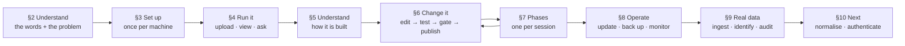

If you have **10 minutes**: read the README from the top through
[What is a chemical registry?](../README.md#what-is-a-chemical-registry-start-here).
**One hour**: add §2 in full and skim the glossary. **One day**: through §4,
ending with your first upload. After that, one section per sitting.

---

## §1 The story so far, on one page

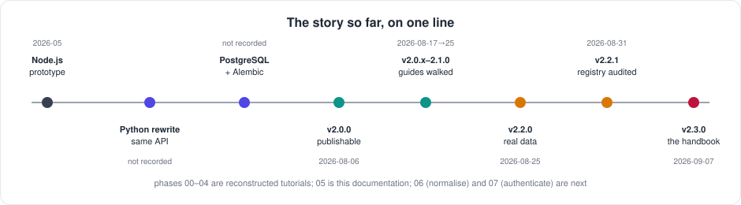

One line per milestone. Dates are when the change shipped. Where the history
does not record a date, it says so rather than guessing.

| When | Milestone |
|---|---|
| 2026-05 | A Node.js/Express prototype with a JSON-file database and a React client — the "Pandora toolbox" this project enhances. The interactive architecture page dates from then. |
| not recorded | Backend rewritten in Python/FastAPI behind the *same* API, verified by parity tests, so the React client never changed. The Node stack retired. → [12-history.md](12-history.md) |
| not recorded | PostgreSQL made optional beside SQLite; Alembic put in charge of the schema inside the container. |
| 2026-08-06 | **v2.0.0.** Public-repository hygiene: certificates backed up outside the repo, internal names replaced by placeholders, real-data workbooks replaced by synthetic ones, four platform guides. |
| 2026-08-17 | **v2.0.1–2.0.3.** Three fixes found by *following the guides literally*: HTTPS surviving a rebuild, a truly complete uninstall, documentation caught up with the code. |
| 2026-08-24 | **v2.1.0.** Documentation rewritten for a newcomer: the glossary with its "missing term is a bug" contract, the API cookbook with every answer captured live. |
| 2026-08-25 | **v2.2.0.** Real laboratory data: a 49,000-row export loaded through a template that is data, not code; a screening table built from the file; a read-only SQL console; two-stage chemical identification. RHEL 8 production rebuilt from the guides and verified. |
| 2026-08-31 | **v2.2.1.** The registry audited; a lookup that took the first result from an unranked list found and fixed; 22 mis-identified compounds removed. |
| 2026-09-07 | **v2.3.0.** The documentation reshaped into the numbered set my other projects use, with this handbook as its spine, one tutorial per phase, both roadmaps, a Windows guide and figures. |
| 2026-09-07 | **v2.4.0.** Reproducible builds: a lock file resolved inside the image, the linter, and continuous integration on the public repository running every check on Linux and macOS. |
| 2026-09-08 | **v2.5.0.** The registry reset's tools: unlink every row, empty the registry, each gated and tested; the reset itself waits on the owner's go and the new identification logic. |
| 2026-09-08 | **v2.6.0–2.7.0.** Link and unlink buttons on the screening table, select all matching rows, a confirmation before a link, per-chemical summaries. R-1 run on production: every row unlinked, the entries kept. |
| 2026-09-08 | **v2.8.0.** The plan reorganised into six tracks, one per module and a shared spine; the registry-first rule specified from the owner's description, to be agreed before the registry is emptied. |
| 2026-09-08 | **v2.9.0.** SH-1: the modules renamed to say what they are — Chemical Registry, Sample Management, Screening Data; addresses unchanged. |
| 2026-09-08 | **v2.10.0.** The authentication plan: a ladder from an open port to single sign-on, every method explained and judged, the first decision record. |
| 2026-09-08 | **v2.10.1.** The first tagged release, on both repositories; tagging becomes a step of the workflow; the container image named as the project's package, for later. |

---

## §2 Day 0 — understand the domain

**Goal:** understand the problem and the vocabulary before touching a computer.
**Why this comes first:** every later page uses the same small set of words —
chemical, sample, screening, toxicology, CAS number, registry. Twenty minutes
here removes a hundred small confusions later.

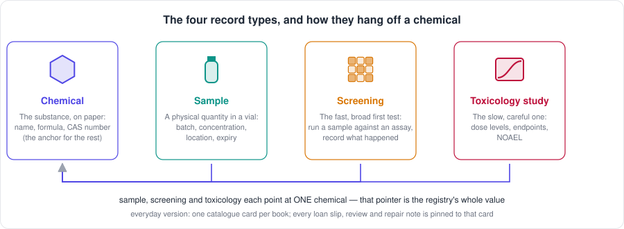

*Everyday version:* a library where every book has been catalogued three times
under three different titles by three librarians who have since left. Nobody
can prove the three cards describe one book, so the library buys it again. A
registry is the single catalogue card everything else hangs from.

1. Read the README from the top through
   [The problem this project tackles](../README.md#the-problem-this-project-tackles).
   *Why:* it states, in plain words, the one question the whole project answers
   — *has this compound been measured before, and where is the result?*
2. Read [What the system handles](../README.md#what-the-system-handles) — the
   four record types and how each hangs off a chemical. *Why:* every screen,
   every upload and every table in the system is one of those four.
3. Read Part 0 of [the user playbook](10-user-playbook.md#part-0--what-this-thing-is),
   including *The CAS number — a passport for a chemical*. *Why:* the CAS
   number is the idea the whole identification step rests on.
4. Skim [`00-glossary.md`](00-glossary.md) — do not memorise it; learn where
   things are and keep it open in a second tab from now on. *Why:* the
   project's promise is that no page uses a word this file does not explain.
5. Read [About the data (honesty notes)](../README.md#about-the-data-honesty-notes).
   *Why:* knowing what this project does **not** claim — no login, no audit
   trail, no chemistry validation — is part of understanding it.

**You are done when** you can tell a colleague, in your own words, what the
difference between a chemical and a sample is, and why two spreadsheets that
both mention "BHT" cannot be trusted to mean the same substance.

---

## §3 Day 0 — set up your workshop

**Goal:** the application running on your machine, installed once, with the
same proof of success the verification checklist uses.
**Why one careful hour is worth it:** everything afterwards — every phase,
every fix, every redeploy — is a short repeatable loop on top of this
foundation. Rushed setup is the single biggest source of "it does not work on
my machine".

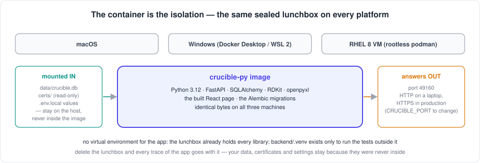

*Everyday version:* the container is a sealed lunchbox. The app and every
library it needs are packed inside, so it tastes the same on a laptop and on a
server. Setting up the workshop means installing the one tool that can open
lunchboxes — podman or Docker — and nothing else.

Pick the guide for your operating system and follow it top to bottom. Each
explains every tool (what it is, why we use it), shows every command **with
its expected output**, and ends with a numbered checklist:

| Machine | Guide | Checklist | Status |
|---|---|---|---|
| A Mac, for development | [`01-setup-macos.md`](01-setup-macos.md) | V1–V7 | ✅ walked from a fresh clone |
| A RHEL 8 VM, for production | [`01-setup-rhel8.md`](01-setup-rhel8.md) — rootless podman, SELinux, the three firewall cases, corporate certificates, surviving a reboot | V1–V9 | ✅ walked on the real machine; V9 (reboot) ⏸ waits on a window |
| A Windows PC | [`01-setup-windows.md`](01-setup-windows.md) — Docker Desktop, the scripts under Git Bash, or a Linux distribution under WSL 2 | V1–V7 (Windows variants) | 🔨 written, marked *untested* until walked on a real PC |

All three guides use the **same one-command install**,
`./setup-after-clone-py.sh`, which copies certificates when a store exists,
builds the image, starts the app, polls the API until it answers, and offers
to install the health-monitoring cron. The guides exist so that you know what
that command is doing rather than watching it scroll past.

**Two repositories, one codebase.** A Mac clones the **public** repository;
the production VM clones the **private** one. Content flows public → private
only, through a mirror folder. You do not need to understand this to install,
but you need it before §6: [`03-git-workflow.md` §1](03-git-workflow.md#1-the-two-repositories).

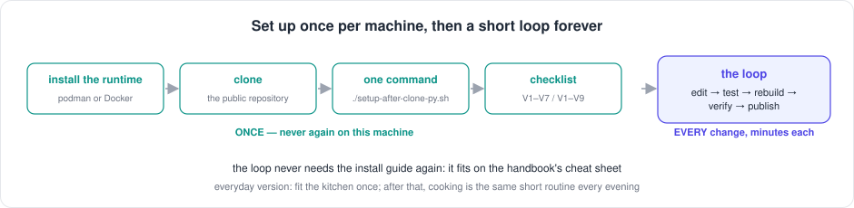

**You are done when** the checklist for your platform passes, and in
particular when this prints a line containing `"chemicals"`:

```bash
# macOS (HTTP)
curl --noproxy '*' -sS http://localhost:49160/api/stats
# RHEL 8 (HTTPS; localhost needs -k because the certificate names only the full hostname)
curl --noproxy '*' -sSk https://localhost:49160/api/stats
```

**If instead** it prints a connection error, the container is not running:
`./container-py.sh status`, then `./container-py.sh logs` — the real error is
in the last twenty lines. To remove everything and start again:
[`01-uninstall-macos.md`](01-uninstall-macos.md) · [`01-uninstall-rhel8.md`](01-uninstall-rhel8.md)
— always `./uninstall.sh --dry-run` first.

---

## §4 Day 1 — run it and look around

**Goal:** a file loaded, its rows visible in the browser, and one question
answered through the API — so that the three doors into the system are
familiar before you read how it is built.
**Why this comes before the architecture:** a diagram of boxes means nothing
until you have seen what comes out of them.

1. **Load a synthetic file.** Open `http://localhost:49160`, go to the ELN
   page, and upload `docs/excel-templates/chemicals/chemicals_template.xlsx`.
   *Why:* the templates are invented data that exercise every column each
   upload reads; [`excel-templates/README.md`](excel-templates/README.md)
   explains each column. Follow [playbook Part 2](10-user-playbook.md#part-2--put-a-laboratory-file-in)
   for what happens to your file on the way in.
2. **Look at what arrived.** The Data Viewer shows the rows; the Dashboard
   counts them and refreshes every five seconds. On the Screening Data page each
   row can be linked to a registered compound or unlinked again by hand —
   [playbook, linking by hand](10-user-playbook.md#linking-and-unlinking-by-hand).
   [Playbook Part 3](10-user-playbook.md#part-3--look-at-what-arrived) explains
   the two views, the filters and the coloured rows.
3. **Ask the API the same question.** The web pages are the API's first
   client, not its only one. Run the first two recipes in
   [`08-api-cookbook.md`](08-api-cookbook.md#getting-your-bearings); every
   answer there was captured from a live instance, so you can compare.
4. **Open the interactive architecture page** at
   `http://localhost:49160/architecture` and click through the six tabs. You
   will read the text version in §5; this is the floor plan.

**You are done when** `curl --noproxy '*' -sS http://localhost:49160/api/stats`
reports a non-zero chemical count and you can find one of the uploaded
chemicals by name in the Data Viewer.

---

## §5 Understand how it is built

**Goal:** you can explain the architecture in five sentences and hold the two
ideas that everything else follows from.
**Why now:** you have seen the system work; the design will make sense
because you have something to attach it to.

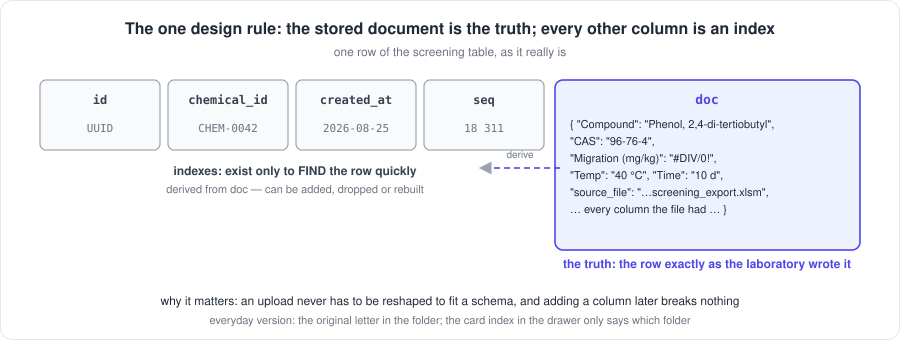

The two ideas to hold before changing any code:

1. **The stored document is the truth; every other column is an index.** Each
   record is kept whole as JSON in a `doc` column; the columns beside it exist
   only to find it quickly. That is why an upload never has to be reshaped to
   fit a schema, why adding a field later breaks nothing, and why the next
   phase (normalising the frequently-filtered fields into real columns) must
   not break it. → [`02-architecture.md` → The one design rule](02-architecture.md#the-one-design-rule-everything-else-follows-from)
2. **The container is the isolation.** There is no virtual environment for
   the application; the image carries Python, RDKit and the built client, and
   runs identically on a laptop and on the VM. `backend/.venv` exists only to
   run the tests outside it. → [`02-architecture.md` → Four words you need first](02-architecture.md#four-words-you-need-first)

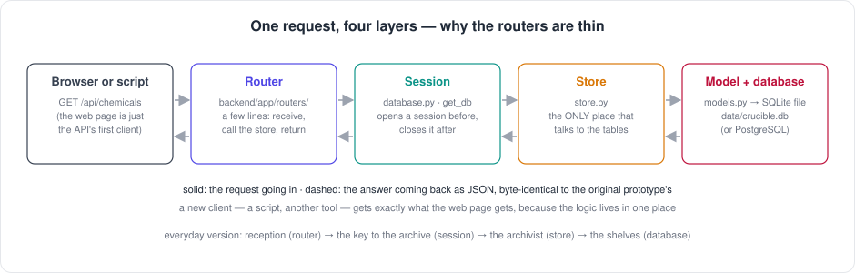

Then read, in this order:

- [`02-architecture.md`](02-architecture.md) — the boxes, what each does and
  why it exists, why not the obvious alternatives, the request path, testing.
- [`02-database-schema.md`](02-database-schema.md) — the hybrid document
  pattern in detail, SQLite versus PostgreSQL, what Alembic owns.
- [`backend/README.md`](../backend/README.md) — the module layout and every
  environment variable, for when you open the code.

**You are done when** you can answer: *where does a row's original spreadsheet
value live, and what happens to it if a column is added to the table later?*

---

## §6 How a change travels

**Goal:** you can take an edit from your Mac to production, and know at each
step what would stop a secret from travelling with it.
**Why it has its own document:** there are two repositories and three folders,
and the gate between public and private is the reason internal names never
reach the public one.

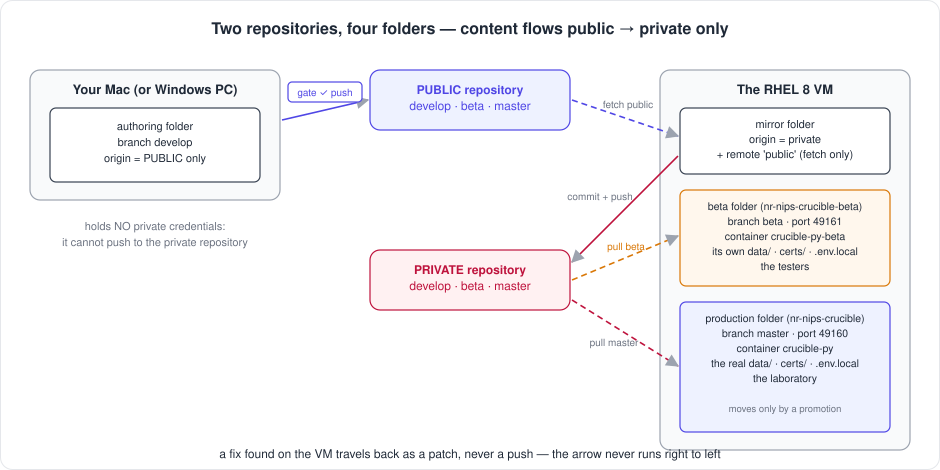

*Everyday version:* a letter goes from your desk (the Mac) to the post office
(the public repository), where a clerk checks it carries no home address
(the gate), then to the company mailroom (the private mirror), and only then to
the person who acts on it (production). The route never runs backwards.

The whole sequence — edit, test, gate, commit, push three branches, mirror,
deploy, confirm sync — lives in **one place**,
[`03-git-workflow.md`](03-git-workflow.md), and nowhere else in the
documentation. Read [§1 The two repositories](03-git-workflow.md#1-the-two-repositories),
[§3 Golden rules](03-git-workflow.md#3-golden-rules) and
[Flow A](03-git-workflow.md#4-flow-a---a-change-from-start-to-finish) once;
after that the cheat sheet in [§A](#a-cheat-sheet) is enough.

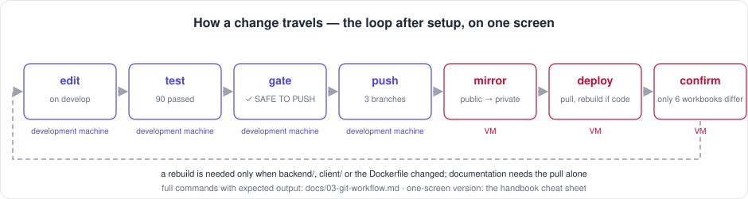

**Every session after setup** starts the same way, on the Mac:

```bash
cd ~/Documents/Work/pandora_toolbox/nr-nips-crucible
git switch develop && git pull --ff-only origin develop   # be on develop, be current
git status                                                # expect: clean
cd backend && .venv/bin/pytest -q && cd ..               # expect: 90 passed
```

and ends with the gates — the linter, the tests, the link check,
`./check-public-safe.sh` printing `✓ SAFE TO PUSH` after `git add`, and a
rebuild if code changed — before anything is pushed. After the push, CI
runs the same checks on a Linux and a macOS machine, in the public
repository and again in the private one after the mirror
([phase 05b](04-phase-tutorials/phase-05b-reproducible-builds-and-ci.md));
mirror only a green commit.
A fix discovered on the VM travels back as a patch, never a push:
[Flow B](03-git-workflow.md#5-flow-b---a-fix-discovered-on-the-vm).

**You are done when** you have pushed a one-line documentation change through
all five steps and `git diff --stat public/develop develop` in the mirror
folder shows only the private-only files.

---

## §7 The build, phase by phase

**This is the only build log in the repository.** One row per phase: what it
delivered, when, and where the tutorial is. Each tutorial follows the same
shape — why the phase exists, what it built, numbered steps with expected
output, a checkpoint, what it deliberately did not do, and the publish block.
Phases shipped before the tutorials existed are *reconstructed* from the
release notes and the git log, and say "not recorded" where the history is
silent rather than inventing a command.

**Tracks.** Since v2.8.0 the plan is organised in six **tracks** — one per
module (CR Chemical Registry, SD Screening Data, SM Sample Management, TX
Toxicology, QC Query Console) and SH, the shared spine — the way my other
projects run two tracks over one core. Phases shipped before the tracks
existed keep their numbers and are assigned a track here; new phases are
named by track code and number (`CR-3`), and their tutorials by the same
code (`phase-cr-3-every-way-in.md`). What each track does next is
[`05-roadmap.md`](05-roadmap.md#where-each-track-stands-and-its-next-phase).

| # | Track | Phase | Delivered | Tutorial | Shipped | Status |
|---|---|---|---|---|---|---|
| 00 | SH | Node → Python | The FastAPI backend behind the same API as the Node prototype, verified by parity tests; the React client untouched; the Node stack retired | [`phase-00-node-to-python.md`](04-phase-tutorials/phase-00-node-to-python.md) | pre-2.0, date not recorded | ✅ (reconstructed) |
| 01 | SH | PostgreSQL and Alembic | Engine-agnostic storage via `DATABASE_URL`; Alembic owns the schema in the container; SQLite stays the default | [`phase-01-postgres-alembic.md`](04-phase-tutorials/phase-01-postgres-alembic.md) | pre-2.0, date not recorded | ✅ (reconstructed) |
| 02 | SH | Public-repository hygiene | Certificates backed up outside the repo; internal hostnames, users and paths behind placeholders; real workbooks replaced by synthetic ones from a tracked generator; four platform guides; the pre-push gate | [`phase-02-public-repo-hygiene.md`](04-phase-tutorials/phase-02-public-repo-hygiene.md) | 2026-08-06 (v2.0.0) | ✅ (reconstructed) |
| 03 | SH | Platform verification | Both guides walked from a blank machine: macOS V1–V7, RHEL 8 V1–V9 (V9 pending a reboot window); fifteen bugs found and fixed by following the guides literally | [`phase-03-platform-verification.md`](04-phase-tutorials/phase-03-platform-verification.md) | 2026-08-17 → 2026-08-25 | ✅ (reconstructed) |
| 04 | SD · CR | Template ingestion | A laboratory export described as data (fingerprint, column map, cleaners, provenance), the screening table built from the file, the read-only SQL console, two-stage chemical identification, the registry audit and the five maintenance scripts | [`phase-04-template-ingestion.md`](04-phase-tutorials/phase-04-template-ingestion.md) | 2026-08-25 (v2.2.0), 2026-08-31 (v2.2.1) | ✅ (reconstructed) |
| 05 | SH | Documentation consolidation | The numbered document set, this handbook, the phase tutorials, the roadmaps, the lessons file, the Windows guide, figures | [`phase-05-docs-consolidation.md`](04-phase-tutorials/phase-05-docs-consolidation.md) | 2026-09-07 (v2.3.0) | ✅ |
| 05b | SH | Reproducible builds and CI | `backend/requirements.lock` resolved inside the image by `./container-py.sh lock`; the Dockerfile, CI and the test environment install from it; the linter with an explicit rule set; a workflow on the public repository running every check on Linux and macOS | [`phase-05b-reproducible-builds-and-ci.md`](04-phase-tutorials/phase-05b-reproducible-builds-and-ci.md) | 2026-09-07 (v2.4.0) | ✅ |
| R | CR · SD | Registry reset | `--unlink-all` and `--all` on the removal script, batched and gated, with the script's first six tests; the two-step procedure on production; then the new identification logic | [`phase-r-registry-reset.md`](04-phase-tutorials/phase-r-registry-reset.md) | 2026-09-08 (v2.5.0 tools · v2.6.0 buttons · v2.7.0 match, confirm, summaries) | 🔨 R-1 done 2026-09-08 · R-2 awaiting go after SD-1 is agreed · R-3 written as the SD-1 specification 📝 (2026-09-08) |
| SH-1 | SH | Module names | *Chemicals*, *Samples*, *Screening* become *Chemical Registry*, *Sample Management*, *Screening Data* in the sidebar, the page headings, the dashboard tiles, the interactive architecture page and every document; no address or API path changed | [`phase-sh-1-module-names.md`](04-phase-tutorials/phase-sh-1-module-names.md) | 2026-09-08 (v2.9.0) | ✅ |
| 06 (SH-2) | SH | Schema normalisation | The frequently-filtered fields promoted from JSON into indexed columns, without changing the API or breaking the design rule | `04-phase-tutorials/phase-06-schema-normalisation.md` | — | 🔜 |
| 07 (SH-3a/b/c) | SH | Authentication, as a ladder (agreed 2026-09-08) | A token gate (SH-3a), local accounts (SH-3b), single sign-on through the organisation's identity provider (SH-3c) — one flag, one guard on every route, one open health route; planned in [`13-authentication.md`](13-authentication.md), decided in [ADR 0001](adr/0001-authentication-ladder.md) | `04-phase-tutorials/phase-sh-3a-token-gate.md` and siblings | — | 🔜 SH-3a ready · ⏸ SH-3c on the registration |

Version-by-version detail, including what each release deliberately did *not*
fix, is in [`NEWS.md`](../NEWS.md).

**Returning after a break?** Read the status column, open the first 🔨 or 🔜
row, and run the "every session" block in §6. Your local state is always
recoverable with `git switch develop && git pull --ff-only origin develop`.

---

## §8 Operate it

**Goal:** you can keep the production instance healthy without re-reading the
install guide.
**Why one document:** every runbook — updating, backing up, rotating a
certificate, monitoring, troubleshooting, uninstalling — lives in
[`07-operations.md`](07-operations.md). The setup guides link there instead of
repeating it.

| I want to… | Command | Where it is explained |
|---|---|---|
| Update to a new version | `./container-py.sh backup` → `git pull --ff-only origin master` → `./container-py.sh rebuild` | [`01-setup-rhel8.md` §6](01-setup-rhel8.md#6-day-2-operations) |
| Back up, restore | `./container-py.sh backup` · `restore <file>` | [Backup and restore](07-operations.md#backup-and-restore) |
| Rotate the certificate | install the new pair, `./container-py.sh start-ssl` | [SSL/TLS certificate setup](07-operations.md#ssltls-certificate-setup) |
| Know it is still up | `monitor.sh` from cron every 5 minutes; `cert-expiry-check.sh` weekly | [Health monitoring](07-operations.md#health-monitoring) |
| Survive a reboot | the systemd user unit and lingering | [Auto-start on boot](07-operations.md#auto-start-on-boot-systemd) |
| Reclaim disk after rebuilds | `podman image prune -f` | [Maintenance](07-operations.md#maintenance-and-operational-tasks) |
| Remove it | `./uninstall.sh --dry-run`, then the mode you mean | [`01-uninstall-macos.md`](01-uninstall-macos.md) · [`01-uninstall-rhel8.md`](01-uninstall-rhel8.md) |

There is no login yet, by design while the system was built on one
internal network. The plan to add one — a token gate in days, single
sign-on as the destination, and what to ask the identity team for now — is
[`13-authentication.md`](13-authentication.md); when its first rung ships,
this table gains a *turn the login on* row.

Three habits the runbooks assume: back up before any rebuild or bulk write;
never copy a live database file with `cp` (use the backup command, which uses
SQLite's online-backup API); and run every verification command in a form
that cannot fail silently (`curl -sS`, never `-s`).

---

## §9 Work with real laboratory data

**Goal:** a laboratory's own export loaded, its compounds given a single
identity each, and the registry checked for mistakes.
**Why it is a separate skill:** real files are messy in ways synthetic ones
are not — a cp1252 encoding, `#DIV/0!` in a measurement column, header rows
repeated mid-file, two CAS numbers in one cell — and identifying a compound
from a house-style name is a judgement, not a lookup.

The build of all this is [phase 04](04-phase-tutorials/phase-04-template-ingestion.md).
Follow the playbook in order; it was written for exactly this sequence:

1. [Part 2 — put a laboratory file in](10-user-playbook.md#part-2--put-a-laboratory-file-in):
   what a template is (a description of the file as *data*, so that the next
   laboratory format is a new description, not new code) and what the cleaner
   does to each cell.
2. [Part 4 — give the compounds an identity](10-user-playbook.md#part-4--give-the-compounds-an-identity)
   and [`09-chemical-identification.md`](09-chemical-identification.md). The
   two stages use opposite rules on purpose:

   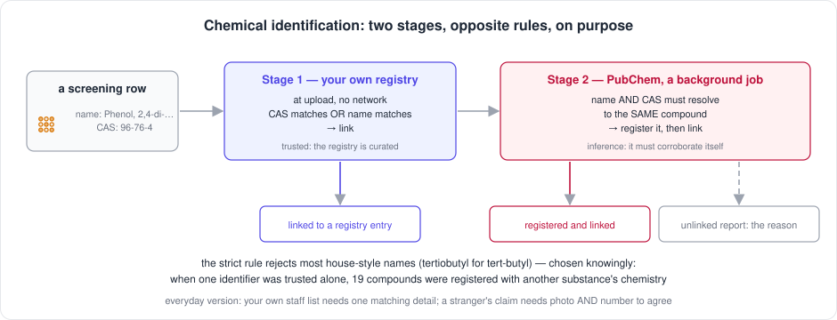


   | Stage | Rule | Why |
   |---|---|---|
   | Your own registry, at upload, no network | **either** the CAS number **or** the name matches → link | the registry is curated, so one match is trustworthy |
   | PubChem, background job | **both** must resolve to the same compound → link | PubChem is inference, so it demands corroboration |

   The strict rule rejects most compounds whose name is written in a house
   style (`tertiobutyl` for `tert-butyl`). That was chosen knowingly; the
   lessons file records what happened when a lookup was trusted on one
   identifier.

   **This rule is being replaced.** The registry-first rule — both
   identifiers must match one *registered* compound, ingestion never asks
   PubChem, unregistered compounds are reviewed by a person — was specified
   on 2026-09-08 and waits on agreement:
   [`09-chemical-identification.md` → The next rule](09-chemical-identification.md#the-next-rule-registry-first--specification).
3. [Part 5 — check what you registered](10-user-playbook.md#part-5--check-what-you-registered)
   and [Part 6 — correct what is wrong](10-user-playbook.md#part-6--correct-what-is-wrong):
   the audit, and removing or merging entries without orphaning measurements.
4. [Part 7 — ask your own questions](10-user-playbook.md#part-7--ask-your-own-questions)
   and [`09-query-cookbook.md`](09-query-cookbook.md): read-only SQL against a
   schema where most fields live inside a JSON column.

**You are done when** the identification report shows more rows linked than
unlinked, the audit reports nothing it can measure, and you can write a query
that joins one compound's measurements to its registry entry.

---

## §10 What comes next

Two documents, two horizons:

- [`05-roadmap.md`](05-roadmap.md) — what is planned for *this* system, in
  order, and what each item waits on. The honest part is the waiting: most
  items are not hard to build; they are blocked on a decision or on each
  other.
- [`06-product-and-technology-roadmap.md`](06-product-and-technology-roadmap.md)
  — from today's system of record to an industrialised, hosted product:
  every candidate technology with a verdict (required now, recommended
  later, optional, not needed) and the trigger that would change it.

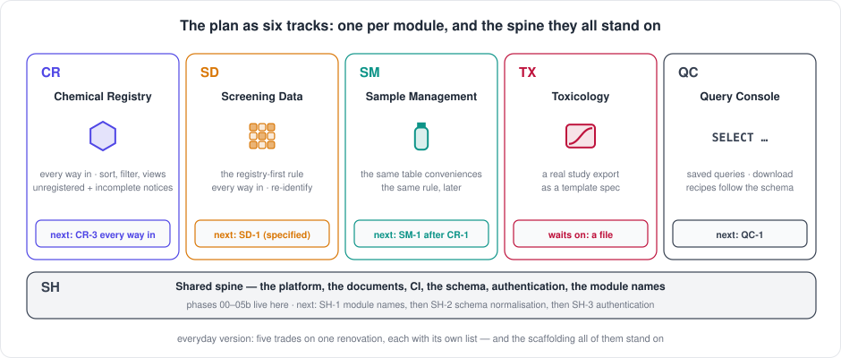

The plan runs as six tracks — one per module and a shared spine — and the
roadmap names the next phase of each ([where each track stands](05-roadmap.md#where-each-track-stands-and-its-next-phase)).
In the order the roadmap [argues for](05-roadmap.md#why-this-order):

1. ~~SH-1 — module names~~ done, v2.9.0.
2. ~~SD-1 agreed~~ 2026-09-08, **then R-2:** the registry-first rule is
   [specified and agreed](09-chemical-identification.md#the-next-rule-registry-first--specification);
   the registry is emptied next (R-2, behind a backup and a go, after the
   demo).
3. **CR-3 — every way in:** JSON upload and one terminal command, so the
   empty registry can be refilled from a curated file by any route.
4. **SD-1 build, then CR-5:** the rule in code, with the command that
   re-attaches the rows already loaded, and the unregistered-compounds
   notice and review table.
5. **CR-1, CR-2, CR-4:** sort and filter per column, the three views, and
   the incomplete-entries notice with the PubChem review step.
6. **SH-2 — schema normalisation:** list the fields people filter on, agree
   them, *then* write the migration.
7. **SH-3a, b, c — authentication, as a ladder:** the largest gap. `/api/*`
   is open to anyone who can reach the port; deliberate for an internal
   network, and the first thing a wider audience needs. A token gate in
   days, local accounts only as far as needed, single sign-on as the
   destination when the identity team's registration arrives — requested
   now. The plan, every method explained, and what to ask for:
   [`13-authentication.md`](13-authentication.md). This runs beside the
   phases above, not after them.

   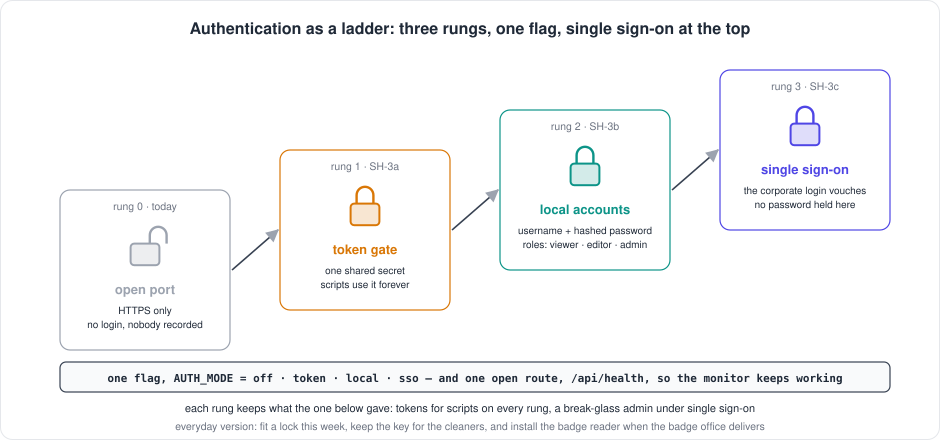

---

## §11 Mistakes that taught something

Every one was found by following a written procedure literally on a real
machine, and every one has the same shape: **an operation reporting one thing
while doing another** — a dry run that wrote, a status that could not fail, a
verification that could not run and printed what a pass looks like, a list
treated as ranked. Look for that shape first, in code and in documentation.
The full list, each with its lesson, is [`11-lessons-learned.md`](11-lessons-learned.md).

---

## §A Cheat sheet

The commands I actually type, on one screen. The scripts are the same on both
machines; they auto-detect podman or Docker.

| | macOS (development) | RHEL 8 VM (production) |
|---|---|---|
| Start of session | `git switch develop && git pull --ff-only origin develop` | — |
| Run the checks CI runs | `cd backend && .venv/bin/ruff check . && .venv/bin/pytest -q` | not possible on the VM (system Python 3.6); the container ships its own |
| Changed `requirements.txt`? | `./container-py.sh lock`, review the diff, then rebuild | — |
| Rebuild after a code change | `./container-py.sh rebuild` | `./container-py.sh backup && ./container-py.sh rebuild` |
| Is it up? | `curl --noproxy '*' -sS http://localhost:49160/api/stats` | `curl --noproxy '*' -sSk https://localhost:49160/api/stats` |
| Status, logs | `./container-py.sh status` · `logs` | same |
| The gate, before every push | `git add -A && ./check-public-safe.sh` → `✓ SAFE TO PUSH` · `python3 check-links.py` | — |
| Publish | `git push origin develop develop:beta develop:master` | — |
| Tag the release (every version that reaches production) | `git tag -a vX.Y.Z -m "vX.Y.Z — <NEWS subtitle>" && git push origin vX.Y.Z`, then the Release page | mirror folder: the same tag on the mirror's commit, then the Release page on the private host |
| Mirror public → private | — | mirror folder: `git fetch public && git checkout public/develop -- .` → commit → push three branches |
| Deploy | — | production folder: `git switch master && git pull --ff-only origin master`, rebuild only if code changed |
| Confirm the two repos agree | — | mirror folder: `git diff --stat public/develop develop` → only the private-only files |
| Back up | `./container-py.sh backup` | same, plus copy the newest `backups/crucible-*.db` off the machine |
| Remove everything | `./uninstall.sh --dry-run` first | same |

Full commands with expected output: [`03-git-workflow.md`](03-git-workflow.md)
for the publish path, [`07-operations.md`](07-operations.md) for everything
else.

---

## When something goes wrong

1. **Which machine, which folder, which branch?** `pwd && git branch --show-current`.
   Most confusion on this project has been one of those three.
2. **Is the container running, and what did it last say?**
   `./container-py.sh status` then `./container-py.sh logs`.
3. **Did a verification command actually run?** A `grep` that matches nothing
   prints nothing, which looks like success. Re-run it in a form that shows
   output either way.

Then: [playbook Part 10](10-user-playbook.md#part-10--when-something-goes-wrong)
for the beginner-facing walkthrough, and
[`07-operations.md` → Troubleshooting](07-operations.md#troubleshooting) for
the symptom / cause / fix table (SELinux, rootless ports, proxies, systemd).

---

## How this handbook is maintained

- **§0 and §7 change in the same commit as the work they describe.** A
  handbook that describes last week is a second README.
- **It sequences; it does not duplicate.** Every topic has one home; this page
  links there with a sentence on why. A command that appears both here and in
  a specialised page is a bug, except in §A, which is deliberately a copy of
  the commands I type most.
- **Every jargon term is in the glossary.** If you meet one that is not,
  [`00-glossary.md`](00-glossary.md) says what to do.
- **The same shape as my other projects.** OrthoWatch, StrainScope, SegAudit,
  StableSeg and ImagingAgent all carry a numbered document set and a handbook
  like this one, so the five read as one body of work.

**Last Updated:** September 8, 2026
