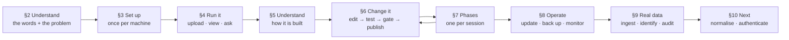
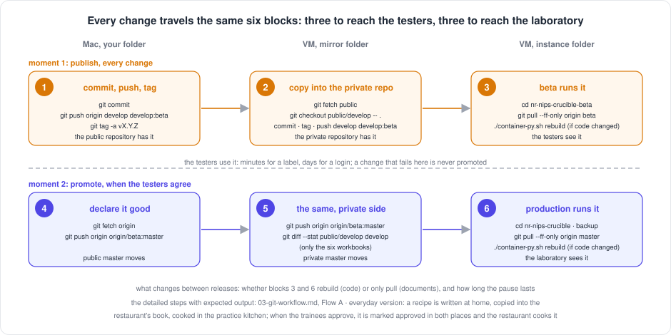
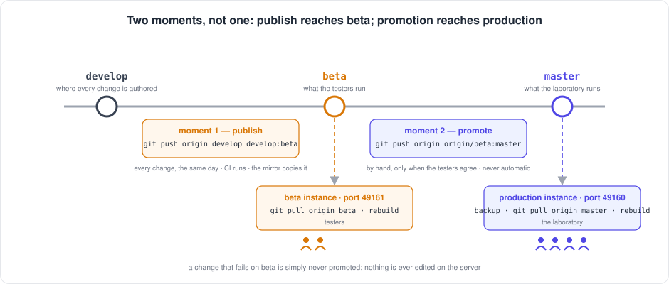

[← README](../README.md) · **Handbook** · [Glossary](00-glossary.md)

# The Crucible Handbook — one document from day 0 to today, and what comes next

**Who this is for:** anyone opening this repository for the first time, and anyone
coming back after a break — including me. It is the *only* document you need to
keep open. Every other document is linked from here at the moment you need it,
with a sentence on why.
**What it is:** a living, ordered walkthrough of the whole journey: learn what a
chemical registry is → set up a machine, once → run the system and look around →
understand how it is built → learn how a change travels → the build so far, phase
by phase → operate it → work with real laboratory data → what comes next. It is
updated **in the same commit** as any change it describes, so it is never out of
date. If it ever disagrees with reality, that is a bug worth reporting.
**What it is not:** a copy of the other documents. Details live in the
specialised pages; this page tells you which one to read, when, and why.

**Three pages people confuse, and what each is for:**

| Page | Question it answers | Open it when |
|---|---|---|
| **This handbook** | *Where are we, what was built, in what order do I read the rest, what comes next?* | You are new, or coming back after a break, or want the plan |
| [The user playbook](10-user-playbook.md) | *How do I use the application, from nothing, start to finish, and why each step?* | You are learning to run it: load a file, check it, identify, correct, ask questions |
| [Chemical Registry tasks](10-registry-tasks.md) | *How do I do this one routine job, right now, from the browser, the API or the terminal?* | You already know the system and need the command or the button |

*Everyday version:* the handbook is the map of the building, the playbook is
the induction course, the tasks page is the laminated card by the machine.

**Status legend used throughout:** ✅ done and verified · 🔨 in progress ·
🔜 planned (approach written, not built) · ⏸ waiting on a decision or a window.

---

## Contents

- [§0 Where we are](#0-where-we-are)
- [The journey at a glance](#the-journey-at-a-glance)
- [§1 The story so far, on one page](#1-the-story-so-far-on-one-page)
- [§2 Day 0 — understand the domain](#2-day-0--understand-the-domain)
- [§3 Day 0 — set up your workshop](#3-day-0--set-up-your-workshop)
- [§4 Day 1 — run it and look around](#4-day-1--run-it-and-look-around)
- [§5 Understand how it is built](#5-understand-how-it-is-built)
- [§6 How a change travels](#6-how-a-change-travels)
- [§7 The build, phase by phase](#7-the-build-phase-by-phase)
- [§8 Operate it](#8-operate-it)
- [§9 Work with real laboratory data](#9-work-with-real-laboratory-data)
- [§10 What comes next](#10-what-comes-next)
- [§11 Mistakes that taught something](#11-mistakes-that-taught-something)
- [§A Cheat sheet](#a-cheat-sheet)
- [When something goes wrong](#when-something-goes-wrong)
- [How this handbook is maintained](#how-this-handbook-is-maintained)

---

## §0 Where we are

| | |
|---|---|
| **Version** | 2.22.1 (2026-09-22, the login on production too, each instance with its own token; the monitor ignores a generic PORT; 2.22.0 the same day, the token gate: the first rung of the login, on beta first; 2.21.4 the same day, the development machine named by its role in every document, figure and comment; 2.21.3 the same day, the six blocks of every change written down; 2.21.2 the same day, one supervisor: the service runs the application and the script hands over; the run-stop-status guide; 2.21.1 the same day, the script keeps the systemd unit current; 2.21.0 the same day, the instance label: *Prod* and *Beta* in the page; 2.20.0 to 2.20.2 the day before and the same morning: the beta instance built, corrected, live); the first tagged release was `v2.10.1` |
| **Status date** | 2026-09-22 |
| **Tests** | 169 passing (`cd backend && .venv/bin/pytest`) |
| **Last phase done** | **SH-3a — the token gate ✅ (2026-09-22, v2.22.0):** two lines in an instance's `.env.local` close its port; every module's routes answer 401 without the token and as before with it; a login page with the instance pill, a cookie that is a keyed hash of the token, a *Sign out*; `GET /api/health` open for the probes; `verify-deploy.sh --token`; the cross-origin policy closed; on beta at 17:31 and on production at 18:06 the same day, each with its own token (decision A11) — [phase SH-3a](04-phase-tutorials/phase-sh-3a-token-gate.md). Before it, **SH-13 — the instance label ✅ (2026-09-22, v2.21.0):** every page says *Prod* (indigo) or *Beta* (amber) in a pill and on the tab, derived from the same instance name the scripts use, through one open endpoint `GET /api/instance`; the first change to travel publish-then-promote with a rebuild — [phase SH-13](04-phase-tutorials/phase-sh-13-instance-label.md). Before it, **SH-12 — a beta instance for user testing ✅ (2026-09-21, v2.20.0, live on the server 2026-09-22):** a second, complete copy of the application beside production, named by one file (`CRUCIBLE_INSTANCE=beta`, `CRUCIBLE_PORT=49161`) that every script reads; its own container, image, data, unit and monitor line; `restore` takes a folder so beta is refreshed from production in two commands; the workflow now has two moments, publish to beta and promote to master; rehearsed on the development machine with two containers side by side; the server setup is [`01-setup-rhel8.md` §8](01-setup-rhel8.md#8-a-second-instance-for-user-testing-beta) — [phase SH-12](04-phase-tutorials/phase-sh-12-beta-instance.md). Before it, CR-11 — counts, batch filters and source tags ✅ (2026-09-14): the strip of batch counts as filter buttons, six source tags derived from the data as chips in every view, filterable in combination, one summary endpoint and script — [phase CR-11](04-phase-tutorials/phase-cr-11-counts-and-tags.md). Before it, CR-10 — the attention page ✅ (2026-09-09): every flag in the browser with the buttons to act — merge, keep both, mark reviewed, set the identifier — behind one audit module the page, the API and the script all call; a review mark stored on the entry — [phase CR-10](04-phase-tutorials/phase-cr-10-attention-page.md). Before it the same day, CR-2 with CR-1 — three views, sort and filter on the registry table ✅: every column (164), every batch (12,561), sorted and filtered on the server — [phase CR-2](04-phase-tutorials/phase-cr-2-views-sort-filter.md); and CR-9 — The real registry sources ✅: the Dotmatics export, the structure file and the limited list recognised by their columns and loaded by their own rules; batches folded, sources merged on DTXSID, shared identifiers flagged, structures read; a banner and the audit for what a person decides — [phase CR-9](04-phase-tutorials/phase-cr-9-real-registry-sources.md) · [the sources](09-registry-sources.md) |
| **Phase in progress** | **R — the registry reset** 🔨 (tracks CR + SD): **R-1 and R-2 done on production 2026-09-08** — every row unlinked, then every entry removed; the registry is empty by design, the 664 entries held in a backup outside the repository; R-3 is now **SD-1, agreed ✅ 2026-09-08** — the registry-first rule, written from the owner's description and agreed the same day, D1–D11 as recommended — [phase R](04-phase-tutorials/phase-r-registry-reset.md) · [the specification](09-chemical-identification.md#the-next-rule-registry-first--specification) |
| **Plan** | Six **tracks**, one per module and a shared spine, each with its next phase — [`05-roadmap.md`](05-roadmap.md). Next in order: ~~the owner loads the three real files~~ done 2026-09-09 (12,539 entries on production) → ~~CR-10 the attention page~~ done v2.16.0 → ~~CR-11 counts and tags~~ done v2.18.0 → ~~SH-12 the beta instance~~ done v2.20.0, live on the server 2026-09-22 → ~~SH-13 the instance label~~ done v2.21.0 → ~~SH-3a the token gate~~ done v2.22.0, on beta first → **SH-3b local accounts**, one login per tester on beta, then promoted (the owner's priority of 2026-09-21 — [`13-authentication.md`](13-authentication.md)) → CR-12 structures: derive, draw, edit ([specified](09-structures.md), three releases) → SD-1 build → CR-5 unregistered review → CR-4 incomplete entries → CR-8 merge a hand-picked pair → SH-2 schema normalisation; SH-3c single sign-on ⏸ not needed for the moment (the owner, 2026-09-22) |
| **Production** | one RHEL 8 VM, one container per instance — production on 49160 and, **since 2026-09-22, the beta instance on 49161** with its own copy of production's data (restored from the morning's backup), its own unit and monitor line, **both behind the token gate since 2026-09-22 (v2.22.0), each with its own token** — one SQLite file each: 49,065 screening rows, **12,539 registered chemicals** (the Dotmatics export, the structure file and the limited list, loaded by the owner on 2026-09-09 through the terminal shortcut), **0 rows linked** until SD-1 attaches them; 419 entries share an identifier, 3 have batch conflicts and 125 have a formula their names do not explain — 349 items on the attention page, for a person to decide; the 664 old entries stay in `~/data-backup-20260908-before-R2.db` on the server |

**Open items, none blocking:**

- ⏸ The RHEL 8 reboot check (V9) waits on a maintenance window.
- 🔜 The script that removes chemicals has no automated test; it deletes data.
- 🔜 Deleting a chemical through the API leaves its screening rows pointing at nothing (the removal script unlinks first; the endpoint does not yet).
- ⏸ Twenty-two real compounds were removed after a lookup bug mis-identified them. Under the new rule they are registered by a person from the review table (CR-5), with everything else.
- ⏸ No `LICENSE` file yet; the owner's decision. Public on GitHub without one still means all rights reserved.

---

## The journey at a glance

| Stage | What you get out of it | Time | Status |
|---|---|---|---|
| [§2 Understand the domain](#2-day-0--understand-the-domain) | You can explain what a chemical registry is and why spreadsheets fail at the job | 30–45 min | ✅ |
| [§3 Set up your workshop](#3-day-0--set-up-your-workshop) | The app running on your machine, installed once, with proof it works | ~45 min | ✅ macOS · ✅ RHEL 8 · 🔨 Windows (guide written, untested) |
| [§4 Run it and look around](#4-day-1--run-it-and-look-around) | You have loaded a file, looked at it in the browser, and asked the API a question | 1 h | ✅ |
| [§5 Understand how it is built](#5-understand-how-it-is-built) | You can explain the one design rule and why the container is the isolation | 1–2 h | ✅ |
| [§6 How a change travels](#6-how-a-change-travels) | You can take an edit from your development machine to production without leaking anything | 1 h reading, minutes per change | ✅ |
| [§7 The build, phase by phase](#7-the-build-phase-by-phase) | You know what was built, in what order, and why | 1 h | ✅ tutorials 00–05b, R, SH-1 |
| [§8 Operate it](#8-operate-it) | Update, back up, rotate certificates, monitor, uninstall | as needed | ✅ |
| [§9 Work with real laboratory data](#9-work-with-real-laboratory-data) | A laboratory export loaded, its compounds identified, the registry audited | half a day | ✅ |
| [§10 What comes next](#10-what-comes-next) | The next three phases and what each waits on | 20 min | ✅ written |



If you have **10 minutes**: read the README from the top through
[What is a chemical registry?](../README.md#what-is-a-chemical-registry-start-here).
**One hour**: add §2 in full and skim the glossary. **One day**: through §4,
ending with your first upload. After that, one section per sitting.

---

## §1 The story so far, on one page


One line per milestone. Dates are when the change shipped. Where the history
does not record a date, it says so rather than guessing.

| When | Milestone |
|---|---|
| 2026-05 | A Node.js/Express prototype with a JSON-file database and a React client — the "Pandora toolbox" this project enhances. The interactive architecture page dates from then. |
| not recorded | Backend rewritten in Python/FastAPI behind the *same* API, verified by parity tests, so the React client never changed. The Node stack retired. → [12-history.md](12-history.md) |
| not recorded | PostgreSQL made optional beside SQLite; Alembic put in charge of the schema inside the container. |
| 2026-08-06 | **v2.0.0.** Public-repository hygiene: certificates backed up outside the repo, internal names replaced by placeholders, real-data workbooks replaced by synthetic ones, four platform guides. |
| 2026-08-17 | **v2.0.1–2.0.3.** Three fixes found by *following the guides literally*: HTTPS surviving a rebuild, a truly complete uninstall, documentation caught up with the code. |
| 2026-08-24 | **v2.1.0.** Documentation rewritten for a newcomer: the glossary with its "missing term is a bug" contract, the API cookbook with every answer captured live. |
| 2026-08-25 | **v2.2.0.** Real laboratory data: a 49,000-row export loaded through a template that is data, not code; a screening table built from the file; a read-only SQL console; two-stage chemical identification. RHEL 8 production rebuilt from the guides and verified. |
| 2026-08-31 | **v2.2.1.** The registry audited; a lookup that took the first result from an unranked list found and fixed; 22 mis-identified compounds removed. |
| 2026-09-07 | **v2.3.0.** The documentation reshaped into the numbered set my other projects use, with this handbook as its spine, one tutorial per phase, both roadmaps, a Windows guide and figures. |
| 2026-09-07 | **v2.4.0.** Reproducible builds: a lock file resolved inside the image, the linter, and continuous integration on the public repository running every check on Linux and macOS. |
| 2026-09-08 | **v2.5.0.** The registry reset's tools: unlink every row, empty the registry, each gated and tested; the reset itself waits on the owner's go and the new identification logic. |
| 2026-09-08 | **v2.6.0–2.7.0.** Link and unlink buttons on the screening table, select all matching rows, a confirmation before a link, per-chemical summaries. R-1 run on production: every row unlinked, the entries kept. |
| 2026-09-08 | **v2.8.0.** The plan reorganised into six tracks, one per module and a shared spine; the registry-first rule specified from the owner's description, to be agreed before the registry is emptied. |
| 2026-09-08 | **v2.9.0.** SH-1: the modules renamed to say what they are — Chemical Registry, Sample Management, Screening Data; addresses unchanged. |
| 2026-09-08 | **v2.10.0.** The authentication plan: a ladder from an open port to single sign-on, every method explained and judged, the first decision record. |
| 2026-09-08 | **R-2 run on production.** Every registry entry removed after a backup; the registry empty by design until it is refilled under the agreed rule. |
| 2026-09-09 | **v2.15.0.** CR-2 with CR-1: the registry table shows every column, every batch, sorted and filtered. |
| 2026-09-09 | **v2.16.0.** CR-10: the attention page — every flag in the browser with the buttons to act, one audit module behind the page, the API and the script, the review mark on the entry. |
| 2026-09-14 | **v2.16.1.** The columns answer no longer goes stale after a re-import that changes entries without adding any; the export re-imported on production, 34 batch columns. |
| 2026-09-14 | **v2.17.0.** The plan for CR-11 and CR-12 written first, at the owner's request, ahead of the screening rule. |
| 2026-09-14 | **v2.18.0.** CR-11: the counts strip and the source tags on the registry page — where every compound came from, at a glance; one summary behind the browser, the API and a script. |
| 2026-09-21 | **v2.19.0.** The beta instance and the login put at the top of the plan, at the owner's request, so end users can test without touching production; the local-accounts rung to be built in full. |
| 2026-09-21 | **v2.20.0.** SH-12: the beta instance — every script reads its instance from one file, a second copy runs beside production and cannot touch it, the workflow gains publish-to-beta and promote-to-master; rehearsed on the development machine, ready for the server. |
| 2026-09-22 | **v2.20.2.** The beta instance set up on the server from the guide's §8: two containers, two units, two monitor lines, the same 12,539 compounds on both ports; the restart message says the right scheme. |
| 2026-09-22 | **v2.21.0.** SH-13: the page says *Prod* or *Beta*, in a pill and on the tab, indigo or amber; one open endpoint; the first rebuild to go beta first, then promoted. |
| 2026-09-22 | **v2.21.1.** The first beta deploy found the script and the systemd unit fighting over one container; the script now stops an active unit before touching the container and rewrites the unit afterwards (lesson 36). |
| 2026-09-22 | **v2.21.2.** One supervisor: the script hands every container it creates to the service, and its status, stop, start and restart go through the service; a command returns only when the application answers; one page, `15-run-stop-status.md`, for is-it-running, stop, start and surviving a reboot (lesson 37). |
| 2026-09-22 | **v2.21.3.** The route of every change since the beta instance written as six blocks in two moments, with why each block exists, in the workflow page, the handbook and a figure. |
| 2026-09-22 | **v2.21.4.** Every document, figure and comment names the machine where the code is written by its role, *the development machine*, and a platform only where behaviour differs by platform; a contributing norm and a glossary entry. |
| 2026-09-22 | **v2.22.0.** SH-3a: the token gate — two lines in a folder's settings file close an instance's port; a login page, a cookie that is not the token, one open health route, the deploy check with a token, the cross-origin policy closed; on beta first. |
| 2026-09-22 | **v2.22.1.** The login on production too, the same evening, with its own token (one token per instance, A11); the monitor no longer honours a generic `PORT` and refuses to restart a container at a port it does not publish (lesson 39). |
| 2026-09-09 | **v2.14.0.** CR-9: the laboratory's three real registry files described as data — the master export, the structure file, the limited list — loaded by their own rules; the registry can now be refilled with 12,539 real entries. |
| 2026-09-09 | **v2.13.0.** CR-3: every way into the registry through one door — JSON beside the spreadsheet and structure formats, import and export from the terminal, and the review loop that refills the registry from the pre-reset backup. |
| 2026-09-09 | **v2.11.0.** CR-6: deleting a compound with linked rows is refused in the browser and the plain API; forced or from the script it unlinks first, then deletes. |
| 2026-09-08 | **v2.10.1.** The first tagged release, on both repositories; tagging becomes a step of the workflow; the container image named as the project's package, for later. |

---

## §2 Day 0 — understand the domain

**Goal:** understand the problem and the vocabulary before touching a computer.
**Why this comes first:** every later page uses the same small set of words —
chemical, sample, screening, toxicology, CAS number, registry. Twenty minutes
here removes a hundred small confusions later.


*Everyday version:* a library where every book has been catalogued three times
under three different titles by three librarians who have since left. Nobody
can prove the three cards describe one book, so the library buys it again. A
registry is the single catalogue card everything else hangs from.

1. Read the README from the top through
   [The problem this project tackles](../README.md#the-problem-this-project-tackles).
   *Why:* it states, in plain words, the one question the whole project answers
   — *has this compound been measured before, and where is the result?*
2. Read [What the system handles](../README.md#what-the-system-handles) — the
   four record types and how each hangs off a chemical. *Why:* every screen,
   every upload and every table in the system is one of those four.
3. Read Part 0 of [the user playbook](10-user-playbook.md#part-0--what-this-thing-is),
   including *The CAS number — a passport for a chemical*. *Why:* the CAS
   number is the idea the whole identification step rests on.
4. Skim [`00-glossary.md`](00-glossary.md) — do not memorise it; learn where
   things are and keep it open in a second tab from now on. *Why:* the
   project's promise is that no page uses a word this file does not explain.
5. Read [About the data (honesty notes)](../README.md#about-the-data-honesty-notes).
   *Why:* knowing what this project does **not** claim — no login, no audit
   trail, no chemistry validation — is part of understanding it.

**You are done when** you can tell a colleague, in your own words, what the
difference between a chemical and a sample is, and why two spreadsheets that
both mention "BHT" cannot be trusted to mean the same substance.

---

## §3 Day 0 — set up your workshop

**Goal:** the application running on your machine, installed once, with the
same proof of success the verification checklist uses.
**Why one careful hour is worth it:** everything afterwards — every phase,
every fix, every redeploy — is a short repeatable loop on top of this
foundation. Rushed setup is the single biggest source of "it does not work on
my machine".


*Everyday version:* the container is a sealed lunchbox. The app and every
library it needs are packed inside, so it tastes the same on a laptop and on a
server. Setting up the workshop means installing the one tool that can open
lunchboxes — podman or Docker — and nothing else.

Pick the guide for your operating system and follow it top to bottom. Each
explains every tool (what it is, why we use it), shows every command **with
its expected output**, and ends with a numbered checklist:

| Machine | Guide | Checklist | Status |
|---|---|---|---|
| A macOS machine | [`01-setup-macos.md`](01-setup-macos.md) | V1–V7 | ✅ walked from a fresh clone |
| A RHEL 8 VM, for production | [`01-setup-rhel8.md`](01-setup-rhel8.md) — rootless podman, SELinux, the three firewall cases, corporate certificates, surviving a reboot | V1–V9 | ✅ walked on the real machine; V9 (reboot) ⏸ waits on a window |
| A Windows PC | [`01-setup-windows.md`](01-setup-windows.md) — Docker Desktop, the scripts under Git Bash, or a Linux distribution under WSL 2 | V1–V7 (Windows variants) | 🔨 written, marked *untested* until walked on a real PC |

All three guides use the **same one-command install**,
`./setup-after-clone-py.sh`, which copies certificates when a store exists,
builds the image, starts the app, polls the API until it answers, and offers
to install the health-monitoring cron. The guides exist so that you know what
that command is doing rather than watching it scroll past.

**Two repositories, one codebase.** The development machine clones the **public** repository;
the production VM clones the **private** one. Content flows public → private
only, through a mirror folder. You do not need to understand this to install,
but you need it before §6: [`03-git-workflow.md` §1](03-git-workflow.md#1-the-two-repositories).


**You are done when** the checklist for your platform passes, and in
particular when this prints `{"status":"ok"}` (the open health route, which
answers whether or not a login is on):

```bash
# development machine (HTTP)
curl --noproxy '*' -sS http://localhost:49160/api/health
# RHEL 8 (HTTPS; localhost needs -k because the certificate names only the full hostname)
curl --noproxy '*' -sSk https://localhost:49160/api/health
```

**If instead** it prints a connection error, the container is not running:
`./container-py.sh status`, then `./container-py.sh logs` — the real error is
in the last twenty lines. To remove everything and start again:
[`01-uninstall-macos.md`](01-uninstall-macos.md) · [`01-uninstall-rhel8.md`](01-uninstall-rhel8.md)
— always `./uninstall.sh --dry-run` first.

---

## §4 Day 1 — run it and look around

**Goal:** a file loaded, its rows visible in the browser, and one question
answered through the API — so that the three doors into the system are
familiar before you read how it is built.
**Why this comes before the architecture:** a diagram of boxes means nothing
until you have seen what comes out of them.

If the instance asks for an **access token** first, paste the one its
operator gave you — [playbook → Signing in](10-user-playbook.md#signing-in).
A fresh installation has the login off.

1. **Load a synthetic file.** Open `http://localhost:49160`, go to the ELN
   page, and upload `docs/excel-templates/chemicals/chemicals_template.xlsx`.
   *Why:* the templates are invented data that exercise every column each
   upload reads; [`excel-templates/README.md`](excel-templates/README.md)
   explains each column. Follow [playbook Part 2](10-user-playbook.md#part-2--put-a-laboratory-file-in)
   for what happens to your file on the way in.
2. **Look at what arrived.** The Data Viewer shows the rows; the Dashboard
   counts them and refreshes every five seconds. On the Screening Data page each
   row can be linked to a registered compound or unlinked again by hand —
   [playbook, linking by hand](10-user-playbook.md#linking-and-unlinking-by-hand).
   [Playbook Part 3](10-user-playbook.md#part-3--look-at-what-arrived) explains
   the two views, the filters and the coloured rows. For the registry's
   routine jobs — add, load, edit, link, remove, export — one table per
   task with browser, API and terminal side by side:
   [`10-registry-tasks.md`](10-registry-tasks.md).
3. **Ask the API the same question.** The web pages are the API's first
   client, not its only one. Run the first two recipes in
   [`08-api-cookbook.md`](08-api-cookbook.md#getting-your-bearings); every
   answer there was captured from a live instance, so you can compare.
4. **Open the interactive architecture page** at
   `http://localhost:49160/architecture` and click through the six tabs. You
   will read the text version in §5; this is the floor plan.

**You are done when** `curl --noproxy '*' -sS http://localhost:49160/api/stats`
reports a non-zero chemical count and you can find one of the uploaded
chemicals by name in the Data Viewer.

---

## §5 Understand how it is built

**Goal:** you can explain the architecture in five sentences and hold the two
ideas that everything else follows from.
**Why now:** you have seen the system work; the design will make sense
because you have something to attach it to.


The two ideas to hold before changing any code:

1. **The stored document is the truth; every other column is an index.** Each
   record is kept whole as JSON in a `doc` column; the columns beside it exist
   only to find it quickly. That is why an upload never has to be reshaped to
   fit a schema, why adding a field later breaks nothing, and why the next
   phase (normalising the frequently-filtered fields into real columns) must
   not break it. → [`02-architecture.md` → The one design rule](02-architecture.md#the-one-design-rule-everything-else-follows-from)
2. **The container is the isolation.** There is no virtual environment for
   the application; the image carries Python, RDKit and the built client, and
   runs identically on a laptop and on the VM. `backend/.venv` exists only to
   run the tests outside it. → [`02-architecture.md` → Four words you need first](02-architecture.md#four-words-you-need-first)


Then read, in this order:

- [`02-architecture.md`](02-architecture.md) — the boxes, what each does and
  why it exists, why not the obvious alternatives, the request path, testing.
- [`02-database-schema.md`](02-database-schema.md) — the hybrid document
  pattern in detail, SQLite versus PostgreSQL, what Alembic owns.
- [`backend/README.md`](../backend/README.md) — the module layout and every
  environment variable, for when you open the code.

**You are done when** you can answer: *where does a row's original spreadsheet
value live, and what happens to it if a column is added to the table later?*

---

## §6 How a change travels

**Goal:** you can take an edit from your development machine to production, and know at each
step what would stop a secret from travelling with it.
**Why it has its own document:** there are two repositories and three folders,
and the gate between public and private is the reason internal names never
reach the public one.


*Everyday version:* a letter goes from your desk (the development machine) to the post office
(the public repository), where a clerk checks it carries no home address
(the gate), then to the company mailroom (the private mirror), and only then to
the person who acts on it (production). The route never runs backwards.

The whole sequence — edit, test, gate, commit, push, mirror, deploy to
beta, confirm sync, and then, when the testers agree, promote to production
— lives in **one place**,
[`03-git-workflow.md`](03-git-workflow.md), and nowhere else in the
documentation. Read [§1 The two repositories](03-git-workflow.md#1-the-two-repositories),
[§3 Golden rules](03-git-workflow.md#3-golden-rules) and
[Flow A](03-git-workflow.md#4-flow-a---a-change-from-start-to-finish) once;
after that the cheat sheet in [§A](#a-cheat-sheet) is enough.


**Since v2.20.0 the route has two moments and six blocks.** A *publish*
pushes `develop` and `beta`, and the **beta instance** — the testers' copy
on port 49161, [`14-beta-instance.md`](14-beta-instance.md) — pulls it the
same day (blocks 1 to 3: development machine, mirror folder, beta folder). A *promotion*
pushes `beta` to `master` by hand, on a day someone chooses, and production
pulls it (blocks 4 to 6: development machine, mirror folder, production folder). A change
that fails on beta is never promoted. The six blocks, with why each exists,
are the first table of [Flow A](03-git-workflow.md#the-six-blocks-at-a-glance).





**Every session after setup** starts the same way, on the development machine:

```bash
cd ~/Documents/Work/pandora_toolbox/nr-nips-crucible
git switch develop && git pull --ff-only origin develop   # be on develop, be current
git status                                                # expect: clean
cd backend && .venv/bin/pytest -q && cd ..               # expect: 90 passed
```

and ends with the gates — the linter, the tests, the link check,
`./check-public-safe.sh` printing `✓ SAFE TO PUSH` after `git add`, and a
rebuild if code changed — before anything is pushed. After the push, CI
runs the same checks on a Linux and a macOS machine, in the public
repository and again in the private one after the mirror
([phase 05b](04-phase-tutorials/phase-05b-reproducible-builds-and-ci.md));
mirror only a green commit.
A fix discovered on the VM travels back as a patch, never a push:
[Flow B](03-git-workflow.md#5-flow-b---a-fix-discovered-on-the-vm).

**You are done when** you have pushed a one-line documentation change through
all five steps and `git diff --stat public/develop develop` in the mirror
folder shows only the private-only files.

---

## §7 The build, phase by phase

**This is the only build log in the repository.** One row per phase: what it
delivered, when, and where the tutorial is. Each tutorial follows the same
shape — why the phase exists, what it built, numbered steps with expected
output, **how to test it by every route** (browser, API, terminal, the
database, the automated tests — the owner's rule since 2026-09-08: a phase
is done when its result has been checked from every direction a user or a
script could look at it), what it deliberately did not do, and the publish
block.
Phases shipped before the tutorials existed are *reconstructed* from the
release notes and the git log, and say "not recorded" where the history is
silent rather than inventing a command.

**Tracks.** Since v2.8.0 the plan is organised in six **tracks** — one per
module (CR Chemical Registry, SD Screening Data, SM Sample Management, TX
Toxicology, QC Query Console) and SH, the shared spine — the way my other
projects run two tracks over one core. Phases shipped before the tracks
existed keep their numbers and are assigned a track here; new phases are
named by track code and number (`CR-3`), and their tutorials by the same
code (`phase-cr-3-every-way-in.md`). What each track does next is
[`05-roadmap.md`](05-roadmap.md#where-each-track-stands-and-its-next-phase).

| # | Track | Phase | Delivered | Tutorial | Shipped | Status |
|---|---|---|---|---|---|---|
| 00 | SH | Node → Python | The FastAPI backend behind the same API as the Node prototype, verified by parity tests; the React client untouched; the Node stack retired | [`phase-00-node-to-python.md`](04-phase-tutorials/phase-00-node-to-python.md) | pre-2.0, date not recorded | ✅ (reconstructed) |
| 01 | SH | PostgreSQL and Alembic | Engine-agnostic storage via `DATABASE_URL`; Alembic owns the schema in the container; SQLite stays the default | [`phase-01-postgres-alembic.md`](04-phase-tutorials/phase-01-postgres-alembic.md) | pre-2.0, date not recorded | ✅ (reconstructed) |
| 02 | SH | Public-repository hygiene | Certificates backed up outside the repo; internal hostnames, users and paths behind placeholders; real workbooks replaced by synthetic ones from a tracked generator; four platform guides; the pre-push gate | [`phase-02-public-repo-hygiene.md`](04-phase-tutorials/phase-02-public-repo-hygiene.md) | 2026-08-06 (v2.0.0) | ✅ (reconstructed) |
| 03 | SH | Platform verification | Both guides walked from a blank machine: macOS V1–V7, RHEL 8 V1–V9 (V9 pending a reboot window); fifteen bugs found and fixed by following the guides literally | [`phase-03-platform-verification.md`](04-phase-tutorials/phase-03-platform-verification.md) | 2026-08-17 → 2026-08-25 | ✅ (reconstructed) |
| 04 | SD · CR | Template ingestion | A laboratory export described as data (fingerprint, column map, cleaners, provenance), the screening table built from the file, the read-only SQL console, two-stage chemical identification, the registry audit and the five maintenance scripts | [`phase-04-template-ingestion.md`](04-phase-tutorials/phase-04-template-ingestion.md) | 2026-08-25 (v2.2.0), 2026-08-31 (v2.2.1) | ✅ (reconstructed) |
| 05 | SH | Documentation consolidation | The numbered document set, this handbook, the phase tutorials, the roadmaps, the lessons file, the Windows guide, figures | [`phase-05-docs-consolidation.md`](04-phase-tutorials/phase-05-docs-consolidation.md) | 2026-09-07 (v2.3.0) | ✅ |
| 05b | SH | Reproducible builds and CI | `backend/requirements.lock` resolved inside the image by `./container-py.sh lock`; the Dockerfile, CI and the test environment install from it; the linter with an explicit rule set; a workflow on the public repository running every check on Linux and macOS | [`phase-05b-reproducible-builds-and-ci.md`](04-phase-tutorials/phase-05b-reproducible-builds-and-ci.md) | 2026-09-07 (v2.4.0) | ✅ |
| R | CR · SD | Registry reset | `--unlink-all` and `--all` on the removal script, batched and gated, with the script's first six tests; the two-step procedure on production; then the new identification logic | [`phase-r-registry-reset.md`](04-phase-tutorials/phase-r-registry-reset.md) | 2026-09-08 (v2.5.0 tools · v2.6.0 buttons · v2.7.0 match, confirm, summaries) | 🔨 R-1 and R-2 done 2026-09-08 · R-3 agreed as the SD-1 specification ✅ (2026-09-08), built as SD-1 |
| CR-11 | CR | Counts, batch filters and source tags | A strip of batch counts as filter buttons (all · one batch · several · batch rows); six tags derived from what the entry records, never stored (*Dotmatics ID, Excel upload, SDF upload, CSV upload, JSON upload, Manual*), chips on every row of every view and in the detail, filterable all-or-any; every import records its format; `GET /api/chemicals/summary`, three list parameters, `registry_summary.py`; five tests | [`phase-cr-11-counts-and-tags.md`](04-phase-tutorials/phase-cr-11-counts-and-tags.md) | 2026-09-14 (v2.18.0) | ✅ |
| CR-10 | CR | The attention page | Every flag in the browser with the actions a person takes — merge, keep both, mark reviewed, set the identifier, delete; one audit module and one merge module behind the page, four endpoints and the two scripts; the review mark stored on the entry; shared identifiers found from the data; the formula check reads every name; eight tests | [`phase-cr-10-attention-page.md`](04-phase-tutorials/phase-cr-10-attention-page.md) | 2026-09-09 (v2.16.0) | ✅ |
| CR-2 + CR-1 | CR | Three views, sort and filter | Compact, Complete (every column the entries have, discovered from the data, a remembered chooser) and Batches (one row per batch) on the registry table; sort by any column with numbers as numbers and missing last; a filter box under every heading; rows per page; `view`, `sort`, `order`, `filters` on the list endpoint and `GET /api/chemicals/columns`; five tests | [`phase-cr-2-views-sort-filter.md`](04-phase-tutorials/phase-cr-2-views-sort-filter.md) | 2026-09-09 (v2.15.0) | ✅ |
| CR-9 | CR | The real registry sources | The Dotmatics export (one entry per registration, batches folded, every column kept), the registry structure file (V3000, read by RDKit, merged on DTXSID), the limited list (identifier pending from screening data) as template specs; shared identifiers kept and flagged; the notices banner; the audit lists every flag; the structure parser fixed; seven tests on synthetic files | [`phase-cr-9-real-registry-sources.md`](04-phase-tutorials/phase-cr-9-real-registry-sources.md) | 2026-09-09 (v2.14.0) | ✅ |
| CR-3 | CR | Every way in | One shared import module; JSON upload in the browser and the API beside CSV, TSV, XLSX and SDF; a JSON-body endpoint; `import_file.py` and `export_chemicals.py` with `./container-py.sh import` / `export`; a JSON template; the review loop for the 664 old entries; six tests | [`phase-cr-3-every-way-in.md`](04-phase-tutorials/phase-cr-3-every-way-in.md) | 2026-09-09 (v2.13.0) | ✅ |
| CR-6 | CR | Deletion refuses or forces | A compound with linked rows cannot be deleted from the browser or the plain API (409, with the count and where to unlink); with `force`, and from the script, the rows are unlinked first, then the entry deleted; one shared module for where a link lives; six tests, one contract test rewritten for the agreed rule | [`phase-cr-6-delete-unlinks-first.md`](04-phase-tutorials/phase-cr-6-delete-unlinks-first.md) | 2026-09-09 (v2.11.0) | ✅ |
| SH-1 | SH | Module names | *Chemicals*, *Samples*, *Screening* become *Chemical Registry*, *Sample Management*, *Screening Data* in the sidebar, the page headings, the dashboard tiles, the interactive architecture page and every document; no address or API path changed | [`phase-sh-1-module-names.md`](04-phase-tutorials/phase-sh-1-module-names.md) | 2026-09-08 (v2.9.0) | ✅ |
| 06 (SH-2) | SH | Schema normalisation | The frequently-filtered fields promoted from JSON into indexed columns, without changing the API or breaking the design rule | `04-phase-tutorials/phase-06-schema-normalisation.md` | — | 🔜 |
| SH-13 | SH | The instance label | Every page says which instance it is: an indigo *Prod* pill on a white bar, an amber *Beta* pill on an amber bar, `[Prod]`/`[Beta]` on the tab; `CRUCIBLE_INSTANCE` passed into the container, `GET /api/instance` open, the label derived from the name; five tests | [`phase-sh-13-instance-label.md`](04-phase-tutorials/phase-sh-13-instance-label.md) | 2026-09-22 (v2.21.0) | ✅ |
| SH-3a | SH | The token gate | `AUTH_MODE=token` and `CRUCIBLE_TOKEN` from `.env.local` close an instance's port: one guard declared per router, 401 without the token, the old answer with it; a login page with the instance pill, a keyed-hash cookie, *Sign out*; `GET /api/health` open and every probe moved to it; `verify-deploy.sh --token`; the cross-origin policy closed; nineteen tests; on beta first | [`phase-sh-3a-token-gate.md`](04-phase-tutorials/phase-sh-3a-token-gate.md) | 2026-09-22 (v2.22.0) | ✅ |
| SH-12 | SH | A beta instance for user testing (live on the server 2026-09-22) | `CRUCIBLE_INSTANCE` and `CRUCIBLE_PORT` read from a folder's `.env.local` by `container-py.sh`, the setup script, the monitor and the uninstaller, each acting on its own folder's instance; a second, complete copy of the application beside production — `crucible-py-beta` on 49161, its own data, unit and monitor line — that no script in its folder can make touch production; `restore` takes a folder; the workflow gains *publish to beta* and *promote to master*; RHEL 8 guide §8; two figures; rehearsed on the development machine; planned in [`14-beta-instance.md`](14-beta-instance.md), decided in [ADR 0002](adr/0002-beta-instance.md) | [`phase-sh-12-beta-instance.md`](04-phase-tutorials/phase-sh-12-beta-instance.md) | 2026-09-21 (v2.20.0) · on the server 2026-09-22 | ✅ |
| 07 (SH-3a/b/c) | SH | Authentication, as a ladder (agreed 2026-09-08; reordered to the top 2026-09-21) | A token gate (SH-3a), local accounts in full (SH-3b), single sign-on through the organisation's identity provider (SH-3c) — one flag, one guard on every route, one open health route; planned in [`13-authentication.md`](13-authentication.md), decided in [ADR 0001](adr/0001-authentication-ladder.md) | `04-phase-tutorials/phase-sh-3a-token-gate.md` and siblings | — | 🔜 SH-3a + SH-3b **next**, on beta first · ⏸ SH-3c on the registration |

Version-by-version detail, including what each release deliberately did *not*
fix, is in [`NEWS.md`](../NEWS.md).

**Returning after a break?** Read the status column, open the first 🔨 or 🔜
row, and run the "every session" block in §6. Your local state is always
recoverable with `git switch develop && git pull --ff-only origin develop`.

---

## §8 Operate it

**Goal:** you can keep the production instance healthy without re-reading the
install guide.
**Why one document:** every runbook — updating, backing up, rotating a
certificate, monitoring, troubleshooting, uninstalling — lives in
[`07-operations.md`](07-operations.md). The setup guides link there instead of
repeating it.

| I want to… | Command | Where it is explained |
|---|---|---|
| **Is it running? Stop it, start it, restart it, survive a reboot** | `./container-py.sh status` · `stop` · `start` · `restart` in the instance's folder, or `systemctl --user … container-crucible-py[-beta].service`; both doors agree | [`15-run-stop-status.md`](15-run-stop-status.md), the one page for this |
| Update to a new version | `./container-py.sh backup` → `git pull --ff-only origin master` → `./container-py.sh rebuild` (production, after a promotion); the beta folder pulls `beta` after every publish | [`01-setup-rhel8.md` §6](01-setup-rhel8.md#6-day-2-operations) · [`03-git-workflow.md` Steps 10–11](03-git-workflow.md#step-10---deploy-to-the-beta-instance) |
| Back up, restore | `./container-py.sh backup` · `restore <file>` · `restore <folder>` (its newest backup) | [Backup and restore](07-operations.md#backup-and-restore) |
| Refresh beta from production | production folder `./container-py.sh backup`, beta folder `./container-py.sh restore ../nr-nips-crucible/backups` | [Two instances on one machine](07-operations.md#two-instances-on-one-machine) |
| Know which instance a folder or a tab is | `./container-py.sh help \| grep Usage` · the page's *Prod* / *Beta* pill and tab title · `curl …/api/instance` | [`14-beta-instance.md`](14-beta-instance.md#which-instance-am-i-looking-at-the-label) · [playbook](10-user-playbook.md#which-instance-am-i-on) |
| Check, stop, start either instance | see the first row; the instance is the folder you are in, or the name in the service | [`15-run-stop-status.md`](15-run-stop-status.md) |
| Turn the login on, rotate the token, turn it off | two lines in the instance's `.env.local` (`AUTH_MODE=token`, `CRUCIBLE_TOKEN=…`), then `./container-py.sh stop` and `start`; a new token the same way; `AUTH_MODE=off` opens it again | [Security → The login](07-operations.md#the-login-turn-it-on-rotate-the-token-turn-it-off) · [phase SH-3a, Step 7](04-phase-tutorials/phase-sh-3a-token-gate.md#step-7--turn-it-on-beta-first) |
| Rotate the certificate | install the new pair, `./container-py.sh start-ssl` | [SSL/TLS certificate setup](07-operations.md#ssltls-certificate-setup) |
| Know it is still up | `monitor.sh` from cron every 5 minutes; `cert-expiry-check.sh` weekly | [Health monitoring](07-operations.md#health-monitoring) |
| Survive a reboot | lingering plus the enabled service; the script rewrites the service's recipe card after every container it creates and hands the container over | [`15-run-stop-status.md` → Keeping it running](15-run-stop-status.md#keeping-it-running-after-the-server-restarts) |
| Reclaim disk after rebuilds | `podman image prune -f` | [Maintenance](07-operations.md#maintenance-and-operational-tasks) |
| Remove it | `./uninstall.sh --dry-run`, then the mode you mean | [`01-uninstall-macos.md`](01-uninstall-macos.md) · [`01-uninstall-rhel8.md`](01-uninstall-rhel8.md) |

The login's first rung is a shared token (v2.22.0): on by two lines in a
folder's settings file, off by default; on both server instances since
2026-09-22, each with its own token. Who is
calling, with roles, is the next rung; single sign-on is on hold —
[`13-authentication.md`](13-authentication.md).

Three habits the runbooks assume: back up before any rebuild or bulk write;
never copy a live database file with `cp` (use the backup command, which uses
SQLite's online-backup API); and run every verification command in a form
that cannot fail silently (`curl -sS`, never `-s`).

---

## §9 Work with real laboratory data

**Goal:** a laboratory's own export loaded, its compounds given a single
identity each, and the registry checked for mistakes.
**Why it is a separate skill:** real files are messy in ways synthetic ones
are not — a cp1252 encoding, `#DIV/0!` in a measurement column, header rows
repeated mid-file, two CAS numbers in one cell — and identifying a compound
from a house-style name is a judgement, not a lookup.

The build of all this is [phase 04](04-phase-tutorials/phase-04-template-ingestion.md).
Follow the playbook in order; it was written for exactly this sequence:

1. [Part 2 — put a laboratory file in](10-user-playbook.md#part-2--put-a-laboratory-file-in):
   what a template is (a description of the file as *data*, so that the next
   laboratory format is a new description, not new code) and what the cleaner
   does to each cell.
2. [Part 4 — give the compounds an identity](10-user-playbook.md#part-4--give-the-compounds-an-identity)
   and [`09-chemical-identification.md`](09-chemical-identification.md). The
   two stages use opposite rules on purpose:

   


   | Stage | Rule | Why |
   |---|---|---|
   | Your own registry, at upload, no network | **either** the CAS number **or** the name matches → link | the registry is curated, so one match is trustworthy |
   | PubChem, background job | **both** must resolve to the same compound → link | PubChem is inference, so it demands corroboration |

   The strict rule rejects most compounds whose name is written in a house
   style (`tertiobutyl` for `tert-butyl`). That was chosen knowingly; the
   lessons file records what happened when a lookup was trusted on one
   identifier.

   **This rule is being replaced.** The registry-first rule — both
   identifiers must match one *registered* compound, ingestion never asks
   PubChem, unregistered compounds are reviewed by a person — was specified
   on 2026-09-08 and waits on agreement:
   [`09-chemical-identification.md` → The next rule](09-chemical-identification.md#the-next-rule-registry-first--specification).
3. [Part 5 — check what you registered](10-user-playbook.md#part-5--check-what-you-registered)
   and [Part 6 — correct what is wrong](10-user-playbook.md#part-6--correct-what-is-wrong):
   the audit, and removing or merging entries without orphaning measurements.
4. [Part 7 — ask your own questions](10-user-playbook.md#part-7--ask-your-own-questions)
   and [`09-query-cookbook.md`](09-query-cookbook.md): read-only SQL against a
   schema where most fields live inside a JSON column.

Day to day, the registry's routine tasks are one page, every route side by
side: [`10-registry-tasks.md`](10-registry-tasks.md).

**You are done when** you can say which rows are linked and why (today, on
production: none, by design, until the registry is refilled under the
registry-first rule), the audit reports nothing it can measure, and you can
write a query that joins one compound's measurements to its registry entry.

---

## §10 What comes next

Two documents, two horizons:

- [`05-roadmap.md`](05-roadmap.md) — what is planned for *this* system, in
  order, and what each item waits on. The honest part is the waiting: most
  items are not hard to build; they are blocked on a decision or on each
  other.
- [`06-product-and-technology-roadmap.md`](06-product-and-technology-roadmap.md)
  — from today's system of record to an industrialised, hosted product:
  every candidate technology with a verdict (required now, recommended
  later, optional, not needed) and the trigger that would change it.


The plan runs as six tracks — one per module and a shared spine — and the
roadmap names the next phase of each ([where each track stands](05-roadmap.md#where-each-track-stands-and-its-next-phase)).
In the order the roadmap [argues for](05-roadmap.md#why-this-order):

1. ~~SH-1 — module names~~ done, v2.9.0.
2. ~~SD-1 agreed~~ 2026-09-08, **then R-2:** the registry-first rule is
   [specified and agreed](09-chemical-identification.md#the-next-rule-registry-first--specification);
   the registry is emptied next (R-2, behind a backup and a go, after the
   demo).
3. ~~CR-6~~ done, v2.11.0. ~~CR-3~~ done, v2.13.0. ~~CR-9~~ done, v2.14.0.
   **Loading the real files, yours:** the Dotmatics export, the structure
   file and the limited list, by any route; the phase's test section says
   exactly what each should report
   ([how](04-phase-tutorials/phase-cr-9-real-registry-sources.md#how-to-test-it-by-every-route)).
   The review loop for the 664 old entries stays available but is now
   optional: the export is the master source.
4. ~~SH-12 the beta instance~~ done, v2.20.0, and live on the server since
   2026-09-22 ([`01-setup-rhel8.md` §8](01-setup-rhel8.md#8-a-second-instance-for-user-testing-beta));
   ~~SH-13 the instance label~~ done, v2.21.0.
   ~~SH-3a the token gate~~ done, v2.22.0, on both instances. **SH-3b local
   accounts** — one login per tester on the beta instance, with roles,
   promoted to production once tested; single sign-on (SH-3c) on hold, not
   needed for the moment
   ([`14-beta-instance.md`](14-beta-instance.md) · [`13-authentication.md`](13-authentication.md)).
5. ~~CR-11~~ done, v2.18.0. **CR-12** — the owner's request of 2026-09-14:
   structures derived, drawn and editable in the browser
   ([specification](09-structures.md)), three releases, waiting on
   decisions S1–S5.
6. **SD-1 build, then CR-5:** the rule in code, with the command that
   re-attaches the rows already loaded, and the unregistered-compounds
   notice and review table.
7. ~~CR-1, CR-2~~ done, v2.15.0; ~~CR-10~~ the attention page done, v2.16.0.
   **CR-4:** the incomplete-entries notice with the PubChem review step.
8. **SH-2 — schema normalisation:** list the fields people filter on, agree
   them, *then* write the migration.
9. **SH-3a, b, c — authentication, as a ladder:** the largest gap. `/api/*`
   is open to anyone who can reach the port; deliberate for an internal
   network, and the first thing a wider audience needs. A token gate in
   days, local accounts only as far as needed, single sign-on as the
   destination when the identity team's registration arrives — requested
   now. The plan, every method explained, and what to ask for:
   [`13-authentication.md`](13-authentication.md). This runs beside the
   phases above, not after them.

   

---

## §11 Mistakes that taught something

Every one was found by following a written procedure literally on a real
machine, and every one has the same shape: **an operation reporting one thing
while doing another** — a dry run that wrote, a status that could not fail, a
verification that could not run and printed what a pass looks like, a list
treated as ranked. Look for that shape first, in code and in documentation.
The full list, each with its lesson, is [`11-lessons-learned.md`](11-lessons-learned.md).

---

## §A Cheat sheet

The commands I actually type, on one screen. The scripts are the same on both
machines; they auto-detect podman or Docker.

| | Development machine | RHEL 8 VM (production) |
|---|---|---|
| Start of session | `git switch develop && git pull --ff-only origin develop` | — |
| Run the checks CI runs | `cd backend && .venv/bin/ruff check . && .venv/bin/pytest -q` | not possible on the VM (system Python 3.6); the container ships its own |
| Changed `requirements.txt`? | `./container-py.sh lock`, review the diff, then rebuild | — |
| Rebuild after a code change | `./container-py.sh rebuild` | `./container-py.sh backup && ./container-py.sh rebuild` — in the folder of the instance you mean; `help \| grep Usage` says which |
| Is it up? | `curl --noproxy '*' -sS http://localhost:49160/api/health` | `curl --noproxy '*' -sSk https://localhost:49160/api/health` (open whatever the login says); or `./container-py.sh status` in the instance's folder, or `systemctl --user status container-crucible-py[-beta].service` — [`15-run-stop-status.md`](15-run-stop-status.md) |
| Status, stop, start, restart, logs | `./container-py.sh status` · `stop` · `start` · `restart` · `logs` | same, or `systemctl --user … container-crucible-py[-beta].service`; both agree — [`15-run-stop-status.md`](15-run-stop-status.md) |
| The login (a shared token) | rehearse: `AUTH_MODE=token CRUCIBLE_TOKEN=… ./container-py.sh rebuild`; call: `curl -H "Authorization: Bearer $T" …` | two lines in `.env.local`, `stop` then `start`; `CRUCIBLE_TOKEN=… ./verify-deploy.sh https://localhost:49161` — [phase SH-3a](04-phase-tutorials/phase-sh-3a-token-gate.md#step-7--turn-it-on-beta-first) |
| Run a maintenance script (audit, remove, merge…) | `./container-py.sh script <name.py> [args]` — no name lists them; the scripts always report first and write only with `--apply` | same |
| Load a chemicals file · export the registry | `./container-py.sh import chemicals <file>` (json, csv, tsv, xlsx, xls, sdf) · `./container-py.sh export chemicals <file.json>` | same |
| The gate, before every push | `git add -A && ./check-public-safe.sh` → `✓ SAFE TO PUSH` · `python3 check-links.py` | — |
| The whole route of a change, six blocks | [Flow A, the six blocks](03-git-workflow.md#the-six-blocks-at-a-glance): 1 development machine publish · 2 mirror · 3 beta folder · pause · 4 development machine promote · 5 mirror · 6 production folder | |
| Publish (every change; the beta instance gets it) | `git push origin develop develop:beta` | beta folder: `git switch beta && git pull --ff-only origin beta`, rebuild only if code changed |
| Promote (when the testers agree; production gets it) | `git fetch origin && git log --oneline origin/master..origin/beta` then `git push origin origin/beta:master` | mirror folder: `git fetch origin && git push origin origin/beta:master`; then production's deploy row |
| Tag the release (every version that reaches production) | `git tag -a vX.Y.Z -m "vX.Y.Z — <NEWS subtitle>" && git push origin vX.Y.Z`, then the Release page | mirror folder: the same tag on the mirror's commit, then the Release page on the private host |
| Mirror public → private | — | mirror folder: `git fetch public && git checkout public/develop -- .` → commit → `git push origin develop develop:beta` |
| Deploy to production (after a promotion) | — | production folder: `git switch master && git pull --ff-only origin master`, rebuild only if code changed |
| Refresh beta's data from production | — | production folder `./container-py.sh backup`; beta folder `./container-py.sh restore ../nr-nips-crucible/backups` |
| Confirm the two repos agree | — | mirror folder: `git diff --stat public/develop develop` → only the private-only files |
| Back up | `./container-py.sh backup` | same, plus copy the newest `backups/crucible-*.db` off the machine |
| Remove everything | `./uninstall.sh --dry-run` first | same |

Full commands with expected output: [`03-git-workflow.md`](03-git-workflow.md)
for the publish path, [`07-operations.md`](07-operations.md) for everything
else.

---

## When something goes wrong

1. **Which machine, which folder, which branch?** `pwd && git branch --show-current`.
   Most confusion on this project has been one of those three.
2. **Is the container running, and what did it last say?**
   `./container-py.sh status` then `./container-py.sh logs`.
3. **Did a verification command actually run?** A `grep` that matches nothing
   prints nothing, which looks like success. Re-run it in a form that shows
   output either way.

Then: [playbook Part 10](10-user-playbook.md#part-10--when-something-goes-wrong)
for the beginner-facing walkthrough, and
[`07-operations.md` → Troubleshooting](07-operations.md#troubleshooting) for
the symptom / cause / fix table (SELinux, rootless ports, proxies, systemd).

---

## How this handbook is maintained

- **§0 and §7 change in the same commit as the work they describe.** A
  handbook that describes last week is a second README.
- **It sequences; it does not duplicate.** Every topic has one home; this page
  links there with a sentence on why. A command that appears both here and in
  a specialised page is a bug, except in §A, which is deliberately a copy of
  the commands I type most.
- **Every jargon term is in the glossary.** If you meet one that is not,
  [`00-glossary.md`](00-glossary.md) says what to do.
- **The same shape as my other projects.** OrthoWatch, StrainScope, SegAudit,
  StableSeg and ImagingAgent all carry a numbered document set and a handbook
  like this one, so the five read as one body of work.

**Last Updated:** September 22, 2026
